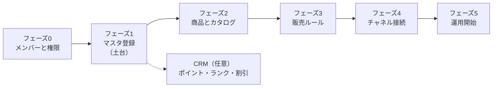

# セットアップガイド — 何をどの順番で設定するか

> 「結局、最初に何を設定すればいいの？」に答えるページです。
> SQの設定は**後の設定が前の設定を参照する**つくりになっているため、順番を間違えると「選択肢に何も出てこない」状態になります。このページの順番どおりに進めれば迷いません。

---

## 全体像 — 5つのフェーズ

| フェーズ | やること | かかる目安 |
|:--|:--|:--|
| 0 | 管理メンバーと権限グループ | 1人で使い始めるならスキップ可 |
| 1 | マスタ登録（テナント・ロケーションなど） | 最重要。ここの漏れが後で全部効いてくる |
| 2 | 商品・バリエーション・カタログ・在庫数 | 商品数による |
| 3 | 販売価格などの販売ルール | チャネル接続前に価格ルールだけ作っておくと楽 |
| 4 | Shopify・スマレジ・リテールポータルの接続 | フェーズ1〜3が前提 |
| 5 | 注文・出荷・取り寄せの日常運用 | — |

---

## フェーズ0: メンバーと権限（必要な場合のみ）

複数人で使う場合だけ、最初にやっておきます。

1. 権限を制限したいメンバーがいるなら、先に[権限グループを作成する](../02-by-task/権限グループを作成する.md)
2. [管理メンバーを追加する](../02-by-task/管理メンバーを追加する.md)（追加時に権限グループを選ぶため、グループが先）

> パスワードはありません。メンバーはメールアドレス認証でログインします。

---

## フェーズ1: マスタ登録 — すべての土台

**マスタは多くの画面の「選択肢」や表示項目になるデータ**です。候補が出ない原因は、未登録・0件だけでなく、種別不一致やチャネル未接続、そもそも参照UIが無いケースにも分かれます。候補が出ない場合は、該当マスタの登録状況、フォーム側の種別条件、連携状態を確認してください。次の順番で登録してください。

| 順番 | マスタ | 必須度 | なぜ先に必要か（どこで使われるか） |
|:--|:--|:--|:--|
| 1 | テナント | **必須**（通常は開設時に作成済み。確認だけ） | 発注・ディスカウント・チャネル連携のすべてがテナントに紐づく |
| 2 | **ロケーション**（倉庫・店舗） | **必須** | 在庫はすべて「どのロケーションに何個」で記録される。これが無いと在庫を持てない |
| 3 | ロケーショングループ | チャネル接続するなら**必須** | Shopify連携・OmnibusCore連携の必須入力項目。作成時はロケーションを1件以上選択する必要がある |
| 4 | 取引先 | 発注機能を使うなら必須 | 発注伝票の必須入力項目 |
| 5 | 決済方法 | 店舗販売（POS・リテールポータル）を使うなら | 注文の支払い手段 |
| 6 | ブランド / 販売員 / 通知用メールアドレス / 納品書テンプレート | 任意 | ブランド=商品登録時の分類属性（一部の自動追加条件にも利用可）、販売員=リテールポータルでの閲覧者・客注作成者の記録（作成時はロケーション必須）、通知メール=各種通知 |

> **ロケーション登録時の注意（あとで効いてくる2つのチェックボックス）**
> - 「**在庫依頼を受け付ける**」… EC注文起点などの自動在庫リクエストで、この店舗を送付対象にするための設定。手動の在庫依頼作成画面ではOFFでもリクエスト先に選択・保存できます（2026-06-21実機確認）
> - 「**店舗受け取りを有効にする**」… 店舗受取（BOPIS）用の設定。2026-06-27再確認では店舗受取ルールのロケーション選択肢は場所種別「店舗」で絞られることを確認済み。ON/OFFの最終影響は接続環境で要確認

**ロケーションを登録すべきタイミング**

| やりたいこと | 先に作るロケーション | 注意 |
|:--|:--|:--|
| 倉庫在庫を持つ | 倉庫ロケーション | 発注・出荷・在庫管理の基準になる |
| 店舗在庫を持つ | 店舗ロケーション | 店舗別の在庫数を見る単位になる |
| 取り寄せ販売をする | 依頼先店舗と出荷元倉庫/店舗 | 自動在庫リクエストの送付対象にしたい店舗は「在庫依頼を受け付ける」をON |
| 店舗受取をする | 受取対象の店舗 | 場所種別は「店舗」。必要に応じて「店舗受け取りを有効にする」をON（ON/OFFの最終影響は接続環境で要確認） |
| ECに出す店舗在庫だけを分ける | 論理ロケーション | 物理店舗ではなく、EC販売用の在庫枠として作る |
| リテールポータルを使う | 店舗ロケーションと在庫ロケーション | 連携フォームで両方を選択する |

📖 手順: [初期設定の手順](../02-by-task/初期設定の手順.md)（テナント〜決済方法）／[その他のマスタを登録する](../02-by-task/その他のマスタを登録する.md)（ブランド以降）

---

## フェーズ2: 商品とカタログ

1. **商品を作成する** — [手順](../02-by-task/商品を作成する.md)
   > ⚠️ ここだけは慎重に: **バリエーションの軸（カラー・サイズなどのオプション）と「種別」は商品の作成時にしか設定できません**。後から軸を増やせないので、色・サイズ展開は最初に決め切ってください。
2. バリエーションごとの詳細（上代・SKU・在庫追跡）を登録する
3. **カタログを作成して商品を入れる** — [手順](../02-by-task/カタログを作成して商品を追加する.md)
   - チャネル接続するなら**必須**（Shopify連携は「どのカタログの商品を出すか」で制御するため）
4. **在庫数を設定する** — SKU詳細の「販売可能数を編集」か、[CSVで一括更新](../02-by-task/CSVで在庫を一括更新する.md)
5. 商品ステータスを「公開中」にする

---

## フェーズ3: 販売ルール

| ルール | いつ必要か | 手順 |
|:--|:--|:--|
| 販売価格 | **チャネル接続前に作っておくと楽**（Shopify連携フォームで指定できる） | [販売価格を設定する](../02-by-task/販売価格を設定する.md) |
| 予約販売 | 在庫0でも売り続けたい商品があるとき | [予約販売を設定する](../02-by-task/予約販売を設定する.md) |
| 販売上限 | チャネル接続後（チャネル選択が必須のため、未接続では作成を完了できない） | [販売上限を設定する](../02-by-task/販売上限を設定する.md) |
| 販売閾値 | 在庫僅少で販売を止める運用をするとき | [販売閾値を設定する](../02-by-task/販売閾値を設定する.md) |

---

## フェーズ4: チャネル接続

**接続フォームの必須項目は、ここまでのフェーズで作ったものです。** 先に揃っているか確認してください。

| 接続するもの | 事前に必要なもの（必須） |
|:--|:--|
| Shopify | テナント・**カタログ**・**ロケーショングループ**（＋コネクターアプリのインストール） |
| OmnibusCore | テナント・メーカーコード |
| スマレジ | テナント・契約ID（＋スマレジ側にアプリインストール） |
| リテールポータル | 店舗ロケーション・在庫ロケーション（倉庫）・テナント・カタログ。接続後に**利用ユーザーの追加**を忘れずに |

📖 手順: [販売チャネルを接続する](../02-by-task/販売チャネルを接続する.md)／[ロジザード・Recustomerを接続する](../02-by-task/ロジザード・Recustomerを接続する.md)

> **取り寄せ販売（店舗在庫のEC販売）をやる場合は、ここで追加の設定が必要です:**
> ①「店舗在庫EC販売用」のような論理ロケーションを作る ②ECで売ってよい数を設定 ③自動在庫リクエストの送付対象にしたい実店舗の「在庫依頼を受け付ける」をON ④ロケーショングループにまとめてShopify連携に設定
> → 詳細: [取り寄せ販売（EC注文起点）の流れ](../02-by-task/取り寄せ販売（EC注文起点）の流れ.md)

---

## フェーズ5: CRM（使う場合のみ・順番に注意）

CRMは**参照関係が逆順**なので、この順で作るとスムーズです。

1. **会員ランク算出ルール**を先に作る — [手順](../02-by-task/会員ランク算出ルールを作成する.md)
2. **ポイント付与ルール**を作る（フォームで会員ランク算出ルールを選択するため、1が先） — [手順](../02-by-task/注文ポイント付与ルールを作成する.md)
3. ポイントキャンペーン・誕生日・失効通知などを必要に応じて — [手順](../02-by-task/ポイントキャンペーンを設定する.md)
4. **ディスカウント**はいつでも独立して作成可能 — [手順](../02-by-task/ディスカウントを作成する.md)

---

## ✅ 最短セットアップ・チェックリスト

「とりあえず動く状態」までの最小限はこれだけです。

- [ ] テナントを確認した（設定 > テナント）
- [ ] ロケーションを登録した（最低1つ。倉庫 or 店舗）
- [ ] 商品を1つ作成した（バリエーション・上代・SKUまで）
- [ ] 在庫数を入れた（SKU詳細の「販売可能数を編集」）
- [ ] 商品ステータスを「公開中」にした

チャネルと繋ぐ場合は、さらに:

- [ ] カタログを作成して商品を入れた
- [ ] ロケーショングループを作成し、ロケーションを1件以上入れた
- [ ] 販売価格ルールを作成した
- [ ] チャネルを接続した

---

## 目的別ショートカット

| やりたいこと | 必要な設定（上から順に） | 入口 |
|:--|:--|:--|
| ECサイト（Shopify）と繋ぎたい | マスタ → 商品＋カタログ → ロケーショングループ → Shopify接続 | [販売チャネルを接続する](../02-by-task/販売チャネルを接続する.md) |
| 店舗在庫をECで売りたい（取り寄せ） | 上記 ＋ 論理ロケーション ＋ 店舗の「在庫依頼を受け付ける」ON（自動在庫リクエスト送付先の設定） | [取り寄せ販売（EC注文起点）の流れ](../02-by-task/取り寄せ販売（EC注文起点）の流れ.md) |
| 店舗間・倉庫間で在庫を動かしたい | ロケーション2つ以上 ＋ 商品・在庫 | [取り寄せ販売の処理手順](../02-by-task/取り寄せ販売の処理手順.md) |
| 店舗スタッフに画面を渡したい | リテールポータル接続 ＋ ユーザー追加（＋権限グループ） | [販売チャネルを接続する](../02-by-task/販売チャネルを接続する.md) |
| ポイント制度を始めたい | 会員ランク算出ルール → ポイント付与ルール | [会員ランク算出ルールを作成する](../02-by-task/会員ランク算出ルールを作成する.md) |
| 仕入れ（発注）を管理したい | 取引先マスタ → 発注伝票 | [初期設定の手順](../02-by-task/初期設定の手順.md) |
| 商品・在庫をまとめて登録したい | マスタ → CSVインポート | [商品をCSVで一括登録する](../02-by-task/商品をCSVで一括登録する.md) |

---

## 関連

- 各データが「どこでどう効くか」の事典: [データ事典①（設定で作るデータ）](データ事典①-設定で作るデータ.md)／[データ事典②（商品・在庫・運用）](データ事典②-商品・在庫・運用のデータとステータス.md)
- 全体像の読み物: [SQをはじめる — 全機能ガイド](SQをはじめる-全機能ガイド.md)
- データの流れ: [SQのデータの流れ（図解）](データの流れ-図解.md)
