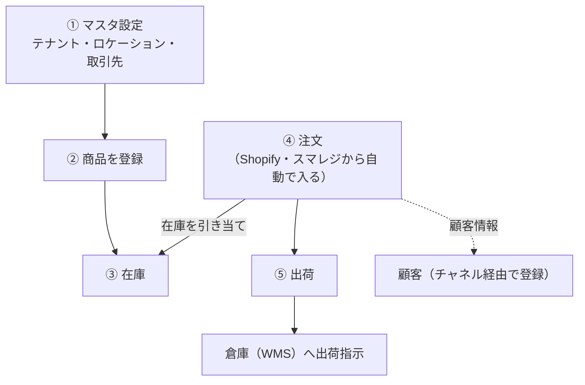
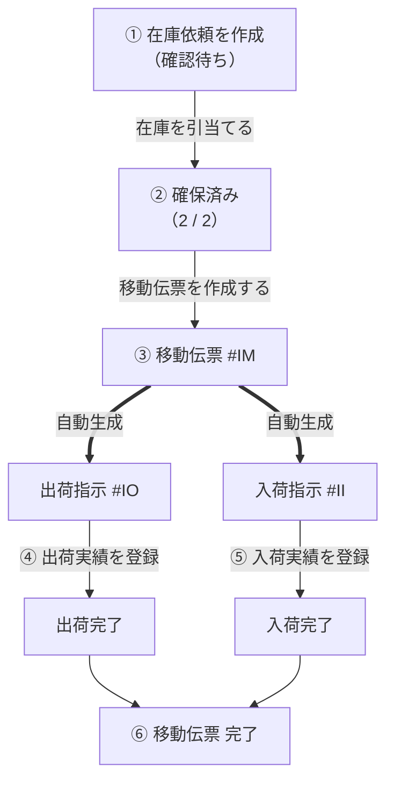
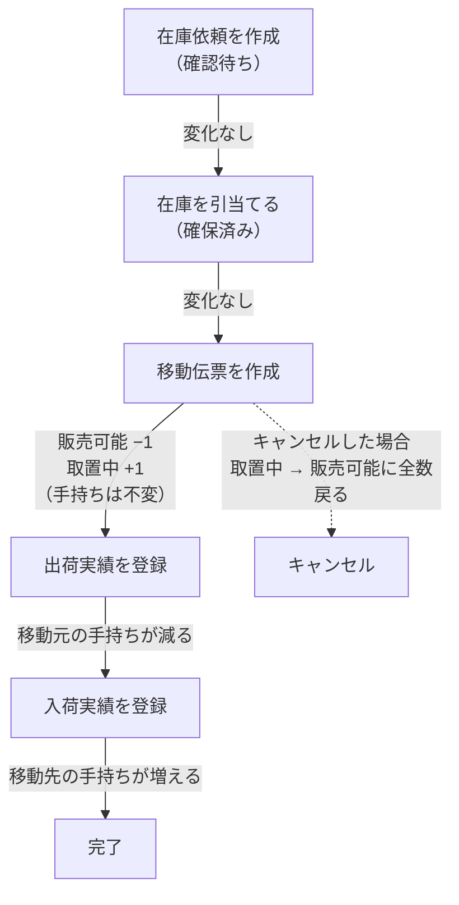
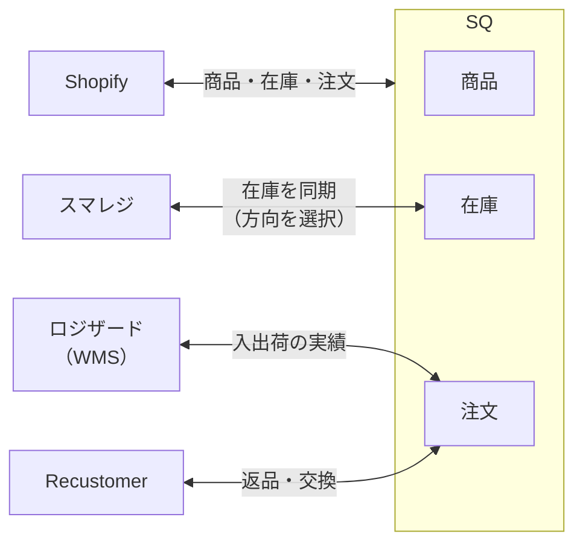

# SQのデータの流れ（図解）

SQの中で、データがどのように流れるかを図で示します。初めての方が全体像をつかむためのものです。

---

## 1. 全体像 — 商品・在庫・注文・顧客のつながり

マスタ（基本設定）を土台に、商品・在庫が用意され、外部チャネルから注文が入り、出荷されるまでの大きな流れです。

> ポイント: SQは「お客様の購入画面」ではなく、その**裏側で在庫と注文を一元管理**するシステムです。注文はShopifyやスマレジから自動で流れ込みます。

---

## 2. 取り寄せ販売のデータの流れ ★

SQの目玉機能。倉庫の在庫を店舗へ取り寄せて販売するときの流れです。**移動伝票を作った瞬間に、出荷指示と入荷指示が自動で生まれる**のが特徴です。

> 注意: 出荷実績・入荷実績の登録は **巻き戻せません**。商品・ロケーション・数量を確認してから登録してください。
> 詳細手順: [取り寄せ販売の処理手順](../02-by-task/取り寄せ販売の処理手順.md)

---

## 3. 在庫が動くタイミング（取り寄せ販売）

取り寄せ販売の操作で、移動元ロケーションの在庫がいつ・どう動くかの実際の流れです。ポイントは「**引当てた時点では数字は動かず、移動伝票を作った瞬間に動く**」ことです。

> **2026-06-14更新**: 在庫の区分名が変わりました（確定済み→引当済み、確保済み→取置中）。「在庫依頼のステータス『確保済み』」は名称変更なし（上図の②）。移動伝票作成では移動元の販売可能→取置中へ振替（実機検証済み）。移動先には入荷予定が立ち、出荷実績で積送中、入荷実績で販売可能・手持ちへ移る。

計算式: **手持ち = 販売可能 + 引当済み + 取置中 + 破損 + 検品 + 予備**（SKU詳細画面。これに加えて「積送中」「入荷予定」の2列があり、手持ちには含まれません）

> 注意: 在庫数は**マイナスになることがあります**（在庫0のロケーションから出荷実績を登録しても処理はブロックされないため）。マイナスは調整伝票で修正してください。

---

## 4. 外部サービスとのデータ連携

SQは外部サービスと双方向でデータをやり取りします。

> 注意: 各連携の**接続後の実際の同期挙動（方向・頻度・エラー時の動き）は未接続のため未確認**です。接続項目・設定UIは確認済みです。

---

## 関連
- [SQをはじめる — 全機能ガイド](SQをはじめる-全機能ガイド.md)
- [取り寄せ販売の処理手順](../02-by-task/取り寄せ販売の処理手順.md)
