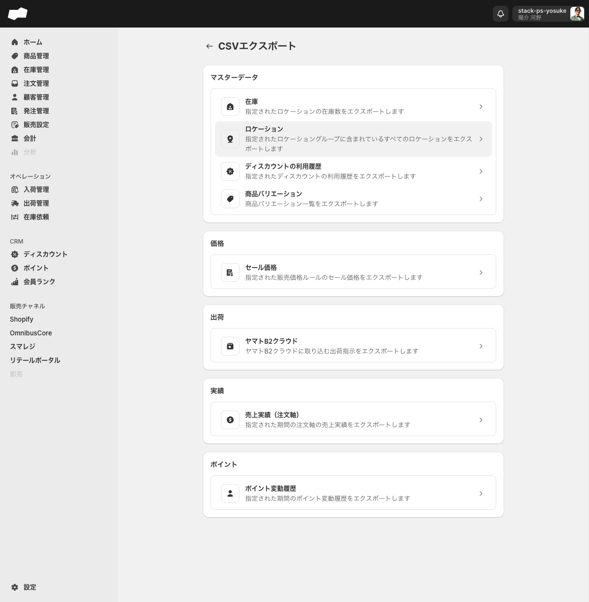
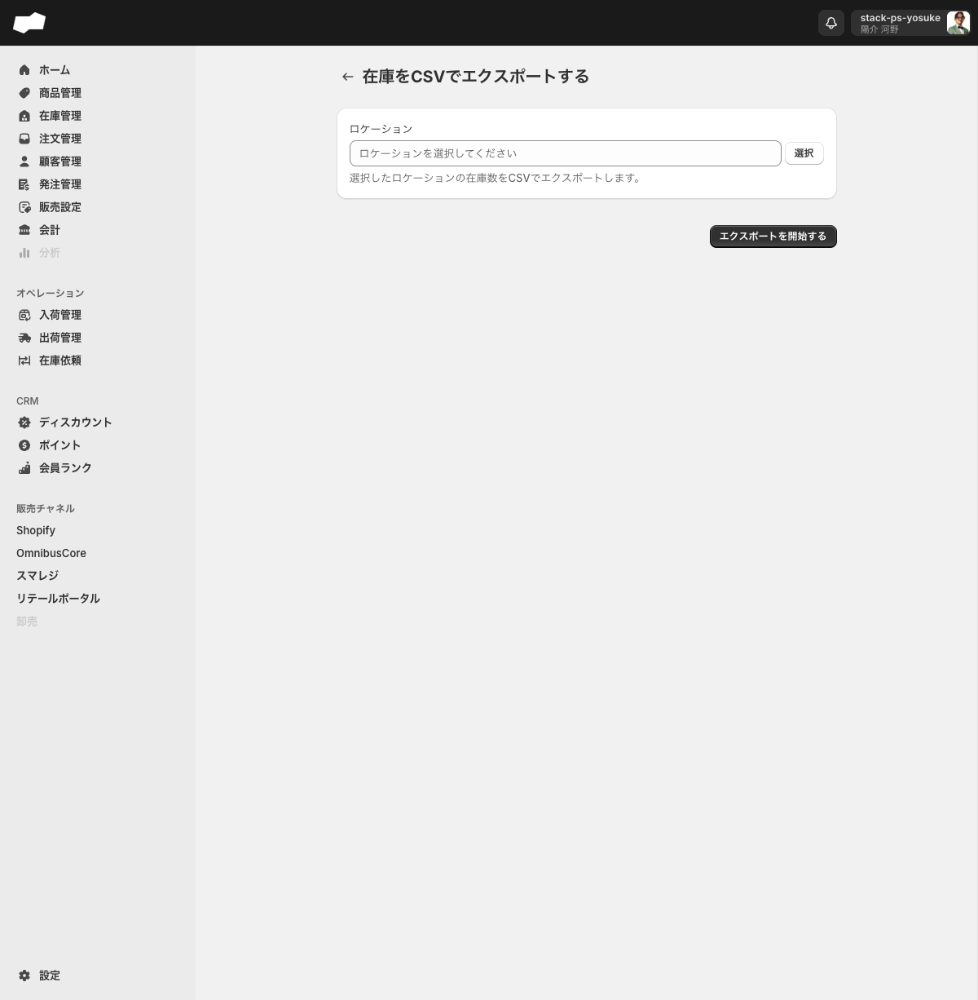
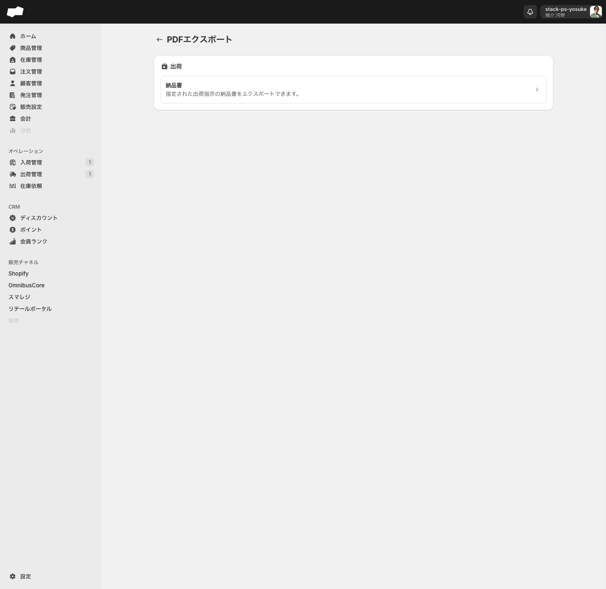

# CSVエクスポート・PDFエクスポート

> 対象画面: CSVエクスポート / /admin/csv_export　|　PDFエクスポート / /admin/pdf_export　|　最終確認: 2026-06-19

## この機能でできること

- 在庫・価格・売上実績・ポイント変動履歴などのデータをCSV形式でダウンロードできる（9カテゴリ）
- 納品書PDFのエクスポートカテゴリを確認できる（PDFエクスポート画面からの任意新規生成導線は表示されない）
- CSVエクスポートとPDFエクスポートの実行履歴を一覧で確認できる

## 画面・項目の説明

### CSVエクスポート（/admin/csv_export）

#### エクスポートできるデータカテゴリ（9種）

カテゴリはグループ別にまとめられている。

##### マスターデータグループ

| カテゴリ（UIラベル） | 説明 |
|:--|:--|
| 在庫 | 指定されたロケーションの在庫数をエクスポートします |
| ロケーション | 指定されたロケーショングループに含まれているすべてのロケーションをエクスポートします |
| ディスカウントの利用履歴 | 指定されたディスカウントの利用履歴をエクスポートします |
| 商品バリエーション | 商品バリエーション一覧をエクスポートします |

##### 価格グループ

| カテゴリ（UIラベル） | 説明 |
|:--|:--|
| セール価格 | 指定された販売価格ルールのセール価格をエクスポートします |

##### 出荷グループ

| カテゴリ（UIラベル） | 説明 |
|:--|:--|
| ヤマトB2クラウド | ヤマトB2クラウドに取り込む出荷指示をエクスポートします |

##### 実績グループ

| カテゴリ（UIラベル） | 説明 |
|:--|:--|
| 売上実績（注文軸） | 指定された期間の注文軸の売上実績をエクスポートします |
| 売上実績（明細軸） | 指定された期間の明細軸の売上実績をエクスポートします |

##### ポイントグループ

| カテゴリ（UIラベル） | 説明 |
|:--|:--|
| ポイント変動履歴 | 指定された期間のポイント変動履歴をエクスポートします |

#### 各カテゴリのフォーム詳細

##### 在庫エクスポート

| 項目（UIラベル） | 必須/任意 | 説明 |
|:--|:--|:--|
| ロケーション | 実質必須（* マークなし） | 「選択」ボタンを押してロケーション選択ダイアログから選ぶ。複数選択可。未選択のままではエクスポートが実行されない |

**ロケーション選択ダイアログの構成**: タブ「すべて」「店舗」「倉庫」の3種。列はチェックボックス・名前・場所コード。複数選択できる。

##### ロケーションエクスポート

| 項目（UIラベル） | 必須/任意 | 説明 |
|:--|:--|:--|
| ロケーショングループ | 必須（* マーク付き） | 「選択」ボタンを押してロケーショングループ選択ダイアログから選ぶ |

**画面内補足文（原文）**: 「選択したロケーショングループに属するロケーションをCSVでエクスポートします。」

##### ディスカウントの利用履歴エクスポート

| 項目（UIラベル） | 必須/任意 | 説明 |
|:--|:--|:--|
| ディスカウント | 必須（* マーク付き） | 「選択」ボタンを押してディスカウント選択ダイアログから選ぶ |

**画面内補足文（原文）**: 「選択したディスカウントの使用履歴をCSVでエクスポートします。」

##### 商品バリエーションエクスポート

| 項目（UIラベル） | 必須/任意 | 説明 |
|:--|:--|:--|
| 商品情報を含める | 任意（チェックボックス） | チェックをONにするとCSVに商品情報列が追加される（デフォルト: 未チェック） |

**チェックボックスの補足文（原文）**: 「CSVに商品情報（商品コード、商品タイトル、ブランド名など）を含めます」

##### セール価格エクスポート

| 項目（UIラベル） | 必須/任意 | 説明 |
|:--|:--|:--|
| 販売価格ルール | 必須（* マーク付き） | ドロップダウンから対象の販売価格ルールを選ぶ |

**画面内補足文（原文）**: 「選択した販売価格ルールのセール価格をCSVでエクスポートします。」

##### ヤマトB2クラウドエクスポート

この一覧画面にはエクスポートボタンが存在しない。ヤマトB2クラウド向けのCSVは、出荷管理画面（/admin/inventory_outbound_orders）の「条件指定でエクスポート」→「ヤマトB2クラウド」から実行する。実行後はメールでダウンロードリンクが通知される。

この画面（/admin/csv_export/csv_export_operation_inventory_outbound_order_yamato_b2_clouds）は実行履歴の確認専用。ただし2026-06-15のstaging確認では、条件指定フォームの「実行する」を押した直後に出荷管理へ戻り、この履歴画面には即時レコードが表示されなかった。ステータス変更チェックをOFFにした場合、対象の出荷指示は出荷待ちのまま変化しない。

##### 売上実績（注文軸）エクスポート

| 項目（UIラベル） | 必須/任意 | 説明 |
|:--|:--|:--|
| テナント | 必須（* マーク付き） | ドロップダウンから対象のテナントを選ぶ |
| 開始日時 | 必須（* マーク付き） | 絞り込みを開始する日時を入力する |
| 終了日時 | 必須（* マーク付き） | 絞り込みを終了する日時を入力する |

2026-06-16の実機確認では、3項目を入力して「エクスポートを開始する」を押すと一覧画面へ戻り、直近行が「注意 処理中」と表示された。再読み込み後に「成功 完了」になり、ダウンロードリンクが表示された。

##### 売上実績（明細軸）エクスポート

売上実績一覧画面の「エクスポート」>「明細軸」から `/admin/csv_export/csv_export_operation_sale_change_line_items` に遷移する。フォーム項目は注文軸と同じ構成。

##### ポイント変動履歴エクスポート

| 項目（UIラベル） | 必須/任意 | 説明 |
|:--|:--|:--|
| テナント | 必須（* マーク付き） | ドロップダウンから対象のテナントを選ぶ |
| 開始日時 | 必須（* マーク付き） | ポイント変動履歴の絞り込みを開始する日時を入力する |
| 終了日時 | 必須（* マーク付き） | ポイント変動履歴の絞り込みを終了する日時を入力する |

### PDFエクスポート（/admin/pdf_export）

#### エクスポートできるデータ

| カテゴリ（UIラベル） | 説明 |
|:--|:--|
| 納品書 | 指定された出荷指示の納品書をエクスポートします |

#### 納品書PDFの生成方法

PDFエクスポート画面（`/admin/pdf_export`）には「出荷」グループと「納品書」行が表示される。2026-06-19時点では、このトップ画面に新規作成ボタンは表示されない。

PDFエクスポートメニュー側には新規作成ボタンが表示されず、`/admin/pdf_export/pdf_export_operation_packing_slips/create` に直接アクセスしても「このページは存在しないようです」と表示された。出荷完了済みの出荷指示詳細でも、納品書/PDF生成ボタンは確認できなかった。

そのため、現時点のFAQでは「PDFエクスポート画面から任意に納品書PDFを新規作成できる」とは案内しない。注文起点の出荷指示など、別条件で生成導線が出る可能性は追加確認が必要。

納品書のテンプレートは設定画面（/admin/settings/pdf_template_package_slip）で管理する。

## 補足・注意点

- 各エクスポートカテゴリの一覧画面には実行履歴が表示される。カテゴリをクリックして専用画面へ進む
- 売上実績（注文軸）は、実行後に一覧上で「処理中」から「成功 完了」へ変わり、ダウンロードリンクが表示される
- ヤマトB2クラウドCSVは非同期処理で実行される。納品書PDFは、今回の実機確認ではPDFメニューからの新規作成導線を確認できなかった
- ヤマトB2クラウドの条件指定エクスポートでは、「CSVの出力後に出荷指示のステータスを出荷作業中に変更する」をONにすると対象出荷指示のステータス変更を伴う。ステータスを変えたくない場合はOFFのまま実行する

## 関連

- 作業別: [ヤマトB2クラウドで出荷業務を行う](../02-by-task/ヤマトB2クラウドで出荷業務を行う.md)
- 作業別: [売上実績をCSVエクスポートする](../02-by-task/売上実績をCSVエクスポートする.md)
- 作業別: [在庫をCSVでエクスポートする手順](../02-by-task/)<!-- TODO: 作業別ファイル作成後にリンクを追加 -->
- 機能別: [CSVインポート](./CSVインポート.md)
- FAQ: [CSVエクスポート・PDFエクスポートに関するよくある質問](../03-faq/)<!-- TODO: FAQファイル作成後にリンクを追加 -->
