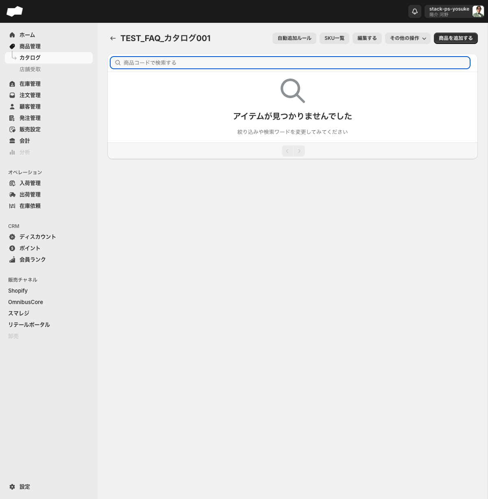
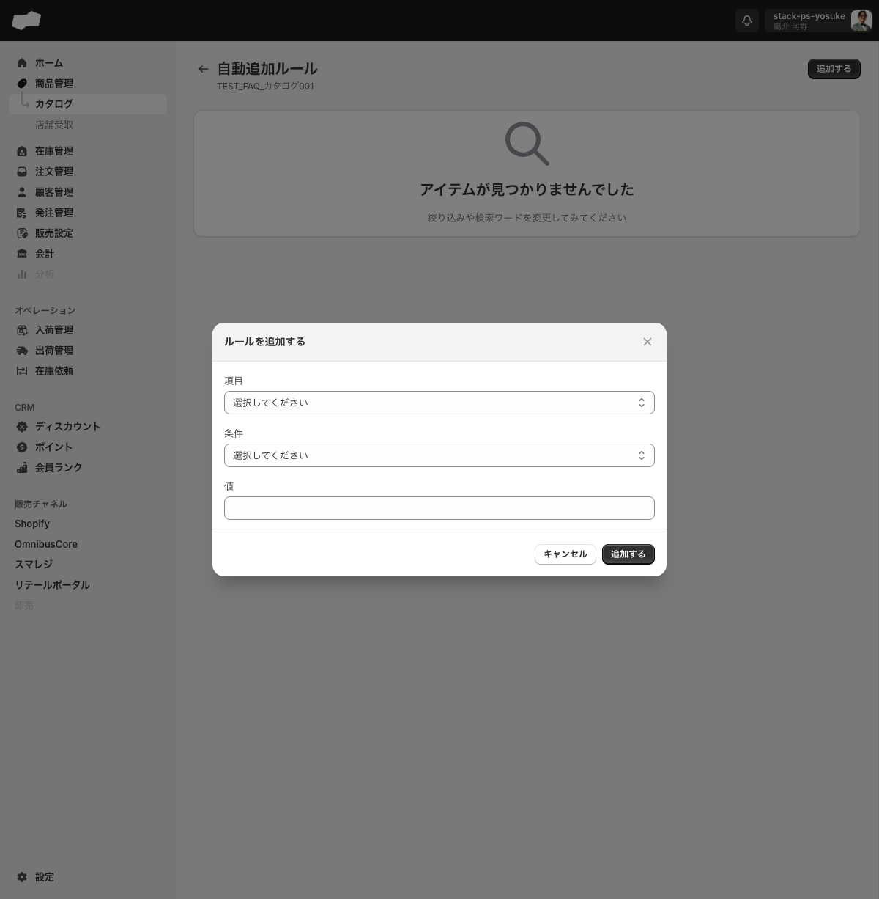

# カタログ

> 対象画面: カタログ / /admin/catalogs　|　最終確認: 2026-06-10

## この機能でできること

- 商品をグループにまとめて管理する（カタログの作成・編集・削除）
- カタログに商品を手動で追加する
- 製造元やブランドコードを条件に商品を自動追加するルールを設定する
- 外部連携（OmnibusCore など）のチャネルにカタログを紐付けて、出品する商品をチャネルごとに制御する
- CSVで商品を一括追加する

---

## カタログとは

カタログは商品をグループ化する入れ物です。外部連携（OmnibusCoreなど）ではチャネル（連携先）ごとに1つのカタログを指定することで、どの商品をそのチャネルに出すかを制御します。

例えばOmnibusCore連携では、連携設定の「商品同期設定 > カタログ」でカタログを選択します。カタログ一覧の「販売先」列に表示される件数は、このカタログを参照しているチャネル連携の数を示します。

<!-- TODO: 要確認（Shopify連携・スマレジ連携でのカタログ紐付け設定経路。OmnibusCoreのみ実機確認済み） -->

---

## カタログ一覧（/admin/catalogs）

### 一覧の列

| 列名 | 内容 |
|:--|:--|
| 名前 | カタログ名 |
| 商品 | このカタログに登録されている商品の数（例: 0個の商品） |
| 販売先 | このカタログを参照しているチャネル連携の数（例: 0つの販売先） |

---

## カタログ詳細画面（/admin/catalogs/{id}）

### 画面上部のボタン

| ボタン | 機能 |
|:--|:--|
| 自動追加ルール | 自動追加ルールの一覧・設定画面へ遷移 |
| SKU一覧 | このカタログのSKU一覧画面へ遷移 |
| 編集する | カタログ名を変更するダイアログを開く |
| その他の操作 | 「カタログを削除する」「インポート」のメニューが表示される |
| 商品を追加する（右側） | 商品を選択してカタログに追加する画面へ遷移 |

### 商品の検索

詳細画面の本体に「商品コードで検索する」テキストボックスがあります。カタログ内の商品を商品コードで絞り込めます。

---

## 商品の追加（/admin/catalogs/{id}/create）

「商品を追加する」をクリックすると「カタログに商品を追加する」画面が開きます。

- テーブル列: 商品（サムネイル＋商品名）/ 商品コード
- 「商品コードで検索する」テキストボックスで絞り込みができます
- 商品行のチェックボックスを選択すると「カタログに追加する」ボタンが表示されます
- 一括チェックボックスで全件を選択することもできます

---

## 自動追加ルール（/admin/catalogs/{id}/automatic_add_rules）

条件に一致する商品を自動的にカタログへ追加するルールを設定できます。

### ルールの設定項目

「追加する」ボタンで「ルールを追加する」ダイアログが開きます。

| 項目 | 選択肢 |
|:--|:--|
| 項目 | 「製造元」「ブランドコード」の2択 |
| 条件 | 「一致する」の1択 |
| 値 | テキストで自由入力 |

設定したルールと完全一致する商品が自動的にカタログに追加されます。

登録済みルールは「項目」「条件」「値」の一覧で確認できます。行を選択すると「ルールを削除する」ボタンが表示され、確認ダイアログ「カタログのルールを削除しますか？」から削除できます。本文は「選択された1件のルールを削除します。この処理は巻き戻すことができません。」です。

---

## カタログの編集

「編集する」ボタンをクリックすると「カタログを編集する」ダイアログが開きます。

| 項目（UIラベル） | 必須 | 説明 |
|:--|:--|:--|
| タイトル* | 必須 | カタログ名（例: 渋谷店） |

編集できるのはタイトルのみです。チャネル割り当てやロケーションとの紐付けはこのダイアログからは設定できません。

---

## SKU一覧（/admin/catalogs/{id}/catalog_product_variants）

カタログに追加されているSKUの一覧を確認できます。

<!-- TODO: 要確認（商品が登録されている状態でのSKU一覧の列構成。現在テスト環境は0件のため列ヘッダーが非表示） -->

---

## CSVインポート

「その他の操作 > インポート」からカタログへの商品を一括追加できます。

インポート画面（/admin/csv_import/csv_import_operation_catalog_products）では以下の項目を入力します。

| 項目 | 必須 | 説明 |
|:--|:--|:--|
| カタログ | 必須 | ドロップダウンで既存カタログを選択 |
| ファイルをアップロード | 必須 | CSVファイルをアップロード（ファイル選択またはドラッグ&ドロップ） |

テンプレートファイル（Googleスプレッドシート）へのリンクがページ上部に表示されます。

---

## 補足・注意点

- カタログの削除は「その他の操作 > カタログを削除する」から行います。削除前に商品との紐付けを確認してください
- 削除時は確認ダイアログ「カタログを削除しますか？」が表示されます。本文は「カタログを削除します。この処理は巻き戻すことができません。」です
- カタログとチャネルの紐付けはチャネル連携側の設定から行います（例: OmnibusCore連携の「商品同期設定」）
- カタログ一覧の「販売先」列の件数は、このカタログを参照しているチャネル連携の数です。カタログ詳細画面から直接「販売先」を設定するUIはありません

---

## 関連

- 機能別: [商品管理](./商品管理.md)
- 作業別: [カタログを作成して商品を追加する](../02-by-task/カタログを作成して商品を追加する.md)
