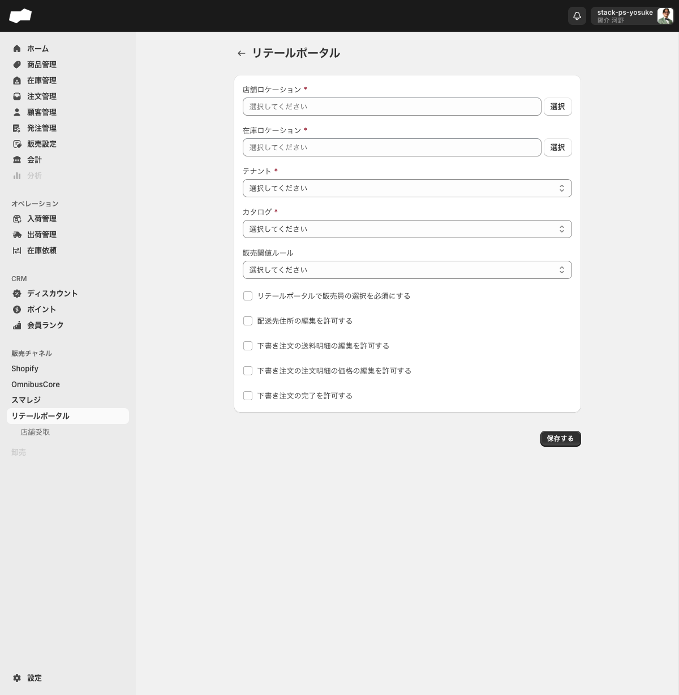
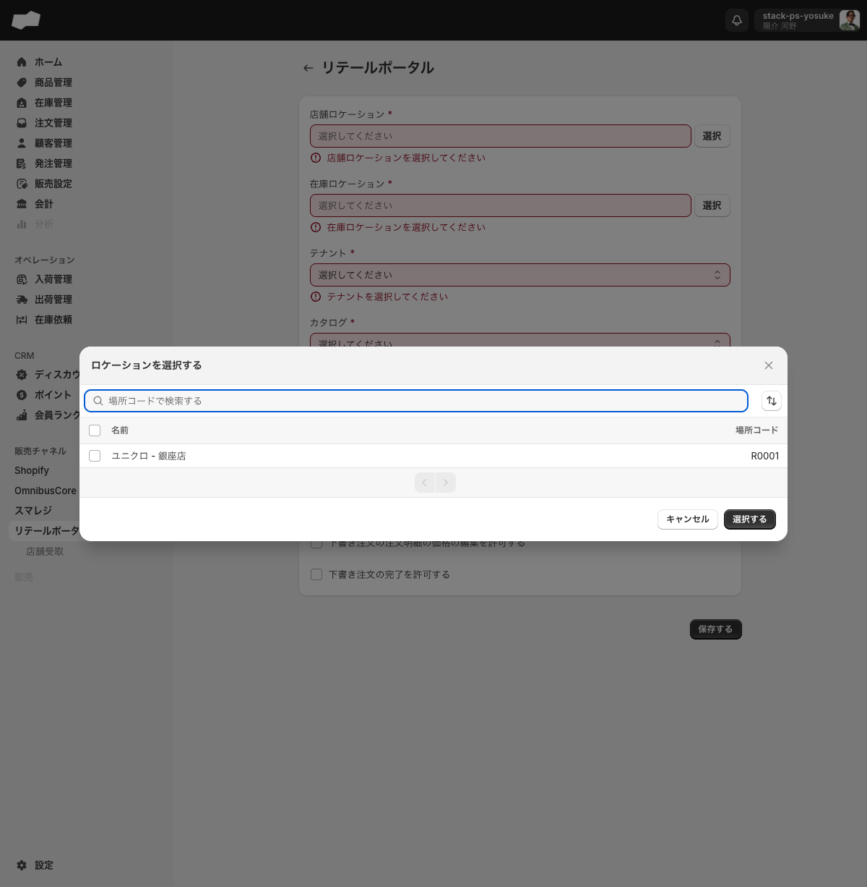
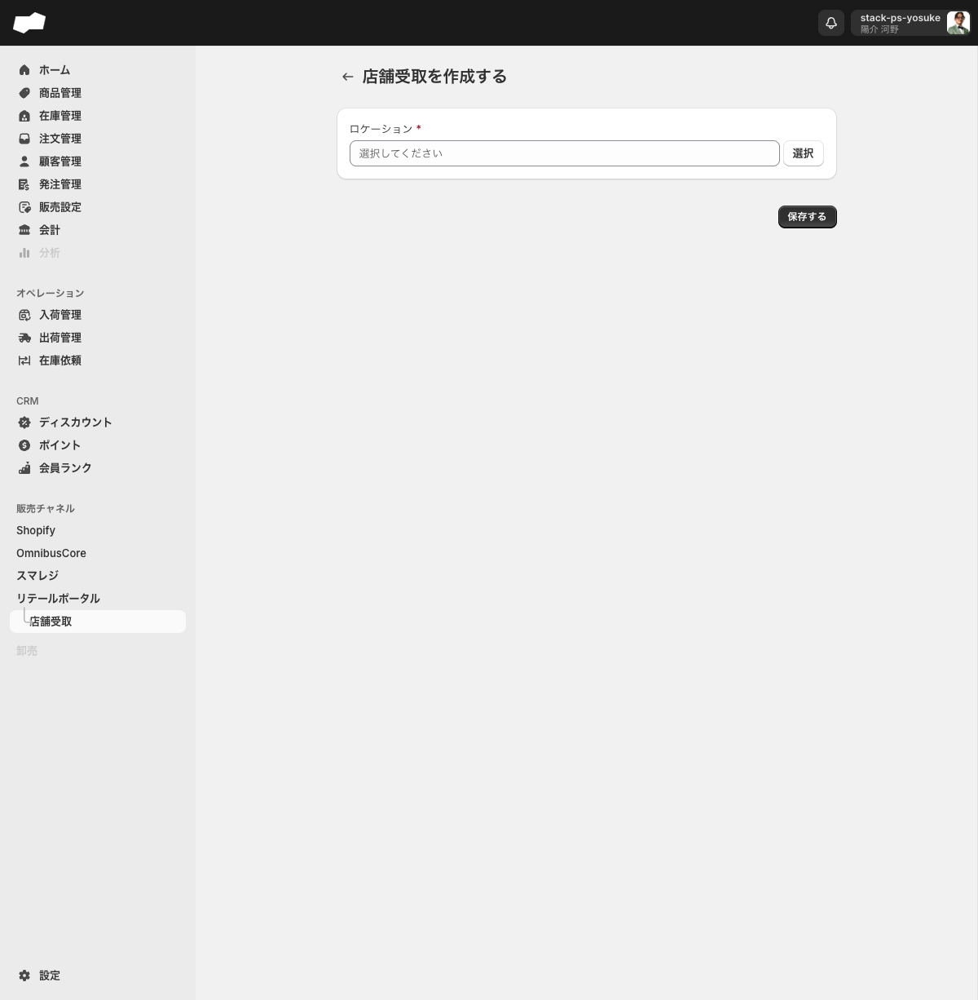

# リテールポータル連携

> 対象画面: リテールポータル連携 / `/admin/retail_portal_integrations`　|　最終確認: 2026-06-12

## この機能でできること

- 店舗スタッフが利用するリテールポータル画面とSQを接続する
- 接続は1件 = 1店舗ロケーションの単位で管理する
- リテールポータル経由での注文操作（送料・価格・完了など）の許可・禁止を設定する
- 接続後の詳細画面から管理者ユーザーをリテールポータル連携に追加できる
- 関連機能として「店舗受取」のロケーションルールを設定できる

## 画面・項目の説明

### 接続前の画面（空状態）

リテールポータル連携が未設定の場合、「追加する」ボタンと「場所コードを入力してください」フィルター欄が表示されます。「追加する」ボタンから作成フォーム（`/admin/retail_portal_integrations/create`）に進みます。

### 作成フォーム（`/admin/retail_portal_integrations/create`）

| 項目（UIラベル） | 説明 | 必須 | 制約・選択肢 |
|:--|:--|:--|:--|
| 店舗ロケーション | 連携する店舗のロケーション | 必須 | 「選択」ボタンからダイアログで選択。店舗種別のロケーションのみ表示 |
| 在庫ロケーション | 在庫の引当元となるロケーション | 必須 | 「選択」ボタンからダイアログで選択。倉庫種別のロケーションのみ表示 |
| テナント | 連携するSQ内テナント | 必須 | コンボボックス（SQ内マスタから選択） |
| カタログ | 連携する商品カタログ | 必須 | コンボボックス（SQ内マスタから選択） |
| 販売閾値ルール | 販売可否を判断する在庫閾値ルール | 任意 | コンボボックス（SQ内マスタから選択） |
| リテールポータルで販売員の選択を必須にする | 注文時に販売員の選択を必須とするかどうか | 任意 | チェックボックス（デフォルト: オフ） |
| 配送先住所の編集を許可する | 店舗スタッフが配送先住所を編集できるかどうか | 任意 | チェックボックス（デフォルト: オフ） |
| 下書き注文の送料明細の編集を許可する | 店舗スタッフが下書き注文の送料明細を編集できるかどうか | 任意 | チェックボックス（デフォルト: オフ） |
| 下書き注文の注文明細の価格の編集を許可する | 店舗スタッフが下書き注文の注文明細の価格を編集できるかどうか | 任意 | チェックボックス（デフォルト: オフ） |
| 下書き注文の完了を許可する | 店舗スタッフが下書き注文を完了できるかどうか | 任意 | チェックボックス（デフォルト: オフ） |

**送信ボタン**: 「保存する」

### ロケーション選択ダイアログの仕様

「店舗ロケーション」または「在庫ロケーション」の「選択」ボタンを押すと、「ロケーションを選択する」ダイアログが開きます。

| 要素 | 内容 |
|:--|:--|
| ダイアログタイトル | 「ロケーションを選択する」 |
| 表示列 | 「名前」「場所コード」 |
| 検索フィールド | 「場所コードで検索する」 |
| 操作ボタン | 「キャンセル」「選択する」 |

ダイアログはロケーションの種別でフィルタリングされています。

- 「店舗ロケーション」の選択ダイアログ: 店舗種別のロケーションのみ表示
- 「在庫ロケーション」の選択ダイアログ: 倉庫種別のロケーションのみ表示

### バリデーション

| 条件 | エラー文言 |
|:--|:--|
| 店舗ロケーション未選択 | 「店舗ロケーションを選択してください」 |
| 在庫ロケーション未選択 | 「在庫ロケーションを選択してください」 |
| テナント未選択 | 「テナントを選択してください」 |
| カタログ未選択 | 「カタログを選択してください」 |

---

### 保存後の詳細画面

「保存する」をクリックすると、詳細画面へ遷移します。

- 詳細画面の見出し（h1）は選択した**店舗ロケーション名**が表示されます。
- 画面には以下のボタンが表示されます。

| ボタン（UIラベル） | 操作 |
|:--|:--|
| 編集する | 連携設定を編集するフォームへ遷移する |
| ユーザーを追加する | 管理者ユーザーをこのリテールポータル連携に追加するダイアログを開く |

### 「ユーザーを追加する」ダイアログ

「**ユーザーを追加する**」ボタンをクリックすると「**ユーザーを選択する**」ダイアログが開きます。

- メールアドレスで検索して管理者ユーザーを絞り込み、追加するユーザーを選択できます。

<!-- TODO: 要確認（ユーザー追加後の表示と、追加されたユーザーが持つリテールポータルへのアクセス権限の詳細） -->

---

### 店舗受取（`/admin/local_pickup_retail_location_rules`）

リテールポータルのサブメニューとして「店舗受取」画面があります。

#### 一覧画面

空状態では「追加する」ボタンのみ表示されます。

#### 作成フォーム（`/admin/local_pickup_retail_location_rules/create`）

| 項目（UIラベル） | 説明 | 必須 | 制約・選択肢 |
|:--|:--|:--|:--|
| ロケーション | 店舗受取を設定するロケーション | 必須 | 「選択」ボタンからダイアログで選択。店舗種別のロケーションのみ表示（リテールポータル作成フォームの「店舗ロケーション」ダイアログと同一構造） |

## 店舗スタッフ側でできること（取り寄せ販売）

リテールポータルは、取り寄せ販売フローにおいて店舗スタッフが操作する画面でもあります。EC注文が入り、倉庫に実在庫が不足している場合、店舗スタッフはリテールポータルで次の操作を行います。

1. **在庫リクエストの確認・確保登録** — SQから店舗に通知された在庫リクエストを確認し、在庫の「確保」登録を行う <!-- TODO: 要確認（画面ラベル原文。実機環境の提供待ち） — リクエスト一覧の画面名・確保ボタン名 -->
2. **移動伝票の一括作成** — 確保済みの在庫をまとめて移動伝票として発行する（ロケーションごとに分割生成される） <!-- TODO: 要確認（画面ラベル原文。実機環境の提供待ち） — 一括作成ボタン名と操作経路 -->
3. **出荷登録** — 店舗から倉庫への出荷実績を登録する <!-- TODO: 要確認（画面ラベル原文。実機環境の提供待ち） — リテールポータル上の出荷登録操作の画面名・ボタン名 -->

> この操作の全体像と前後の流れ: [取り寄せ販売（EC注文起点）の流れ](../02-by-task/取り寄せ販売（EC注文起点）の流れ.md)

---

## 補足・注意点

- テナント・カタログはSQ内で事前に作成しておく必要があります。
- ロケーションの種別（店舗/倉庫）はロケーションマスタ（設定 > ロケーション）で管理されます。種別に応じて選択ダイアログに表示されるロケーションが変わります。
- 「場所コード」はロケーションに紐づく識別コードで、ロケーション設定画面の「基本情報を編集」ダイアログにある「コード」フィールドに管理者が手動で入力するものです。自動採番ではありません。
- 5つのチェックボックスはすべてデフォルトでオフです。店舗スタッフに許可する操作のみオンに設定してください。
- 各チェックボックスはリテールポータル経由の注文操作に関わる権限設定です。

<!-- TODO: 要確認（接続後の実際の同期挙動（方向・頻度・エラー時）は未接続環境のため未確認） -->
<!-- TODO: 要確認（店舗受取の詳細機能・接続後の画面） -->
<!-- TODO: 要確認（ユーザー追加後の表示と、追加されたユーザーが持つリテールポータルへのアクセス権限の詳細） -->

## 関連

- 作業別: [販売チャネルを接続する](../02-by-task/販売チャネルを接続する.md)（リテールポータルのセクションを参照）
- FAQ: [外部連携のよくある質問](../03-faq/外部連携のよくある質問.md)
