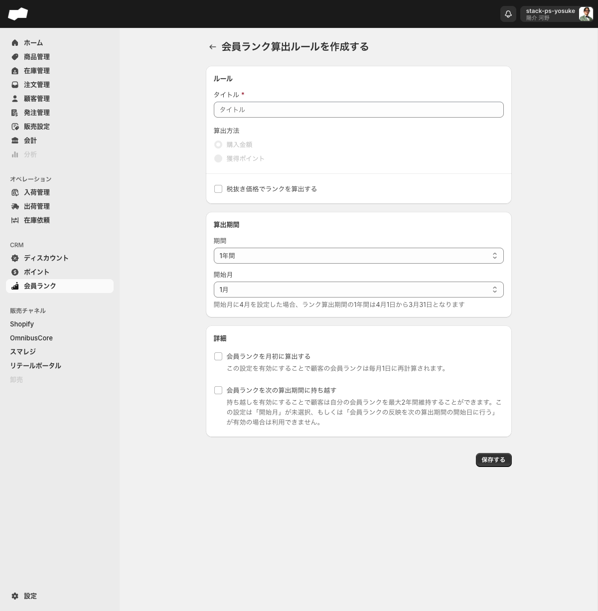
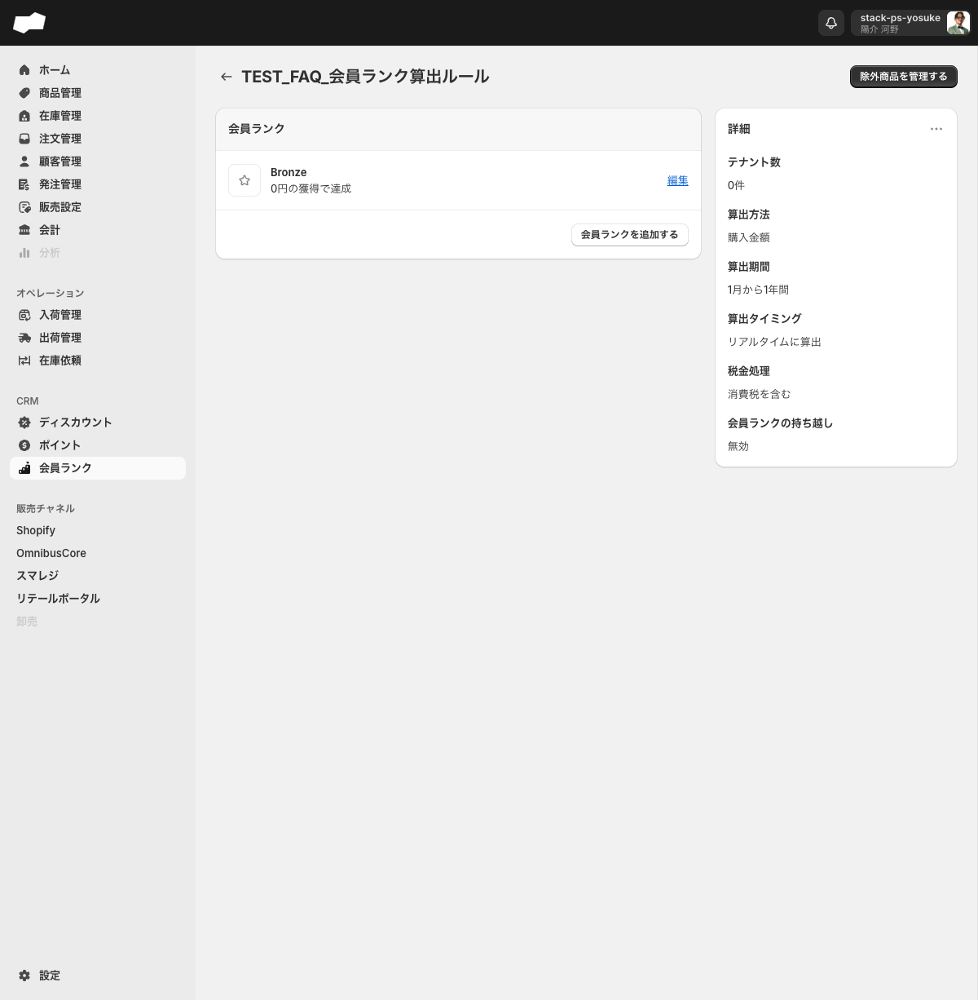
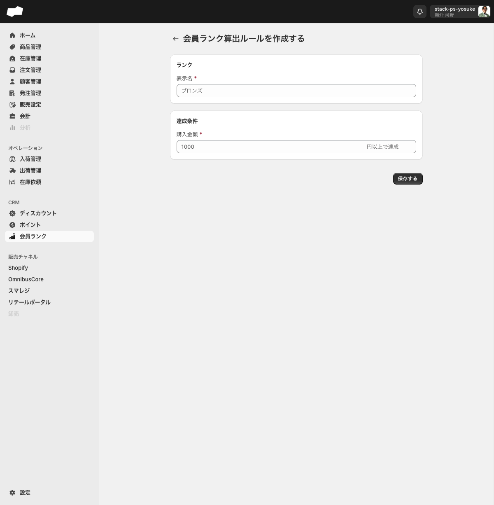

# 会員ランク

> 対象画面: 会員ランク / `/admin/customer_rank_calculation_rules` | 最終確認: 2026-06-16

## この機能でできること

- 顧客の会員ランクを算出するルールを作成・管理する
- 算出期間（1年間・直近365日・無期限）と開始月を設定する
- ランクの段階（表示名と達成条件となる購入金額）をルールごとに定義する
- 会員ランクを毎月1日に再計算する月初算出を設定する
- 会員ランクを最大2年間維持する持ち越し設定を行う
- ランク算出から除外する商品を指定する
- 設定した会員ランク算出ルールをポイント付与ルールやポイントキャンペーンと連携させる

## 画面・項目の説明

### 一覧画面（`/admin/customer_rank_calculation_rules`）

- タブは「すべて」のみ
- 「会員ランク算出ルールを作成する」ボタンから作成フォームへ遷移する

---

### 会員ランク算出ルール作成フォーム（`/admin/customer_rank_calculation_rules/create`）

#### ルール

| 項目（UIラベル） | 説明 | 必須 | 制約・選択肢 |
|:--|:--|:--|:--|
| タイトル | ルールの管理名 | 必須（★） | テキスト |
| 算出方法 | ランクを算出する基準 | — | ラジオボタン。選択肢: 「購入金額」/ 「獲得ポイント」。現在どちらも変更できない状態（購入金額固定） <!-- TODO: 要確認（「獲得ポイント」が将来的に使用可能になるかは未確認） --> |
| 税抜き価格でランクを算出する | 税抜き金額でランクを計算するかどうか | 任意 | チェックボックス。OFFの場合は税込み金額で計算する |

#### 算出期間

| 項目（UIラベル） | 説明 | 必須 | 制約・選択肢 |
|:--|:--|:--|:--|
| 期間 | ランク算出に使う期間 | — | コンボボックス。選択肢: 「1年間」（デフォルト）/ 「直近365日」/ 「無期限」 |
| 開始月 | 1年間の算出期間の開始月 | 任意（期間=1年間 の場合に設定可） | コンボボックス。1月〜12月。ヘルプ文（原文）: 「開始月に4月を設定した場合、ランク算出期間の1年間は4月1日から3月31日となります」 |

「直近365日」または「無期限」を選ぶと、「開始月」と「会員ランクを次の算出期間に持ち越す」はフォームから非表示になります。

#### 詳細

| 項目（UIラベル） | 説明 | 必須 | 制約・選択肢 |
|:--|:--|:--|:--|
| 会員ランクを月初に算出する | 毎月1日に会員ランクを再計算する | 任意 | チェックボックス。ヘルプ文（原文）: 「この設定を有効にすることで顧客の会員ランクは毎月1日に再計算されます。」 |
| 会員ランクを次の算出期間に持ち越す | 同じ会員ランクを最大2年間維持できるようにする | 任意 | チェックボックス。ヘルプ文（原文）: 「持ち越しを有効にすることで顧客は自分の会員ランクを最大2年間維持することができます。この設定は「開始月」が未選択、もしくは「会員ランクの反映を次の算出期間の開始日に行う」が有効の場合は利用できません。」 |

---

### 算出ルール詳細ページ（`/admin/customer_rank_calculation_rules/{id}`）

算出ルールを保存すると詳細ページに遷移する。詳細ページには以下の情報が表示される。

#### 「詳細」セクションの表示項目

| 項目 | 説明 |
|:--|:--|
| テナント数 | 紐付いているテナント数 |
| 算出方法 | 購入金額（現在は固定） |
| 算出期間 | 例: 「1月から1年間」 |
| 算出タイミング | 「リアルタイムに算出」（設定項目なし） |
| 税金処理 | 「消費税を含む」（税抜きチェックがOFFの場合）|
| 会員ランクの持ち越し | 「無効」または「有効」 |

右上の操作ボタンをクリックするとドロップダウンが展開し、「ルールを編集」（`/update` へ遷移）と「ルールを削除」が表示される。

#### 「会員ランク」セクション

詳細ページ内の「会員ランク」セクションでランクの段階を管理する。

- 「会員ランクを追加する」リンクから新しいランクを追加できる
- 算出ルール作成直後に「Bronze」ランク（0円以上で達成）が自動的に作成される
- 既存のランクは「編集」リンクから変更できる

#### 「除外商品を管理する」リンク

詳細ページ内のリンクから除外商品の管理ページ（`/exclude_products`）へ遷移できる。

---

### ランクの段階（会員ランク追加フォーム）

URL: `/admin/customer_rank_calculation_rules/{id}/customer_rank_rules/create`

ランクの段階を追加するフォーム。ページタイトル（h1）は「会員ランク算出ルールを作成する」と表示される（算出ルール本体の作成フォームと同じ文言になっているが、入力項目が異なる）。

| 項目（UIラベル） | 説明 | 必須 | 制約・選択肢 |
|:--|:--|:--|:--|
| 表示名 | ランク名 | 必須（★） | テキスト。プレースホルダ: 「ブロンズ」 |
| 購入金額 | 達成に必要な購入金額 | 必須（★） | 数値。ラベル形式: 「[n] 円以上で達成」 |

---

### 初期ランク（Bronze）の制約

算出ルール作成時に自動生成される「Bronze」ランクには以下の制約がある。

| 制約 | 内容 |
|:--|:--|
| 表示名 | 変更可能 |
| 達成条件（購入金額） | 変更できない（入力欄が選択不可の状態）。注意文（原文）: 「このランクは初期値なので達成条件を変更することができません」 |
| 削除 | 削除できない（「削除する」ボタンが選択不可の状態） |

---

### 会員ランクの除外商品

URL: `/admin/customer_rank_calculation_rules/{id}/exclude_products`

ランク算出の対象から外す商品を登録する。「除外商品を追加する」リンクから商品を選択して登録する。

追加フォームは「除外商品を選択する」の1項目です。「選択」ボタンから商品選択ダイアログを開き、商品を選択して保存します。

- 商品未選択の状態では「保存する」は実質disabledになり、保存できません。
- 保存後は除外商品一覧へ戻り、商品名と作成日時が表示されます。
- 行を選択すると「除外商品から削除」が表示されます。
- 削除確認は「除外商品から削除しますか？」で、本文は「選択された1件の除外商品を削除しますか？この処理は巻き戻すことができません。」です。

---

## 補足・注意点

- 算出方法は現在「購入金額」固定。「獲得ポイント」ラジオボタンは選択できない状態になっている
- 「会員ランクを次の算出期間に持ち越す」は、「開始月」が未設定の場合または「会員ランクの反映を次の算出期間の開始日に行う」が有効の場合には使用できない
- ランクの段階（達成条件）は算出ルールの詳細ページ内で管理する。独立したURLは存在しない
- 初期ランク（Bronze）の達成条件（0円）と削除はどちらも変更・操作できない。表示名のみ変更可能
- ランク算出の詳細ページに表示される「算出タイミング: リアルタイムに算出」は作成・編集フォームに対応する設定項目がなく、システムの固定値と見られる <!-- TODO: 要確認 -->
- 会員ランクとポイントの連携方法は2つある。(1) 注文ポイント付与ルール作成時に会員ランク算出ルールを紐付ける。(2) ポイントキャンペーン種別「会員ランク」を使い、キャンペーン詳細ページからランク別の倍率を設定する

<!-- TODO: 要確認（実注文への会員ランク算出結果。現環境ではチャネル未接続のため実際の顧客ランク反映は未検証） -->

## 関連

- 作業手順: [会員ランク算出ルールを作成する](../02-by-task/会員ランク算出ルールを作成する.md)
- 機能別: [ポイント（注文ポイント）](./ポイント.md)
