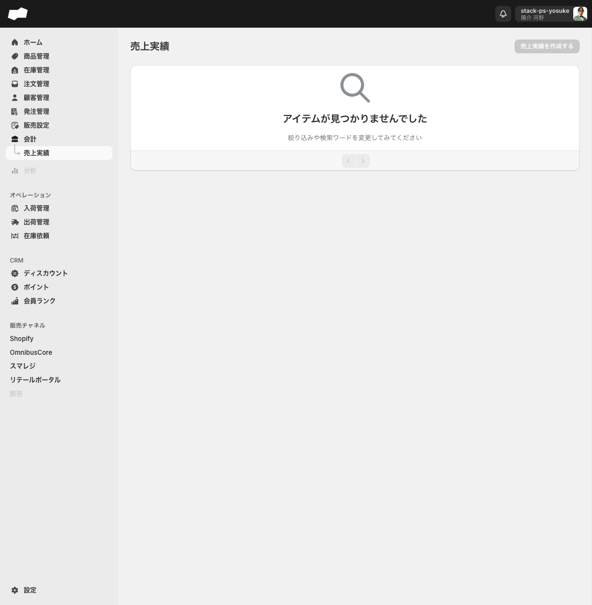
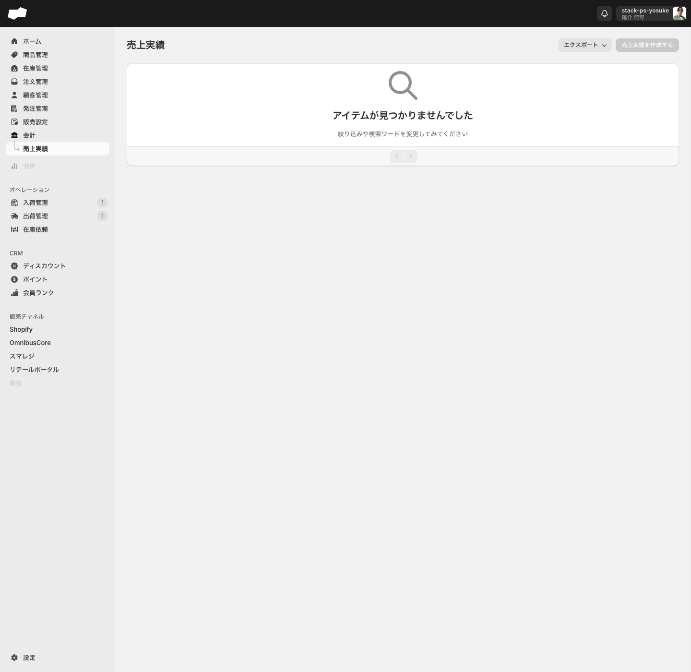

# 会計（売上実績）

> 対象画面: 売上実績 / `/admin/sale_change_line_items`　|　最終確認: 2026-06-16

## この機能でできること

- 売上実績の一覧を確認する
- 売上実績をCSVでエクスポートする（「売上実績（注文軸）」「売上実績（明細軸）」）

---

## 画面・項目の説明

### ナビゲーションと画面名の関係

| 場所 | 表示名 |
|:--|:--|
| サイドナビ | 会計 |
| サブメニュー | 売上実績 |
| 画面見出し（h1） | 売上実績 |

- サイドナビの「会計」とサブメニューの「売上実績」は同じ画面（`/admin/sale_change_line_items`）に遷移します。
- 現在の「会計」機能は「売上実績」のみで構成されており、サブページは1つです。

### 売上実績 一覧画面

| 項目 | 内容 |
|:--|:--|
| タブ | なし |
| 空状態の文言 | 「アイテムが見つかりませんでした」「絞り込みや検索ワードを変更してみてください」 |
| テーブル列の構成 | <!-- TODO: 要確認（売上データがある環境でのテーブル列構成が未確認） --> |

### 「売上実績を作成する」ボタン

- 画面上に「売上実績を作成する」リンクボタンが表示されますが、現在は DOM 上に `href` がなく、クリックしても操作できません。
- `/admin/sale_change_line_items/create` に直接アクセスすると「このページは存在しないようです」画面になります。
- 手動での売上実績作成は現時点ではできません。

### CSVエクスポート

- 売上実績一覧の「エクスポート」ボタンを押すと、「注文軸」「明細軸」のメニューが表示されます。
- 「注文軸」は `/admin/csv_export/csv_export_operation_sale_changes`、「明細軸」は `/admin/csv_export/csv_export_operation_sale_change_line_items` に遷移します。
- CSVエクスポート画面（`/admin/csv_export`）の「実績」グループに「**売上実績（注文軸）**」「**売上実績（明細軸）**」カテゴリがあります。
- リンク先: 注文軸 `/admin/csv_export/csv_export_operation_sale_changes`、明細軸 `/admin/csv_export/csv_export_operation_sale_change_line_items`

---

## 補足・注意点

- 売上実績が注文データから自動的に集計される仕組みかどうかは、現環境（売上データ0件）では確認できていません。<!-- TODO: 要確認（注文データがある環境での売上実績の集計挙動） -->
- 「売上実績を作成する」リンクが注文データの有無によって有効になるかどうかは未確認です。<!-- TODO: 要確認（注文データがある環境でのボタン状態） -->
- 一覧画面のテーブル列構成は、売上データが存在する状態での確認が必要です。<!-- TODO: 要確認（売上データ投入後に列構成を確認） -->

---

## 関連

- 作業別: [売上実績をCSVエクスポートする](../02-by-task/売上実績をCSVエクスポートする.md)
- 機能別: [CSVエクスポート・PDFエクスポート](../01-by-feature/CSVエクスポート・PDFエクスポート.md)
