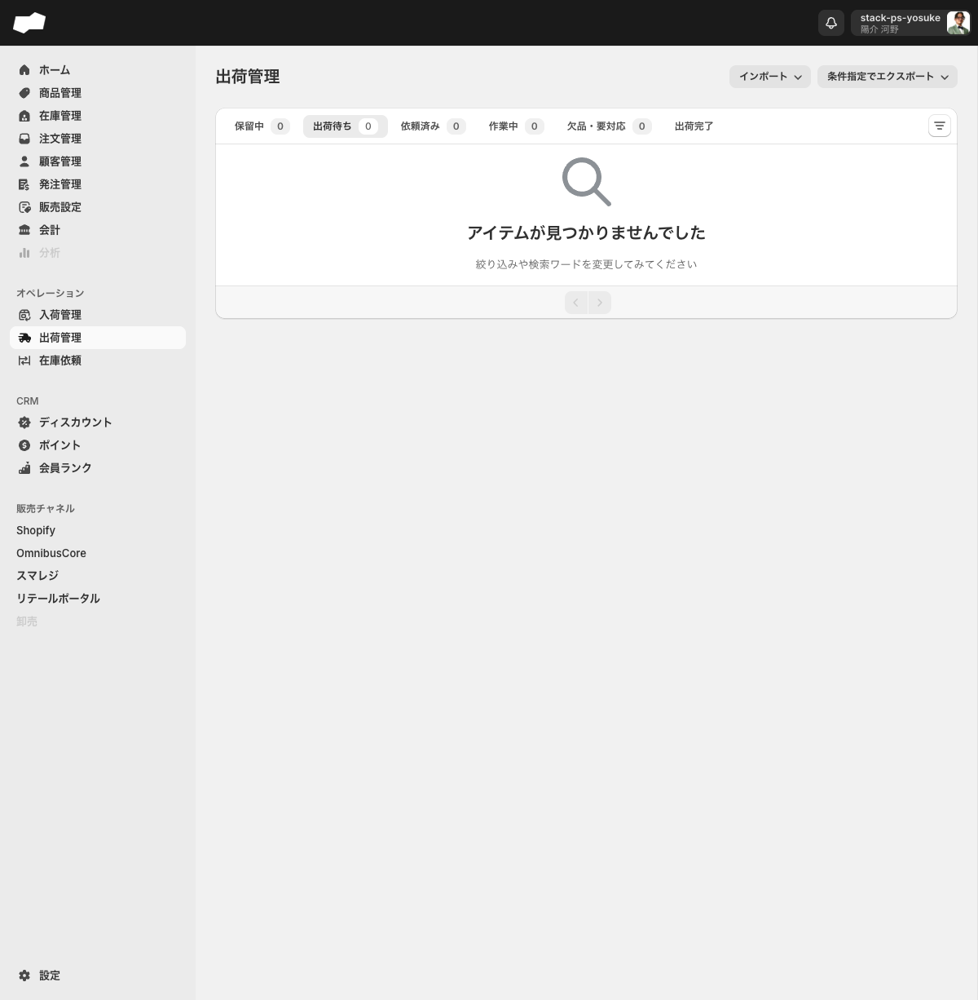
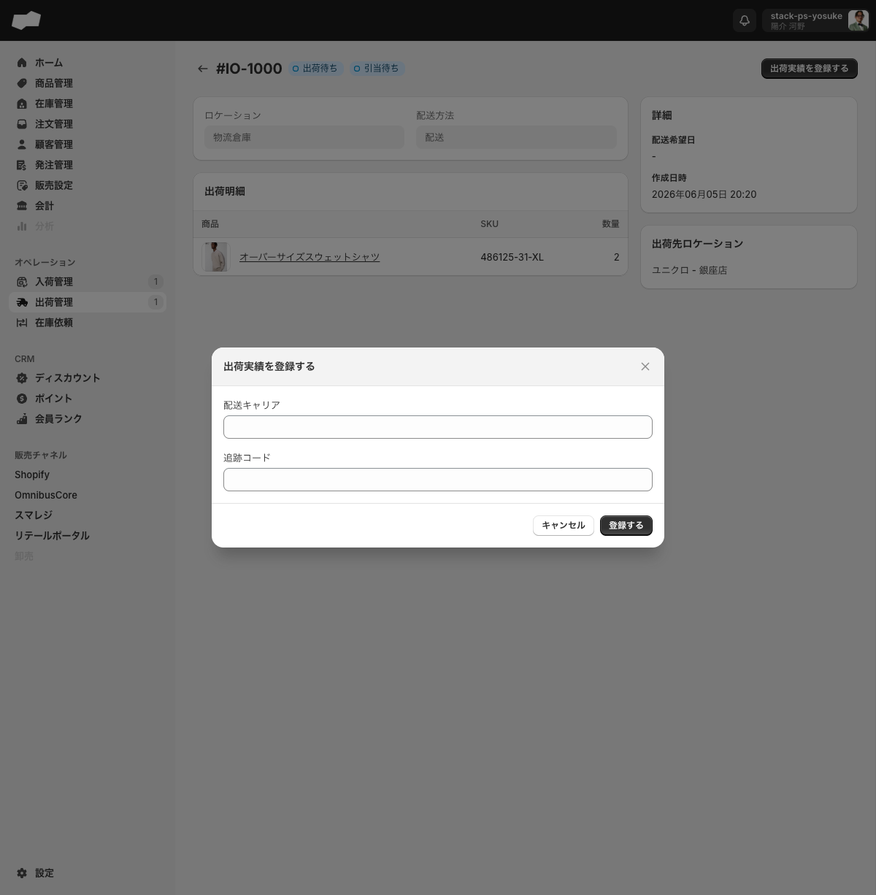

# 出荷管理

> 対象画面: 出荷管理 / /admin/inventory_outbound_orders　|　最終確認: 2026-06-20

## この機能でできること

- 出荷指示の一覧をステータス別タブで確認する
- 出荷指示の詳細から出荷実績（配送キャリア・追跡コード）を登録し、ステータスを出荷完了にする
- ヤマトB2クラウドまたは DHL の出荷実績 CSV をインポートして出荷実績を一括登録する
- 条件を指定してヤマトB2クラウド取り込み用 CSV を生成する

## 画面・項目の説明

### ステータスタブ

出荷指示はステータスによって 6 つのタブに分類されます。

| タブ名 | 説明 |
|:--|:--|
| 保留中 | 出荷作業を保留している出荷指示 |
| 出荷待ち | 出荷作業を待っている出荷指示 |
| 依頼済み | 出荷依頼を済ませた出荷指示 |
| 作業中 | 出荷作業中の出荷指示 |
| 欠品・要対応 | 欠品など対応が必要な出荷指示 |
| 出荷完了 | 出荷実績が登録された出荷指示 |

キャンセルタブは一覧に存在しません。移動伝票がキャンセルされた出荷指示は一覧タブには表示されません。ただし、移動伝票詳細などの関連リンクや直接URLからは、キャンセル済みの出荷指示詳細を開ける場合があります。条件指定エクスポートには出荷作業ステータス「キャンセル済み」の選択肢があります。

### サイドバーの未完了バッジ

サイドナビの「出荷管理」横に未完了の出荷指示件数がバッジ表示されます。0 件のときはバッジが非表示になります。件数が 100 を超える場合は「100+」と表示されます。

### 「インポート」ボタン（ドロップダウン）

出荷実績 CSV をインポートします。クリックすると 2 種類の選択肢が表示されます。

| 選択肢 | 遷移先 |
|:--|:--|
| ヤマトB2クラウド（出荷実績） | ヤマトB2クラウドの出荷実績インポート画面 |
| DHL（出荷実績） | DHL の出荷実績インポート画面 |

いずれの画面でも「新規インポート」から CSV ファイルをアップロードして出荷実績を一括登録できます。アップロードするファイルはCSV ファイルのみです。

ヤマトB2クラウドの CSV フォーマットは全 10 列固定で、必須列は「伝票番号」「出荷日」「お客様管理番号」の 3 列のみです。列の詳細は画面内「テンプレート」のリンクから確認できます。

### 「条件指定でエクスポート」ボタン（ドロップダウン）

クリックすると「ヤマトB2クラウド」の選択肢のみ表示されます（DHL のエクスポートはありません）。選択するとエクスポートフォームに遷移します。

#### エクスポートフォームの項目

| 項目（UIラベル） | 必須 | 説明・選択肢 |
|:--|:--|:--|
| 開始日時 | 必須（*） | 出荷指示の絞り込みを開始する日時 |
| 終了日時 | 必須（*） | 出荷指示の絞り込みを終了する日時（デフォルト: 現在日時） |
| 配送先 (国) | 任意 | 国を選択して絞り込む（マルチ選択可） |
| 決済方法 | 任意 | すべての決済 / 代引きのみ / 代引き以外の決済 |
| 出荷作業ステータス | 任意 | 指定しない / 出荷待ち / 保留中 / 依頼済み / 作業中 / 欠品・要対応 / キャンセル済み / 出荷完了 |
| 注文タグ（含む） | 任意 | 入力したタグを含む出荷指示のみが対象（例: priority） |
| 注文タグ（除外） | 任意 | 入力したタグを含まない出荷指示のみが対象（例: test） |
| CSVの出力後に出荷指示のステータスを出荷作業中に変更する | 任意 | チェックボックス（デフォルト: 未チェック） |

「実行する」ボタンを押すと非同期処理が開始されます。

- ヤマトB2クラウド取り込み用 CSV

納品書PDFについては、2026-06-16の実機確認ではPDFエクスポート画面・出荷完了済み出荷指示詳細のどちらにも新規生成導線を確認できませんでした。ヤマトB2クラウドCSVと納品書PDFが必ず同時生成されるとは案内しないでください。

### 「出荷実績を登録する」ボタン（出荷指示詳細）

出荷指示の詳細画面右上に表示されます。クリックするとダイアログが開きます。

#### ダイアログの入力項目

| 項目（UIラベル） | 必須 | 説明 |
|:--|:--|:--|
| 配送キャリア | 任意 | 配送業者名（空でも登録可） |
| 追跡コード | 任意 | 荷物追跡番号（空でも登録可） |

「登録する」を押すと出荷実績が記録され、ステータスが「出荷完了」に変わります。2026-06-16の実機確認では、配送キャリア・追跡コードを空欄のまま登録しても成功し、トースト「出荷を完了しました」が表示されました。

2026-06-18の実機確認では、配送元ロケーションの表示在庫が0のSKUでも出荷実績登録はブロックされず、出荷完了まで進みました。SQは在庫不足を出荷時に止めないため、実在庫を超える出荷登録をするとマイナス在庫になり得ます。

### 出荷完了後の「出荷実績を登録する」ボタン

出荷実績の登録が完了すると、詳細画面の「出荷実績を登録する」ボタンは**無効化**（クリックできない状態）になります。出荷完了後は、画面から実績の再登録・編集・削除を行うことはできません。

## 補足・注意点

- 出荷実績を登録すると**ステータスを巻き戻すことはできません**。登録前に内容を確認してください。
- 出荷完了後は「出荷実績を登録する」ボタンが無効化され、画面からの再登録・編集・削除は行えません。<!-- TODO: 要確認（出荷実績の修正が必要な場合の対処方法。API経由の操作可否を開発元に確認） -->
- 出荷管理画面から出荷指示を新規作成するボタンはありません。出荷指示は移動伝票の作成と同時に自動生成されます。
- 移動伝票がキャンセルされた出荷指示は出荷管理の一覧タブに表示されなくなります。詳細は関連リンクや直接URLで開ける場合があります。エクスポートで追跡する場合は、出荷作業ステータスを「キャンセル済み」に指定してください。
- 移動伝票経由で生成された出荷指示は、**引当ステータスが「引当待ち」のまま**推移します（出荷実績登録・出荷完了になっても変わりません）。移動伝票経由の出荷指示は出荷用の引当ステータスを使用しないためです。出荷完了の判断は、出荷実績の登録有無と「出荷完了」ステータスを優先してください（2026-06-20実機確認：`#IO-1018`）。
- 出荷実績登録ダイアログの数量は出荷予定数を全量対象（個別数量入力ではなく、配送キャリア・追跡コードのみ任意入力）。「登録する」で確定します（不可逆）。

## 関連

- 作業別: [ヤマトB2クラウドで出荷業務を行う](../02-by-task/ヤマトB2クラウドで出荷業務を行う.md)
- FAQ: [注文と出荷のよくある質問](../03-faq/注文と出荷のよくある質問.md)
- 機能別: [入荷管理](./入荷管理.md)
