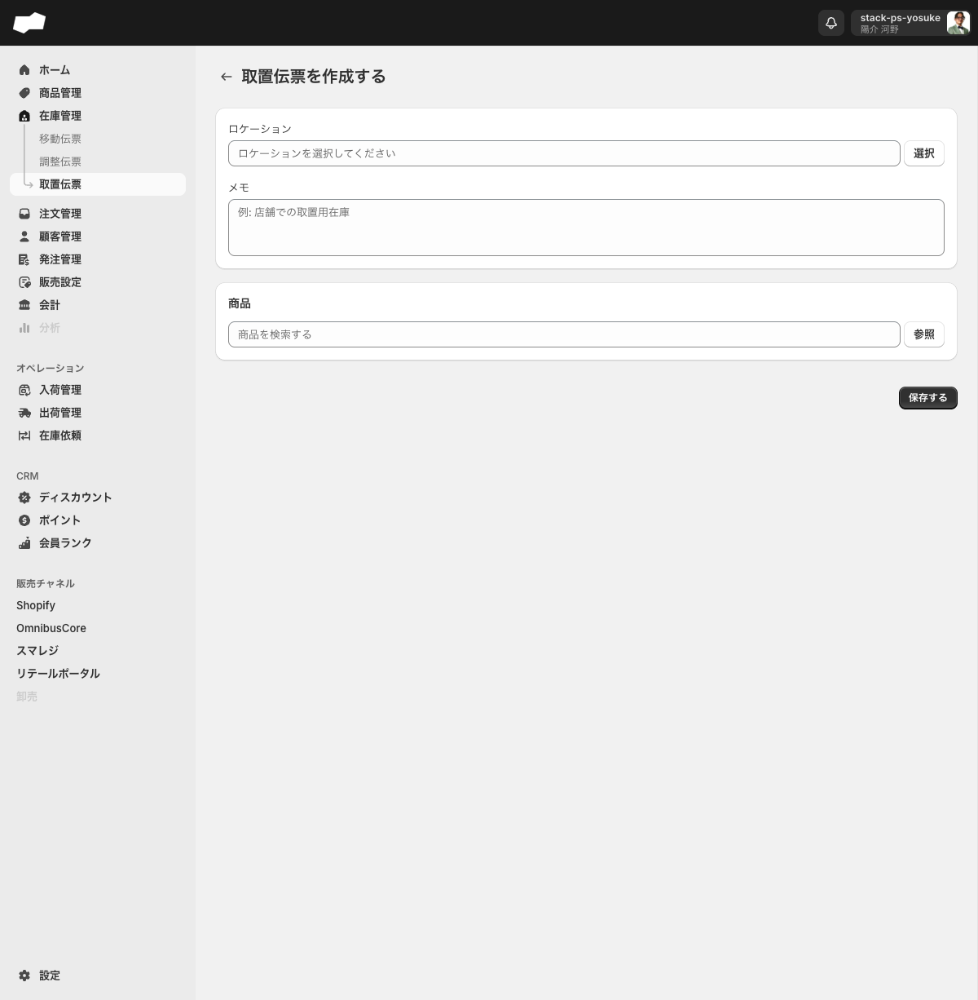

# 取置伝票

> 対象画面: 在庫管理 > 取置伝票 / `/admin/inventory_reservation_orders`　|　最終確認: 2026-06-20

## この機能でできること

- 店舗での取置など、特定の用途のために在庫を確保する伝票を管理する
- 取置伝票を新規作成し、どのロケーションの在庫を確保するかを記録する（作成と同時に対象在庫が「取置中」になる）
- メモ欄に用途や備考を自由に記載する
- 伝票の処理状況を一覧のタブで把握する（未処理 / 処理済み）
- 「処理済みとしてマークする」操作で取置中の在庫を解放し、伝票を処理済み状態にする

## 在庫への影響

| タイミング | 在庫の変化 |
|:--|:--|
| 取置伝票を作成・保存したとき | 対象商品の在庫が「取置中」の区分に移動する |
| 「処理済みとしてマークする」を実行したとき | 「取置中」の在庫が解放される |

## 画面・項目の説明

### 一覧タブ

| タブ名 | 説明 |
|:--|:--|
| すべて | 全ステータスの伝票を表示する |
| 未処理 | まだ処理が完了していない伝票 |
| 処理済み | 処理が完了した伝票 |

### 作成フォーム（`/admin/inventory_reservation_orders/create`）

| 項目（UIラベル） | 説明 | 必須 | 制約・補足 |
|:--|:--|:--|:--|
| ロケーション | 在庫を確保するロケーション（「ロケーションを選択してください」） | 必須 | 「選択」ボタンからロケーション選択モーダルを使う |
| メモ | 取置の目的や補足事項を記録する自由記述欄（「例: 店舗での取置用在庫」） | 任意 | テキストエリア。調整伝票の「理由」に相当する選択肢欄はなく、自由記述のみ |
| 商品（商品を検索する） | 取り置く商品を指定する | 必須（1件以上） | テキスト検索または「参照」ボタンで商品を選ぶ。数量0は保存不可 |

> 調整伝票と異なり「理由」の選択肢フィールドはありません。



空のまま保存すると、ロケーション欄に「ロケーションを選択してください」、商品欄に「商品を1つ以上選択してください」と表示される。商品を選択して数量0で保存すると「数量は1以上を入力してください」と表示される。メモは任意。

### 操作ボタン（作成フォーム）

| ボタン（UIラベル） | 操作 |
|:--|:--|
| 選択 | ロケーション選択モーダルを開く |
| 参照 | 商品選択モーダルを開く |
| 保存する | 取置伝票を保存して一覧画面に戻る。保存後は「取置伝票を作成しました」と表示される |

### 詳細画面（未処理）

未処理の取置伝票詳細画面には以下のボタンが表示されます。

| ボタン（UIラベル） | 操作 |
|:--|:--|
| 処理済みとしてマークする | 確認ダイアログを開き、実行すると伝票を「処理済み」にして在庫を解放する |

### 「処理済みとしてマークする」確認ダイアログ

「**処理済みとしてマークする**」ボタンを押すと次の確認ダイアログが表示されます。

> タイトル「処理済みとしてマークする」
> 本文「**取置伝票を処理済みにすることで、取置中の在庫が解放されます。**」
> ボタン: 「キャンセル」 / 「実行する」

「**実行する**」をクリックすると取置伝票のステータスが「完了 処理済み」に変わり、取置中の在庫が解放されます。

## ステータス遷移

```
作成・保存 → [未処理]（在庫が「取置中」になる）
                 ↓
       「処理済みとしてマークする」→ 確認ダイアログ → 「実行する」
                 ↓
           [処理済み]（取置中の在庫が解放される）
```

## 補足・注意点

- 取置伝票を作成すると、その時点で対象在庫が「取置中」の区分に移動します。「処理済みとしてマークする」を実行するまで在庫は取置中のままです。
- 未処理状態の詳細画面に、独立した「キャンセル」ボタンは表示されません。後処理は「処理済みとしてマークする」から行い、取置中の在庫を解放します。
- 取置伝票は1伝票に複数SKUの明細を設定できます（仕様）。商品「参照」モーダルで複数SKUのチェックを入れて「選択する」と、1回の操作で明細に複数行が一括追加されます（2026-06-20実機確認：486125-31-XL + 486125-09-XL を一括追加）。参照を繰り返すと明細が累積し、同一SKUを複数回選ぶと重複行も発生します（`#IR-1007` では4種SKU・8行に累積）。保存前に明細行を確認してください。

## 関連

- 機能別: [移動伝票](./移動伝票.md)
- 機能別: [調整伝票](./調整伝票.md)
- 作業別: [取置伝票を作成する](../02-by-task/取置伝票を作成する.md)
