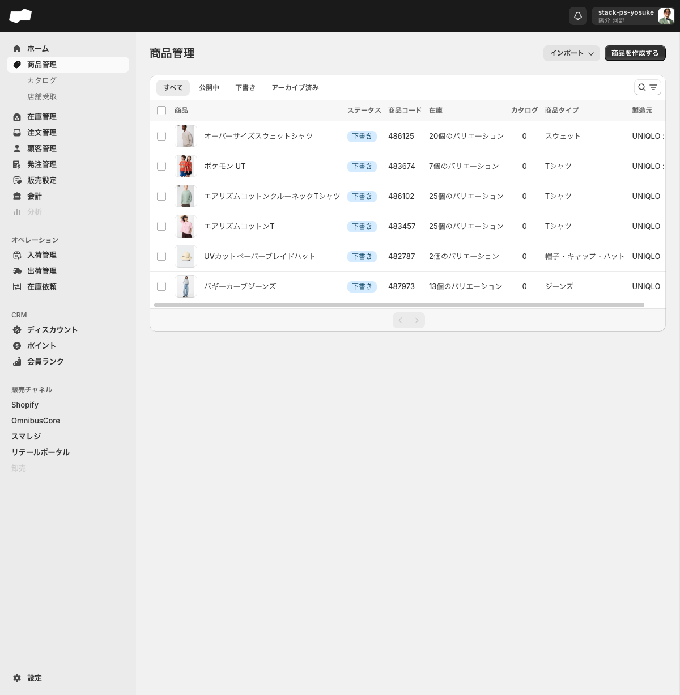
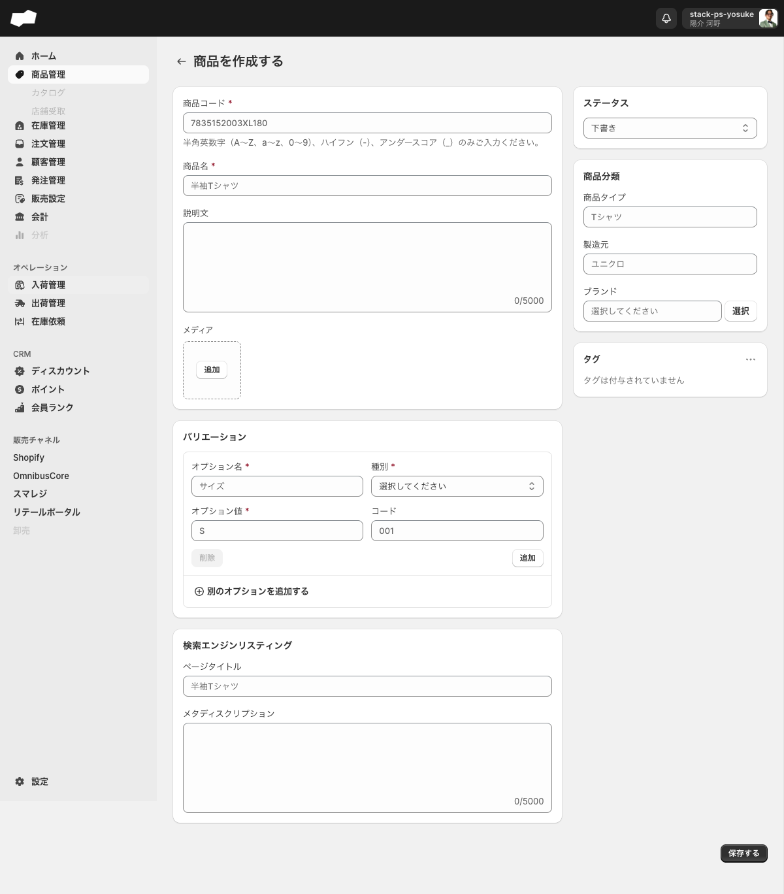

# 商品管理

> 対象画面: 商品管理 / /admin/products　|　最終確認: 2026-06-16

## この機能でできること

- 商品の一覧表示・ステータス別の絞り込み（タブ切替）
- 商品コードによる検索
- 商品の新規作成・編集・アーカイブ・削除
- バリエーション（サイズ・カラーなど）の追加・編集
- CSVによる商品データの一括インポート

---

## 商品一覧（/admin/products）

### タブ

| タブ名 | 表示対象 |
|:--|:--|
| すべて | ステータスを問わず全商品 |
| 公開中 | ステータスが公開中の商品 |
| 下書き | ステータスが下書きの商品 |
| アーカイブ済み | アーカイブ済みの商品 |

### 一覧の列

| 列名 | 内容 |
|:--|:--|
| 商品 | サムネイル画像と商品名 |
| ステータス | 現在のステータス（例: 下書き、公開中） |
| 商品コード | 商品を一意に識別するコード（例: 486125） |
| 在庫 | 登録されているバリエーションの数（例: 20個のバリエーション） |
| カタログ | この商品が属するカタログの数 |
| 商品タイプ | 商品の種別（例: スウェット、Tシャツ） |
| 製造元 | 製造元名（例: UNIQLO） |

### 検索

「検索と絞り込みの結果」ボタンをクリックすると「商品コードで検索する」テキストボックスが展開されます。検索できるのは商品コードのみです。商品名・ステータス・商品タイプ・タグでの絞り込みUIはありません。

### インポート

「インポート」ボタンのドロップダウンには以下の5項目があります。

| 項目ラベル | 用途 |
|:--|:--|
| 商品 | 商品データをCSVでインポートする |
| 商品画像 | 商品画像の割り当てをCSVでインポートする |
| 商品バリエーション | バリエーションデータをCSVでインポートする |
| 商品メタフィールド | 商品のメタフィールドをCSVでインポートする |
| 商品バリエーションメタフィールド | バリエーションのメタフィールドをCSVでインポートする |

---

## 商品作成フォーム（/admin/products/create）

### 基本情報

| 項目（UIラベル） | 必須 | 制約・説明 |
|:--|:--|:--|
| 商品コード* | 必須 | 半角英数字・ハイフン・アンダースコアのみ使用可（例: 7835152003XL180） |
| 商品名* | 必須 | テキスト（例: 半袖Tシャツ） |
| 説明文 | 任意 | テキストエリア、5000字上限 |

### メディア

- 「画像をアップロード」エリア（クリックまたはドラッグ&ドロップでファイル選択）
- 「追加」ボタン（クリックでファイル選択ダイアログを開く）

どちらもローカルファイルを選択してアップロードします。URLからの画像追加はできません。

### バリエーション設定

| 項目（UIラベル） | 必須 | 制約・説明 |
|:--|:--|:--|
| オプション名* | 必須 | テキスト（例: サイズ） |
| 種別* | 必須 | セレクト: 「サイズ」「カラー」「その他」の3択 |
| オプション値* | 必須 | テキスト（例: S） |
| コード | 任意 | テキスト（例: 001） |

- 「追加」ボタンでオプション値の行を追加できます
- 「削除」ボタンで行を削除できます（1行のみの場合はボタンが無効になります）
- 「別のオプションを追加する」ボタンでサイズ・カラーなど別の軸を追加できます

### 検索エンジンリスティング

| 項目（UIラベル） | 必須 | 説明 |
|:--|:--|:--|
| ページタイトル | 任意 | 検索結果に表示されるタイトル |
| メタディスクリプション | 任意 | 検索結果に表示される説明文（5000字上限） |

### サイドバー: ステータス

作成時のステータスは以下の3択から選択します（デフォルト: 下書き）。

| 選択肢 | 説明 |
|:--|:--|
| 下書き | 下書き状態で作成 |
| 公開 | 公開状態で作成 |
| 非公開 | アーカイブ済みとして作成（詳細は「ステータスについての注意」を参照） |

### サイドバー: 商品分類

| 項目（UIラベル） | 必須 | 説明 |
|:--|:--|:--|
| 商品タイプ | 任意 | テキスト（例: Tシャツ） |
| 製造元 | 任意 | テキスト（例: ユニクロ） |
| ブランド | 任意 | 「選択」ボタンでブランドマスターから選択する |

ブランドは事前に「設定 > ブランド」（/admin/settings/brands）でマスター登録が必要です。

### サイドバー: タグ

タグを追加できます。未設定時は「タグは付与されていません」と表示されます。

### 空保存時のバリデーション

「保存する」ボタンは未入力でも押せます。空のまま押すと、同じ画面に戻り、以下のようなエラーがインライン表示されます。

- 商品コードを入力してください
- 商品名を入力してください
- 選択してください（バリエーションの種別など）

---

## 商品詳細・編集画面（/admin/products/{id}）

### ステータスの切り替え

編集画面のステータス選択肢は「公開中」「下書き」の2択です。作成フォームの「非公開」はこの画面には表示されません。

### アーカイブ・削除

商品詳細画面の「その他の操作」ボタンから以下の操作ができます。

| 操作 | 説明 |
|:--|:--|
| 商品をアーカイブする | 商品をアーカイブ済みにする（取り消し可能） |
| 商品を削除する | 商品を完全に削除する（取り消し不可） |

アーカイブ済みの商品の「その他の操作」では「商品のアーカイブを解除する」が表示されます。

アーカイブ解除時は、確認ダイアログに「この商品のアーカイブを解除すると、ステータスが下書きに変更され再び作業できるようになります。」と表示されます。実行後のステータスは「下書き」です。

削除時は確認ダイアログ「商品を削除しますか？」が表示され、本文に「この商品を削除しますか？」「この処理は巻き戻すことができません。」と表示されます。ボタンは「キャンセル」「削除する」です。削除後は商品一覧へ戻り、削除済み商品の詳細URLへ直接アクセスすると「予期せぬエラーが発生しました」「該当するProductが見つかりませんでした。」と表示されます。

---

## ステータスについての注意

| 作成フォームの選択肢 | 編集フォームでの表示 | 一覧タブ | 備考 |
|:--|:--|:--|:--|
| 公開 | 公開中 | 公開中タブ | 表記ゆれがあるが同一ステータス |
| 下書き | 下書き | 下書きタブ | — |
| 非公開 | アーカイブ済み | アーカイブ済みタブ | 「非公開」と「アーカイブ済み」は同じ状態 |

- 「非公開」で作成した商品は、管理画面の商品リスト以外では非表示になります
- アーカイブ済み商品を「商品のアーカイブを解除する」で復元すると、ステータスは「下書き」になります（元のステータスには戻りません）

---

## バリエーション作成フォーム（/admin/products/{id}/variants/create）

### オプション

商品に設定されているオプション軸（カラー・サイズなど）から値を選択します。

### 価格設定

| 項目（UIラベル） | 必須 | 説明 |
|:--|:--|:--|
| 上代* | 必須 | 販売価格（円） |
| 仕入価格 | 任意 | 仕入れ価格（円） |

### 在庫

| 項目（UIラベル） | 必須 | 説明 |
|:--|:--|:--|
| SKU (最小管理単位)* | 必須 | バリエーションを識別するコード（例: 9999990000T001） |
| メーカーSKU | 任意 | メーカー側のSKUコード |
| 在庫を追跡する | — | チェックボックス |
| 在庫切れの場合でも販売を続ける | — | チェックボックス |

### 販売

| 項目（UIラベル） | 必須 | 説明 |
|:--|:--|:--|
| バーコード | 任意 | バーコード番号 |
| JAN | 任意 | JANコード |
| EAN | 任意 | EANコード |

### 配送

| 項目（UIラベル） | 必須 | 説明 |
|:--|:--|:--|
| 重量 | 任意 | 数値で入力 |
| 単位 | — | グラム / キログラム（デフォルト）/ オンス / ポンド |
| 配送を必須にする | — | チェックボックス（デフォルトON） |

### 関税情報

| 項目（UIラベル） | 必須 | 説明 |
|:--|:--|:--|
| 原産国コード | 任意 | 国・地域を選択 |
| 統計品目 (HS) コード | 任意 | HSコードをテキストで入力 |

送信ボタンのラベルは「作成する」です。

---

## バリエーション編集画面（/admin/products/{id}/variants/{variant_id}）

作成フォームとほぼ同じ構成ですが、以下の点が異なります。

| 差異 | 内容 |
|:--|:--|
| 「在庫管理」リンクあり | 該当バリエーションの在庫管理画面へのリンクが上部に表示される |
| 「仕入価格」なし | 作成フォームにある「仕入価格」欄は表示されない |
| 「原価」セクションあり | 「原価を登録する」ボタンと「原価が設定されていません」が表示される |
| UPCフィールドあり | 販売セクションにUPC欄が追加されている |
| 送信ボタン | ラベルが「更新する」になる |

<!-- TODO: 要確認（作成フォームで「仕入価格」を入力した場合、編集フォームの「原価」セクションに値が引き継がれるか） -->

---

## 補足・注意点

- 商品コードは作成後に変更できません（半角英数字・ハイフン・アンダースコアのみ使用可）
- アーカイブは論理削除（復元可能）です。完全に削除するには「商品を削除する」を使います
- アーカイブ解除後のステータスは常に「下書き」になります（公開中には戻りません）
- 検索は商品コードのみに対応しています。商品名での検索はできません

---

## 関連

- 作業別: [商品を作成する](../02-by-task/商品を作成する.md)
- 作業別: [商品をアーカイブ・削除する](../02-by-task/商品をアーカイブ・削除する.md)
- 機能別: [カタログ](./カタログ.md)
