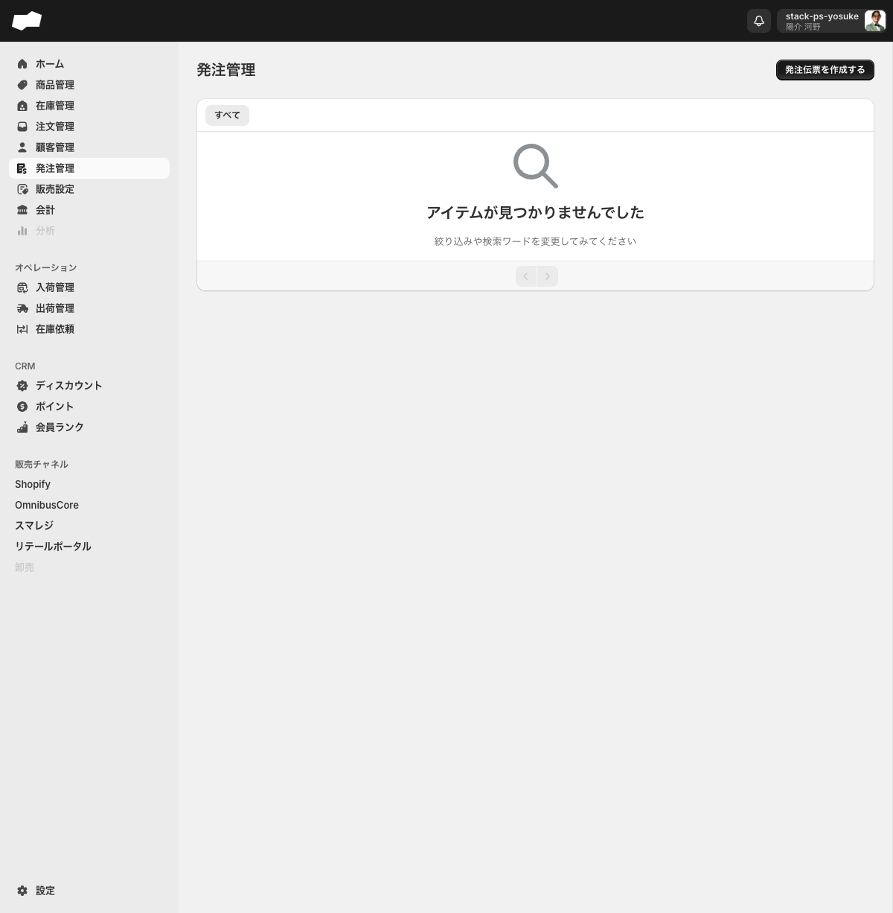
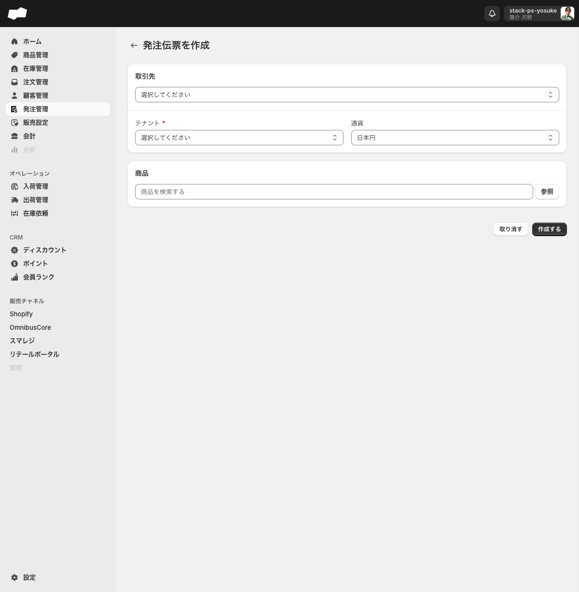
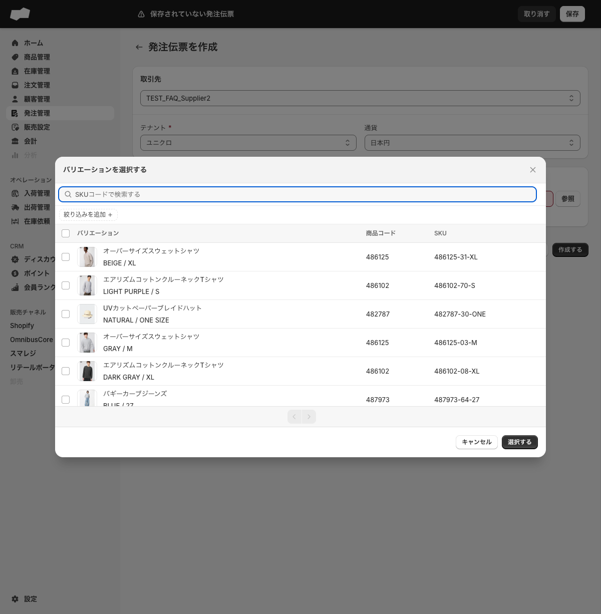

# 発注管理

> 対象画面: 発注管理 / `/admin/inventory_purchase_orders`　|　最終確認: 2026-06-19

## この機能でできること

- 取引先（仕入先）への発注伝票を作成する
- 発注伝票に仕入れる商品・数量・単価・税率を記載し、金額を管理する
- 発注伝票を「下書き」から「発注済み」に進める
- 発注済みの伝票をキャンセルする
- 発注に使用する取引先を「設定 > 取引先」で管理する

> **実機確認メモ（2026-06-19再確認）**: 発注伝票 `#IP-1000` / `#IP-1001` / `#IP-1003` で、下書き → 発注済み → キャンセル済みまで操作できることを確認しました。ただし、発注確認ダイアログには「発注を行うと入荷指示が作成されます」と表示される一方で、今回の確認では入荷管理一覧に発注起点の入荷指示は表示されず、SKU在庫詳細の「入荷予定」も増えませんでした。FAQでは「発注すると必ず入荷予定が増える」とは案内しないでください。

## 画面・項目の説明

### 発注管理 一覧（/admin/inventory_purchase_orders）

| 項目（UIラベル） | 説明 | 必須 | 制約・選択肢 |
|:--|:--|:--|:--|
| 発注伝票を作成する | 発注伝票の作成フォームへ遷移するリンクボタン | — | — |

**タブ**: 「すべて」のみ

**空状態の表示**: 「アイテムが見つかりませんでした」

**一覧テーブル列**（実機確認 2026-06-20、`#IP-1000`〜`#IP-1003` 存在）: 管理番号 / 取引先 / ステータス / 合計金額 / 発注日 / 作成日



実機では発注伝票 `#IP-1000` / `#IP-1001` / `#IP-1003` を作成し、下書き・発注済み・キャンセル済みの状態を確認しています。

---

### 発注伝票 作成フォーム（/admin/inventory_purchase_orders/create）



#### 取引先・基本情報

| 項目（UIラベル） | 説明 | 必須 | 制約・選択肢 |
|:--|:--|:--|:--|
| 取引先* | 仕入先となる取引先をマスタから選択する | 必須 | コンボボックス（「設定 > 取引先」に登録された取引先が選択肢に表示される） |
| テナント* | 発注を紐付けるテナントを選択する | 必須 | コンボボックス |
| 通貨 | 発注伝票で使用する通貨を選択する | 任意 | 米ドル / ユーロ / 日本円 / タイ バーツ / シンガポール ドル（デフォルト: 日本円） |

#### 商品セクション

| 項目（UIラベル） | 説明 | 必須 | 制約・選択肢 |
|:--|:--|:--|:--|
| 商品を追加する | 発注する商品バリエーションをテキスト検索または「参照」ボタンで追加する | 必須（1件以上） | テキスト検索 + 「参照」ボタン |
| 単価（明細行） | 商品1点あたりの仕入価格 | — | 数値入力 |
| 数量（明細行） | 発注数量 | — | 数値入力 |
| 税率（明細行） | 消費税率 | — | 初期値: 10% |
| 金額（明細行） | 単価 × 数量の税抜き金額（読み取り専用） | — | 単価・数量の変更に連動してリアルタイムで更新される |

**「参照」ボタンで開くバリエーション選択ダイアログ**

| 要素 | 説明 |
|:--|:--|
| 検索ボックス | 「SKUコードで検索する」 |
| 絞り込みを追加 | 選択肢は「商品コード」のみ。選択すると商品コード入力欄と「検索」「クリア」ボタンが追加される |
| テーブル列 | バリエーション / 商品コード / SKU |
| フッターボタン | 「キャンセル」「選択する」 |



#### フォーム下部ボタン

| ボタン | 動作 |
|:--|:--|
| 取り消す | フォームを閉じ、一覧画面へ戻る |
| 作成する | 発注伝票を下書きとして保存する |

#### 空のまま「作成する」を押したときのバリデーションエラー

| 条件 | エラー文言 |
|:--|:--|
| 取引先が未選択 | 取引先を選択してください |
| テナントが未選択 | テナントを選択してください |
| 商品が0件 | 商品を1つ以上追加してください |

---

### 発注伝票 詳細とステータス

実機では次の流れを確認しました。

```
作成する
  ↓
下書き
  ↓ 発注する
発注済み
  ↓ キャンセルする
キャンセル済み
```

| 状態 | 実機で確認した表示/操作 | 在庫・入荷への影響 |
|:--|:--|:--|
| 下書き | `注意 / 下書き`。主要操作は「発注する」。 | 在庫は変わらない。 |
| 発注する | 確認ダイアログに「発注を行うと入荷指示が作成されます。発注後は伝票の編集ができません。」と表示される。 | 今回確認したSKUでは、発注後も `入荷予定` は増えなかった。入荷管理一覧にも `#IP-1000` / `#IP-1001` / `#IP-1003` 起点の入荷指示は見えなかった。 |
| 発注済み | `情報 / 発注済み`。発注者/発注日時が表示され、商品セクションは「発注済み商品」になる。その他操作は「キャンセルする」のみ。 | 発注後は編集導線が見えない。 |
| キャンセル | 確認ダイアログに「この処理は巻き戻すことができません。」と表示される。 | キャンセル後も在庫は変わらない。 |
| キャンセル済み | ステータスが「キャンセル済み」。キャンセル者/キャンセル日時が表示される。その他操作は残るが、メニュー内の「キャンセルする」はdisabled。 | 再キャンセルはできない。 |

### 取引先マスタ（設定 > 取引先 / /admin/settings/suppliers）

発注伝票の「取引先」に表示される仕入先の一覧・登録・管理を行う画面です。

**タブ**: 「すべて」 / 「アーカイブ」

**テーブル列**: 名前 / コード

**右上のボタン**

| ボタン | 動作 |
|:--|:--|
| インポート | クリックしても画面遷移・ダイアログが表示されない（未実装） |
| 取引先を作成 | 取引先の作成フォームへ遷移する |

**取引先 作成フォーム（/admin/settings/suppliers/create）**

| 項目（UIラベル） | 説明 | 必須 | 制約・選択肢 |
|:--|:--|:--|:--|
| 取引先名* | 取引先の名前 | 必須 | テキスト入力（プレースホルダー: NIKE Japan） |
| 取引先コード | 取引先の識別コード | 任意 | テキスト入力（プレースホルダー: SUP-001） |

| ボタン | 動作 |
|:--|:--|
| 保存する | 取引先を保存し、取引先一覧（/admin/settings/suppliers）へ遷移する |

取引先名を入力せずに「保存する」を押すと「取引先名を入力してください」というエラーが表示されます。
保存が完了すると「取引先を作成しました」というメッセージが表示されます。

## 補足・注意点

- 取引先マスタに登録したデータは、発注伝票作成フォームの「取引先」選択肢にすぐ反映されます。
- 通貨は発注伝票ごとに設定できます（国際仕入れに対応）。
- 金額欄は単価 × 数量の税抜き金額を表示します（税込み計算ではありません）。
- 取引先一覧の「インポート」ボタンは現時点では動作しません（未実装）。
- 発注確認ダイアログ上は入荷指示が作成されると表示されますが、2026-06-16/2026-06-18/2026-06-19の実機確認では、`#IP-1000` / `#IP-1001` / `#IP-1003` のいずれも入荷管理一覧と在庫詳細で反映を確認できませんでした。発注起点の入荷指示生成は追加確認が必要です。

## 関連

- 作業別: <!-- TODO: 発注伝票の作成手順ページを作成後にリンクを追加 -->
- FAQ: <!-- TODO: 発注管理に関するFAQページを作成後にリンクを追加 -->
