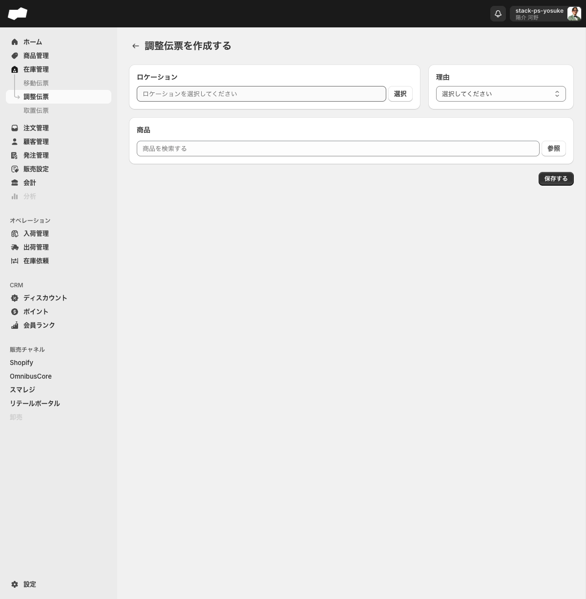
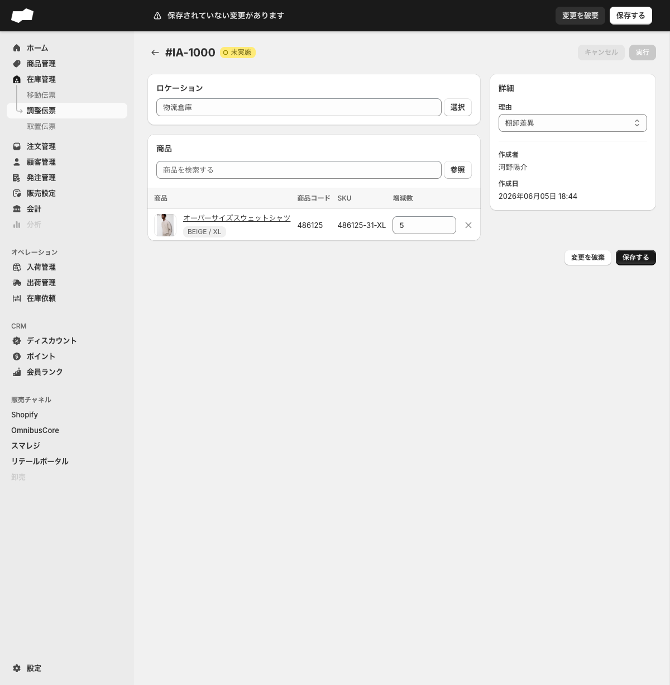
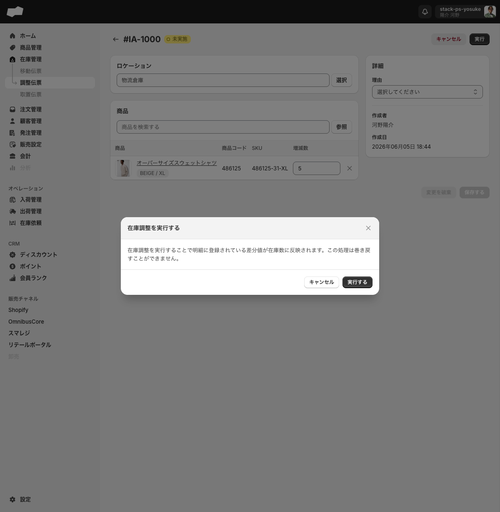

# 調整伝票

> 対象画面: 在庫管理 > 調整伝票 / `/admin/inventory_adjustment_orders`　|　最終確認: 2026-06-18

## この機能でできること

- 棚卸し差異・廃棄・紛失・見本などによる在庫数の手動増減を記録する
- 増減数をプラス（増加）またはマイナス（減少）で指定して在庫に反映する
- マイナス在庫（手持ちが0未満の状態）を修正する場合にも使う
- 過去の調整記録（伝票番号・実行者・実行日）を確認する

## 画面・項目の説明

### 一覧タブ

| タブ名 | 説明 |
|:--|:--|
| すべて | 全ステータスの伝票を表示する |
| 未実施 | まだ在庫に反映されていない伝票 |
| 実施済み | 在庫への反映が完了した伝票 |
| キャンセル | キャンセルされた伝票 |

### 作成フォーム（`/admin/inventory_adjustment_orders/create`）

| 項目（UIラベル） | 説明 | 必須 | 制約・選択肢 |
|:--|:--|:--|:--|
| ロケーション | 調整対象の在庫が置かれているロケーション | 必須 | 「選択」ボタンからロケーション選択モーダルを使う |
| 理由 | 調整の理由を選ぶ | 必須 | 廃棄 / 見本 / 紛失 / 棚卸差異 / その他（5種類）。「破損」「検品」「予備」は選択肢にない |
| 商品（商品を検索する） | 調整する商品を指定する | 必須 | テキスト検索または「参照」ボタンで商品を選ぶ |
| 増減数 | 商品追加後に表示される数値入力欄 | 必須 | プラスで増加、マイナスで減少。デフォルト0。2026-06-18時点では0でも保存できた |

空のまま「**保存する**」を押すと次のエラーがフィールド下にインライン表示されます。

- 「ロケーションを選択してください」
- 「理由を選択してください」
- 「商品を1つ以上追加してください」

2026-06-18の再確認では、ロケーションと商品を入力した状態でも、理由未選択のまま保存すると「理由を選択してください」で保存できませんでした。



### 詳細画面（`/admin/inventory_adjustment_orders/[id]`）

| 表示項目 | 内容 |
|:--|:--|
| ロケーション | 選択済みのロケーション名 |
| 商品テーブル | 商品名・バリエーション / 商品コード / SKU / 増減数 |
| 作成者 | 作成したスタッフ名 |
| 作成日 | 作成日時 |
| 実行者 | 実施したスタッフ名（実施済みのみ表示） |
| 実行日 | 実施日時（実施済みのみ表示） |
| 理由 | 詳細画面ではドロップダウンで表示（未実施時は変更可） |

## ステータスと操作

### ステータス遷移

```
作成・保存 → [未実施] → 「実行」ボタン → 確認ダイアログ → 「実行する」 → [実施済み]
                 ↓
           「キャンセル」ボタン → [キャンセル]
```

| ステータス | 表示バッジ | 利用可能なボタン | 編集可否 |
|:--|:--|:--|:--|
| 未実施 | 「○ 未実施」（白丸） | キャンセル / 実行 | 可（ロケーション・商品・増減数・理由を変更できる） |
| 実施済み | 「● 実施済み」（黒丸） | キャンセル（押しても実行不可） | 不可（全フィールドが読み取り専用になる） |
| キャンセル | 「キャンセル」 | 実行ボタンが残る場合あり（押してもサーバー側でブロック） | 不可 |

### 未実施状態の詳細画面での操作

未実施の調整伝票詳細画面には以下の2つのボタンが表示されます。

| ボタン（UIラベル） | 操作 |
|:--|:--|
| キャンセル | 確認ダイアログなしで即時にステータスを「キャンセル」へ変更する |
| 実行 | 在庫調整を実施し、ステータスを「実施済み」へ変更する |

未実施の間は、詳細画面からロケーション・理由・商品（追加・削除）・増減数を変更できます。変更後は「**保存する**」ボタンが有効化されるので、実行前に「**保存する**」で変更を確定してください（未保存状態では「実行」ボタンがグレーアウトして押せません）。

### 実行する前の注意

未保存の変更がある状態（画面上部に「⚠ 保存されていない変更があります」バナーが表示されている状態）は、「**実行**」ボタンがグレーアウトして押せません。先に「**保存する**」を押してから「**実行**」を押してください。



### 実行確認ダイアログ

「**実行**」ボタンを押すと次のダイアログが表示されます。

> タイトル「在庫調整を実行する」
> 本文「在庫調整を実行することで明細に登録されている差分値が在庫数に反映されます。この処理は巻き戻すことができません。」



「**実行する**」を押すと在庫数に即時反映されます。実施後は取り消せません。

実施済みの伝票でも画面右上に「**キャンセル**」ボタンは表示されます。ただし押してもキャンセルは実行されず、次のトーストが表示され、ステータスは「実施済み」のままです。

> 「キャンセルできない在庫調整伝票が含まれています。既にキャンセル済みまたは完了済みの伝票はキャンセルできません。」

キャンセル済みの伝票でも「実行」ボタンが表示され、確認ダイアログが開く場合があります。ただし確定すると次のエラーでブロックされます。

> 「完了済みまたはキャンセル済みの在庫調整伝票は完了できません。」

## 補足・注意点

- 未実施の「キャンセル」は確認ダイアログなしで即時実行されます。誤って押さないよう注意してください。
- 実施済みの調整伝票ではキャンセルボタンが表示される場合がありますが、キャンセルは実行できません。
- 増減数0でも調整伝票を作成できます。0の伝票は在庫数を動かしませんが、履歴・監査上は不要な伝票になるため通常運用では避けてください。
- 「その他」を理由にして保存した場合、詳細画面の理由ドロップダウンが空表示になるケースを確認しています。保存・実行自体はできますが、理由を運用上必須にする場合は実行前に表示を確認してください。
- 在庫詳細画面（`/admin/inventory_items/[id]`）の「販売可能」列にある鉛筆アイコンからも在庫数を調整できます（「販売可能在庫数を編集する」ダイアログ経由）。

## 関連

- 機能別: [移動伝票](./移動伝票.md)
- 機能別: [取置伝票](./取置伝票.md)
- 作業別: [在庫を調整する](../02-by-task/在庫を調整する.md)
