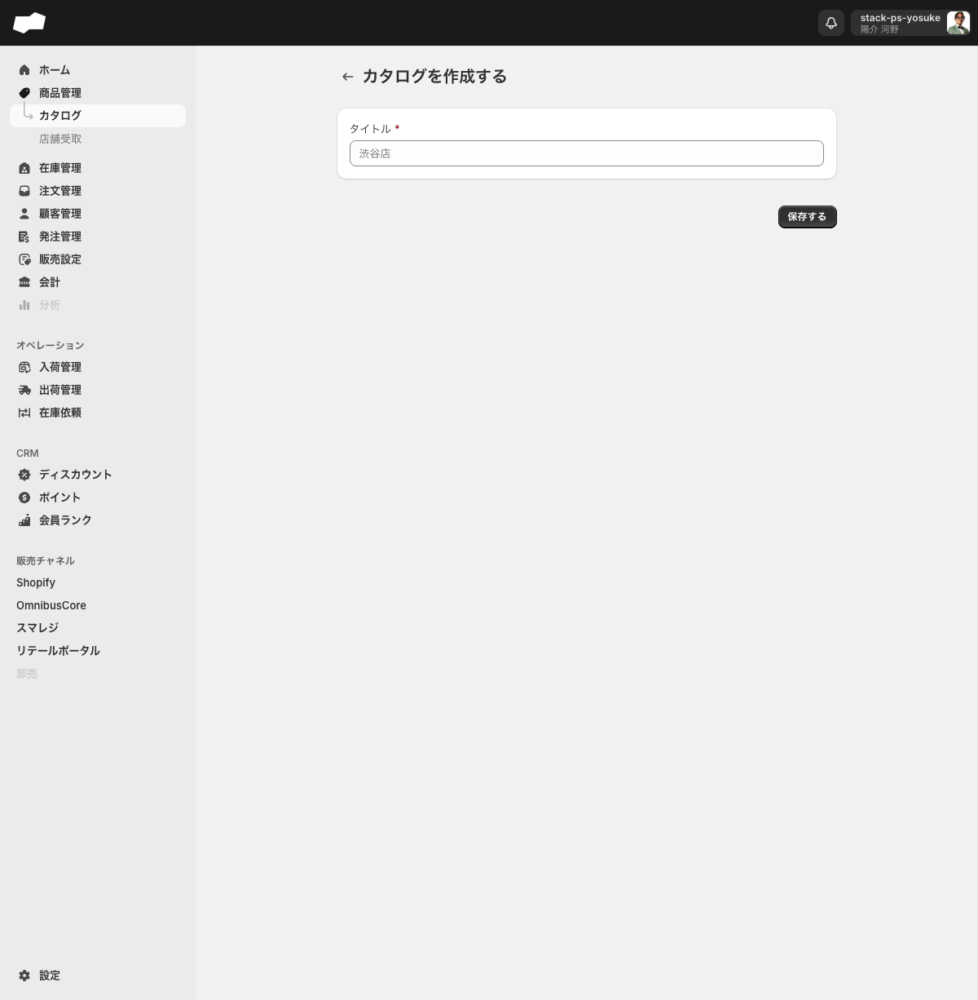
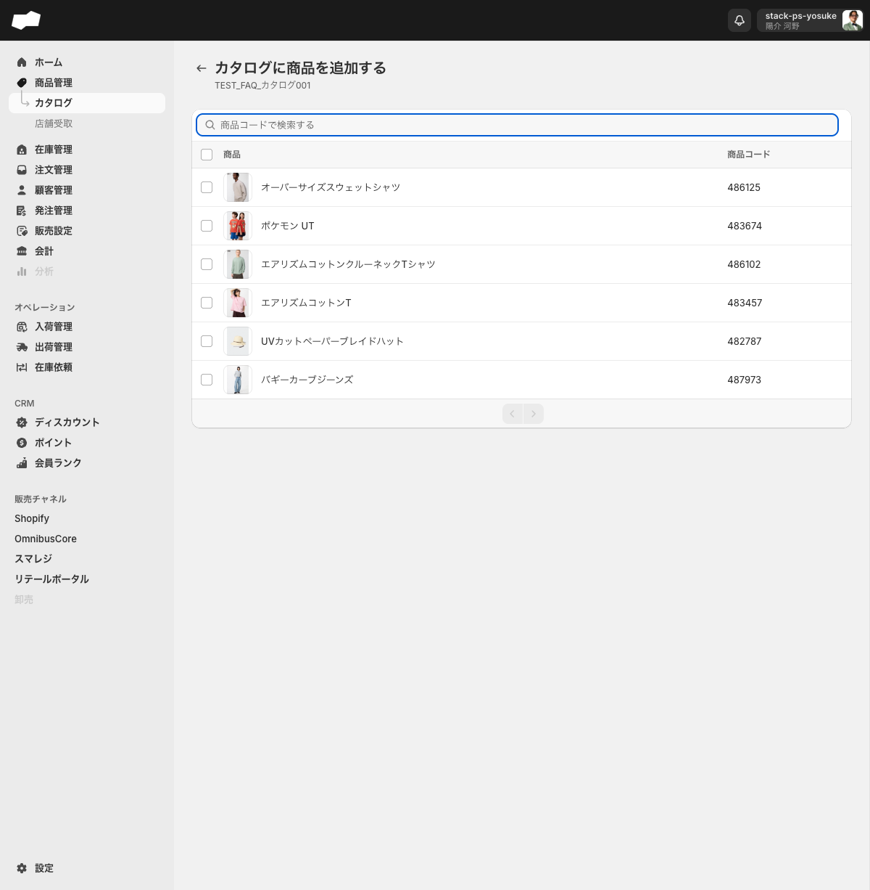

# カタログを作成して商品を追加する

> 対象ユーザー: 運営者・管理者　|　所要: 5〜15分（追加する商品数と設定内容による）　|　最終確認: 2026-06-10

---

## このドキュメントのスコープ

カタログとは商品をグループ化する入れ物で、外部連携（OmnibusCoreなど）のチャネルに出品する商品群を制御するために使います。

この手順では以下の3つの操作を説明します。

1. カタログを新規作成する
2. カタログに商品を手動で追加する
3. 条件に一致する商品を自動追加するルールを設定する

チャネル連携でのカタログ指定方法については末尾を参照してください。

---

## 前提

- カタログ画面を操作できる権限が付与されていること
- カタログに追加したい商品が商品管理に登録済みであること

---

## ステップ 1: カタログを作成する

1. 左メニューの「商品管理」をクリックし、サブメニューの「カタログ」をクリックして、カタログ一覧画面（`/admin/catalogs`）を開く。
2. 「カタログを作成する」ボタンをクリックする。カタログ作成フォーム（`/admin/catalogs/create`）へ遷移する。
3. 「タイトル*」欄にカタログ名を入力する（例: 渋谷店）。

   > カタログ名はチャネル連携でカタログを選ぶときの識別名になります。拠点名や用途がわかる名称をつけることを推奨します。

4. 「保存する」ボタンをクリックする。カタログ詳細画面へ遷移することを確認する。

---

## ステップ 2: カタログに商品を手動で追加する

1. カタログ詳細画面の右上にある「商品を追加する」ボタンをクリックする。「カタログに商品を追加する」画面（`/admin/catalogs/{id}/create`）へ遷移する。
2. 追加したい商品を一覧から探す。商品コードで絞り込みたい場合は「商品コードで検索する」テキストボックスに商品コードを入力する。

3. 追加したい商品行のチェックボックスをオンにする。複数選択も可能。画面上部に「N を選択済み」と選択件数が表示され、「カタログに追加する」ボタンが出現する。
4. 全商品を選択したい場合は一覧上部の一括チェックボックスをオンにする。
5. 「カタログに追加する」ボタンをクリックする。
6. カタログ詳細画面に戻り、追加した商品が一覧に表示されることを確認する。

---

## ステップ 3: 自動追加ルールを設定する（任意）

製造元やブランドコードが一致する商品を自動的にカタログへ追加するルールを設定できます。

1. カタログ詳細画面の左上にある「自動追加ルール」リンクをクリックする。自動追加ルール画面（`/admin/catalogs/{id}/automatic_add_rules`）へ遷移する。
2. 「追加する」ボタンをクリックする。「ルールを追加する」ダイアログが開く。
3. ダイアログ内の各項目を設定する。

   | 項目（UIラベル） | 選択肢 | 入力内容 |
   |:--|:--|:--|
   | 項目 | 「製造元」「ブランドコード」の2択 | 条件とする属性を選ぶ |
   | 条件 | 「一致する」の1択 | 変更不可 |
   | 値 | テキスト自由入力 | 一致させたい値を入力する（例: UNIQLO） |

4. 「追加する」ボタンをクリックする。
5. 設定したルールと完全一致する商品が自動的にカタログへ追加されます。

> 自動追加ルールは「製造元」または「ブランドコード」への**完全一致**のみ対応しています。部分一致・正規表現には対応していません。

---

## チャネル連携でカタログを指定する

作成したカタログを外部連携（OmnibusCore・Shopify・スマレジなど）に紐付けることで、チャネルに出品する商品群をカタログ単位で制御できます。紐付けはカタログ詳細画面からではなく、チャネル連携側の設定画面から行います。

### OmnibusCore連携でのカタログ指定

1. 左メニューからOmnibusCore連携の設定画面（`/admin/omnibus_core_integrations`）を開く。
2. 対象の連携設定をクリックして詳細画面を開く（または「追加する」ボタンで新規作成フォームを開く）。
3. 「商品同期設定」セクションの「カタログ」セレクトで、紐付けたいカタログを選択する。
4. 設定を保存する。

### Shopify・スマレジ連携でのカタログ指定

<!-- TODO: 要確認（Shopify連携・スマレジ連携でのカタログ紐付け設定経路。各連携が未接続のため実機確認できていない。OmnibusCore同様に連携設定フォーム内の「カタログ」セレクトから設定できると推測されるが未確認） -->

---

## カタログ一覧で確認できること

カタログ一覧（`/admin/catalogs`）の各列の意味を確認します。

| 列名 | 内容 |
|:--|:--|
| 名前 | カタログ名 |
| 商品 | このカタログに登録されている商品の数（例: 6個の商品） |
| 販売先 | このカタログを参照しているチャネル連携の数（例: 1つの販売先） |

「販売先」の件数はカタログ詳細画面から変更することはできません。チャネル連携側の設定を変更すると反映されます。

---

## うまくいかないとき

**「商品を追加する」で追加したい商品が一覧に表示されない**
- 「商品コードで検索する」テキストボックスに入力した値が商品コードと完全に一致していることを確認してください。商品名での検索はできません。

**自動追加ルールを設定したが商品が追加されない**
- 設定した値が商品の「製造元」または「ブランドコード」と完全に一致しているか確認してください。大文字・小文字・スペースの違いも影響します。

**カタログ一覧の「販売先」が増えない**
- 「販売先」はチャネル連携側でカタログを紐付けた際に増加します。カタログ詳細画面から直接「販売先」を設定するUIはありません。

---

## 関連

- 機能の説明: [カタログ](../01-by-feature/カタログ.md)
- 機能の説明: [商品管理](../01-by-feature/商品管理.md)
- 関連作業: [商品を作成する](./商品を作成する.md)
