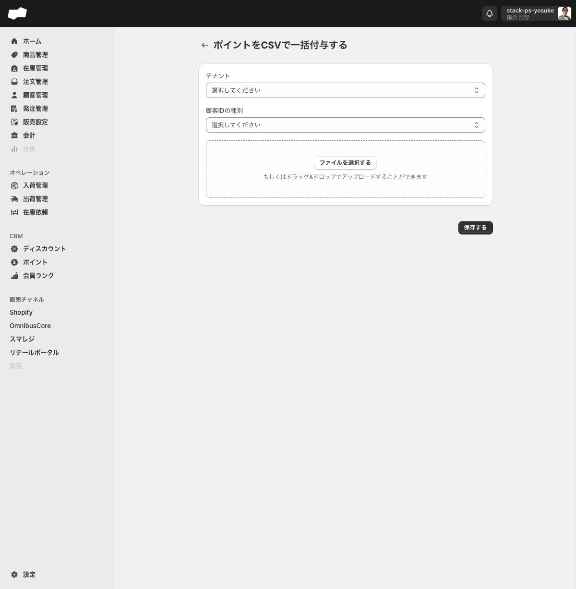

# ポイントをCSVで一括加算する

> 対象ユーザー: 運営者・管理者　|　所要: 5分程度　|　最終確認: 2026-06-16

---

## このドキュメントのスコープ

複数の顧客にポイントをまとめて加算したい場合に、CSVファイルを使って一括で処理する手順を説明します。

1件ずつ手動で加算する方法ではなく、CSVファイルにまとめて一括処理する方法です。

> **補足:** 顧客管理画面の「インポート」メニュー内に表示される「ポイント一括付与」は、CSVインポート画面の「一括加算」と同じ機能です。画面内でラベルが異なりますが、遷移先は同一です。

---

## 前提

- CSVインポート画面（`/admin/csv_import`）を操作する権限があること
- テナントが1件以上登録されていること
- テンプレートに沿って加算データを記入したCSVファイルを用意していること

---

## 手順

### ステップ 1: テンプレートを入手する

1. 左メニューの「CSVインポート」をクリックする。CSVインポートのトップ画面が開く。
2. 「ポイント」グループ内の「一括加算」をクリックする。一覧画面（`/admin/csv_import/csv_import_operation_point_pluses`）へ遷移する。
3. 「テンプレート」ボタンをクリックする。Googleスプレッドシート形式のテンプレートが別タブで開く。
4. テンプレートの指示に従い、加算する顧客IDとポイント数をCSVに記入して保存する。

---

### ステップ 2: 新規インポートを開始する

1. 一覧画面右上の「新規インポート」ボタンをクリックする。インポート実行フォームへ遷移する。

---

### ステップ 3: テナントと顧客IDの種別を選択する

1. 「テナント」のセレクトボックスをクリックし、加算対象のテナントを選択する。

   > 画面上に必須マーク（*）は表示されていませんが、未選択のまま「保存する」を押すと「テナントを選択してください」というエラーが表示されます。必ず選択してください。

2. 「顧客IDの種別」のセレクトボックスをクリックし、CSVに記載した顧客IDの種類を選択する。

   | 選択肢（UIラベル） | 説明 |
   |:--|:--|
   | SQが発番した顧客ID | SQシステムが内部で付与している顧客ID |
   | 外部システムが発番した顧客ID | Shopifyなど外部連携システムが付与しているID |

   > 「顧客IDの種別」も画面上は必須マーク（*）なしですが、未選択のまま保存しようとすると「顧客IDの種別を選択してください」というエラーが表示されます。必ず選択してください。

---

### ステップ 4: CSVファイルをアップロードする

1. 「ファイルを選択する」ボタンをクリックしてファイル選択ダイアログを開き、用意したCSVファイルを選択する。ファイルエリアへのドラッグ＆ドロップでもアップロードできる。

---

### ステップ 5: 保存する

1. 画面右下の「保存する」ボタンをクリックする。インポート処理が実行される。
2. 処理完了後、一覧画面に実行履歴が追加される。履歴行をクリックすると「検証ステータス」「実行ステータス」「検証成功件数」「検証失敗件数」を確認できる。

---

## うまくいかないとき

**「テナントを選択してください」または「顧客IDの種別を選択してください」と表示されて保存できない**
- どちらのフィールドも画面上は任意表示ですが、実際には選択が必須です。両方とも選択してから「保存する」を押してください。

**インポート後に検証失敗件数がゼロでない**
- 一覧画面の該当履歴をクリックし、「検証失敗」のリンクから失敗詳細画面（見出し「検証失敗」）を確認してください。CSVの行単位でエラー内容を確認できます。

---

## 関連

- 機能の説明: [CSVインポート](../01-by-feature/CSVインポート.md)
- 機能の説明: [ポイント（注文ポイント）](../01-by-feature/ポイント.md)
- 作業手順: [ポイントをCSVで一括減算する](#ポイントをcsvで一括減算する)（このファイル内、下記を参照）

---

---

# ポイントをCSVで一括減算する

> 対象ユーザー: 運営者・管理者　|　所要: 5分程度　|　最終確認: 2026-06-11

---

## このドキュメントのスコープ

複数の顧客のポイントをまとめて減算したい場合に、CSVファイルを使って一括で処理する手順を説明します。

操作フローは「一括加算」とほぼ同じです。入口となるカテゴリが「一括減算」になる点が異なります。

---

## 前提

- CSVインポート画面（`/admin/csv_import`）を操作する権限があること
- テナントが1件以上登録されていること
- テンプレートに沿って減算データを記入したCSVファイルを用意していること

---

## 手順

### ステップ 1: テンプレートを入手する

1. 左メニューの「CSVインポート」をクリックする。CSVインポートのトップ画面が開く。
2. 「ポイント」グループ内の「一括減算」をクリックする。一覧画面（`/admin/csv_import/csv_import_operation_point_minuses`）へ遷移する。
3. 「テンプレート」ボタンをクリックする。Googleスプレッドシート形式のテンプレートが別タブで開く。
4. テンプレートの指示に従い、減算する顧客IDとポイント数をCSVに記入して保存する。

---

### ステップ 2: 新規インポートを開始する

1. 一覧画面右上の「新規インポート」ボタンをクリックする。インポート実行フォームへ遷移する。

---

### ステップ 3: テナントを選択する

1. 「テナント」のセレクトボックスをクリックし、減算対象のテナントを選択する。

   > 画面上に必須マーク（*）は表示されていませんが、未選択のまま「保存する」を押すとエラーが表示されます。必ず選択してください。

一括減算フォームには、一括加算フォームにある「顧客IDの種別」は表示されません。空保存時のエラーは「テナントを選択してください」、テナントだけ選んでファイル未選択で保存すると「ファイルを選択してください」です。

---

### ステップ 4: CSVファイルをアップロードする

1. 「ファイルを選択する」ボタンをクリックしてファイル選択ダイアログを開き、用意したCSVファイルを選択する。ファイルエリアへのドラッグ＆ドロップでもアップロードできる。

---

### ステップ 5: 保存する

1. 画面右下の「保存する」ボタンをクリックする。インポート処理が実行される。
2. 処理完了後、一覧画面に実行履歴が追加される。履歴行をクリックすると「検証ステータス」「実行ステータス」「検証成功件数」「検証失敗件数」を確認できる。

---

## うまくいかないとき

**テナント未選択またはファイル未選択で保存できない**
- テナント未選択の場合は「テナントを選択してください」、ファイル未選択の場合は「ファイルを選択してください」と表示されます。一括減算では「顧客IDの種別」は表示されません。

**インポート後に検証失敗件数がゼロでない**
- 一覧画面の該当履歴をクリックし、「検証失敗」のリンクから失敗詳細画面（見出し「検証失敗」）を確認してください。CSVの行単位でエラー内容を確認できます。

---

## 関連

- 機能の説明: [CSVインポート](../01-by-feature/CSVインポート.md)
- 機能の説明: [ポイント（注文ポイント）](../01-by-feature/ポイント.md)
- 作業手順: [ポイントをCSVで一括加算する](#ポイントをcsvで一括加算する)（このファイル内、上記を参照）
