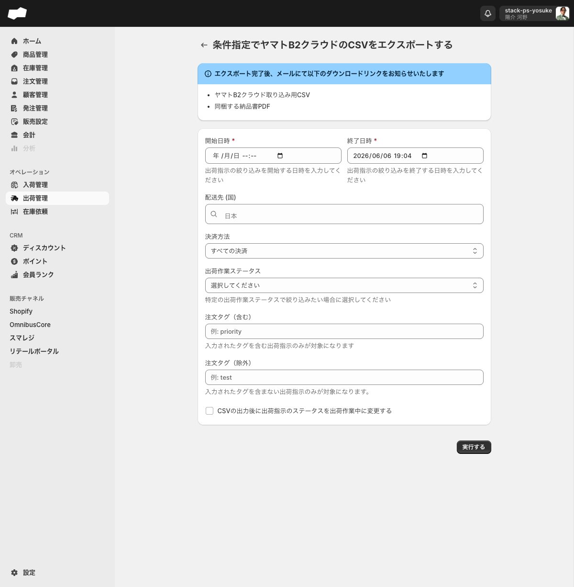
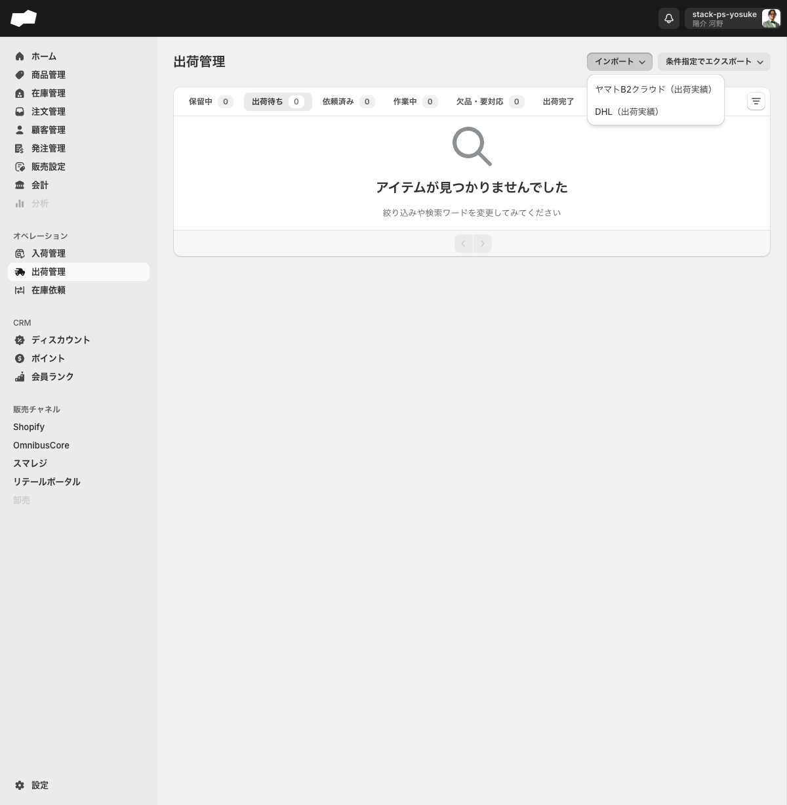
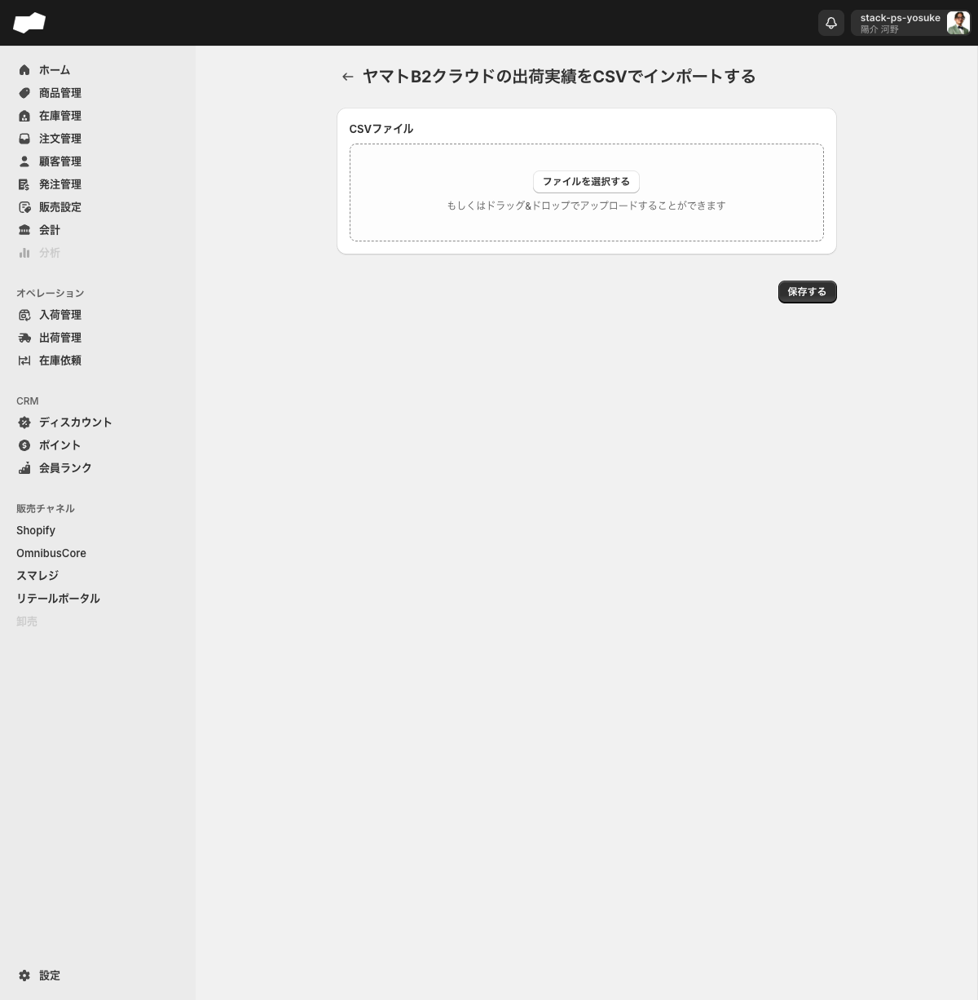

# ヤマトB2クラウドで出荷業務を行う

> 対象ユーザー: 在庫管理担当者　|　所要: 15〜30分（件数による）　|　最終確認: 2026-06-16

---

## このドキュメントのスコープ

ヤマトB2クラウドを使った出荷業務の一連の流れを説明します。

1. SQからヤマトB2クラウド用CSVをエクスポートする
2. ヤマトB2クラウドで発送処理を行う
3. 発送後にヤマトB2クラウドの出荷実績CSVをSQへインポートする

DHL を使った出荷実績インポートも同様の手順で行えます（後述）。

---

## 前提

- 出荷管理を操作する権限が付与されていること
- エクスポート完了通知を受け取るメールアドレスが登録済みであること
- ヤマトB2クラウドのアカウントおよび操作環境が別途用意されていること

---

## フロー全体像

| ステップ | 操作場所 | 内容 |
|:--|:--|:--|
| 1 | SQ 出荷管理 | 条件を指定してヤマトB2クラウド用CSVをエクスポート |
| 2 | メール | エクスポート完了通知を受け取り、ファイルをダウンロード |
| 3 | ヤマトB2クラウド | CSVを取り込んで発送処理 |
| 4 | SQ 出荷管理 | ヤマトB2クラウドの出荷実績CSVをインポート |

---

## 手順

### ステップ 1: 出荷指示CSVをエクスポートする

1. 左メニューの「出荷管理」をクリックし、出荷管理の一覧画面を開く。
2. 画面右上の「条件指定でエクスポート」ボタン（右側に下向き矢印がある）をクリックする。ドロップダウンが開く。
3. 「ヤマトB2クラウド」を選択する。エクスポートフォーム画面「条件指定でヤマトB2クラウドのCSVをエクスポートする」へ遷移する。
4. 以下の項目を入力する。

| 項目（UIラベル） | 必須 | 説明・選択肢 |
|:--|:--|:--|
| 開始日時 | 必須（*） | 絞り込みを開始する日時を入力する |
| 終了日時 | 必須（*） | 絞り込みを終了する日時を入力する（デフォルト: 現在日時が入力済み） |
| 配送先 (国) | 任意 | 国を選択して絞り込む（マルチ選択可） |
| 決済方法 | 任意 | すべての決済 / 代引きのみ / 代引き以外の決済 |
| 出荷作業ステータス | 任意 | 指定しない / 出荷待ち / 保留中 / 依頼済み / 作業中 / 欠品・要対応 / キャンセル済み / 出荷完了 |
| 注文タグ（含む） | 任意 | 入力したタグを含む出荷指示のみが対象になる（例: priority） |
| 注文タグ（除外） | 任意 | 入力したタグを含まない出荷指示のみが対象になる（例: test） |
| CSVの出力後に出荷指示のステータスを出荷作業中に変更する | 任意 | チェックボックス（デフォルト: 未チェック）。チェックをONにするとエクスポートと同時に対象の出荷指示ステータスが変わる |

5. 「実行する」ボタンをクリックする。

<!-- TODO: 要確認（「実行する」をクリックした後の画面上の表示変化・完了トーストの有無） -->

---

### ステップ 2: 出力結果を確認する

エクスポートは非同期処理で実行される。完了後は、CSVエクスポートまたは出荷管理側の関連履歴で出力結果を確認する。メール通知の有無・文面・リンク有効期限は今回の実機確認範囲外です。

- **ヤマトB2クラウド取り込み用CSV**

ダウンロードリンクが表示されたら、CSVファイルをダウンロードする。

> 納品書PDFについては、2026-06-19の実機確認ではPDFエクスポート画面に納品書カテゴリは表示されますが、任意新規生成ボタンは表示されず、直接作成URLも存在しませんでした。ヤマトB2クラウドCSVと納品書PDFが必ず同時生成されるとは案内しないでください。

---

### ステップ 3: ヤマトB2クラウドで発送処理を行う

ヤマトB2クラウドにダウンロードしたCSVを取り込み、発送処理を行う。

<!-- TODO: 要確認（ヤマトB2クラウド側の操作手順はSQ外のシステムのため記録なし） -->

発送完了後、ヤマトB2クラウドから出荷実績CSVをダウンロードしておく（次のステップで使用する）。

---

### ステップ 4: 出荷実績CSVをSQへインポートする

1. 左メニューの「出荷管理」をクリックし、出荷管理の一覧画面を開く。
2. 画面右上の「インポート」ボタン（右側に下向き矢印がある）をクリックする。ドロップダウンが開く。
3. 「ヤマトB2クラウド（出荷実績）」を選択する。ヤマトB2クラウドの出荷実績インポート画面へ遷移する。

4. 「テンプレート」リンクをクリックすると、CSVフォーマットの定義書（Googleスプレッドシート）を確認できる。

   ヤマトB2クラウドCSVのフォーマット仕様（必須列と任意列）:

   | 列 | 項目名 | 必須/任意 |
   |:--|:--|:--|
   | A | 伝票番号 | 必須 |
   | B | お届け先コード | 任意 |
   | C | お届け先名 | 任意 |
   | D | 荷物状況 | 任意 |
   | E | 日付 | 任意 |
   | F | 時刻 | 任意 |
   | G | 出荷日 | 必須 |
   | H | サイズ品目 | 任意 |
   | I | 運賃 | 任意 |
   | J | お客様管理番号 | 必須 |

   必須列は A（伝票番号）・G（出荷日）・J（お客様管理番号）の3列のみ。任意列はインポート処理で読み捨てられる。

5. 「新規インポート」ボタンをクリックする。インポート実行フォームへ遷移する。

6. 「ファイルを選択する」ボタンをクリックしてCSVファイルを選ぶか、ファイルをドラッグ&ドロップでアップロードエリアに置く。
7. 「保存する」ボタンをクリックする。

<!-- TODO: 要確認（「保存する」をクリックした後の処理結果・成功時の表示・エラー時の表示。実行系操作のため実証未実施） -->

> インポート後の実行履歴はインポート一覧画面で確認できる。各履歴行をクリックすると詳細（検証ステータス・実行ステータス・成功件数・失敗件数）を確認できる。

---

## DHL の出荷実績をインポートする場合

ヤマトB2クラウドと同様の手順で行う。手順 4 のステップ 3 で、ドロップダウンの「DHL（出荷実績）」を選択する。

- DHL のインポート画面URL: `/admin/csv_import/csv_import_operation_fulfillment_by_dhls`
- DHL のインポートフォームはCSVファイルのアップロードのみ（テンプレートリンクは2026-06-10時点で未確認）。

<!-- TODO: 要確認（DHL用CSVフォーマットの仕様。2026-06-10時点でテンプレートリンクの有無を未確認） -->

---

## うまくいかないとき

**「条件指定でエクスポート」ドロップダウンに「ヤマトB2クラウド」が表示されない**
- ドロップダウンの選択肢は「ヤマトB2クラウド」のみです。DHL のエクスポートは存在しません。DHL は出荷実績インポートのみ対応しています。

**エクスポート完了メールが届かない**
- エクスポートは非同期処理のため、完了まで時間がかかる場合があります。しばらく待ってからメールを確認してください。

**「保存する」ボタンを押してもインポートが進まない**
- CSVファイルが選択されていない場合はアップロードできません。「ファイルを選択する」でファイルを選んでから「保存する」をクリックしてください。

**インポート後に出荷実績が反映されない**
- インポート一覧画面で該当履歴の詳細を開き、検証ステータスと実行ステータスを確認してください。検証失敗がある場合は失敗件数のリンクから内容を確認できます。

---

## 関連

- 機能の説明: [出荷管理](../01-by-feature/出荷管理.md)
- 機能の説明: [CSVエクスポート・PDFエクスポート](../01-by-feature/CSVエクスポート・PDFエクスポート.md)
