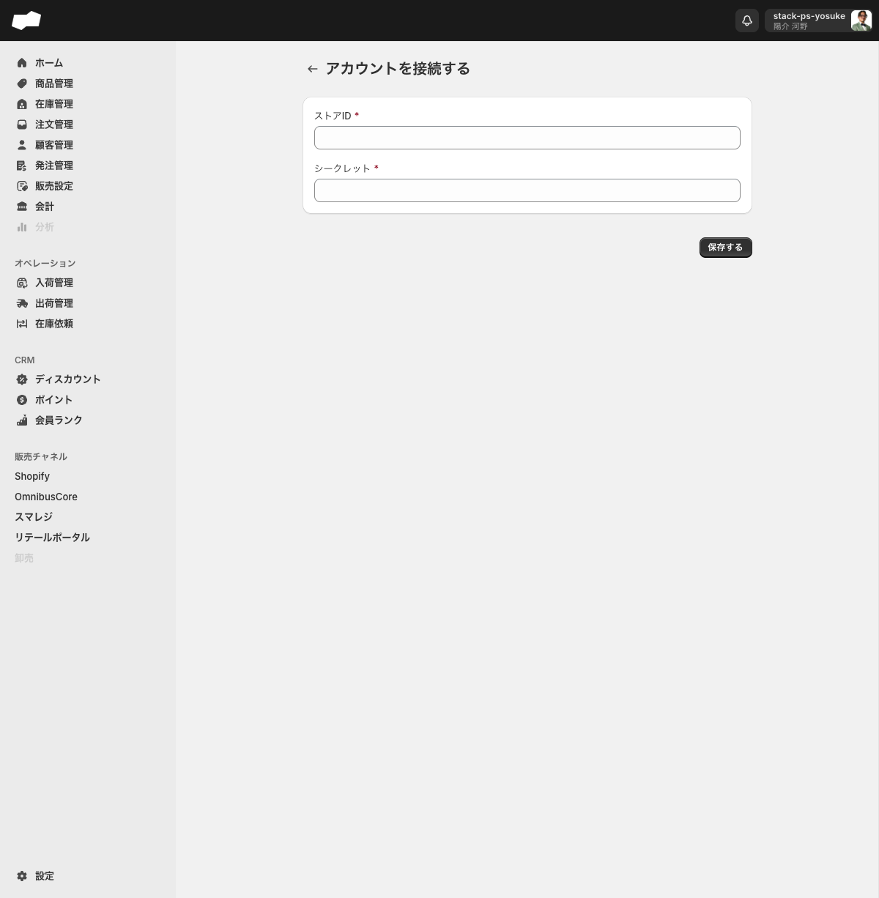
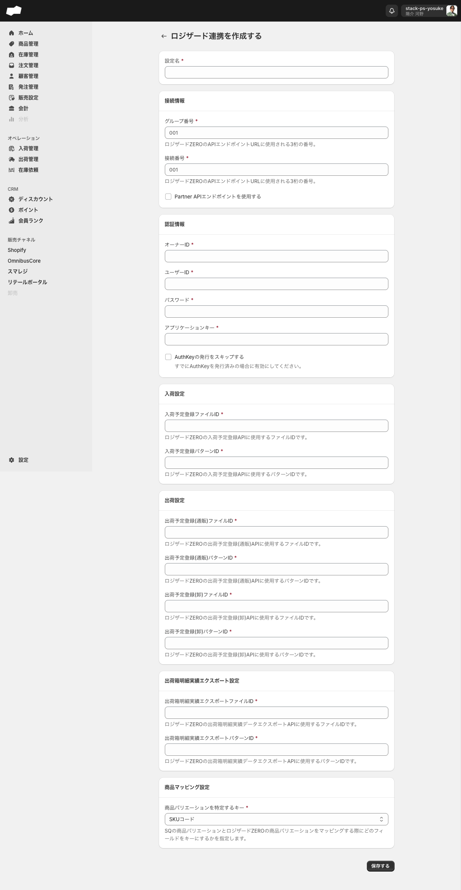

# ロジザード・Recustomerを接続する

> 対象ユーザー: 管理者・運営者　|　所要: 各連携 5〜15分（認証情報の準備済みの場合）　|　最終確認: 2026-06-12

---

## このドキュメントのスコープ

SQの「設定」画面から外部サービス（ロジザードZERO・Recustomer）を接続するフォームの入力手順を説明します。またSQ Admin APIを利用するためのアプリ（APIキー）の作成と、作成後の詳細画面の操作についても説明します。

| 連携先 | 設定場所 |
|:--|:--|
| Recustomer（返品・交換プラットフォーム） | 設定 > 外部連携 > Recustomer |
| ロジザードZERO（WMS・倉庫管理システム） | 設定 > 外部連携 > ロジザード |
| アプリ（SQ Admin API） | 設定 > 外部連携 > アプリ |

> **注意**: フォーム入力・保存ボタンクリックまでが本手順の保証範囲です。保存後の接続確立・同期開始など実行後の挙動は、未接続環境のため未確認です。

<!-- TODO: 要確認（各連携共通: 保存後の接続確立・同期開始の挙動は未接続環境のため未確認） -->

---

## 1. Recustomerを接続する

### 概要

Recustomerは返品・交換を管理するプラットフォームです。SQとRecustomerを接続することで、注文の返品・交換処理をRecustomer経由で行えるようになります。接続にはRecustomer側の「ストアID」と「シークレット」が必要です。

### 前提

- RecustomerのストアIDとシークレットキーを取得済みであること（Recustomerの管理画面から取得してください）

### 手順

1. 左メニュー下部の「設定」をクリックする。設定トップページが開く。
2. 「外部連携」グループの「Recustomer」をクリックする。Recustomer連携一覧画面（`/admin/recustomer_integrations`）が開く。
3. 「アカウントを接続」ボタンをクリックする。接続フォーム（`/admin/recustomer_integrations/create`）が開く。
4. 次の項目を入力する（どちらも必須）。

| 項目（UIラベル） | 必須/任意 | 入力内容 |
|:--|:--|:--|
| ストアID * | 必須 | RecustomerのストアIDを入力する |
| シークレット * | 必須 | RecustomerのAPIシークレットキーを入力する |

5. 「保存する」ボタンをクリックする。

<!-- TODO: 要確認（「保存する」押下後の接続確立・連携開始の挙動は未接続環境のため未確認） -->

### うまくいかないとき（Recustomer）

| 症状 | 対処 |
|:--|:--|
| ストアIDまたはシークレットが空のまま保存しようとした | どちらも必須項目です。未入力の場合はバリデーションエラーが表示されます。Recustomerの管理画面でストアIDとシークレットを確認してから再入力してください |

---

## 2. ロジザードZEROを接続する

### 概要

ロジザードZEROはWMS（倉庫管理システム）です。SQとロジザードZEROを接続することで、入荷予定・出荷予定のデータ連携や在庫実績のエクスポートを行えるようになります。

接続フォームは6セクションに分かれており、ロジザードZERO側の接続情報・認証情報と、入荷/出荷/出荷箱明細/商品マッピングの設定値が必要です。

### 前提

- ロジザードZEROの契約情報（グループ番号・接続番号・オーナーID・ユーザーID・パスワード・アプリケーションキー）を手元に用意していること
- 各設定で使用するファイルID・パターンIDをロジザードZERO側で確認済みであること

### 手順

1. 左メニュー下部の「設定」をクリックする。設定トップページが開く。
2. 「外部連携」グループの「ロジザード」をクリックする。ロジザード連携一覧画面（`/admin/logizard_integrations`）が開く。
3. 「追加する」ボタンをクリックする。作成フォーム（`/admin/logizard_integrations/create`）が開く。
4. 次の各セクションを順番に入力する（* 印は必須）。

#### セクション1: 設定名

| 項目（UIラベル） | 必須/任意 | 入力内容 |
|:--|:--|:--|
| 設定名 * | 必須 | この連携設定の識別名を入力する |

#### セクション2: 接続情報

| 項目（UIラベル） | 必須/任意 | 入力内容 |
|:--|:--|:--|
| グループ番号 * | 必須 | ロジザードZEROのAPIエンドポイントURLに使用される3桁の番号（例: 001）|
| 接続番号 * | 必須 | ロジザードZEROのAPIエンドポイントURLに使用される3桁の番号（例: 001） |
| Partner APIエンドポイントを使用する | 任意 | Partner APIエンドポイントを使う場合にチェックする |

#### セクション3: 認証情報

| 項目（UIラベル） | 必須/任意 | 入力内容 |
|:--|:--|:--|
| オーナーID * | 必須 | ロジザードZEROのオーナーIDを入力する |
| ユーザーID * | 必須 | ロジザードZEROのユーザーIDを入力する |
| パスワード * | 必須 | ロジザードZEROのパスワードを入力する |
| アプリケーションキー * | 必須 | ロジザードZEROのアプリケーションキーを入力する |
| AuthKeyの発行をスキップする | 任意 | すでにAuthKeyを発行済みの場合にチェックする。ヒント: 「すでにAuthKeyを発行済みの場合に有効にしてください。」 |

#### セクション4: 入荷設定

| 項目（UIラベル） | 必須/任意 | 入力内容 |
|:--|:--|:--|
| 入荷予定登録ファイルID * | 必須 | ロジザードZEROの入荷予定登録APIに使用するファイルIDを入力する |
| 入荷予定登録パターンID * | 必須 | ロジザードZEROの入荷予定登録APIに使用するパターンIDを入力する |

#### セクション5: 出荷設定

| 項目（UIラベル） | 必須/任意 | 入力内容 |
|:--|:--|:--|
| 出荷予定登録(通販)ファイルID * | 必須 | ロジザードZEROの出荷予定登録(通販)APIに使用するファイルIDを入力する |
| 出荷予定登録(通販)パターンID * | 必須 | ロジザードZEROの出荷予定登録(通販)APIに使用するパターンIDを入力する |
| 出荷予定登録(卸)ファイルID * | 必須 | ロジザードZEROの出荷予定登録(卸)APIに使用するファイルIDを入力する |
| 出荷予定登録(卸)パターンID * | 必須 | ロジザードZEROの出荷予定登録(卸)APIに使用するパターンIDを入力する |

#### セクション6: 出荷箱明細実績エクスポート設定

| 項目（UIラベル） | 必須/任意 | 入力内容 |
|:--|:--|:--|
| 出荷箱明細実績エクスポートファイルID * | 必須 | ロジザードZEROの出荷箱明細実績データエクスポートAPIに使用するファイルIDを入力する |
| 出荷箱明細実績エクスポートパターンID * | 必須 | ロジザードZEROの出荷箱明細実績データエクスポートAPIに使用するパターンIDを入力する |

#### セクション7: 商品マッピング設定

| 項目（UIラベル） | 必須/任意 | 入力内容 |
|:--|:--|:--|
| 商品バリエーションを特定するキー * | 必須 | SQとロジザードZEROの商品バリエーションをマッピングするキーを選択する。選択肢: 「SKUコード」（デフォルト）/ 「JANコード」/ 「EANコード」/ 「UPCコード」 |

5. 「保存する」ボタンをクリックする。

<!-- TODO: 要確認（「保存する」押下後の接続確立・在庫/入荷/出荷データの同期開始の挙動は未接続環境のため未確認） -->
<!-- TODO: 要確認（ロジザード接続済み状態の詳細・編集・解除操作画面は未確認） -->

### うまくいかないとき（ロジザード）

| 症状 | 対処 |
|:--|:--|
| 必須フィールドのエラーが複数表示される | 各セクションの必須項目（*印）がすべて入力されているか確認してください。特に認証情報セクション（オーナーID・ユーザーID・パスワード・アプリケーションキー）は4つすべて必須です |
| ファイルIDやパターンIDがわからない | ロジザードZEROの管理画面またはロジザードのサポートに確認してください |

---

## 3. アプリ（SQ Admin API）を作成する

SQ Admin APIに外部システムからアクセスしたい場合は、「アプリ」画面でAPIキーを作成します。

### 手順

1. 左メニュー下部の「設定」をクリックする。設定トップページが開く。
2. 「外部連携」グループの「アプリ」をクリックする。アプリ一覧画面（`/admin/settings/apps`）が開く。
3. 「アプリを作成する」リンクボタンをクリックする。アプリ作成フォーム（`/admin/settings/apps/create`）が開く。

> アプリ一覧画面に「APIアクセスを管理する / アプリを作成して、SQのアドミンAPIにアクセスしましょう。」と表示されます。

4. 「アプリ名 *」フィールドにアプリの識別名を入力する（例: モバイルアプリ）。
5. 付与する権限（スコープ）をチェックボックスから選択する。権限は読み取り（:read）と書き込み（:write）を個別に選択できる。各権限には説明文が付いている（例: 「商品情報を閲覧することができます。」）。
6. 「保存する」ボタンをクリックする。アプリ詳細画面へ遷移する。

### アプリ作成後の詳細画面

アプリを保存すると詳細画面が開き、以下の情報とセクションが表示されます。

#### Admin API

| 項目 | 内容 |
|:--|:--|
| アクセストークン | Admin APIへの接続に使用するトークン。作成と同時に自動発行される |
| シークレット | Webhookのリクエスト検証等に使用するシークレット。作成と同時に自動発行される |

#### 検証方法（Playground）

「**Playgroundを開く**」ボタンから GraphQL Playground を開き、Admin APIの動作を確認できます。

#### リクエストログ

「**リクエストログを見る**」からこのアプリによるAPIリクエストの履歴を確認できます。

#### Storefront API

「**トークンを発行する**」ボタンから Storefront API 用のトークンを別途発行できます。

#### Webhook

「**Webhookを作成する**」ボタンからWebhookを追加できます。

**Webhook作成時の入力項目:**

| 項目（UIラベル） | 説明 | 選択肢・補足 |
|:--|:--|:--|
| イベント | Webhookを送信するトリガーとなるイベント | 「注文の作成」 / 「注文の更新」 / 「在庫の更新」の3種 |
| エンドポイント | Webhookの送信先URL | URLを入力する |

> 権限スコープの一覧と説明は [設定](../01-by-feature/設定.md) を参照してください。

---

## 関連

- 販売チャネル（Shopify・OmnibusCore・スマレジ・リテールポータル）の接続: [販売チャネルを接続する](販売チャネルを接続する.md)
- 機能の説明: [設定](../01-by-feature/設定.md)
