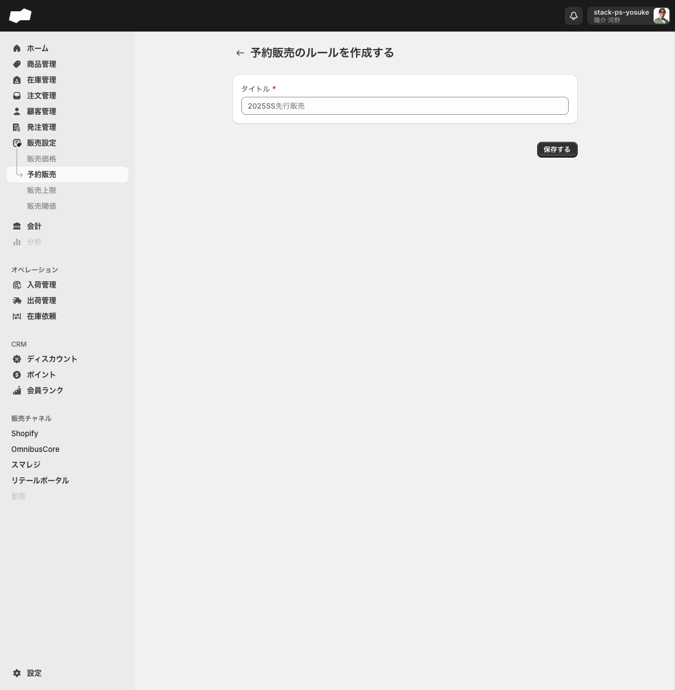
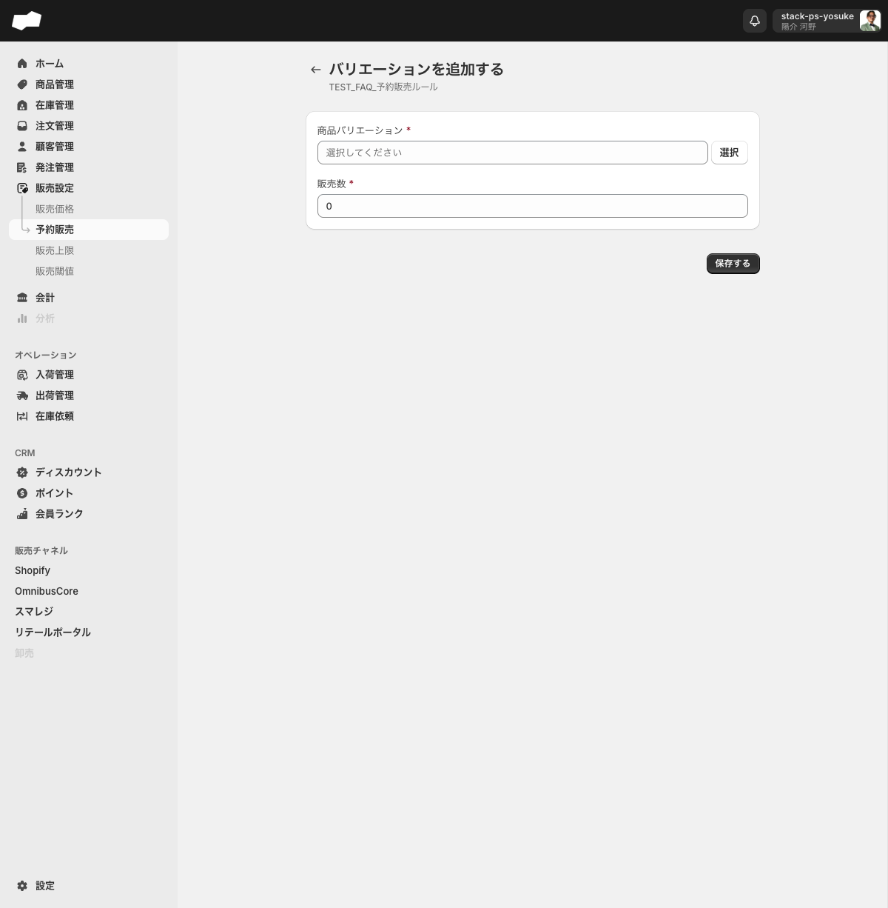

# 予約販売を設定する

> 対象ユーザー: 運営者・管理者　|　所要: 5〜10分　|　最終確認: 2026-06-11

---

## このドキュメントのスコープ

在庫が0になっても注文を受け付け続ける「予約販売」のルールを作成し、対象のSKUを登録する手順を説明します。

作業は大きく2段階です。

1. 予約販売ルールを作成する
2. 対象のSKU（バリエーション）を追加する

> **注意:** 予約販売ルールを設定したときに実際に在庫0の商品が注文受付となるかどうかは、チャネル（販売チャネル連携）が未接続の環境では未検証です。設定後の販売挙動については実際のチャネル環境で確認してください。
> <!-- TODO: 要確認（チャネル接続後の在庫0時の注文受付動作） -->

---

## 前提

- 販売設定画面（`/admin/inventory_back_order_rules`）を操作する権限があること
- 予約販売の対象とする商品バリエーション（SKU）が作成済みであること

---

## 手順

### ステップ 1: 予約販売ルールを作成する

1. 左メニューの「販売設定」>「予約販売」をクリックし、予約販売一覧画面を開く。
2. 「予約販売ルールを作成する」ボタンをクリックする。作成フォーム（ページタイトル: 「予約販売のルールを作成する」）へ遷移する。

   

3. 「タイトル」欄にルールの管理名を入力する（必須）。入力例（プレースホルダ）: 「2025SS先行販売」。
4. 「保存する」ボタンをクリックする。保存が成功するとルールの詳細画面へ遷移する。

---

### ステップ 2: 対象SKUを追加する

#### 1件ずつ追加する場合

1. 詳細画面の「バリエーションを追加する」ボタンをクリックする。登録フォーム（ページタイトル: 「バリエーションを追加する」）へ遷移する。

   

2. 「商品バリエーション」欄の「選択」ボタンをクリックし、対象のSKUを選ぶ（必須）。
3. 「販売数」欄に予約販売を受け付ける数量を入力する（必須）。初期値は「0」です。

   > 「販売数」は予約販売が可能な在庫数の固定値として設定します。

4. 「保存する」ボタンをクリックする。
5. 他のSKUも追加する場合は手順1〜4を繰り返す。

#### CSVで一括追加する場合

1. 詳細画面の「インポート」ボタンをクリックする。CSVインポート画面へ遷移する。
2. CSVインポート一覧（`/admin/csv_import/csv_import_operation_inventory_back_order_rule_product_variants`）で「新規インポート」をクリックする。
3. 作成フォームで「予約販売ルール」を選択し、CSVファイルをアップロードして「保存する」をクリックする。

2026-06-19の実機確認では、この画面にはテンプレートリンクも表示されます。

---

## 補足

- 予約販売ルールには開始日時・終了日時などの期間設定フィールドはありません。
- 詳細画面のタイトル（H1）にはルール名がそのまま表示されます。
- ルール名は詳細画面の「ルールを編集する」ボタンから変更できます。

---

## うまくいかないとき

**「保存する」を押しても保存されない（ルール作成フォーム）**
- 「タイトル」が空欄になっていないか確認してください。

---

## 関連

- 機能の説明: [販売設定](../01-by-feature/販売設定.md)
