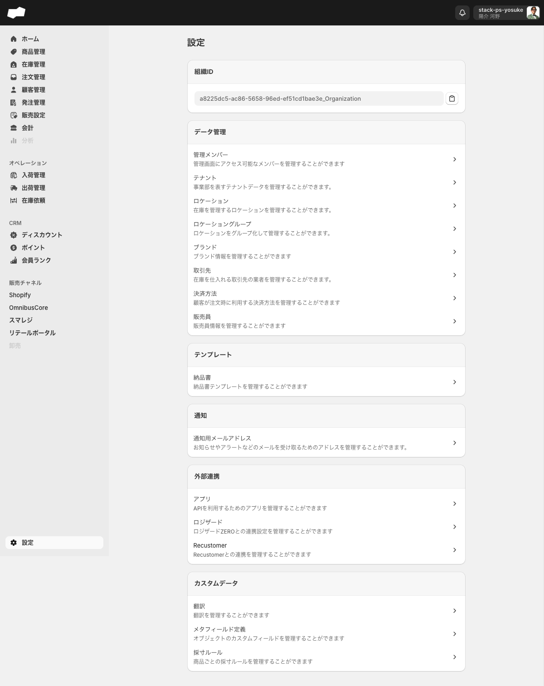
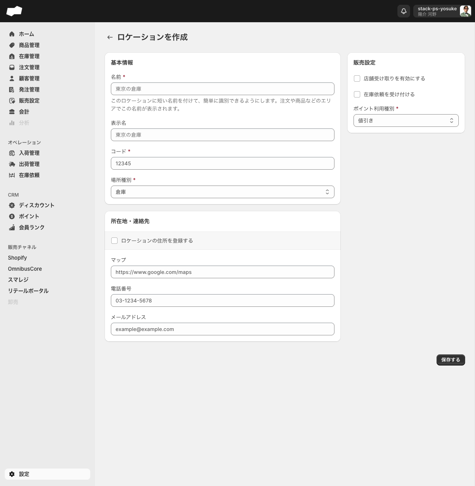
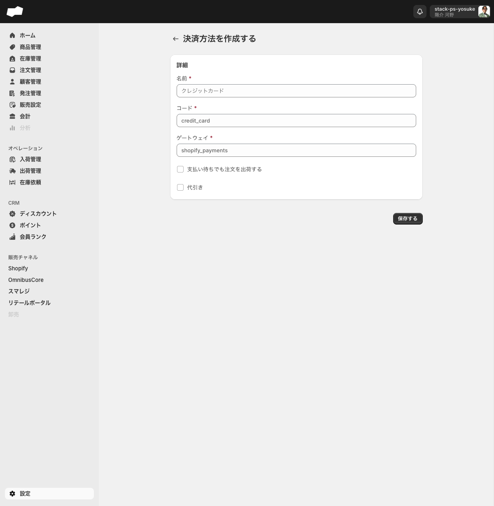

# SQ 初期設定の手順

> 対象ユーザー: 管理者　|　所要: 30〜60分（登録件数による）　|　最終確認: 2026-06-11

---

## このドキュメントのスコープ

SQを初めて使い始めるときに実施する、最低限のマスタ登録手順です。次の順序で進めることを推奨します。

| ステップ | 設定項目 | 場所 |
|:--|:--|:--|
| 1 | テナントを確認する | 設定 > テナント |
| 2 | ロケーションを登録する | 設定 > ロケーション |
| 3 | 取引先を登録する | 設定 > 取引先 |
| 4 | 決済方法を登録する | 設定 > 決済方法 |
| 5 | 管理メンバーと権限を設定する | 設定 > 管理メンバー |

---

## 前提

- 「テナントの編集権限」「ロケーションの編集権限」「ユーザーの編集権限」など、設定画面を操作するための権限が付与されていること
- 管理メンバーとしてログイン済みであること

---

## ステップ 1: テナントを確認する

テナントとは、SQ内でブランド・部門などの運用単位を分けるための管理単位です。ポイント、会員ランク、チャネル連携など複数機能の紐づけ先になります。初期状態で1件登録されている場合があります。

1. 左メニュー下部の「設定」をクリックする。設定トップページが開く。

2. 「テナント」をクリックする。テナント一覧画面に遷移する。
3. 一覧に表示されているテナント名・件数を確認する。
4. 新規にテナントを追加する場合は「テナントを作成」ボタンをクリックし、必要事項を入力して保存する。

> ここで確認したテナントは、後続のロケーション・管理メンバー・発注・ポイント/会員ランク・チャネル連携などの設定に紐づきます。

---

## ステップ 2: ロケーションを登録する

ロケーションとは、在庫を管理する物理的な拠点（倉庫・店舗）です。在庫移動・発注・出荷などのすべての在庫操作に必要です。

1. 設定トップページで「ロケーション」をクリックする。ロケーション一覧画面に遷移する。
2. 「ロケーションを作成」ボタンをクリックする。作成フォームが開く。
3. 次の項目を入力する。

### 基本情報セクションの入力項目

| 項目 | 必須/任意 | 説明 |
|:--|:--|:--|
| 名前 * | 必須 | このロケーションの短い名前。注文・商品などの画面で表示される（例: 物流倉庫） |
| 表示名 | 任意 | 顧客向けなど別途表示名が必要な場合に入力する |
| コード * | 必須 | ロケーションを識別するコード（例: W0001） |
| 場所種別 * | 必須 | セレクトボックスで選択。選択肢は「倉庫」「店舗」の2種類のみ |

### 所在地・連絡先セクションの入力項目

| 項目 | 必須/任意 | 説明 |
|:--|:--|:--|
| ロケーションの住所を登録する | 任意 | チェックボックス。オンにすると住所入力欄が展開される |
| マップ | 任意 | 地図URLを入力 |
| 電話番号 | 任意 | — |
| メールアドレス | 任意 | — |

> **住所の登録について:** 「ロケーションの住所を登録する」チェックボックスをオンにすると、国/地域・郵便番号・都道府県・市区町村・住所・建物名の入力欄が展開されます。住所の登録は任意です。

### 販売設定セクションの入力項目（右サイドバー）

| 項目 | 必須/任意 | 説明 |
|:--|:--|:--|
| 店舗受け取りを有効にする | 任意 | チェックボックス（デフォルト: オフ）。店舗受け取りに対応する場合にオンにする |
| 在庫依頼を受け付ける | 任意 | チェックボックス（デフォルト: オフ）。取り寄せ販売のリクエスト先にする店舗はオンにする |
| ポイント利用種別 * | 必須 | セレクトボックスで選択。選択肢は「値引き」「金種」の2種類のみ |

> **取り寄せ販売を設定する場合の補足:** 店舗在庫のリクエストを受ける実店舗は「在庫依頼を受け付ける」をオンにしてください。オンにすると在庫依頼の送付先として選択できるようになります。

4. 「保存する」ボタンをクリックする。ロケーション詳細画面に遷移したら登録完了。
5. 必要な拠点の数だけ手順 2〜4 を繰り返す。

---

## ステップ 3: 取引先を登録する

取引先とは、在庫を仕入れる業者のことです。発注伝票の作成に必要です。

1. 設定トップページで「取引先」をクリックする。取引先一覧画面に遷移する。
2. 「取引先を作成」ボタンをクリックする。作成フォームが開く。
3. 次の項目を入力する。

### 取引先作成フォームの入力項目

| 項目 | 必須/任意 | 説明 |
|:--|:--|:--|
| 取引先名 * | 必須 | 取引先の名称 |
| 取引先コード | 任意 | 取引先を識別するコード（例: SUP-001） |

4. 「保存する」ボタンをクリックする。
5. 必要な取引先の数だけ手順 2〜4 を繰り返す。

---

## ステップ 4: 決済方法を登録する

決済方法とは、顧客が注文時に利用する支払い手段（クレジットカード・代引きなど）の設定です。

1. 設定トップページで「決済方法」をクリックする。決済方法一覧画面に遷移する。
2. 「決済方法を作成」ボタンをクリックする。作成フォームが開く。
3. 次の項目を入力する。

### 決済方法作成フォームの入力項目

| 項目 | 必須/任意 | 説明 |
|:--|:--|:--|
| 名前 * | 必須 | 決済方法の名称（例: クレジットカード） |
| コード * | 必須 | 識別コード（例: credit_card） |
| ゲートウェイ * | 必須 | 決済ゲートウェイの識別子（例: shopify_payments） |
| 支払い待ちでも注文を出荷する | 任意 | チェックボックス（デフォルト: オフ） |
| 代引き | 任意 | チェックボックス（デフォルト: オフ）。代金引換の場合にチェックする |

4. 「保存する」ボタンをクリックする。
5. 必要な決済方法の数だけ手順 2〜4 を繰り返す。

---

## ステップ 5: 管理メンバーと権限を設定する

管理メンバーの追加および権限グループの設定は、それぞれ別の手順書を参照してください。

- 管理メンバーを追加する手順: [管理メンバーを追加する](管理メンバーを追加する.md)
- 権限グループを作成する手順: [権限グループを作成する](権限グループを作成する.md)

---

## うまくいかないとき

**「ロケーションを作成」ボタンが見つからない**
- 設定トップページの「ロケーション」をクリックして一覧画面へ遷移してから探してください。設定トップページ自体にはボタンがありません。

**「場所種別」で希望の種別が選べない**
- 場所種別は「倉庫」と「店舗」の2種類のみです。それ以外の種別は選択できません。

**「ポイント利用種別」の「値引き」と「金種」の違いがわからない**
- <!-- TODO: 要確認（値引き/金種の具体的な動作の違いを確認する） -->

**取引先コードを後から変更したい**
- 取引先の詳細画面から編集できます。取引先一覧で対象の行をクリックして詳細画面を開いてください。

---

## 関連

- 管理メンバーの追加: [管理メンバーを追加する](管理メンバーを追加する.md)
- 権限グループの作成: [権限グループを作成する](権限グループを作成する.md)
- 機能の説明: [設定](../01-by-feature/設定.md)
