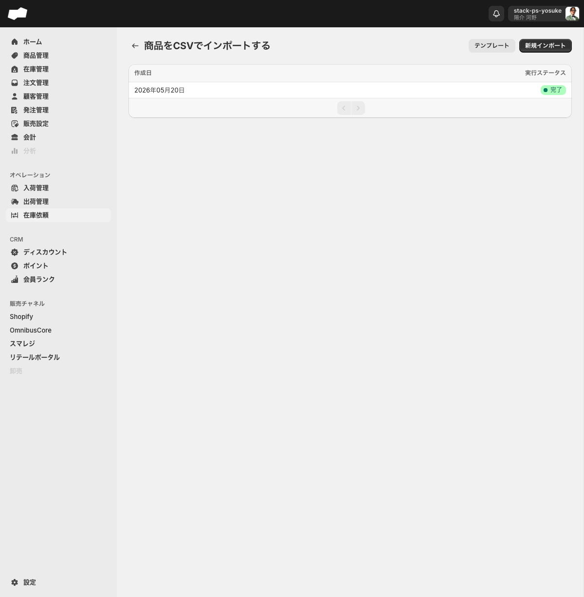
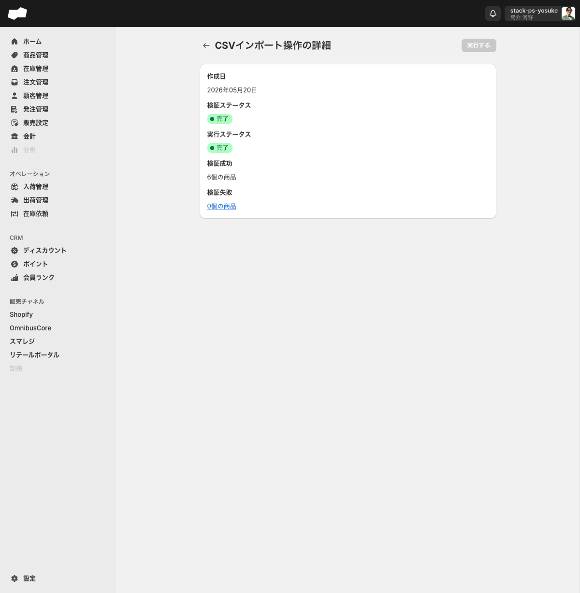

# 商品をCSVで一括登録する

> 対象ユーザー: 運営者・管理者　|　所要: 10〜30分（データ量による）　|　最終確認: 2026-06-11

---

## このドキュメントのスコープ

CSVインポート機能（`/admin/csv_import`）の「商品グループ」5カテゴリを使って、商品・バリエーション・画像データを一括で登録・更新する手順をまとめています。

個別に1件ずつ登録する場合は [商品を作成する](./商品を作成する.md) を参照してください。

---

## 商品グループの5カテゴリと使い分け

CSVインポートの「商品グループ」には以下の5カテゴリがあります。目的に合ったカテゴリを選んでください。

| カテゴリ（UIラベル） | できること |
|:--|:--|
| 商品 | 商品を一括で登録・更新することができます。 |
| 商品バリエーション | 商品バリエーションを一括で登録・更新することができます。 |
| 商品画像 | 商品画像を一括で追加することができます。 |
| 商品バリエーション画像 | 商品バリエーション画像を一括で追加することができます。 |
| カタログ | カタログに商品を一括で追加・削除することができます。 |

> **インポートの入口は2か所あります。**
> - CSVインポートトップ（`/admin/csv_import`）の「商品グループ」内の各カテゴリ
> - 商品一覧（`/admin/products`）の「インポート」ボタン（ドロップダウン）→ 対応するカテゴリを選択

---

## 「商品」カテゴリの基本的な流れ

以下の手順は「商品」カテゴリ（`/admin/csv_import/csv_import_operation_products`）を代表例として説明します。他のカテゴリも同様のフローで操作します（フォームの構成のみ異なる場合があります）。

### ステップ 1: テンプレートを入手する

1. 左メニューから「CSVインポート」をクリックしてCSVインポートトップ画面（`/admin/csv_import`）を開く。
2. 「商品グループ」内の「商品」をクリックする。商品インポートの一覧画面（`/admin/csv_import/csv_import_operation_products`）へ遷移する。
3. 「テンプレート」ボタンをクリックする。Googleスプレッドシートのテンプレートが別タブで開く。

4. スプレッドシートをダウンロードまたはコピーして、CSVファイルとして保存する。

> CSVのカラム順・ヘッダー名はテンプレートに準拠する必要があります。列の順番を変えたり、ヘッダー名を変更したりすると取り込みに失敗します。

---

### ステップ 2: CSVファイルを作成する

テンプレートのヘッダー行に従ってデータを入力し、CSVファイルとして保存します。

<!-- TODO: 要確認（「商品」カテゴリのCSVテンプレートの具体的な列名・必須列の一覧） -->

---

### ステップ 3: 新規インポートを開始する

1. 商品インポートの一覧画面（`/admin/csv_import/csv_import_operation_products`）で「新規インポート」ボタンをクリックする。インポート実行フォーム（`/admin/csv_import/csv_import_operation_products/create`）へ遷移する。

---

### ステップ 4: CSVファイルをアップロードする

1. 「CSVファイル」のアップロードエリアが表示されている。
2. 次のいずれかの方法でCSVファイルを選択する。
   - 「ファイルを選択する」ボタンをクリックしてファイル選択ダイアログを開き、作成したCSVファイルを選択する。
   - アップロードエリアにCSVファイルをドラッグ&ドロップする。

---

### ステップ 5: 「保存する」ボタンをクリックする

1. ファイル選択後、「保存する」ボタンをクリックする。
2. 処理が開始され、インポート一覧画面に実行履歴が表示される。

---

### ステップ 6: 実行履歴で検証ステータスを確認する

「保存する」を押した後、インポートは「検証」→「実行」の2段階で処理されます。

1. 商品インポートの一覧画面（`/admin/csv_import/csv_import_operation_products`）で実行履歴を確認する。
2. 実行した行をクリックして詳細画面を開く。
3. 以下の項目を確認する。

   | 項目（UIラベル） | 内容 |
   |:--|:--|
   | 検証ステータス | CSVの検証結果（例: 完了） |
   | 実行ステータス | データ反映の結果（例: 完了） |
   | 検証成功 | 成功した件数（例: 6個の商品） |
   | 検証失敗 | 失敗した件数。クリックで失敗詳細画面（「検証失敗」）へ移動できる |

---

### ステップ 7: 検証成功後に「実行する」ボタンをクリックする

1. 検証ステータスが「完了」で、「検証失敗」が0件であることを確認する。
2. 「実行する」ボタンをクリックしてデータをシステムに反映させる。

> 「実行する」ボタンは成功完了後は無効（disabled）になります。一度実行したインポートは再実行できません。

---

### 検証失敗があった場合

1. 詳細画面の「検証失敗」の件数リンクをクリックする。
2. 「検証失敗」画面（`/{id}/validation_failure`）でエラーの内容を確認する。
3. CSVファイルを修正して、再度「新規インポート」から手順をやり直す。

<!-- TODO: 要確認（検証失敗詳細画面に表示される列構成：行番号・エラー理由等） -->

---

## 「商品画像」「商品バリエーション画像」カテゴリの注意点

「商品画像」および「商品バリエーション画像」のインポートフォームでは、ファイルアップロードの前に画像の処理方法をラジオボタンで選択します。

| 選択肢（UIラベル） | 動作 |
|:--|:--|
| 画像を追加する（デフォルト） | 既存の画像を残したまま新しい画像を追加する |
| 画像を上書きする | 既存の画像を削除して新しい画像に置き換える |

1. 目的に合った処理方法をラジオボタンで選択する。
2. CSVファイルをアップロードする。
3. 「保存する」ボタンをクリックする。

---

## うまくいかないとき

**「テンプレート」ボタンが見当たらない**
- テンプレートがないカテゴリでは「テンプレート」ボタンは表示されません。商品グループの5カテゴリはすべてテンプレートが用意されています。

**「保存する」を押してもエラーになる**
- CSVのヘッダー行がテンプレートと異なっている可能性があります。テンプレートの列名・列順に合わせてCSVを修正してください。

**検証失敗が発生した**
- 詳細画面の「検証失敗」リンクをクリックしてエラー行を確認し、CSVを修正して再インポートしてください。

---

## 関連

- 機能の説明: [CSVインポート](../01-by-feature/CSVインポート.md)
- 機能の説明: [商品管理](../01-by-feature/商品管理.md)
- 関連作業: [商品を作成する](./商品を作成する.md)
- 関連作業: [CSVで在庫を一括更新する](./CSVで在庫を一括更新する.md)
