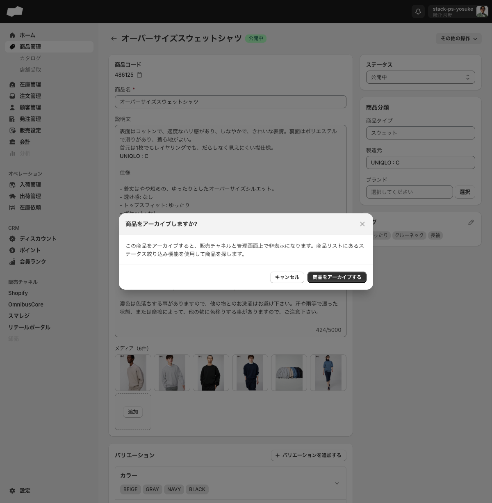
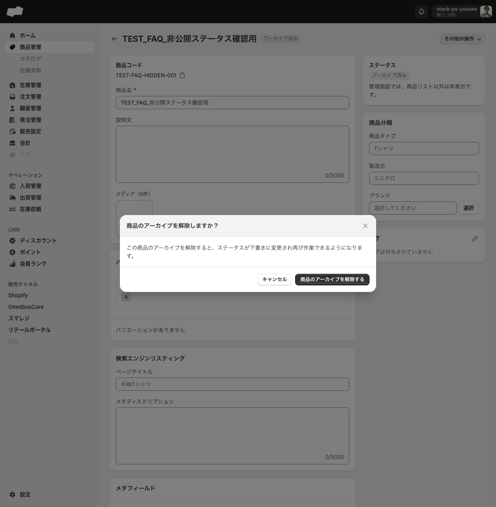

# 商品をアーカイブ・削除する

> 対象ユーザー: 運営者・管理者　|　所要: 1〜2分　|　最終確認: 2026-06-15

---

## アーカイブと削除の違い

| 操作 | 取り消し | 商品の状態 |
|:--|:--|:--|
| アーカイブする | 取り消し可能（復元できる） | アーカイブ済みとして残る。管理画面の商品リスト以外では非表示になる |
| 削除する | 取り消し不可（元に戻せない） | 完全に削除される |

通常は「アーカイブする」を使い、誤操作のリスクを避けることを推奨します。

---

## 前提

- 商品詳細画面を操作できる権限が付与されていること

---

## 商品をアーカイブする

1. 左メニューの「商品管理」をクリックして、商品一覧画面を開く。
2. アーカイブしたい商品の行をクリックして、商品詳細画面を開く。
3. 画面右上の「その他の操作」ボタンをクリックする。ドロップダウンメニューが開く。
4. 「商品をアーカイブする」をクリックする。
5. 確認ダイアログ「商品をアーカイブしますか?」が表示される。本文には「この商品をアーカイブすると、販売チャネルと管理画面上で非表示になります。商品リストにあるステータス絞り込み機能を使用して商品を探します。」と表示される。
6. 「商品をアーカイブする」ボタンをクリックする（やめる場合は「キャンセル」）。

7. 商品のステータスが「アーカイブ済み」に変わり、商品一覧の「アーカイブ済み」タブに移動することを確認する。

---

## アーカイブを解除する（復元する）

アーカイブ済みの商品は「下書き」ステータスに戻して再び編集できるようにできます。

1. 左メニューの「商品管理」をクリックして、商品一覧画面を開く。
2. 「アーカイブ済み」タブをクリックする。アーカイブ済みの商品一覧が表示される。
3. 復元したい商品の行をクリックして、商品詳細画面を開く。
4. 画面右上の「その他の操作」ボタンをクリックする。ドロップダウンメニューが開く。
5. 「商品のアーカイブを解除する」をクリックする。以下の確認ダイアログが表示される。

   > **ダイアログタイトル:** 「商品のアーカイブを解除しますか？」
   >
   > **説明文:** 「この商品のアーカイブを解除すると、ステータスが下書きに変更され再び作業できるようになります。」
   >
   > **ボタン:** 「キャンセル」「商品のアーカイブを解除する」

6. 「商品のアーカイブを解除する」ボタンをクリックする。
7. 商品のステータスが「下書き」に変わることを確認する。

> **注意: アーカイブ解除後のステータスは必ず「下書き」になります。** アーカイブ前に「公開中」だった商品も、解除後は「下書き」に変わります。再び公開するには、編集画面でステータスを「公開中」に変更してください。

---

## 商品を削除する

> **この操作は取り消せません。** 削除した商品は元に戻せません。本当に不要な場合のみ実行してください。迷う場合はアーカイブの使用を推奨します。

1. 左メニューの「商品管理」をクリックして、商品一覧画面を開く。
2. 削除したい商品の行をクリックして、商品詳細画面を開く。
3. 画面右上の「その他の操作」ボタンをクリックする。ドロップダウンメニューが開く。
4. 「商品を削除する」をクリックする。
5. 確認ダイアログ「商品を削除しますか？」が表示される。本文には「この商品を削除しますか？」「この処理は巻き戻すことができません。」と表示される。
6. 「削除する」ボタンをクリックする（やめる場合は「キャンセル」）。
7. 商品一覧へ戻り、対象商品が一覧から消えたことを確認する。削除済み商品の詳細URLへ直接アクセスすると「予期せぬエラーが発生しました」「該当するProductが見つかりませんでした。」と表示される。

---

## うまくいかないとき

**「その他の操作」メニューに「商品をアーカイブする」が表示されない**
- すでにアーカイブ済みの商品を開いている場合、「商品をアーカイブする」の代わりに「商品のアーカイブを解除する」が表示されます。商品一覧の「すべて」または「公開中」「下書き」タブから対象商品を開いてください。

**「アーカイブ済み」タブに商品が表示されない**
- 商品一覧の「アーカイブ済み」タブ（画面上部のタブ）をクリックしてください。「すべて」タブにはアーカイブ済み商品も含まれますが、視認しにくいことがあります。

---

## 関連

- 機能の説明: [商品管理](../01-by-feature/商品管理.md)
- 関連作業: [商品を作成する](./商品を作成する.md)
