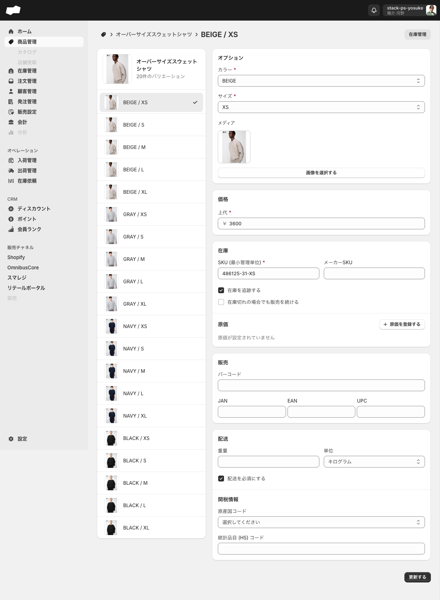

# 商品を編集する

> 対象ユーザー: 運営者・管理者　|　所要: 5〜20分（編集内容による）　|　最終確認: 2026-06-16

---

## このドキュメントのスコープ

既存商品の詳細画面（`/admin/products/{id}`）で行う編集作業をまとめています。  
商品の新規作成は [商品を作成する](./商品を作成する.md) を参照してください。

---

## 前提

- 商品管理画面を操作できる権限が付与されていること
- 編集したい商品がすでに作成済みであること

---

## 商品詳細画面を開く

1. 左メニューの「商品管理」をクリックして商品一覧画面を開く。
2. 一覧から編集したい商品の行をクリックして商品詳細画面（`/admin/products/{id}`）へ遷移する。

---

## 1. 基本情報・説明文を変更する

1. 商品詳細画面の「基本情報」セクションで変更したい項目を編集する。

   | 項目（UIラベル） | 内容 |
   |:--|:--|
   | 商品コード | 作成時に入力した値が表示される。横のアイコンはコピー操作で、押すと「コピーしました」と表示される。商品コードの編集欄は表示されない |
   | 商品名* | 商品名を編集する（必須） |
   | 説明文 | 商品説明を編集する（5000字以内） |

2. 画面上部または右上に「保存されていない変更」バーが表示される。
3. バー内の「保存する」ボタンをクリックして変更を保存する。

> 変更がない場合、右上の「保存する」ボタンは無効（グレー）になっています。

---

## 2. ステータスを変更する

商品詳細画面のサイドバー（右カラム）にある「ステータス」セレクトで変更します。

| 選択肢 | 意味 |
|:--|:--|
| 公開中 | 公開状態 |
| 下書き | 下書き状態 |

1. サイドバーの「ステータス」コンボボックスをクリックして「公開中」または「下書き」を選ぶ。
2. 「保存する」ボタンをクリックして変更を保存する。

> **注意: 編集画面のステータス選択肢は「公開中」「下書き」の2択のみです。** 商品作成時にある「非公開」はこの画面には表示されません。商品をアーカイブしたい場合は「その他の操作 > 商品をアーカイブする」を使用してください（詳細: [商品をアーカイブ・削除する](./商品をアーカイブ・削除する.md)）。

---

## 3. バリエーションを編集する

バリエーション（SKU・サイズ・カラーなど）の詳細を変更します。

1. 商品詳細画面の「バリエーション」セクションで、編集したいバリエーションの行をクリックする。バリエーション編集画面（`/admin/products/{id}/variants/{variant_id}`）へ遷移する。
2. 各セクションの項目を変更する。

   

   #### オプション
   商品に設定されているオプション軸（カラー・サイズなど）の値を変更できます。

   #### 価格
   | 項目（UIラベル） | 必須 | 内容 |
   |:--|:--|:--|
   | 上代* | 必須 | 販売価格（円） |

   #### 原価
   | 項目（UIラベル） | 内容 |
   |:--|:--|
   | （原価セクション） | 「原価が設定されていません」と表示されている場合は「+ 原価を登録する」ボタンをクリックして原価を設定できる |

   「原価を登録する」はモーダルを開く。入力項目は「通貨」（米ドル / ユーロ / 日本円 / タイ バーツ / シンガポール ドル）と「原価」。未入力では「登録する」ボタンは無効。

   #### 在庫
   | 項目（UIラベル） | 必須 | 内容 |
   |:--|:--|:--|
   | SKU (最小管理単位)* | 必須 | バリエーションを識別するコード |
   | メーカーSKU | 任意 | メーカー側のSKUコード |
   | 在庫を追跡する | — | チェックボックス |
   | 在庫切れの場合でも販売を続ける | — | チェックボックス |

   #### 販売
   | 項目（UIラベル） | 内容 |
   |:--|:--|
   | バーコード | バーコード番号 |
   | JAN | JANコード |
   | EAN | EANコード |
   | UPC | UPCコード（編集画面のみ表示される項目） |

   #### 配送
   | 項目（UIラベル） | 内容 |
   |:--|:--|
   | 重量 | 数値で入力 |
   | 単位 | グラム / キログラム（デフォルト）/ オンス / ポンド |
   | 配送を必須にする | チェックボックス（デフォルトON） |

3. 入力が終わったら「更新する」ボタンをクリックして保存する。

> **商品作成時との違い:** バリエーション編集画面には「仕入価格」欄がなく、代わりに「原価」セクションと「UPC」フィールドがあります。また、送信ボタンのラベルが「作成する」ではなく「更新する」になります。
<!-- TODO: 要確認（作成フォームで「仕入価格」を入力した場合、編集フォームの「原価」セクションに値が引き継がれるか） -->

---

## 4. メディア（画像）を追加・変更する

1. 商品詳細画面の「メディア」セクションに移動する。
2. 画像を追加するには次のいずれかの操作を行う。
   - 「画像をアップロード」エリアをクリックするか、エリアにファイルをドラッグ&ドロップしてローカルファイルを選択する。
   - 「追加」ボタンをクリックしてファイル選択ダイアログを開く。
3. 「保存する」ボタンをクリックして変更を保存する。

> URLからの画像追加はできません。ローカルファイルからのアップロードのみ対応しています。

---

## 5. メタフィールド値を設定する

メタフィールドとは、商品に追加したカスタムフィールドです。「設定 > メタフィールド定義」で商品オブジェクトの定義が登録されている場合、商品詳細画面に「メタフィールド」セクション（見出し）が表示されます。

1. 商品詳細画面の「メタフィールド」セクションに移動する。
2. 値を設定したい項目の右側にある編集ボタン（鉛筆アイコン）をクリックする。
3. メタフィールド名のモーダルが開くため、値を入力して保存する。未設定値の場合、モーダル下部の「削除する」は無効で、「キャンセル」「保存する」が表示される。
4. 「保存する」ボタンをクリックして変更を保存する。

> メタフィールドの定義が存在しない場合、このセクションは表示されません。定義の追加は「設定 > メタフィールド定義」で行います。

---

## 6. タグ・商品分類を変更する

サイドバーの各欄を編集します（すべて任意項目）。

| 項目（UIラベル） | 変更方法 |
|:--|:--|
| 商品タイプ | テキストを直接編集する（例: Tシャツ） |
| 製造元 | テキストを直接編集する（例: ユニクロ） |
| ブランド | 「選択」ボタンをクリックしてブランドマスターから選択する |
| タグ | タグ欄の追加ボタンをクリックしてタグを追加する |

1. サイドバーの各項目を必要に応じて変更する。
2. 「保存する」ボタンをクリックして変更を保存する。

> ブランドを設定するには、事前に「設定 > ブランド」（`/admin/settings/brands`）でブランドマスターが登録されている必要があります。

---

## うまくいかないとき

**「保存する」ボタンをクリックしても保存されない**
- 「商品名*」が空の場合は保存できません。必須欄を確認してください。

**「保存する」ボタンが無効（グレー）になっている**
- 変更が行われていない状態です。何かの項目を変更すると「保存する」ボタンが有効になります。

**バリエーション編集画面で「更新する」ボタンが押せない**
- 「上代*」または「SKU (最小管理単位)*」が空の場合は更新できません。

**「メタフィールド」セクションが表示されない**
- 商品オブジェクトのメタフィールド定義がまだ登録されていません。「設定 > メタフィールド定義 > 商品」で定義を追加してください。

---

## 関連

- 機能の説明: [商品管理](../01-by-feature/商品管理.md)
- 関連作業: [商品を作成する](./商品を作成する.md)
- 関連作業: [商品をアーカイブ・削除する](./商品をアーカイブ・削除する.md)
