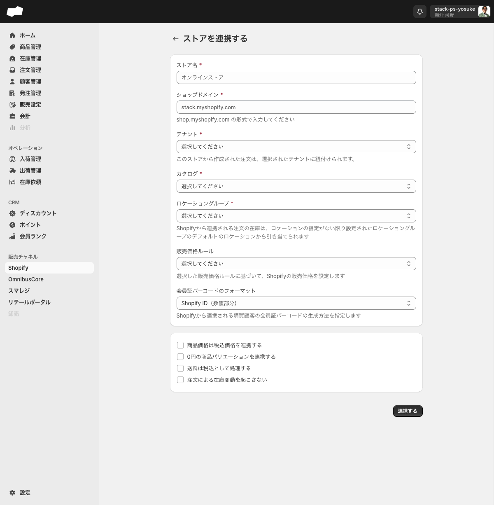
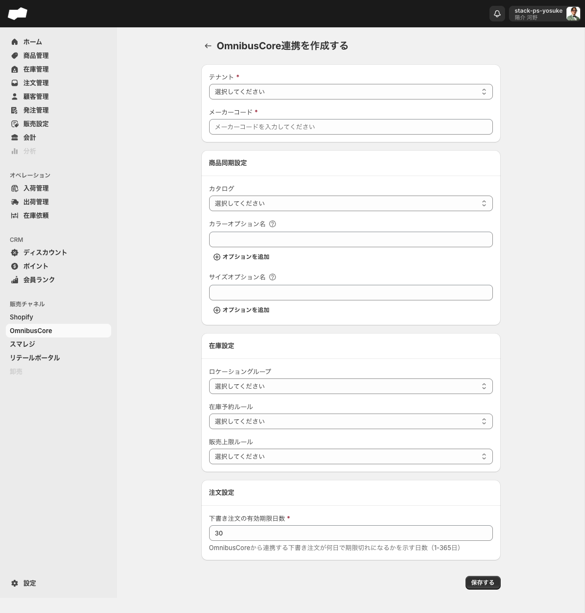
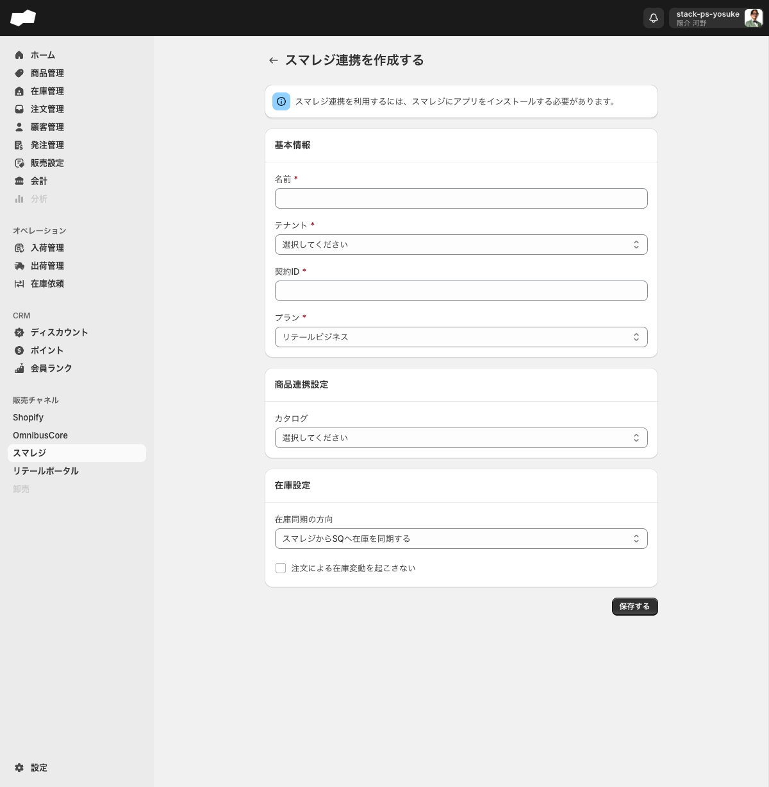

# 販売チャネルを接続する

> 対象ユーザー: 管理者・運営者　|　所要: 各チャネル 5〜15分（マスタ準備済みの場合）　|　最終確認: 2026-06-16

---

## このドキュメントのスコープ

SQに販売チャネルを接続するフォームの入力手順を説明します。対象チャネルは次の4つです。

| チャネル | 接続画面 |
|:--|:--|
| Shopify | `/admin/shopify_integrations` |
| OmnibusCore | `/admin/omnibus_core_integrations` |
| スマレジ | `/admin/smaregi_integrations` |
| リテールポータル | `/admin/retail_portal_integrations` |

> **注意**: フォーム入力・送信ボタンクリックまでが本手順の保証範囲です。送信後のOAuth認証・同期開始など接続実行後の挙動は、未接続環境のため未確認です。

<!-- TODO: 要確認（各チャネル共通: 接続実行後の挙動（OAuth・同期開始・接続完了後の画面）は未接続環境のため未確認） -->

---

## 事前に必要なもの

接続フォームに入力するためには、次のSQ内マスタと各サービスの契約情報を事前に用意してください。

| 必要なもの | 確認場所 | 必要なチャネル |
|:--|:--|:--|
| テナント | 設定 > テナント | Shopify / OmnibusCore / スマレジ / リテールポータル |
| カタログ | 商品 > カタログ | Shopify / OmnibusCore（任意）/ スマレジ（任意）/ リテールポータル |
| ロケーショングループ | 設定 > ロケーショングループ | Shopify（必須）/ OmnibusCore（任意） |
| ロケーション（店舗種別） | 設定 > ロケーション | リテールポータル（店舗ロケーションとして） |
| ロケーション（倉庫種別） | 設定 > ロケーション | リテールポータル（在庫ロケーションとして） |
| Shopifyショップドメイン | Shopifyの契約情報 | Shopify |
| スマレジの契約ID | スマレジの管理画面 | スマレジ |
| OmnibusCoreのメーカーコード | OmnibusCoreの契約情報 | OmnibusCore |

テナント・カタログ・ロケーショングループ・ロケーションの作成手順は [SQ 初期設定の手順](初期設定の手順.md) を参照してください。

---

## 1. Shopifyを接続する

### 前提

- テナント・カタログ・ロケーショングループがSQ内に作成済みであること
- Shopifyストアのショップドメイン（`〇〇.myshopify.com`）がわかっていること
- **先にShopifyストアへSQのコネクターアプリをインストールしておくこと**（下記ステップ0）。アプリ未インストールのまま「連携する」を実行すると「エラーが発生しました。しばらくしてから再度お試しください」というエラーになります

### ステップ0: ShopifyストアにSQコネクターアプリをインストールする

1. Shopifyアプリストアの「SQコネクター」ページ（https://apps.shopify.com/sq）を開き、「インストール」をクリックする。
2. 未ログインの場合は「SQ Connect をインストール」の案内が表示されるので、「既存のアカウントにログインする」からShopifyアカウントにログインし、対象ストアを選択する。
3. Shopify管理画面に「アプリをインストール」の確認ダイアログが表示される。アクセス権限の内容を確認し、「インストール」をクリックする。
4. インストールが完了すると、Shopify管理画面の左メニュー「アプリ」に「SQ Connect」が表示される。

> 注意: 公開されている「SQコネクター」アプリは本番環境（`sq.stackservice.com`）向けです。検証・ステージング環境（`sqstackstaging.com`）のSQに接続する場合は、環境に対応したアプリのインストールリンクを開発元から入手してください。

### 手順

1. 左メニューの「Shopify」をクリックする。Shopify連携一覧画面（`/admin/shopify_integrations`）が開く。
2. 「ストアを接続」ボタン（または「ストアを接続する」リンク）をクリックする。「ストアを連携する」フォーム（`/admin/shopify_integrations/create`）が開く。
3. 次の項目を入力する（必須項目は *印）。

#### 基本情報

| 項目（UIラベル） | 必須/任意 | 入力内容 |
|:--|:--|:--|
| ストア名 * | 必須 | SQ内でのストア識別名（例: オンラインストア） |
| ショップドメイン * | 必須 | `shop.myshopify.com` の形式で入力 |
| テナント * | 必須 | コンボボックスから選択 |
| カタログ * | 必須 | コンボボックスから選択 |
| ロケーショングループ * | 必須 | コンボボックスから選択。ヒント: 「Shopifyから連携される注文の在庫は、ロケーションの指定がない限り設定されたロケーショングループのデフォルトのロケーションから引き当てられます」 |

#### オプション設定（すべて任意）

| 項目（UIラベル） | 初期値 | 説明 |
|:--|:--|:--|
| 販売価格ルール | （未選択） | Shopifyの販売価格を算出するルールを選択する |
| 会員証バーコードのフォーマット | Shopify ID（数値部分） | 「Shopify ID（数値部分）」または「JAN-13コード（モジュラス10/ウェイト3方式）」から選択する |
| 商品価格は税込価格を連携する | オフ | 商品価格を税込でShopifyに送る場合にチェックする |
| 0円の商品バリエーションを連携する | オフ | 価格が0円のバリエーションも連携する場合にチェックする |
| 送料は税込として処理する | オフ | 送料を税込として処理する場合にチェックする |
| 注文による在庫変動を起こさない | オフ | Shopify経由の注文で在庫数を変動させない場合にチェックする |

4. 「連携する」ボタンをクリックする。

<!-- TODO: 要確認（「連携する」押下後のOAuth認証フロー・遷移先画面は未接続環境のため未確認） -->

### うまくいかないとき（Shopify）

| 症状 | 対処 |
|:--|:--|
| 「ストア名を入力してください」と表示される | ストア名フィールドに値を入力してください |
| 「ショップドメインを入力してください」と表示される | `shop.myshopify.com` の形式でショップドメインを入力してください |
| 「テナントを選択してください」と表示される | テナントをコンボボックスから選択してください。テナントがない場合は 設定 > テナント で先に作成してください |
| 「カタログを選択してください」と表示される | カタログをコンボボックスから選択してください。カタログがない場合は先に作成してください |
| 「ロケーショングループを選択してください」と表示される | ロケーショングループをコンボボックスから選択してください。ロケーショングループがない場合は 設定 > ロケーショングループ で先に作成してください |
| 「エラーが発生しました。しばらくしてから再度お試しください」と表示される | Shopifyストア側にSQ Connectが未インストールの可能性があります。先にShopify側でアプリをインストールしてください。staging環境の場合はstaging向けアプリのインストールリンクが必要です |

---

## 2. OmnibusCoreを接続する

### 前提

- テナントがSQ内に作成済みであること
- OmnibusCoreのメーカーコードがわかっていること

### 手順

1. 左メニューの「OmnibusCore」をクリックする。OmnibusCore連携一覧画面（`/admin/omnibus_core_integrations`）が開く。
2. 「追加する」ボタンをクリックする。「OmnibusCore連携を作成する」フォーム（`/admin/omnibus_core_integrations/create`）が開く。
3. 次の項目を入力する（必須項目は *印）。

#### 基本情報

| 項目（UIラベル） | 必須/任意 | 入力内容 |
|:--|:--|:--|
| テナント * | 必須 | コンボボックスから選択 |
| メーカーコード * | 必須 | OmnibusCoreのメーカーコードを入力する |

#### 商品同期設定（すべて任意）

| 項目（UIラベル） | 入力内容 |
|:--|:--|
| カタログ | コンボボックスから選択する（任意） |
| カラーオプション名 | 商品カラーを示すオプション名を入力する。「オプションを追加」ボタンで複数行追加できる |
| サイズオプション名 | 商品サイズを示すオプション名を入力する。「オプションを追加」ボタンで複数行追加できる |

#### 在庫設定（すべて任意）

| 項目（UIラベル） | 入力内容 |
|:--|:--|
| ロケーショングループ | コンボボックスから選択する（任意） |
| 在庫予約ルール | コンボボックスから選択する（任意） |
| 販売上限ルール | コンボボックスから選択する（任意） |

#### 注文設定

| 項目（UIラベル） | 必須/任意 | 入力内容 |
|:--|:--|:--|
| 下書き注文の有効期限日数 * | 必須（作成時） | OmnibusCoreから連携された下書き注文の期限切れまでの日数を入力する。デフォルト: 30、入力範囲: 1〜365 |

4. 「保存する」ボタンをクリックする。

<!-- TODO: 要確認（「保存する」押下後の接続確立・同期開始の挙動は未接続環境のため未確認） -->

> **接続後の追加設定について**: 接続が完了すると詳細・編集画面に「連携サイト」タブと「通知メール」タブが表示されます。連携サイトの追加手順は機能説明ページ（[OmnibusCore連携](../01-by-feature/OmnibusCore連携.md)）を参照してください。

### うまくいかないとき（OmnibusCore）

| 症状 | 対処 |
|:--|:--|
| 「テナントを選択してください」と表示される | テナントをコンボボックスから選択してください |
| 「メーカーコードを入力してください」と表示される | メーカーコードフィールドに値を入力してください |
| 「1から365の間で入力してください」と表示される | 下書き注文の有効期限日数を1〜365の範囲で入力してください |
| 在庫予約ルール・販売上限ルールの選択肢が空 | 対応するマスタがSQ内に未作成の状態です。先にマスタを作成してから再度フォームを開いてください |
| 別のページへ移動しようとすると「保存されていない変更」ダイアログが表示される | 「取り消す」で変更を破棄して離脱するか、「保存」で保存処理を実行してください |

---

## 3. スマレジを接続する

### 前提

- スマレジ側でSQ連携アプリがインストール済みであること

> 「スマレジ連携を利用するには、スマレジにアプリをインストールする必要があります。」（フォーム上部バナーより）
>
> スマレジ側のアプリインストール手順はスマレジのドキュメントを参照してください。

<!-- TODO: 要確認（スマレジ側アプリインストールの具体的な手順・導線） -->

- テナントがSQ内に作成済みであること
- スマレジの契約IDがわかっていること

### 手順

1. 左メニューの「スマレジ」をクリックする。スマレジ連携一覧画面（`/admin/smaregi_integrations`）が開く。
2. 「追加する」ボタンをクリックする。「スマレジ連携を作成する」フォーム（`/admin/smaregi_integrations/create`）が開く。
3. 次の項目を入力する（必須項目は *印）。

#### 基本情報

| 項目（UIラベル） | 必須/任意 | 入力内容 |
|:--|:--|:--|
| 名前 * | 必須 | SQ内でのスマレジ連携の識別名を入力する |
| テナント * | 必須 | コンボボックスから選択する |
| 契約ID * | 必須 | スマレジの契約IDを入力する |
| プラン * | 必須 | コンボボックスから選択する。選択肢: 「スタンダード」「プレミアム」「プレミアムプラス」「フードビジネス」「リテールビジネス」（デフォルト: リテールビジネス） |

#### 商品連携設定（任意）

| 項目（UIラベル） | 入力内容 |
|:--|:--|
| カタログ | コンボボックスから選択する（任意） |

#### 在庫設定（任意）

| 項目（UIラベル） | 初期値 | 入力内容 |
|:--|:--|:--|
| 在庫同期の方向 | スマレジからSQへ在庫を同期する | コンボボックスから選択する。「スマレジからSQへ在庫を同期する」「SQからスマレジへ在庫を同期する」「在庫を同期しない」の3択 |
| 注文による在庫変動を起こさない | オフ | スマレジ経由の注文で在庫数を変動させない場合にチェックする |

4. 「保存する」ボタンをクリックする。

<!-- TODO: 要確認（「保存する」押下後の接続確立・同期開始の挙動は未接続環境のため未確認） -->

### うまくいかないとき（スマレジ）

| 症状 | 対処 |
|:--|:--|
| 「名前を入力してください」と表示される | 名前フィールドに値を入力してください |
| 「テナントを選択してください」と表示される | テナントをコンボボックスから選択してください |
| 「契約IDを入力してください」と表示される | スマレジの契約IDを入力してください |

---

## 4. リテールポータルを接続する

リテールポータルは1接続 = 1店舗ロケーションの単位で管理します。複数店舗を接続する場合は、店舗ごとに手順を繰り返してください。

### 前提

- テナント・カタログがSQ内に作成済みであること
- 店舗種別のロケーションが設定 > ロケーション に作成済みであること（「店舗ロケーション」として使用）
- 倉庫種別のロケーションが設定 > ロケーション に作成済みであること（「在庫ロケーション」として使用）

> ロケーションの場所種別（店舗/倉庫）は、設定 > ロケーション で各ロケーション作成時に指定します。

### 手順

1. 左メニューの「リテールポータル」をクリックする。リテールポータル連携一覧画面（`/admin/retail_portal_integrations`）が開く。
2. 「追加する」ボタンをクリックする。リテールポータル作成フォーム（`/admin/retail_portal_integrations/create`）が開く。
3. 次の項目を入力する（必須項目は *印）。

#### ロケーションの選択

| 項目（UIラベル） | 必須/任意 | 操作方法 |
|:--|:--|:--|
| 店舗ロケーション * | 必須 | 「選択」ボタンをクリックして「ロケーションを選択する」ダイアログを開き、店舗種別のロケーションを選択する。「選択する」ボタンで確定する |
| 在庫ロケーション * | 必須 | 「選択」ボタンをクリックして「ロケーションを選択する」ダイアログを開き、倉庫種別のロケーションを選択する。「選択する」ボタンで確定する |

> ダイアログでは「場所コードで検索する」フィールドを使って絞り込みができます。「店舗ロケーション」ダイアログには店舗種別のロケーションのみ、「在庫ロケーション」ダイアログには倉庫種別のロケーションのみ表示されます。

#### 基本設定

| 項目（UIラベル） | 必須/任意 | 入力内容 |
|:--|:--|:--|
| テナント * | 必須 | コンボボックスから選択する |
| カタログ * | 必須 | コンボボックスから選択する |
| 販売閾値ルール | 任意 | コンボボックスから選択する（任意） |

#### 操作権限の設定（すべて任意・デフォルト: オフ）

| 項目（UIラベル） | 説明 |
|:--|:--|
| リテールポータルで販売員の選択を必須にする | 注文時に販売員の選択を必須とする場合にチェックする |
| 配送先住所の編集を許可する | 店舗スタッフが配送先住所を編集できるようにする場合にチェックする |
| 下書き注文の送料明細の編集を許可する | 店舗スタッフが下書き注文の送料明細を編集できるようにする場合にチェックする |
| 下書き注文の注文明細の価格の編集を許可する | 店舗スタッフが下書き注文の注文明細の価格を編集できるようにする場合にチェックする |
| 下書き注文の完了を許可する | 店舗スタッフが下書き注文を完了できるようにする場合にチェックする |

4. 「保存する」ボタンをクリックする。詳細画面へ遷移する。

<!-- TODO: 要確認（「保存する」押下後の接続確立・リテールポータルとの同期開始の挙動は未接続環境のため未確認） -->

### 保存後の詳細画面

「保存する」をクリックすると詳細画面へ遷移します。

- 画面の見出し（h1）は選択した**店舗ロケーション名**が表示されます。
- 「**編集する**」ボタンから設定を変更できます。
- 「**ユーザーを追加する**」ボタンから管理者ユーザーをこのリテールポータル連携に追加できます。

#### ユーザーを追加する

1. 詳細画面の「**ユーザーを追加する**」ボタンをクリックする。「ユーザーを選択する」ダイアログが開く。
2. メールアドレスで検索して管理者ユーザーを絞り込む。
3. 追加するユーザーを選択して確定する。

<!-- TODO: 要確認（ユーザー追加後の表示と、追加されたユーザーが持つリテールポータルへのアクセス権限の詳細） -->

### 店舗受取ルールを追加する（オプション）

リテールポータルの接続後、「店舗受取」のロケーションルールを追加できます。

1. 左メニューの「リテールポータル」配下の「店舗受取」をクリックする。店舗受取一覧画面（`/admin/local_pickup_retail_location_rules`）が開く。
2. 「追加する」ボタンをクリックする。作成フォームが開く。
3. 「ロケーション」フィールドの「選択」ボタンをクリックして、「ロケーションを選択する」ダイアログから店舗種別のロケーションを選択する。「選択する」ボタンで確定する。
4. 「保存する」ボタンをクリックする。

<!-- TODO: 要確認（店舗受取ルールの詳細機能・接続後の画面は未確認） -->

### うまくいかないとき（リテールポータル）

| 症状 | 対処 |
|:--|:--|
| 「店舗ロケーションを選択してください」と表示される | 「選択」ボタンから店舗種別のロケーションを選択してください |
| 「在庫ロケーションを選択してください」と表示される | 「選択」ボタンから倉庫種別のロケーションを選択してください |
| 「テナントを選択してください」と表示される | テナントをコンボボックスから選択してください |
| 「カタログを選択してください」と表示される | カタログをコンボボックスから選択してください |
| ダイアログで目的のロケーションが表示されない | 「店舗ロケーション」ダイアログには店舗種別のロケーションのみ表示されます。「在庫ロケーション」ダイアログには倉庫種別のロケーションのみ表示されます。設定 > ロケーション で場所種別が正しく設定されているか確認してください |

---

## 関連

- 機能の説明（Shopify連携）: [Shopify連携](../01-by-feature/Shopify連携.md)
- 機能の説明（OmnibusCore連携）: [OmnibusCore連携](../01-by-feature/OmnibusCore連携.md)
- 機能の説明（スマレジ連携）: [スマレジ連携](../01-by-feature/スマレジ連携.md)
- 機能の説明（リテールポータル連携）: [リテールポータル連携](../01-by-feature/リテールポータル連携.md)
- 外部連携（ロジザード・Recustomer）: [ロジザード・Recustomerを接続する](ロジザード・Recustomerを接続する.md)
- 初期設定: [SQ 初期設定の手順](初期設定の手順.md)
