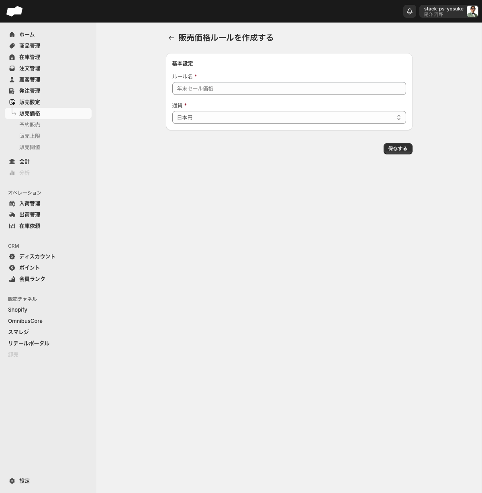
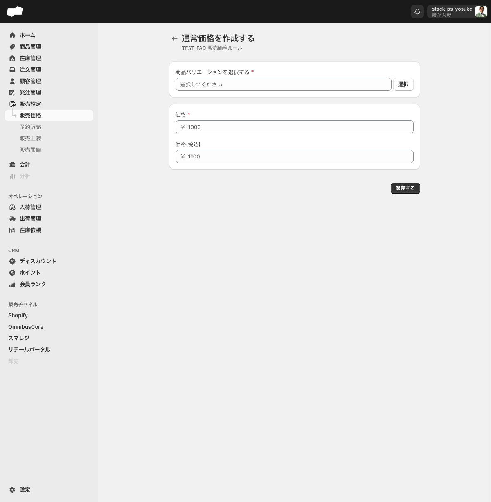

# 販売価格を設定する

> 対象ユーザー: 運営者・管理者　|　所要: 5〜15分　|　最終確認: 2026-06-11

---

## このドキュメントのスコープ

販売価格ルールを新規作成し、SKUごとに通常価格・セール価格を登録する手順を説明します。

作業は大きく3段階です。

1. 販売価格ルールを作成する
2. 通常価格を登録する
3. セール価格を登録する（必要な場合）

---

## 前提

- 販売設定画面（`/admin/product_price_rules`）を操作する権限があること
- 価格を登録する商品バリエーション（SKU）が作成済みであること

---

## 手順

### ステップ 1: 販売価格ルールを作成する

1. 左メニューの「販売設定」>「販売価格」をクリックし、販売価格一覧画面を開く。
2. 「販売価格ルールを作成する」ボタンをクリックする。作成フォーム（`/admin/product_price_rules/create`）へ遷移する。

   

3. 「ルール名」に管理用の名前を入力する（必須）。入力例（プレースホルダ）: 「年末セール価格」。
4. 「通貨」のコンボボックスで、このルールに適用する通貨を選択する（必須）。デフォルトは「日本円」。

   選択できる通貨は以下のとおりです。

   | 選択肢 |
   |:--|
   | 米ドル |
   | ユーロ |
   | 日本円 |
   | タイ バーツ |
   | シンガポール ドル |

   > **注意:** 通貨はルール作成後に変更できません。「ルールを編集」モーダルでも「JPY」のように読み取り専用で表示され、「通貨は編集できません」と注釈されます。作成前に必ず確認してください。

5. 「保存する」ボタンをクリックする。保存が成功するとルールの詳細画面へ遷移する。

---

### ステップ 2: 通常価格を登録する

1. 詳細画面（`/admin/product_price_rules/[id]`）の「通常価格」カードをクリックする。通常価格SKU一覧画面（ページタイトル: 「販売価格ルール (通常価格)」）へ遷移する。
2. 「通常価格を登録する」ボタンをクリックする。通常価格作成フォーム（ページタイトル: 「通常価格を作成する」）へ遷移する。

   

3. 「商品バリエーションを選択する」欄の「選択」ボタンをクリックし、対象のSKUを選ぶ（必須）。
4. 「価格」欄に税抜き価格を数値で入力する（必須）。入力欄には通貨記号「￥」が表示されます。
5. 「価格(税込)」欄に税込み価格を入力する（任意）。
6. 「保存する」ボタンをクリックする。

   > 通常価格にもCSVインポートのカテゴリ「販売価格 (通常)」がありますが、テンプレートファイルは提供されていません。画面から登録する場合はSKUごとに手順2〜6を繰り返してください。

---

### ステップ 3: セール価格を登録する（任意）

#### 1件ずつ登録する場合

1. 詳細画面の「セール価格」カードをクリックする。セール価格SKU一覧画面（ページタイトル: 「販売価格ルール (セール価格)」）へ遷移する。
2. 「セール価格を登録」ボタンをクリックする。セール価格作成フォーム（ページタイトル: 「セール価格を作成する」）へ遷移する。
3. 「商品バリエーションを選択する」欄の「選択」ボタンをクリックし、対象のSKUを選ぶ（必須）。
4. 「価格」欄にセール時の税抜き価格を入力する（必須）。通貨記号「￥」が表示されます。
5. 「価格（税込）」欄にセール時の税込み価格を入力する（任意）。<!-- 注: セール価格フォームのラベルは記録上全角括弧。通常価格フォームは半角括弧「価格(税込)」 -->
6. 「開始日時」欄にセール開始の日時を入力する（必須）。
7. 「終了日時」欄にセール終了の日時を入力する（任意）。終了日時を空欄にした場合の動作は未確認です。<!-- TODO: 要確認（終了日時未設定時の挙動） -->
8. 「保存する」ボタンをクリックする。

#### CSVで一括登録する場合

1. セール価格SKU一覧画面の「インポート」ボタンをクリックする。CSVインポート画面へ遷移する。
2. 画面の指示に従ってCSVファイルをアップロードする。<!-- TODO: 要確認（CSVインポート画面の操作詳細） -->

---

## うまくいかないとき

**「保存する」を押しても保存されない（作成フォーム）**
- 「ルール名」が空欄になっていないか確認してください。
- 「通貨」が選択されているか確認してください。

**通貨を変更したい**
- ルール作成後に通貨は変更できません。新しい通貨のルールを別途作成してください。

**「価格を入力してください」と表示されて保存できない（通常価格フォーム）**
- 「商品バリエーションを選択する」または「価格」が未入力です。どちらも必須項目です。

---

## 関連

- 機能の説明: [販売設定](../01-by-feature/販売設定.md)
- 作業別: [セール価格はセール価格を登録する手順（ステップ 3）を参照](#ステップ-3-セール価格を登録する任意)
