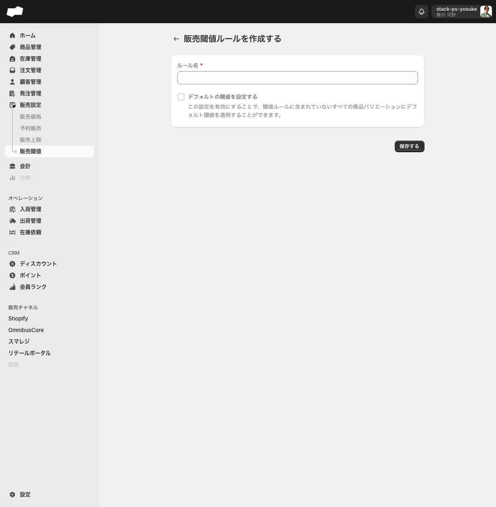
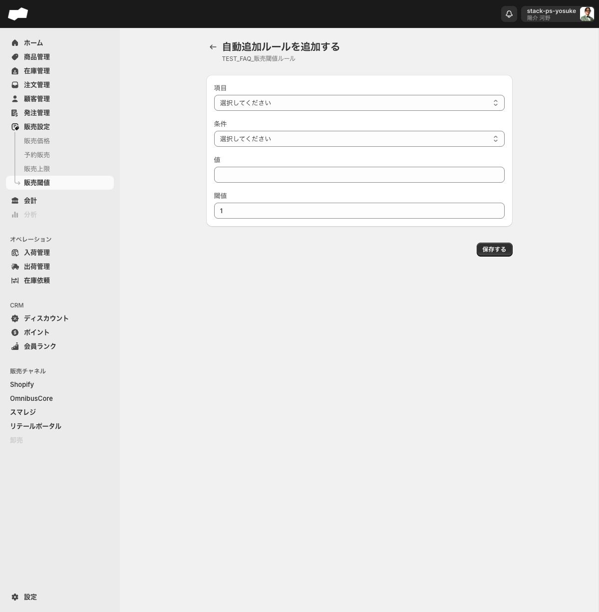

# 販売閾値を設定する

> 対象ユーザー: 運営者・管理者　|　所要: 5〜15分　|　最終確認: 2026-06-11

---

## このドキュメントのスコープ

商品バリエーション（SKU）に在庫の販売閾値（しきいち）を設定するルールを作成し、個別またはブランドコード単位でSKUに閾値を登録する手順を説明します。

作業は大きく3段階です。

1. 販売閾値ルールを作成する
2. SKUに閾値を登録する（手動または自動追加ルール）
3. 必要に応じてCSVで一括登録する

> **注意:** 閾値に達した場合に販売が停止されるのか通知が送られるのかなど、実際の挙動はUI上に説明文がありません。設定前に動作を確認してください。
> <!-- TODO: 要確認（閾値割れ時の実挙動。販売停止か通知かは未確認） -->

---

## 前提

- 販売設定画面（`/admin/inventory_threshold_rules`）を操作する権限があること
- 閾値を設定する商品バリエーション（SKU）が作成済みであること

---

## 手順

### ステップ 1: 販売閾値ルールを作成する

1. 左メニューの「販売設定」>「販売閾値」をクリックし、販売閾値一覧画面を開く。
2. 「販売閾値ルールを作成する」ボタンをクリックする。作成フォーム（ページタイトル: 「販売閾値ルールを作成する」）へ遷移する。

   

3. 「ルール名」欄にルールの管理名を入力する（必須）。
4. ルールに含まれていないすべてのSKUにデフォルト閾値を適用したい場合は、「デフォルトの閾値を設定する」チェックボックスをONにする（任意）。

   チェックをONにすると以下の入力欄が展開されます。

   | 項目（UIラベル） | 説明 | 必須 |
   |:--|:--|:--|
   | デフォルトの閾値 * | 全バリエーションに適用するデフォルト閾値の数値 | 必須（チェックON時） |

   > 画面の説明文（原文）: 「この設定を有効にすることで、閾値ルールに含まれていないすべての商品バリエーションにデフォルト閾値を適用することができます。」

   初期値は「0」です。適用したい閾値の数値を入力してください（プレースホルダ: 「入力してください」）。

5. 「保存する」ボタンをクリックする。保存が成功すると販売閾値一覧画面（`/admin/inventory_threshold_rules`）へ遷移する。

   > 販売価格・予約販売の保存後が詳細画面へ遷移するのとは異なり、販売閾値の保存後は一覧画面へ戻ります。

---

### ステップ 2: 詳細画面を開く

1. 販売閾値一覧でルール名をクリックし、詳細画面を開く。

   詳細画面のボタンと機能は以下のとおりです。

   | 要素（UIラベル） | 操作内容 |
   |:--|:--|
   | 自動追加ルール | ブランドコードを条件にSKUを自動追加する設定画面へ遷移 |
   | ルールを編集する | 編集モーダルを開き、ルール名やデフォルト閾値を変更できる |
   | 閾値を追加する | SKUを1件ずつ手動登録するフォームへ遷移 |
   | SKUコードで検索する | 登録済みSKUを絞り込む |

   デフォルト閾値が有効になっている場合は、バッジ「デフォルト閾値が有効」が表示されます。

---

### ステップ 3: SKUに閾値を登録する

#### 手動で1件ずつ追加する場合

1. 詳細画面の「閾値を追加する」リンクをクリックする。登録フォームへ遷移する。
2. 「商品バリエーションを選択する」欄の「選択」ボタンをクリックし、対象のSKUを選ぶ（必須）。
3. 「閾値」欄に設定する閾値の数値を入力する（必須）。初期値は「0」です。
4. 「保存する」ボタンをクリックする。
5. 他のSKUも追加する場合は手順1〜4を繰り返す。

登録済みの閾値は詳細画面の一覧に表示されます。一覧の列は「バリエーション」「SKU」「商品コード」「閾値」です。行を選択すると「閾値を削除」ボタンが表示され、確認ダイアログ「閾値を削除しますか？」が表示されます。本文は「選択された1件の閾値を削除します。この処理は巻き戻すことができません。」です。2026-06-19の実機確認では、削除確定直後の画面には対象行が残りましたが、詳細を再読み込みすると行は消えました。削除後はリロードして反映を確認してください。

#### ブランドコードを条件に自動追加する場合

ブランドコードが一致するSKUをまとめてルールに追加し、一括で閾値を設定できます。

1. 詳細画面の「自動追加ルール」ボタンをクリックする。自動追加ルール一覧画面（`/admin/inventory_threshold_rules/[id]/automatic_add_rules`）へ遷移する。
2. 「自動追加ルールを追加する」ボタンをクリックする。作成フォーム（ページタイトル: 「自動追加ルールを追加する」）へ遷移する。

   

3. 各項目を入力する。

   | 項目（UIラベル） | 説明 | 必須 | 制約・選択肢 |
   |:--|:--|:--|:--|
   | 項目 | 自動追加の対象とする属性 | 必須 | コンボボックス。現在の選択肢: 「ブランドコード」のみ |
   | 条件 | 一致の条件 | 必須 | コンボボックス。現在の選択肢: 「一致する」のみ |
   | 値 | 照合するブランドコードの値 | 必須 | テキスト入力 |
   | 閾値 | 自動追加されたSKUに設定する閾値 | 必須（初期値あり） | 数値入力（spinbutton）。初期値「1」 |

   設定例: 「項目: ブランドコード」「条件: 一致する」「値: BRAND01」「閾値: 5」と入力すると、ブランドコードが「BRAND01」のSKUが閾値5でルールに自動追加されます。

4. 「保存する」ボタンをクリックする。

#### CSVで一括登録する場合

CSVインポートの「販売閾値」カテゴリから、SKU別の閾値を一括登録できます。2026-06-19の実機確認では、作成フォームに「販売閾値ルール」選択とCSVファイルアップロード欄が表示されました。

手順:

1. CSVインポートのトップ画面を開く。
2. 「販売閾値」カテゴリを選択する。
3. 「新規インポート」をクリックする。
4. 「販売閾値ルール」を選択し、CSVファイルをアップロードする。
5. 「保存する」をクリックする。

テンプレート導線は確認できていません。CSV列構成はStack社の列定義または既存テンプレート資料を確認してください。

---

## うまくいかないとき

**「保存する」を押しても保存されない（ルール作成フォーム）**
- 「ルール名」が空欄になっていないか確認してください。
- 「デフォルトの閾値を設定する」をONにした場合は「デフォルトの閾値」欄が空欄でないか確認してください。

**「項目を選択してください」「条件を選択してください」「値を入力してください」と表示されて保存できない（自動追加ルール作成フォーム）**
- 表示されたエラーメッセージに対応する項目が未入力です。「項目」「条件」「値」はすべて必須です。それぞれ入力・選択して保存してください。

---

## 補足

- 「項目」の選択肢は現在「ブランドコード」のみです。
- 「条件」の選択肢は現在「一致する」のみです。
- 販売閾値ルール自体を削除する場合は、販売閾値一覧で行を選択して「削除する」をクリックします。確認ダイアログは「販売閾値ルールを削除しますか？」です。

---

## 関連

- 機能の説明: [販売設定](../01-by-feature/販売設定.md)
