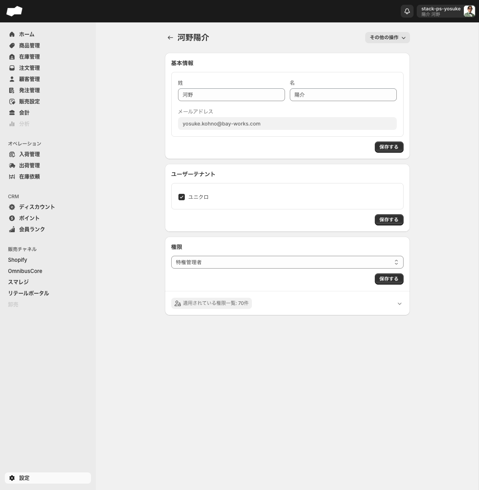
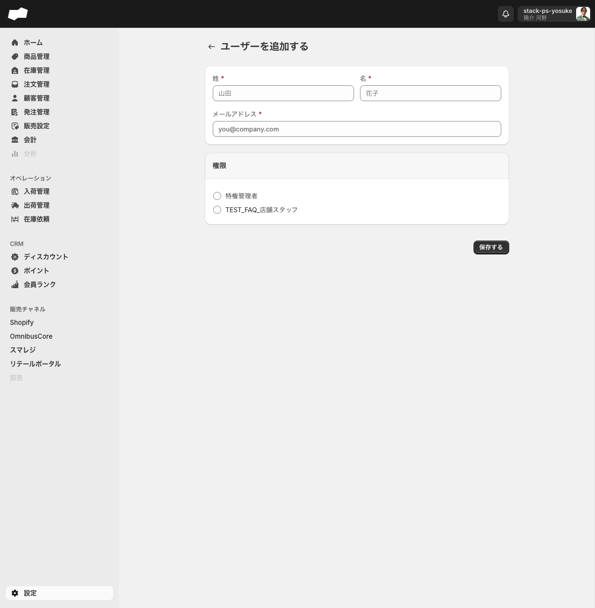
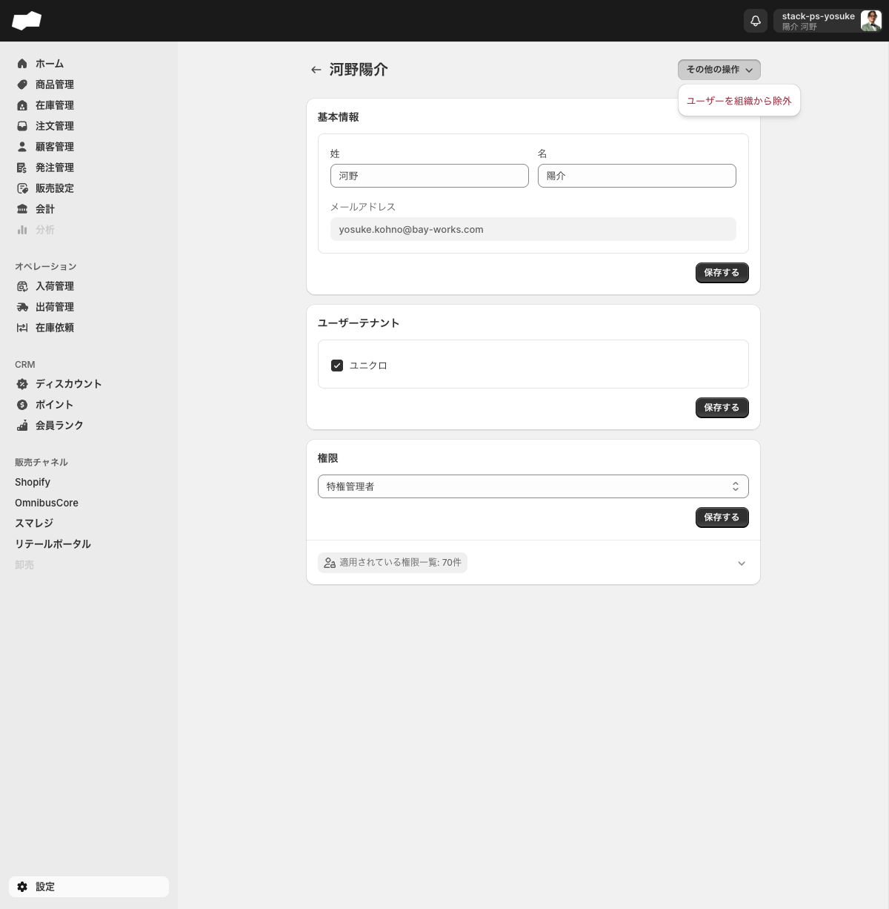
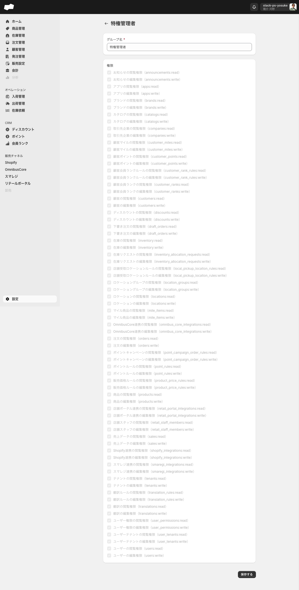
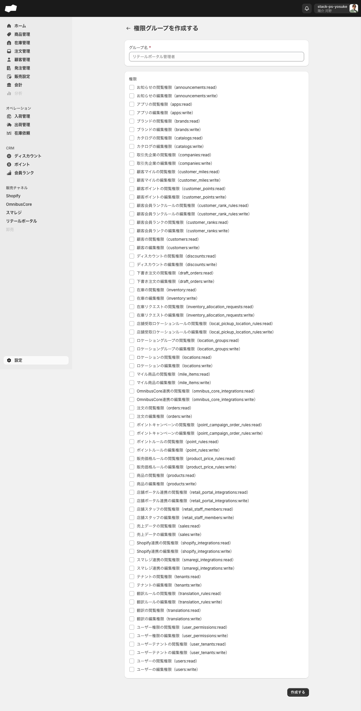
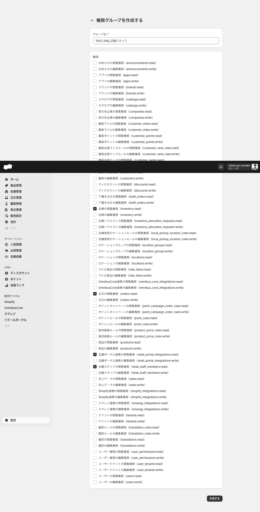

# 02. アカウント・権限

> このページはWBS-25エリアの第2エリアです。SQの管理画面にログインできるメンバーの追加・削除と、メンバーごとに操作できる範囲を制御する権限グループの仕組みを理解するのが目標です。

## このエリアで学べること

- ログイン方式（パスワードなし・メール認証）を説明できる
- 管理メンバーの追加・編集・組織からの除外手順が分かる
- 権限グループ（38リソース × 閲覧/編集 = 76権限）の仕組みを説明できる
- 「特権管理者」とカスタム権限グループの違いを説明できる
- メンバーごとに見える画面・操作できる機能を制御できる

---

## 機能概要

SQでは、管理画面を利用するスタッフを **管理メンバー** として登録し、各メンバーに **権限グループ** を割り当てることで「誰が何を閲覧・編集できるか」を制御します。

| 対象 | URL | 役割 |
|:--|:--|:--|
| 管理メンバー | `/admin/settings/users` | 管理画面にアクセスできるメンバーの追加・編集・除外 |
| 権限グループ | `/admin/settings/permission_groups` | メンバーに割り当てる権限のひな形（76権限のON/OFF） |

これらは左メニュー「設定」>「管理メンバー」からアクセスします。権限グループは管理メンバー一覧の「**権限グループ一覧**」ボタンから遷移します。

### ログイン方式

SQのログインに **パスワードは使わません**。

1. ログイン画面でメールアドレスを入力する
2. 入力したアドレス宛に6桁のワンタイムコードが届く
3. コードを手入力してログインする

パスワードの設定・変更画面は存在しません。

---

## 画面・項目の説明

### 管理メンバー一覧（/admin/settings/users）

一覧画面の主な操作ボタンは以下のとおりです。

| ボタン（UIの原文） | 説明 |
|:--|:--|
| 追加する | メンバー追加フォーム（`/admin/settings/users/create`）へ遷移 |
| 権限グループ一覧 | 権限グループ管理画面（`/admin/settings/permission_groups`）へ遷移 |
| インポート | CSVによる一括追加 |

### メンバー追加フォーム（/admin/settings/users/create）

フォームタイトル: **「ユーザーを追加する」**

| 項目（UIの原文） | 必須 | 補足 |
|:--|:--|:--|
| 姓 * | 必須 | 姓・名は同じ行に横並びで表示 |
| 名 * | 必須 | — |
| メールアドレス * | 必須 | ログイン時の認証に使うアドレス |
| 権限グループ | — | 作成済みのグループから1つ選択（1人1グループ） |

- パスワード入力欄はありません
- 権限グループは1人につき **1グループのみ** 割り当て可能です（複数グループの同時割り当て不可）

### メンバー詳細画面（保存後）

メンバーを追加すると詳細画面に遷移し、以下の3セクションが表示されます。

| セクション | 内容 |
|:--|:--|
| 基本情報 | 姓・名・メールアドレスの編集 |
| ユーザーテナント | アクセスを許可するテナント（事業部）のチェックボックス選択 |
| 権限 | 権限グループをコンボボックスで変更。下部に「適用されている権限一覧」（件数表示付き）のアコーディオンあり |

「その他の操作」ボタンから **「ユーザーを組織から除外」** を実行できます（退職・アクセス削除時はこの操作を使います）。

### 権限グループ一覧（/admin/settings/permission_groups）

権限グループには2種類あります。

| グループ | 特徴 |
|:--|:--|
| 特権管理者 | 初期から用意された半固定グループ。全76権限が付与済み。権限内容（76件）は変更不可・グループ自体の削除不可。グループ名のみ変更可能 |
| カスタムグループ | 「作成する」から新規作成。76権限から任意に選択可能。作成後に編集・削除も可能 |

### 権限グループ作成フォーム（/admin/settings/permission_groups/create）

フォームタイトル: **「権限グループを作成する」**

| 項目（UIの原文） | 必須 | 補足 |
|:--|:--|
| グループ名 * | 必須 | テキストボックス |
| 権限（チェックボックス群） | — | 76権限から個別に選択。デフォルトは全オフ |

### 権限の体系（38リソース × 閲覧/編集 = 76権限）

権限は **38リソース** に対し、**閲覧（`:read`）/ 編集（`:write`）** の2種類が用意されており、合計 **76種類** です。

代表的なリソース（一部）:

| リソース | 内容の例 |
|:--|:--|
| 商品（products） | 商品管理の閲覧・編集 |
| 注文（orders） | 注文管理の閲覧・編集 |
| 在庫（inventory） | 在庫管理の閲覧・編集 |
| 発注伝票（inventory_purchase_orders） | 発注の閲覧・編集 |
| ユーザー（users） | 管理メンバーの閲覧・編集 |
| テナント（tenants） | テナント（事業部）の閲覧・編集 |
| 翻訳（translations） | 翻訳設定の閲覧・編集 |

38リソース全一覧: お知らせ / アプリ / ブランド / カタログ / 取引先企業 / 顧客マイル / 顧客ポイント / 顧客会員ランクルール / 顧客会員ランク / 顧客 / ディスカウント / 下書き注文 / 在庫 / 在庫リクエスト / 発注返品伝票 / 発注伝票 / 店舗受取ロケーションルール / ロケーショングループ / ロケーション / マイル商品 / ネクストエンジン連携 / OmnibusCore連携 / 注文 / ポイントキャンペーン / ポイントルール / 販売価格ルール / 商品 / 店舗ポータル連携 / 店舗スタッフ / 売上データ / Shopify連携 / スマレジ連携 / テナント / 翻訳ルール / 翻訳 / ユーザー権限 / ユーザーテナント / ユーザー

> 権限グループ作成フォームで「一部だけチェックを入れた」状態の例は下記スクリーンショットで確認できます。
>
> 

---

## 主な操作手順

### 管理メンバーを追加する

1. 左メニュー「設定」>「管理メンバー」（`/admin/settings/users`）を開く
2. 右上の「**追加する**」ボタンをクリックする
3. 「姓」「名」「メールアドレス」を入力する（いずれも必須）
4. 「権限グループ」から割り当てるグループを1つ選択する
5. 「**作成する**」を押して保存する
6. メンバー詳細画面に遷移し、追加が完了する

### メンバーの権限グループを変更する

1. 管理メンバー一覧から対象メンバーの行をクリックし、詳細画面を開く
2. 「権限」セクションのコンボボックスで別の権限グループを選択する
3. 保存する（「適用されている権限一覧」アコーディオンで付与された権限の件数を確認できる）

### メンバーを組織から除外する（退職・アクセス削除）

1. 対象メンバーの詳細画面を開く
2. 「**その他の操作**」ボタンをクリックする
3. 「**ユーザーを組織から除外**」を選択する

<!-- TODO: 要確認（組織から除外時の確認ダイアログの有無・除外後に同メールアドレスで再追加できるか） -->

### カスタム権限グループを作成する

1. 管理メンバー一覧の「**権限グループ一覧**」ボタンをクリックする
2. 「**作成する**」ボタンをクリックし、作成フォーム（`/admin/settings/permission_groups/create`）を開く
3. 「グループ名」を入力する（必須）
4. 76種類の権限から、このグループに許可したいものをチェックする
5. 「**作成する**」を押して保存する

### 権限グループを削除する

1. 権限グループ一覧で対象の行を選択する
2. 「**権限グループを削除**」を選ぶ
3. 確認ダイアログ「権限グループを削除しますか？」（本文: 「選択された1件の権限グループを削除します。この処理は巻き戻すことができません。」）で削除を確定する
4. トースト「権限グループを削除しました」が表示される

> 「特権管理者」グループは削除できません。

---

## 注意点・制約

| 区分 | 内容 | 根拠 |
|:--|:--|:--|
| ログイン方式 | パスワードによるログインはなく、メール認証（6桁ワンタイムコード手入力）のみ。パスワード設定画面は存在しない | 実機確認済み |
| 権限グループの割り当て | 1メンバーに割り当てられるのは **1グループのみ**。複数グループの組み合わせは不可 | 実機確認済み |
| 特権管理者は半固定 | 全76権限が付与済み。権限内容の変更とグループ削除は不可。変更できるのはグループ名のみ | 実機確認済み |
| 権限グループ削除は不可逆 | 確認ダイアログに「この処理は巻き戻すことができません。」と表示される。誤削除時は再作成が必要 | 実機確認済み |
| 正しいURL | 管理メンバーの正しいURLは `/admin/settings/users`。`/settings/staffs` `/settings/members` `/settings/organization_users` は404 | 実機確認済み |
| 権限体系 | 現行UIは **38リソース × 閲覧/編集 = 76権限** | 実機確認済み（2026-06-19） |

---

## このエリアの確認状態

| 項目 | 状態 | 根拠 |
|:--|:--|:--|
| ログイン方式（メール認証・パスワードなし） | ✅ 確定 | 実機確認済み |
| 管理メンバー一覧・追加フォームの項目 | ✅ 確定 | 実機確認済み（フォームの保存は未実行） |
| メンバー詳細画面の3セクション構成 | ✅ 確定 | 実機確認済み |
| 権限グループ一覧・作成フォーム | ✅ 確定 | 実機確認済み |
| 権限体系（38リソース × 閲覧/編集 = 76権限） | ✅ 確定 | 実機確認済み（2026-06-19） |
| 特権管理者グループの半固定仕様 | ✅ 確定 | 実機確認済み |
| 権限グループ削除の確認ダイアログ・トースト | ✅ 確定 | 実機確認済み |
| 組織からの除外時の確認ダイアログ・再追加可否 | ⚠️ 未確認 | TODO参照 |
| 権限差分（別権限ユーザーでのログイン時のメニュー/ボタン差分） | ⚠️ 未確認 | 別権限ユーザーでのログインが必要 |

---

## TODO（未確認・一部確認）

- [ ] **組織除外の詳細**: 「ユーザーを組織から除外」実行時の確認ダイアログの有無、除外後に同じメールアドレスで再追加できるか
- [ ] **権限差分の実機確認**: カスタム権限グループを割り当てた別ユーザーで実際にログインし、左メニュー・ボタンがどう変わるかは未確認（現在は推測範囲）
- [ ] **ユーザーテナントの実効果**: メンバー詳細の「ユーザーテナント」でテナントのチェックを外した場合の画面アクセス制限の実挙動は未確認
- [ ] **メンバー追加の保存**: 追加フォームの保存実行は未実施（項目構成のみ確認）

---

## 次のエリア

→ [03. 設定・マスタ](03-設定・マスタ.md)
