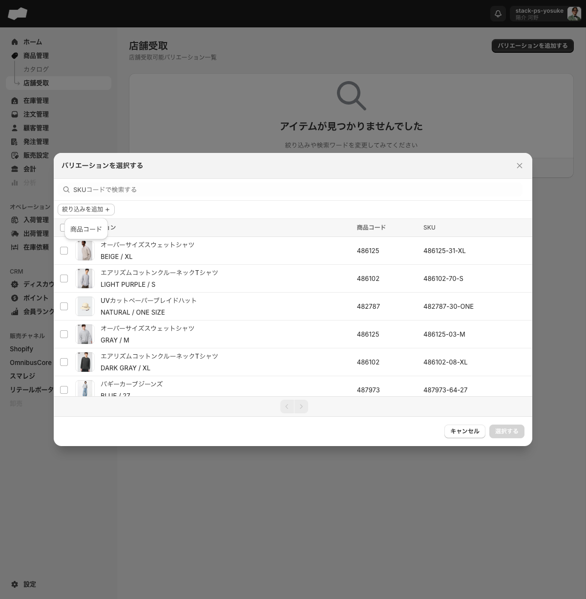
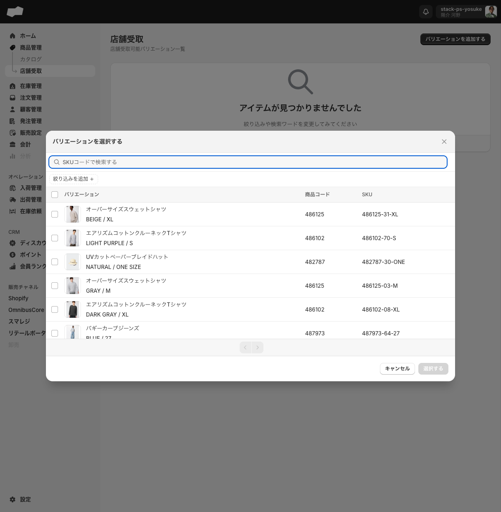

# 07. 店舗受取商品

> このページはWBS-25エリアの第7エリアです。商品管理の中でも「店舗受取」として扱う商品（SKU）をどのように管理するかを理解するのが目標です。

店舗受取とは、お客様がネットで注文した商品を **店舗で受け取れる** 販売方法です。SQでは、すべての商品が店舗受取対象になるわけではなく、運営側が「このSKUは店舗受取可能」と指定したものだけが対象になります。このエリアでは、その **対象SKUの管理** を扱います。

<!-- TODO: 要確認（店舗受取の全体像。商品側の設定だけで完結するのか、ロケーション設定やチャネル連携も必要かは未確認） -->

---

## このエリアで学べること

- 店舗受取とは何か、どの商品（SKU）が対象になるか説明できる
- 店舗受取可能バリエーション一覧の画面構成（列・ボタン）が分かる
- どのSKUを店舗受取対象にするか、運営側で指定・解除できる

---

## 機能概要

| 項目 | 内容 |
|:--|:--|
| 機能名 | 店舗受取 |
| 管理画面URL | `/admin/local_pickup_product_variants` |
| 対象 | 商品管理 > 店舗受取 のサブメニュー |
| できること | 店舗受取対象とするSKU（バリエーション）の一覧表示・追加 |
| 単位 | SKU（バリエーション）単位で指定する |

この画面は「**どのSKUを店舗受取対象にするか**」を管理する商品管理側の機能です。商品全体ではなく、バリエーション（SKU）ごとに対象を指定します。

<!-- TODO: 要確認（追加したSKUを削除（解除）できるかは未確認。一覧に削除UIが確認できているか再確認が必要） -->

---

## 画面・項目の説明

### 店舗受取可能バリエーション一覧（/admin/local_pickup_product_variants）

画面のh1（大見出し）は「**店舗受取**」で、副題に「**店舗受取可能バリエーション一覧**」と表示されます。

#### 一覧の列

| 列名 | 内容 |
|:--|:--|
| バリエーション | バリエーション名（色・サイズなど） |
| 商品コード | 商品を一意に識別するコード |
| SKU | バリエーションを識別する在庫管理コード |

#### ボタン

| ボタン | 内容 |
|:--|:--|
| バリエーションを追加する | 店舗受取対象にするバリエーションを追加するダイアログを開く |

<!-- TODO: 要確認（一覧にフィルター・検索・ページネーションの有無。スクショにフィルタードロップダウン相当の画像があるが内容未確認） -->

### バリエーション追加ダイアログ

「バリエーションを追加する」ボタンを押すと、追加ダイアログが開きます。

<!-- TODO: 要確認（追加ダイアログ内の項目・選択方法。スクショ `03-local-pickup-add-variant-dialog.png` に記録があるが、ダイアログ内のラベル・項目名・必須欄は実機で未確認） -->

---

## 主な操作手順

### 店舗受取対象のバリエーションを追加する

1. 左メニューの「商品管理」を開き、サブメニューの「店舗受取」を選択する（`/admin/local_pickup_product_variants` に遷移）
2. 「バリエーションを追加する」ボタンをクリックする
3. 追加ダイアログで対象のバリエーション（SKU）を選択する
4. ダイアログの保存ボタンを押して一覧に反映する

<!-- TODO: 要確認（手順3の具体的な選択UI・手順4のボタン名。実機でダイアログ操作を保存まで実行していないため断定不可） -->

### 店舗受取対象を解除する

<!-- TODO: 要確認（対象SKUの解除・削除手順。一覧からの解除UIが確認できていないため手順を記載できない） -->

---

## 注意点・制約

- 店舗受取の対象は **SKU（バリエーション）単位** です。商品単位では指定しません
- 「店舗受取の業務上の最終効果（注文・チャネル側での受取挙動）」は **未確認** です。本エリアで確定しているのは管理画面側のデータ・一覧表示のみです
- 外部チャネル（Shopify等）と連携していない環境では、店舗受取設定が実際の販売にどう反映されるかは **未確認・連携が必要** です

<!-- TODO: 要確認（対象SKU追加後に即時反映か、承認や公開フローがあるか） -->

---

## このエリアの確認状態

| 項目 | 状態 | 根拠 |
|:--|:--|:--|
| 画面URL（/admin/local_pickup_product_variants） | 確定 | 2026-06-19実機確認 |
| h1・副題（店舗受取 / 店舗受取可能バリエーション一覧） | 確定 | 2026-06-19実機確認 |
| 一覧の列（バリエーション/商品コード/SKU） | 確定 | 2026-06-19実機確認 |
| 「バリエーションを追加する」ボタンの存在 | 確定 | 2026-06-19実機確認 |
| データ存在（3件以上） | 確定 | 2026-06-19実機確認 |
| 追加ダイアログの項目・選択方法 | 未確認 | スクショはあるが内容未確認 |
| 対象SKUの解除・削除手順 | 未確認 | 解除UIが確認できていない |
| 追加保存後の一覧反映タイミング | 未確認 | 保存操作を未実行 |
| フィルター・検索の有無 | 未確認 | スクショにドロップダウン相当画像あり、内容未確認 |
| チャネル連携時の販売側反映 | 未確認（連携待ち） | 外部接続が必要 |
| 店舗受取の最終業務効果 | 未確認 | 注文・チャネル側挙動は未接続 |

---

## TODO（未確認・一部確認）

このエリアはWBS確認状態「完成寄り」です。画面の存在・一覧構成・主要ボタンは確定していますが、操作の細部が未確認です。

- [ ] 追加ダイアログ（`バリエーションを追加する` 押下後）の項目名・選択方法・必須欄
- [ ] ダイアログの保存ボタン名（`追加する` / `保存する` 等）
- [ ] 追加保存後の対象バリエーション一覧への反映タイミング（即時か承認フローか）
- [ ] 店舗受取対象の解除・削除UIと手順
- [ ] 一覧のフィルター・検索・ページネーションの有無と使い方
- [ ] チャネル連携（Shopify等）時の、販売側での店舗受取表示・受取指定挙動（連携待ち）
- [ ] 受取可能店舗（ロケーション）との紐付け設定があるか（商品側と店舗側の両面設定の要否）

---

## 関連

- 機能別: [商品管理](../01-by-feature/商品管理.md)
- FAQ別: [商品と商品登録のよくある質問](../03-faq/商品と商品登録のよくある質問.md)

---

## 次のエリア

→ [08-次エリア名.md](./08-次エリア名.md)

<!-- TODO: リンク先（第8エリア）のファイル名が確定次第、正しいリンクに置換する -->
