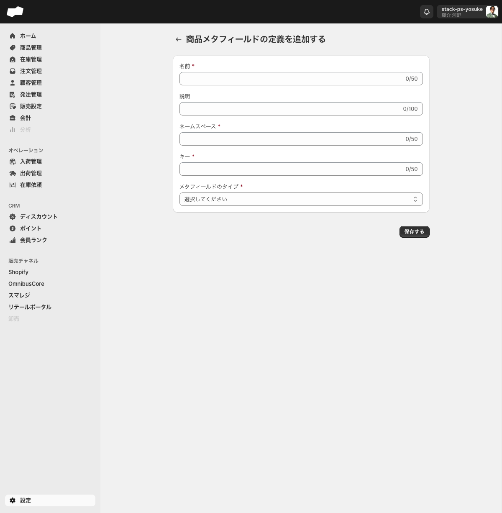
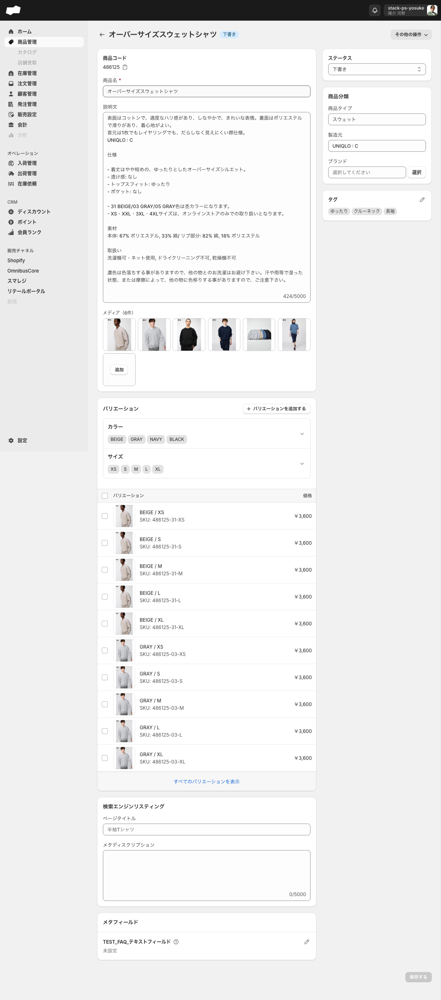

# 08. カスタムデータ

> このページはWBS-25エリアの第8エリアです。SQの標準項目だけでは足りない「追加情報」を、どこに・どう持たせるかを理解するのが目標です。

## このエリアで学べること

- 標準項目（商品名・価格・在庫数など）以外の「独自の情報」をどこに持たせるか説明できる
- メタフィールド定義で、どのオブジェクトにどんな型の項目を追加できるか把握できる
- ネームスペース（namespace）とキー（key）の組み合わせで、追加項目が一意に識別される仕組みが分かる
- メタフィールドが連携先（Shopifyなど）でどう扱われるかの前提が分かる

---

## 機能概要

### カスタムデータとは

SQには、あらかじめ用意された標準項目（商品名・SKUコード・在庫数・価格など）があります。しかし業務によっては「この商品の仕入先メモ」「この顧客の自社会員番号」「この注文の内部メモ」など、**標準項目にはない独自の情報**を持たせたい場合があります。

SQでは、こうした追加情報を **メタフィールド** として任意のオブジェクトに付与できます。管理者は **メタフィールド定義**（追加項目の「型」と「名前」のひな形）を作成し、対象オブジェクトの詳細画面にフィールドを表示させます。

### 対象画面

| 画面 | URL | 役割 |
|:--|:--|:--|
| メタフィールド定義 一覧 | `/admin/settings/metafield_definitions` | 定義の一覧表示・管理 |
| メタフィールド定義 作成 | `/admin/settings/metafield_definitions/create` | 新しい定義の作成 |

> 設定画面（`/admin/settings`）の「カスタムデータグループ」配下に位置づけられています。同グループには「翻訳」「採寸ルール」もありますが、本エリアではメタフィールド定義を主に扱います。

### 何ができるか

- 商品・注文・顧客・ロケーションなど、**16種のオブジェクト**にカスタムフィールドを追加できる
- テキスト・数値・日付・JSONなど **12種の型** から選択できる
- 定義を保存すると、対象オブジェクトの詳細画面に「メタフィールド」セクションが即座に表示される

---

## 画面・項目の説明

### メタフィールド定義 作成フォーム

フォームのパス: `/admin/settings/metafield_definitions/create`

| 項目（UIの原文） | 必須 | 制約・補足 |
|:--|:--|:--|
| 名前 * | 必須 | 最大50文字 |
| 説明 | 任意 | 最大100文字 |
| ネームスペース * | 必須 | 最大50文字・最低4文字 |
| キー * | 必須 | 最大50文字・最低4文字 |
| メタフィールドのタイプ * | 必須 | コンボボックス（下記12種から選択） |

### カスタムフィールドを追加できるオブジェクト（16種）

| カテゴリ | オブジェクト |
|:--|:--|
| 組織 | 組織 |
| 商品系 | 商品 / バリエーション |
| 顧客・取引先 | 顧客 / 会社 / 仕入れ先 |
| 注文系 | 注文 / 下書き注文 |
| 販売設定 | ディスカウント |
| 在庫・拠点 | ロケーション / 在庫移動伝票 / 在庫調整伝票 / 在庫取置伝票 |
| 発注・入出荷 | 発注伝票 / 入荷指示 / 出荷指示 |

### メタフィールドのタイプ（12種）

| 型（UIの原文） | 用途の例 |
|:--|:--|
| 単一行のテキスト | メモ・コード・短いラベル |
| 単一行のテキスト(リスト) | タグのような複数値（文字列） |
| 複数行のテキスト | 長文の備考・説明 |
| 日付と時刻 | 発注日時・対応期限（時刻付き） |
| 日付 | 関連する年月日 |
| trueまたはfalse | フラグ（オン/オフ） |
| バーコード(NW7) | NW7形式のバーコード値 |
| 整数 | 個数・回数など小数のない数値 |
| 小数 | 寸法・割合など小数を含む数値 |
| JSON | 構造化データ |
| ID | 別データの識別子 |
| リッチテキスト | 書式付きの長文 |

### ネームスペースとキー（識別子）

メタフィールドの識別子は **「ネームスペース.キー」** の形式で管理されます。

- 例: ネームスペース `custom`、キー `note` → 識別子は `custom.note`
- ネームスペース・キーともに **最低4文字・最大50文字**
- ネームスペースは、複数の関連項目をグループ化する名前空間として使います

---

## 主な操作手順

### メタフィールド定義を新規作成する

1. 左メニューの「設定」を開き `/admin/settings` へ遷移する
2. 「カスタムデータグループ」の **メタフィールド定義**（`/admin/settings/metafield_definitions`）を開く
3. 一覧画面の **作成** ボタンから `/admin/settings/metafield_definitions/create` へ遷移する
4. 「名前」を入力する（最大50文字・必須）
5. 必要に応じて「説明」を入力する（最大100文字・任意）
6. 「ネームスペース」を入力する（最低4文字・最大50文字・必須）
7. 「キー」を入力する（最低4文字・最大50文字・必須）
8. 「メタフィールドのタイプ」コンボボックスから12種のいずれかを選ぶ（必須）
9. 対象オブジェクト（16種）から1つを選択する
10. **保存する** ボタンを押して定義を作成する

### 作成後に何が起こるか

定義を保存すると、対象オブジェクトの詳細画面に **「メタフィールド」セクションが即座に表示** されます。このセクションで、各オブジェクト（商品・注文など）ごとに実際の値を入力できるようになります。

| タイミング | 結果 |
|:--|:--|
| 定義を保存した直後 | 対象オブジェクトの詳細画面に「メタフィールド」セクションが表示される |
| 商品詳細で確認した例 | 商品詳細画面に「メタフィールド」セクションが表示されることを確認済み |

---

## 注意点・制約

- **ネームスペース・キーの文字数制限**: ともに **最低4文字・最大50文字** です。3文字以下の短い識別子は使えません。
- **名前の文字数制限**: 最大50文字です。
- **説明の文字数制限**: 最大100文字です。
- **定義と値の関係**: メタフィールド定義は「項目の型と名前のひな形」です。各オブジェクトで入力された値は、そのオブジェクトごとに保持されます（定義が値を直接持つわけではありません）。
- **採寸ルールとの違い**: 同じカスタムデータグループに「採寸ルール」がありますが、採寸ルールは「商品ごとの採寸項目（肩幅・バストなど）と単位を定義する専用機能」であり、メタフィールドとは別物です。採寸ルールを個別商品に紐づける操作は現在の管理画面UIからは行えません。<!-- TODO: 要確認（API経由または外部連携での割り当て方法） -->
- **翻訳への影響**: 翻訳ルールを作成する際、「翻訳データを自動で作成する」をオンにすると、メタフィールドも翻訳対象に含まれます（商品・商品オプション・商品オプション値・メタフィールドの翻訳データが自動生成される）。

---

## このエリアの確認状態

| 項目 | 状態 | 根拠 |
|:--|:--|:--|
| メタフィールド定義 一覧の表示 | 確定 | `/admin/settings/metafield_definitions` |
| メタフィールド定義 作成フォームの表示 | 確定 | `/admin/settings/metafield_definitions/create` |
| 作成フォームの項目（名前・説明・ネームスペース・キー・タイプ） | 確定 | 設定.mdの実機確認記録 |
| 文字数制限（名前50・説明100・ネームスペース/キー4-50） | 確定 | 実機確認 |
| タイプの選択肢（12種） | 確定 | 実機確認 |
| カスタムフィールド追加対象オブジェクト（16種） | 確定 | 実機確認 |
| 定義保存後にメタフィールドセクションが即時表示される | 確定 | 実機確認（商品詳細で確認） |
| 識別子が「ネームスペース.キー」形式 | 確定 | 実機確認 |
| 連携先（Shopify等）でのメタフィールド扱い | 未確認 | 外部接続が必要 |
| 作成済み定義の編集・削除操作 | 未確認 | 実機で未検証 |
| メタフィールド値を各オブジェクトで入力・保存する操作 | 一部確認 | 商品詳細でセクション表示は確認、値の保存は未検証 |

---

## TODO（未確認・一部確認）

WBS確認状態が「完成寄り」のため、残る未確認項目は以下のとおりです。

- [ ] **連携待ち**: Shopify等のチャネル接続後に、メタフィールドが連携先でどう扱われるか（同期方向・型の対応）
- [ ] **連携待ち**: メタフィールド値が連携時のマッピングで使われるか
- [ ] **TODO表示該当なし**: 本エリアにはTODO表示中の機能は見当たりません（採寸ルールの商品紐付け以外は実装済み）
- [ ] 作成済みメタフィールド定義の編集・削除操作（実機で未検証）
- [ ] 各オブジェクトでメタフィールド値を入力して保存する操作（商品詳細でセクション表示は確認済み、値の保存は未検証）
- [ ] 採寸ルールを個別商品に紐づける方法（現在の管理画面UIからは行えない。API経由か外部連携か要確認）

---

## 次のエリア

次は [09-次エリア名.md](./09-次エリア名.md) へ進みます。
<!-- TODO: 要確認（第9エリアのタイトル・WBS該当範囲を確定してリンク名を修正） -->
