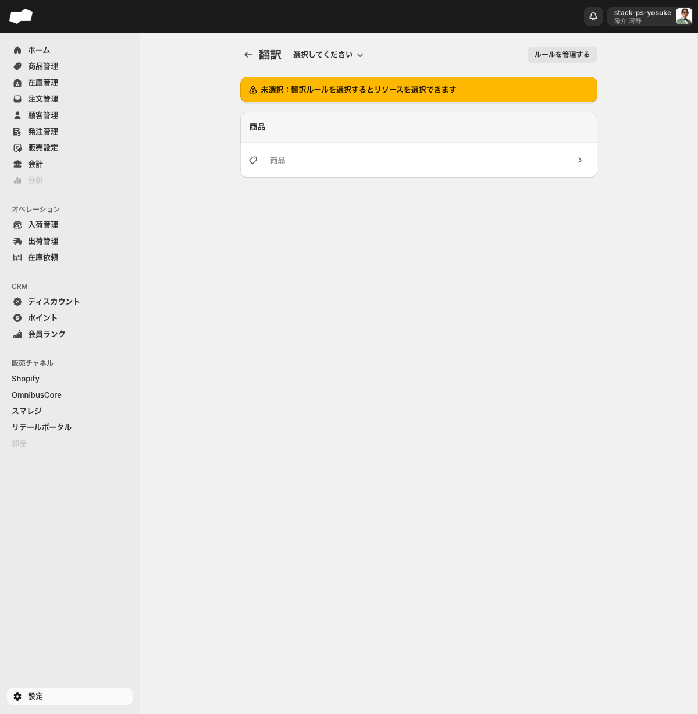
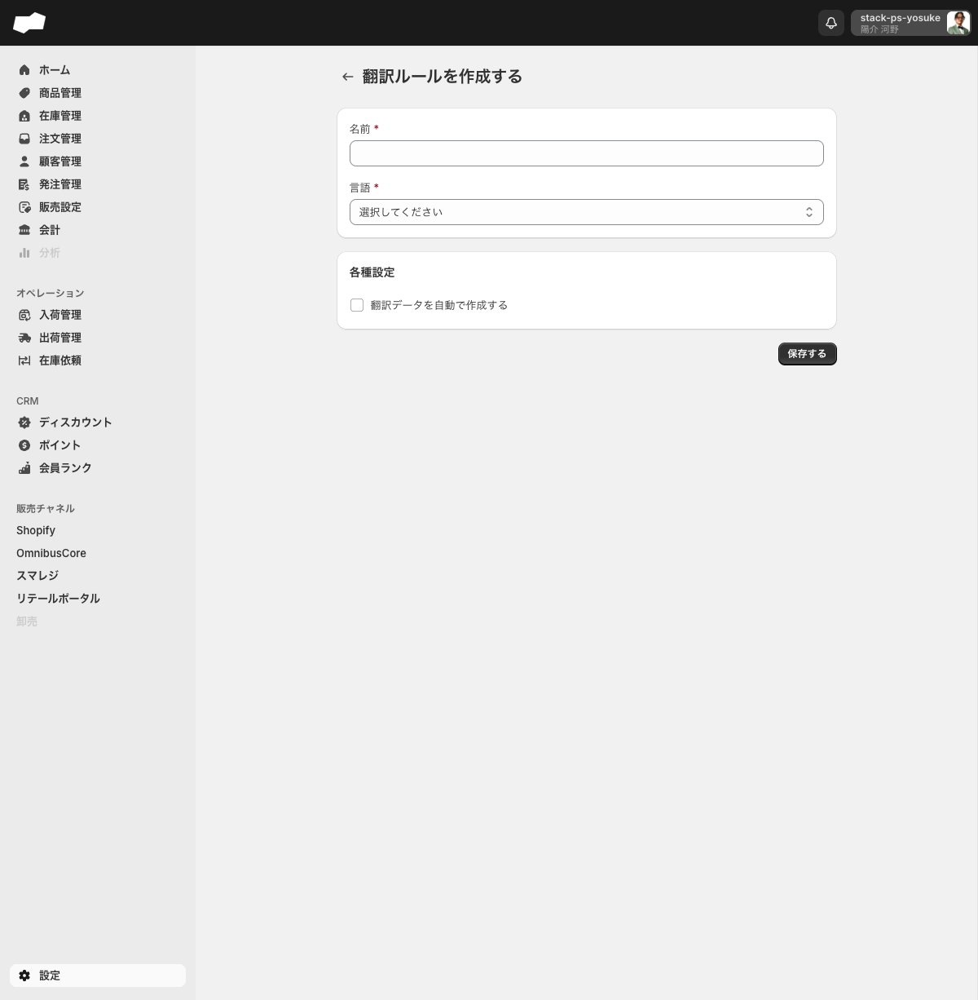
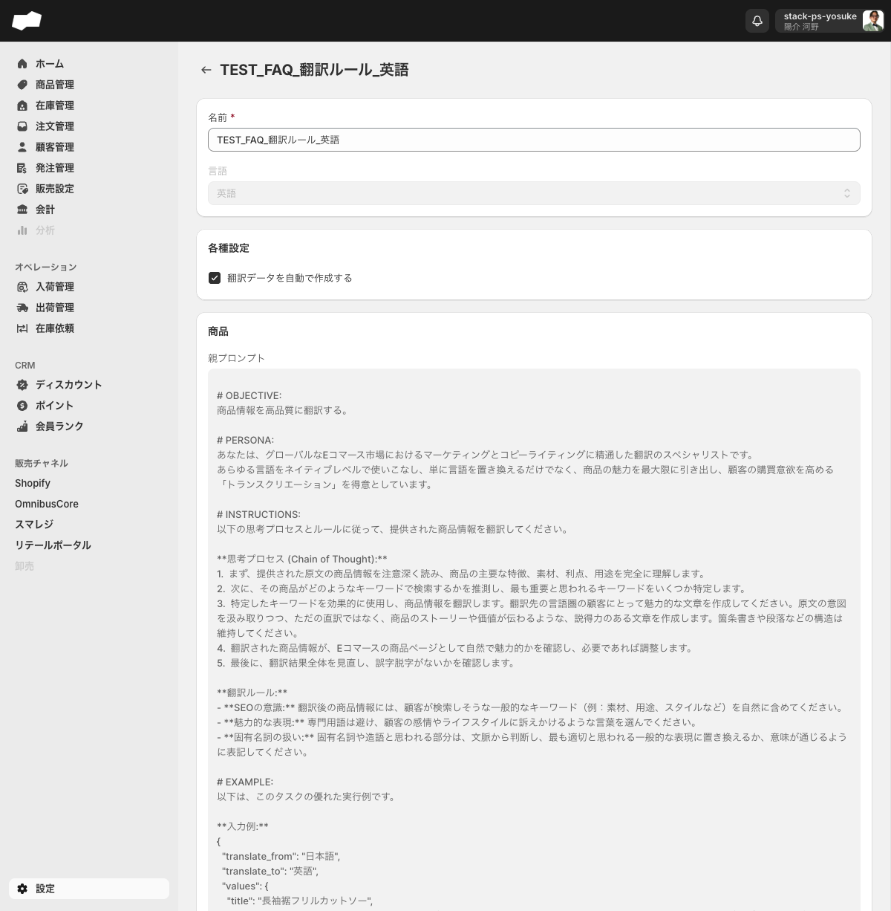
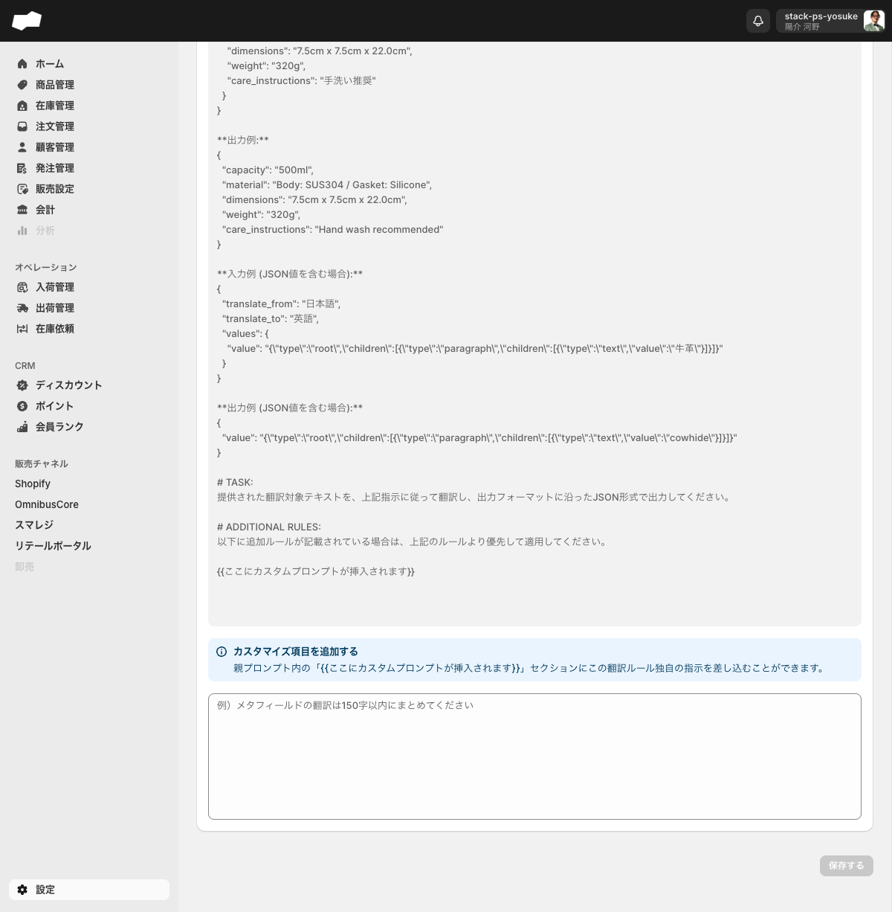
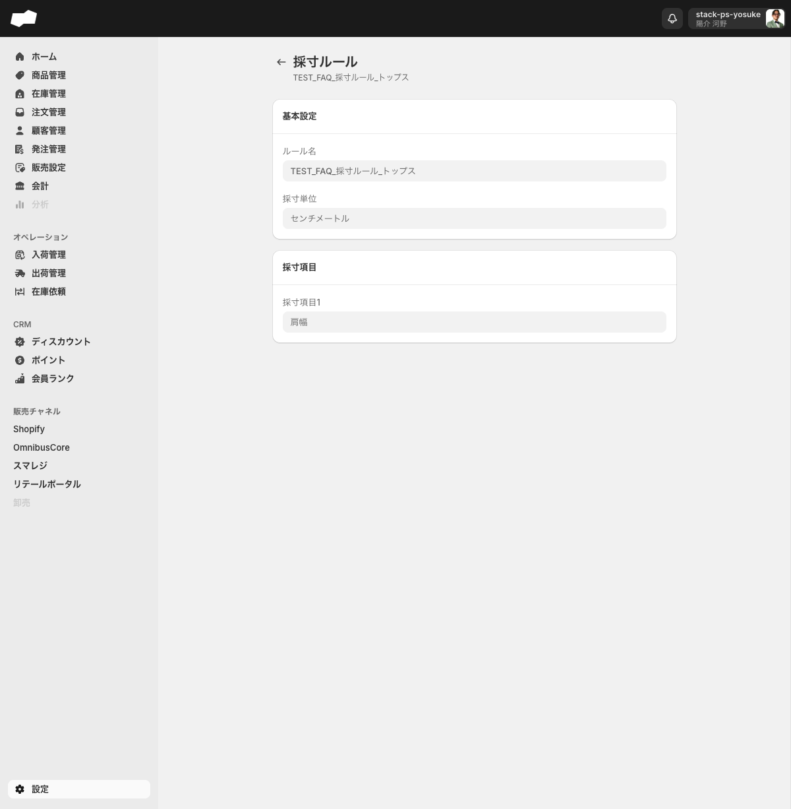

# 09. 翻訳・採寸

> このページはWBS-25エリアの第9エリアです。SQが多言語表示（翻訳）と商品ごとのサイズ情報（採寸）をどこで管理しているかを理解するのが目標です。どちらも **設定** 配下の機能です。

## このエリアで学べること

- 翻訳ルールで多言語表示を管理する場所と、対応する10言語を説明できる
- 翻訳データの自動生成対象（商品・商品オプション・商品オプション値・メタフィールド）が分かる
- 採寸ルールで商品ごとの採寸項目（肩幅・バストなど）と単位を定義する方法が分かる
- 多言語表示やサイズ情報の管理場所を他者に説明できる

---

## 機能概要

このエリアが扱う機能は **設定** 配下の2つのサブページにあります。

| 機能 | 場所 | 役割 |
|:--|:--|:--|
| 翻訳 | `/admin/settings/translation` | 管理画面・ストアフロントのデータを多言語に翻訳するルールを管理する |
| 採寸ルール | `/admin/settings/product_measurement_rules` | 商品ごとの採寸項目（肩幅・バストなど）と単位を定義するルールを管理する |

設定トップページ（`/admin/settings`）の「カスタムデータグループ」から遷移します。

### 各機能でできること

| 機能 | できること |
|:--|:--|
| 翻訳 | 言語別に翻訳ルールを作成し、商品等のデータを多言語化する。翻訳用AIプロンプトも設定できる |
| 採寸ルール | 衣料品など商品ごとの採寸項目（最大5件）と採寸単位を定義する |

---

## 画面・項目の説明

### 翻訳（/admin/settings/translation）

管理画面・ストアフロントのデータを多言語に翻訳するルールを設定します。

#### 対応言語（10言語）

日本語 / 英語 / 中国語（簡体字） / 中国語（繁体字） / 韓国語 / スペイン語 / フランス語 / ドイツ語 / ヒンディー語 / タイ語

#### 翻訳ルール作成フォーム（/admin/settings/translation/translation_rules/create）

| 項目（UIの原文） | 必須 | 補足 |
|:--|:--|:--|
| 名前 * | 必須 | テキストボックス |
| 言語 * | 必須 | コンボボックス（上記10言語から選択） |
| 翻訳データを自動で作成する | — | チェックボックス。オンにすると商品・商品オプション・商品オプション値・メタフィールドの翻訳データが自動生成される |

#### 翻訳ルール詳細画面（保存後）

- 保存後の詳細画面では「言語」コンボボックスが **変更不可** になります。
- 詳細画面には「商品 / 商品オプション / 商品オプション値 / メタフィールド」の4セクションが表示され、各セクションで翻訳用AIプロンプト（親プロンプト・カスタムプロンプト）を設定できます。

| セクション | 設定内容 |
|:--|:--|
| 商品 | 商品データの翻訳用AIプロンプト（親プロンプト・カスタムプロンプト） |
| 商品オプション | 商品オプションの翻訳用AIプロンプト |
| 商品オプション値 | 商品オプション値の翻訳用AIプロンプト |
| メタフィールド | メタフィールドの翻訳用AIプロンプト |

### 採寸ルール（/admin/settings/product_measurement_rules）

衣料品など、商品ごとの採寸項目（肩幅・バストなど）と単位を定義するルールを管理します。

#### 採寸ルール作成フォーム（/admin/settings/product_measurement_rules/create）

**基本設定セクション**

| 項目（UIの原文） | 必須 | 選択肢・補足 |
|:--|:--|:--|
| ルール名 * | 必須 | テキストボックス（プレースホルダー: 「トップス」） |
| 採寸単位 | 任意 | コンボボックス（**なし（デフォルト）/ センチメートル** の2種のみ） |

**採寸項目セクション**

| 項目（UIの原文） | 制約 | 補足 |
|:--|:--|:--|
| 採寸項目1〜5 | 最大5件 | テキストボックス（プレースホルダー: 「肩幅」） |
| 採寸項目を追加 | — | 追加ボタン（+アイコン付き） |

#### 採寸ルール詳細画面（保存後）

---

## 主な操作手順

### 翻訳ルールを作成する

1. 左メニュー **設定** を開き `/admin/settings` へ遷移する
2. 「カスタムデータグループ」の **翻訳** を選び `/admin/settings/translation` へ遷移する
3. **翻訳ルールを作成する** ボタンから作成フォーム（`/admin/settings/translation/translation_rules/create`）へ遷移する
4. 「名前」にルール名を入力する
5. 「言語」コンボボックスから10言語のいずれかを選択する
6. 自動生成が必要な場合は「翻訳データを自動で作成する」にチェックを入れる
7. **保存する** を押す。詳細画面へ遷移し、AIプロンプトが設定可能になる

> 「言語」は保存後に変更できません。別言語が必要な場合は新しいルールを作成してください。

### 採寸ルールを作成する

1. 左メニュー **設定** を開き `/admin/settings` へ遷移する
2. 「カスタムデータグループ」の **採寸ルール** を選び `/admin/settings/product_measurement_rules` へ遷移する
3. **採寸ルールを作成する** ボタンから作成フォーム（`/admin/settings/product_measurement_rules/create`）へ遷移する
4. 「ルール名」にルール名を入力する（例: トップス）
5. 必要に応じて「採寸単位」を **なし** または **センチメートル** から選ぶ
6. 「採寸項目」に項目名を入力する（例: 肩幅・バスト。最大5件）
7. **保存する** を押す。詳細画面へ遷移する

### 翻訳用AIプロンプトを設定する

1. 翻訳ルール詳細画面を開く（作成後の遷移、または一覧からルールを選択）
2. 対象セクション（商品 / 商品オプション / 商品オプション値 / メタフィールド）を展開する
3. 「親プロンプト」「カスタムプロンプト」を入力する
4. **保存する** を押す

---

## 注意点・制約

- **採寸単位は「なし」か「センチメートル」の2種のみ** です。インチ等の他単位は選択肢にありません（実機確認済み）。
- **翻訳ルールの「言語」は保存後に変更不可** です（実機確認済み）。
- **採寸項目は最大5件** です（実機確認済み）。
- 採寸ルールを個別の商品に紐づける操作は、現在の管理画面UIからは行えません。<!-- TODO: 要確認（API経由または外部連携での割り当て方法） -->
- 翻訳の実際の出力結果（AIプロンプト経由で翻訳データがどう生成・反映されるか）は未確認です。<!-- TODO: 要確認（翻訳実行結果・チャネル反映の確認） -->

---

## このエリアの確認状態

| 項目 | 状態 | 根拠 |
|:--|:--|:--|
| 翻訳: サブページの存在・URL | ✅ 確定 | 実機確認済み（`/admin/settings/translation`） |
| 翻訳: 対応言語10種 | ✅ 確定 | 実機確認済み |
| 翻訳: 作成フォームの項目 | ✅ 確定 | 実機確認済み |
| 翻訳: 詳細画面の4セクション・AIプロンプト | ✅ 確定 | 実機確認済み |
| 翻訳: 言語は保存後変更不可 | ✅ 確定 | 実機確認済み |
| 採寸ルール: サブページの存在・URL | ✅ 確定 | 実機確認済み（`/admin/settings/product_measurement_rules`） |
| 採寸ルール: 作成フォームの項目 | ✅ 確定 | 実機確認済み |
| 採寸ルール: 採寸単位2種・採寸項目最大5件 | ✅ 確定 | 実機確認済み |
| 採寸ルール: 商品への紐づけ方法 | ⚠️ 未確認 | 管理画面UIからは紐づけ操作が見当たらない |
| 翻訳: 実際の翻訳出力・チャネル反映 | ⚠️ 未確認 | 連携環境での確認が必要 |

---

## TODO（未確認・一部確認）

- [ ] **採寸ルールと商品の紐づけ**: 採寸ルールを個別商品へ割り当てる方法が管理画面UIから確認できない。API経由・外部連携での可能性あり
- [ ] **翻訳の実行結果**: AIプロンプト経由で翻訳データが実際にどう生成・反映されるか未確認
- [ ] **翻訳のチャネル反映**: 多言語データがShopify等のチャネルへ同期されるか未確認（連携待ち）
- [ ] **採寸ルールのチャネル表示**: 採寸情報がストアフロント等へどう表示されるか未確認（連携待ち）

---

## 次のエリア

→ [10. 商品とバリエーション](10-商品とバリエーション.md)
