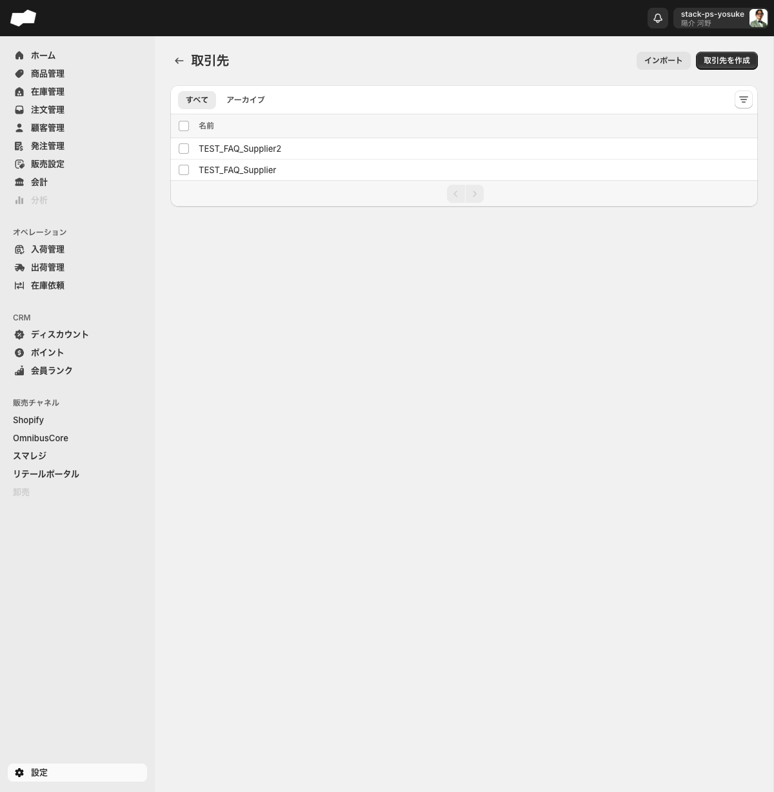
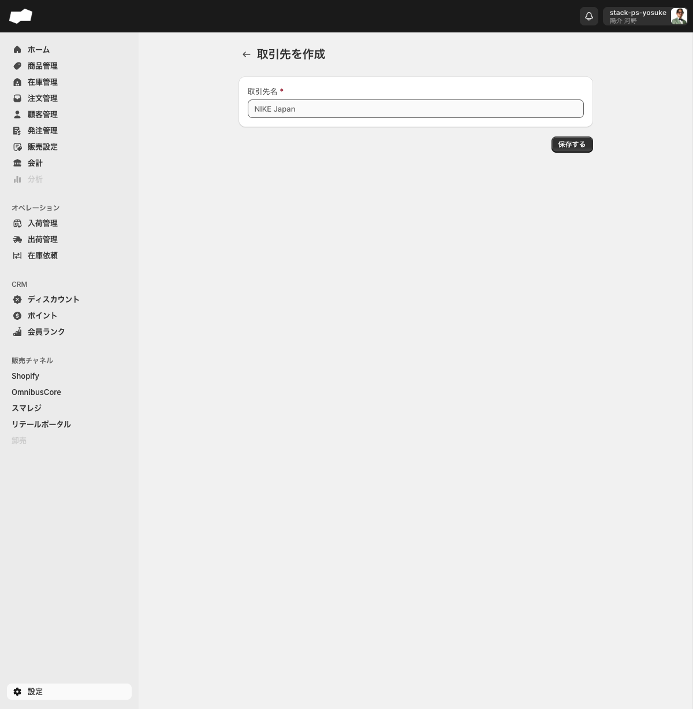
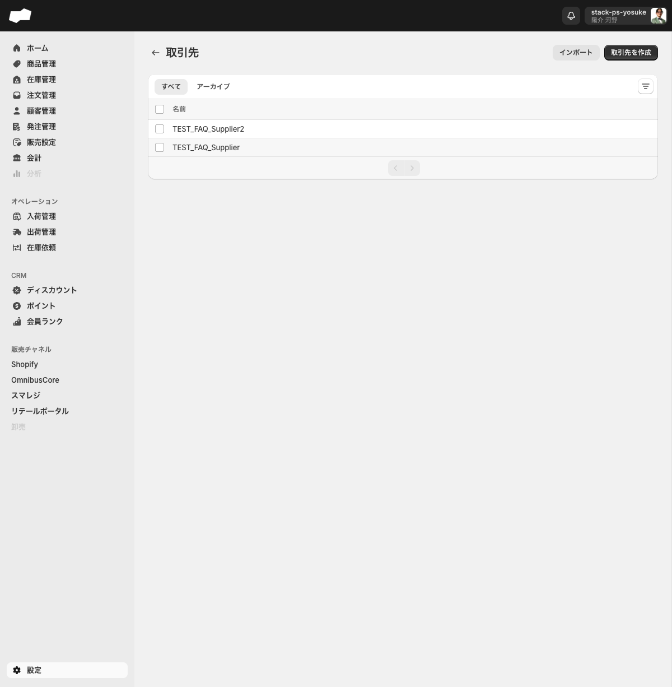

# 14. 発注・仕入

> このページはWBS-25エリアの第14エリアです。取引先（仕入先）への発注伝票を作成し、ステータスを下書き→発注済み→キャンセル済みと進める手順を理解するのが目標です。発注伝票は作成・発注・キャンセルまで実行できますが、「発注すると入荷指示が作成される」というダイアログ表示に対し、実機では入荷管理一覧への反映を確認できていません（学習ゴールの核心部分です）。

## このエリアで学べること

- 取引先（仕入先）マスタを登録・編集する方法が分かる
- 発注伝票を作成し、商品・数量・単価・税率・通貨を入力できる
- 発注伝票のステータスが「下書き → 発注済み → キャンセル済み」へ遷移することを説明できる
- **発注ステータスが進んでも、実機確認範囲では入荷指示や入荷予定に連動しないこと**を説明できる
- 発注済み後は伝票の編集ができず、キャンセル操作は巻き戻せないことを理解する

---

## 機能概要

このエリアは「オペレーション」グループに属する機能と「設定」グループの取引先マスタから成り立ちます。

| 機能 | 画面URL | 役割 |
|:--|:--|:--|
| 発注管理 | `/admin/inventory_purchase_orders` | 取引先への発注伝票の一覧表示・作成 |
| 発注伝票 作成 | `/admin/inventory_purchase_orders/create` | 取引先・テナント・通貨・商品を指定して発注伝票を下書き保存 |
| 取引先マスタ | `/admin/settings/suppliers` | 発注伝票の「取引先」に表示される仕入先の一覧・登録 |

### できること

- **取引先マスタ**: 取引先名・取引先コードを登録し、発注伝票ですぐに選択できる
- **発注伝票の作成**: 取引先・テナント・通貨・商品（バリエーション）・単価・数量・税率を入力して下書き保存
- **ステータス遷移**: 下書き → 発注済み → キャンセル済み まで進められる
- **国際仕入れ対応**: 発注伝票ごとに通貨（日本円 / 米ドル / ユーロ / タイ バーツ / シンガポール ドル）を選択可能

### 実機確認範囲のステータス遷移

```
作成する
  ↓
下書き  ──発注する──▶  発注済み  ──キャンセルする──▶  キャンセル済み
```

> **重要**: 発注確認ダイアログには「発注を行うと入荷指示が作成されます」と表示されますが、2026-06-16 / 2026-06-18 / 2026-06-19 の実機確認（`#IP-1000` `#IP-1001` `#IP-1003`）では、いずれも入荷管理一覧に発注起点の入荷指示は表示されず、SKU在庫詳細の「入荷予定」も増えませんでした。**「発注すれば必ず入荷予定が増える」とは案内しないでください。**

---

## 画面・項目の説明

### 発注管理 一覧（`/admin/inventory_purchase_orders`）


**タブ**: 「すべて」のみ

**空状態の表示**: 「アイテムが見つかりませんでした」

**一覧テーブル列**（2026-06-20実機確認、`#IP-1000`〜`#IP-1003` 存在）:

| 列名 | 内容 |
|:--|:--|
| 管理番号 | 発注伝票番号（例: `#IP-1003`） |
| 取引先 | 発注先の取引先名 |
| ステータス | 下書き / 発注済み / キャンセル済み |
| 合計金額 | 発注伝票の合計金額 |
| 発注日 | 発注実行日 |
| 作成日 | 伝票作成日 |

**右上のボタン**:

| ボタン | 動作 |
|:--|:--|
| 発注伝票を作成する | 発注伝票の作成フォーム（`/create`）へ遷移する |

### 発注伝票 作成フォーム（`/admin/inventory_purchase_orders/create`）


#### 取引先・基本情報

| 項目（UIラベル） | 必須 | 説明・制約 |
|:--|:--|:--|
| 取引先* | 必須 | 仕入先となる取引先をコンボボックスから選択（「設定 > 取引先」に登録された取引先が選択肢に表示される） |
| テナント* | 必須 | 発注を紐付けるテナントをコンボボックスから選択 |
| 通貨 | 任意 | 発注伝票で使用する通貨（米ドル / ユーロ / 日本円 / タイ バーツ / シンガポール ドル、デフォルト: 日本円） |

#### 商品セクション

| 項目（UIラベル） | 必須 | 説明・制約 |
|:--|:--|:--|
| 商品を追加する | 必須（1件以上） | テキスト検索または「参照」ボタンで商品バリエーションを追加 |
| 単価（明細行） | — | 商品1点あたりの仕入価格（数値入力） |
| 数量（明細行） | — | 発注数量（数値入力） |
| 税率（明細行） | — | 消費税率（初期値: 10%） |
| 金額（明細行） | — | 単価 × 数量の税抜き金額（読み取り専用。単価・数量の変更に連動して更新） |

#### 「参照」ボタンで開くバリエーション選択ダイアログ


| 要素 | 説明 |
|:--|:--|
| 検索ボックス | 「SKUコードで検索する」 |
| 絞り込みを追加 | 選択肢は「商品コード」のみ。選択すると商品コード入力欄と「検索」「クリア」ボタンが追加される |
| テーブル列 | バリエーション / 商品コード / SKU |
| フッターボタン | 「キャンセル」「選択する」 |

#### フォーム下部ボタン

| ボタン | 動作 |
|:--|:--|
| 取り消す | フォームを閉じ、一覧画面へ戻る |
| 作成する | 発注伝票を下書きとして保存する |

#### バリデーションエラー（空のまま「作成する」を押した場合）

| 条件 | エラー文言 |
|:--|:--|
| 取引先が未選択 | 取引先を選択してください |
| テナントが未選択 | テナントを選択してください |
| 商品が0件 | 商品を1つ以上追加してください |

### 発注伝票 詳細とステータス別の表示

| 状態 | 実機で確認した表示/操作 | 在庫・入荷への影響 |
|:--|:--|:--|
| 下書き | `注意 / 下書き`。主要操作は「発注する」。 | 在庫は変わらない。 |
| 発注する | 確認ダイアログ「発注を行うと入荷指示が作成されます。発注後は伝票の編集ができません。」 | 実機確認範囲では `入荷予定` 増加なし。入荷管理一覧にも当該伝票起点の入荷指示は見えず。 |
| 発注済み | `情報 / 発注済み`。発注者/発注日時が表示され、商品セクションは「発注済み商品」になる。その他操作は「キャンセルする」のみ。 | 編集導線が見えない。 |
| キャンセル | 確認ダイアログ「この処理は巻き戻すことができません。」 | 在庫は変わらない。 |
| キャンセル済み | ステータスが「キャンセル済み」。キャンセル者/キャンセル日時が表示される。メニュー内の「キャンセルする」はdisabled。 | 再キャンセルはできない。 |

### 取引先マスタ（設定 > 取引先 / `/admin/settings/suppliers`）



**タブ**: 「すべて」 / 「アーカイブ」

**テーブル列**: 名前 / コード

**右上のボタン**:

| ボタン | 動作 |
|:--|:--|
| インポート | クリックしても画面遷移・ダイアログが表示されない（**未実装**） |
| 取引先を作成 | 取引先の作成フォーム（`/create`）へ遷移する |

#### 取引先 作成フォーム（`/admin/settings/suppliers/create`）



| 項目（UIラベル） | 必須 | 説明・制約 |
|:--|:--|:--|
| 取引先名* | 必須 | 取引先の名前（テキスト入力、プレースホルダー: NIKE Japan） |
| 取引先コード | 任意 | 取引先の識別コード（テキスト入力、プレースホルダー: SUP-001） |

| ボタン | 動作 |
|:--|:--|
| 保存する | 取引先を保存し、取引先一覧へ遷移する |

取引先名を入力せずに「保存する」を押すと「取引先名を入力してください」というエラーが表示されます。保存完了時は「取引先を作成しました」というトーストが表示されます。



#### 取引先 詳細（`/admin/settings/suppliers/<id>`）

取引先の詳細画面では名前・コードを編集できます。<!-- TODO: 要確認（取引先レコード自体の削除UIが確認できない。誤登録時の削除方法は開発元確認が必要） -->

---

## 主な操作手順

### 手順1: 取引先を登録する

1. 左メニューの「設定」を開き、「取引先」をクリックする。取引先一覧（`/admin/settings/suppliers`）が開く。
2. 右上の「取引先を作成」ボタンをクリックする。作成フォーム（`/create`）へ遷移する。
3. 「取引先名」に仕入先の名前を入力する。
4. 必要に応じて「取引先コード」に識別コードを入力する。
5. 「保存する」ボタンをクリックする。
6. 「取引先を作成しました」というメッセージが表示され、取引先一覧に戻ることを確認する。

### 手順2: 発注伝票を作成する（下書き保存まで）

1. 左メニューの「発注管理」をクリックし、一覧画面（`/admin/inventory_purchase_orders`）を開く。
2. 右上の「発注伝票を作成する」ボタンをクリックする。作成フォーム（`/create`）へ遷移する。
3. 「取引先」コンボボックスから、手順1で登録した取引先を選ぶ。
4. 「テナント」コンボボックスから、発注を紐付けるテナントを選ぶ。
5. 必要に応じて「通貨」を選ぶ（デフォルト: 日本円）。
6. 「商品を追加する」のテキスト検索、または「参照」ボタンからバリエーションを選択する。
7. 明細行の「単価」「数量」「税率」を入力する。
8. フォーム下部の「作成する」ボタンをクリックする。
9. 発注伝票の詳細画面に遷移し、ステータスが「下書き」になっていることを確認する。

> **バリエーション選択ダイアログの絞り込み**: 「絞り込みを追加」で選べるのは「商品コード」のみです。SKUコード検索欄に直接入力して探すこともできます。

### 手順3: 発注伝票を発注済みにする

1. 発注伝票の詳細画面（ステータス: 下書き）を開く。
2. 商品・数量・単価・合計金額が正しいことを確認する。
3. 「発注する」ボタンをクリックする。確認ダイアログが開く。
4. 「発注を行うと入荷指示が作成されます。発注後は伝票の編集ができません。」の内容を確認する。
5. 実行ボタンをクリックする。
6. ステータスが「発注済み」に変わり、発注者・発注日時が表示されることを確認する。
7. 商品セクションの見出しが「発注済み商品」に変わることを確認する。

> **入荷連動は未確認**: 手順3を完了しても、2026-06-16 / 2026-06-18 / 2026-06-19 の実機確認では入荷管理一覧に発注起点の入荷指示は表示されず、SKU在庫詳細の「入荷予定」も増えませんでした。入荷連携が有効になる条件（外部システム連携・設定等）がある可能性があり、開発元確認事項です。

### 手順4: 発注伝票をキャンセルする

1. 発注済み状態の発注伝票の詳細画面を開く。
2. 「その他の操作」>「キャンセルする」をクリックする。確認ダイアログが開く。
3. 「この処理は巻き戻すことができません。」の内容を確認する。
4. 実行ボタンをクリックする。
5. ステータスが「キャンセル済み」に変わり、キャンセル者・キャンセル日時が表示されることを確認する。

### 各ステップの確認ポイント

| 確認タイミング | 見るべき箇所 | 期待する状態 |
|:--|:--|:--|
| 手順1完了後 | 取引先 一覧 | 登録した取引先が表示される |
| 手順1完了後 | 発注伝票作成フォーム > 取引先 | 登録した取引先が選択肢に出る |
| 手順2完了後 | 発注伝票 詳細 > ステータス | 下書き |
| 手順3完了後 | 発注伝票 詳細 > ステータス | 発注済み |
| 手順3完了後 | 商品セクション見出し | 「発注済み商品」に変化 |
| 手順4完了後 | 発注伝票 詳細 > ステータス | キャンセル済み |

---

## 注意点・制約

### 発注ステータスは入荷に連動しない（実機確認範囲）

発注確認ダイアログには「発注を行うと入荷指示が作成されます」と表示されますが、2026-06-16 / 2026-06-18 / 2026-06-19 の実機確認では、`#IP-1000` / `#IP-1001` / `#IP-1003` のいずれも、発注後に以下の変化を確認できませんでした。

- 入荷管理一覧（`/admin/inventory_inbound_orders`）への発注起点入荷指示の表示
- SKU在庫詳細の「入荷予定」の増加

したがって **「発注すれば入荷予定が自動で立つ」とは断定できません**。入荷連携が有効になる条件（外部連携・設定・非同期タイミング等）は開発元確認事項です。FAQ・サポート案内では「発注ステータスは在庫・入荷に直接連動しない（実機確認範囲）」として案内してください。

### 発注済み後は編集できない

発注を実行すると確認ダイアログにある通り「伝票の編集ができません」。発注済み状態で編集導線は表示されず、その他操作は「キャンセルする」のみになります。内容を修正したい場合は伝票をキャンセルし、新しく作り直してください。

### キャンセルは巻き戻せない（不可逆）

キャンセル確認ダイアログには「この処理は巻き戻すことができません。」と表示されます。キャンセル済み伝票は再キャンセルできず（メニュー内の「キャンセルする」はdisabled）、キャンセル済み伝票を「発注済み」「下書き」に戻す操作は確認できていません。

### 金額欄は税抜き表示

発注伝票の明細「金額」は 単価 × 数量 の **税抜き金額** を表示します。税率は別項目として保持されます。合計金額も税抜きベースです。

### 通貨は発注伝票ごとに選択可能

通貨は日本円 / 米ドル / ユーロ / タイ バーツ / シンガポール ドル から選べ、発注伝票ごとに設定できます。国際仕入れに対応するための項目です。

### 取引先一覧の「インポート」は未実装

取引先一覧（`/admin/settings/suppliers`）右上の「インポート」ボタンをクリックしても画面遷移・ダイアログが表示されません。取引先の登録は1件ずつ手動で行ってください（実機確認済み）。

### 取引先は発注伝票作成フォームに即時反映

取引先マスタに登録したデータは、発注伝票作成フォームの「取引先」選択肢にすぐ反映されます。取引先を新規登録してから発注伝票を作成する流れで問題ありません。

---

## このエリアの確認状態

| 項目 | 状態 | 根拠 |
|:--|:--|:--|
| 発注伝票の作成（下書き保存） | ✅ 確定 | `#IP-1000` `#IP-1001` `#IP-1003` で確認 |
| ステータス遷移 下書き→発注済み→キャンセル済み | ✅ 確定 | `#IP-1003` を新規作成・発注・キャンセルまで操作 |
| 発注済み後の編集不可 | ✅ 確定 | `#IP-1001` `#IP-1003` 詳細で確認 |
| 発注確認ダイアログの表示文言 | ✅ 確定 | 「発注を行うと入荷指示が作成されます。〜」 |
| 取引先マスタの登録・編集 | ✅ 確定 | `/admin/settings/suppliers` で確認 |
| 取引先作成時のバリデーション | ✅ 確定 | 「取引先名を入力してください」確認済み |
| 取引先のインポートボタン（未実装） | ✅ 確定 | クリック無反応を実機確認 |
| 通貨の選択肢（5種） | ✅ 確定 | 作成フォームで確認 |
| バリエーション選択ダイアログ | ✅ 確定 | 「参照」ボタン・SKUコード検索・商品コード絞り込み |
| **発注後の入荷指示生成** | ❌ 未確認 | `#IP-1000` `#IP-1001` `#IP-1003` で入荷管理一覧・入荷予定への反映を確認できず |
| **発注後の入荷予定増加** | ❌ 未確認 | 同上。FAQでは断定禁止 |
| 取引先レコードの削除 | ❌ 未確認 | 削除UIを確認できず |
| 発注伝票の発注確認メール送信 | ❌ 未確認 | 連携前提のため未検証 |
| 発注伝票のPDF出力 | ❌ 未確認 | 導線を確認できず |

---

## TODO（未確認・一部確認）

- [ ] **連携待ち** — 発注伝票（`#IP-1000` `#IP-1001` `#IP-1003`）発注後の入荷連携。ダイアログでは入荷指示生成を謳うが、入荷管理一覧・入荷予定への反映を実機確認できず。開発元確認事項
- [ ] **連携待ち** — 発注伝票の発注確認メール送信（取引先・メールテンプレート設定が前提のため未検証）
- [ ] **TODO表示** — 取引先一覧の「インポート」ボタン（クリック無反応・未実装を確認済み。実装されたら再検証）
- [ ] **要確認** — 取引先レコード自体の削除方法（一覧・詳細のいずれにも削除UIを確認できず。誤登録時の取扱いを開発元に確認）
- [ ] **要確認** — 発注伝票のPDF出力・印刷導線（導線を確認できず）
- [ ] **要確認** — 発注済み伝票を差し戻して再編集する方法があるか（編集不可を確認済み、再編集導線の有無は開発元確認）
- [ ] **完成寄り** — 権限グループ別の画面差分（発注管理・取引先マスタが表示されない権限があるか）

---

## 次のエリア

→ [15. 次エリア名](15-次エリア名.md)
