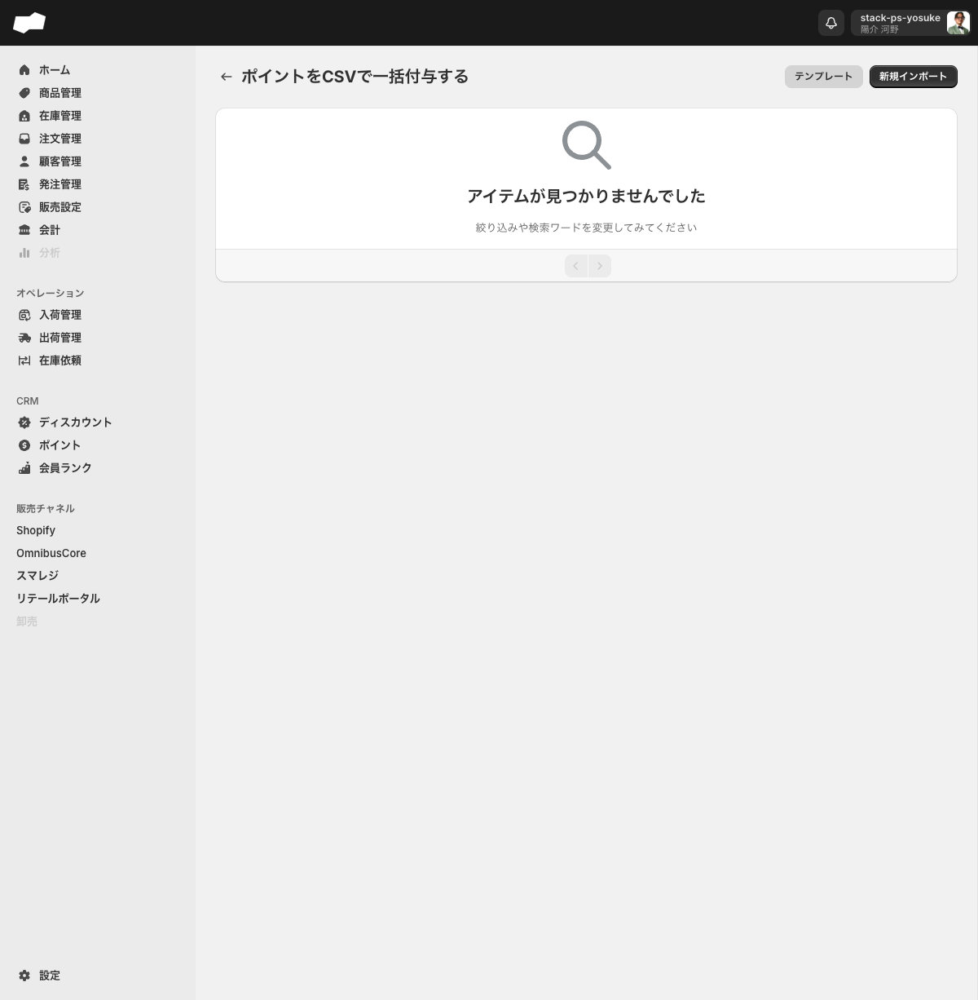
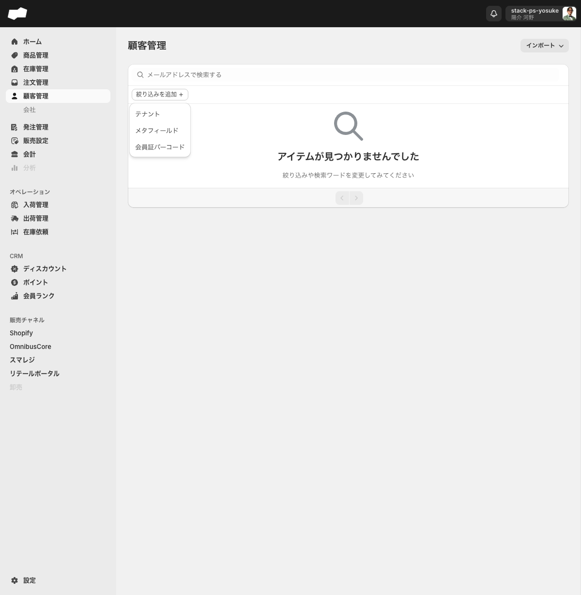
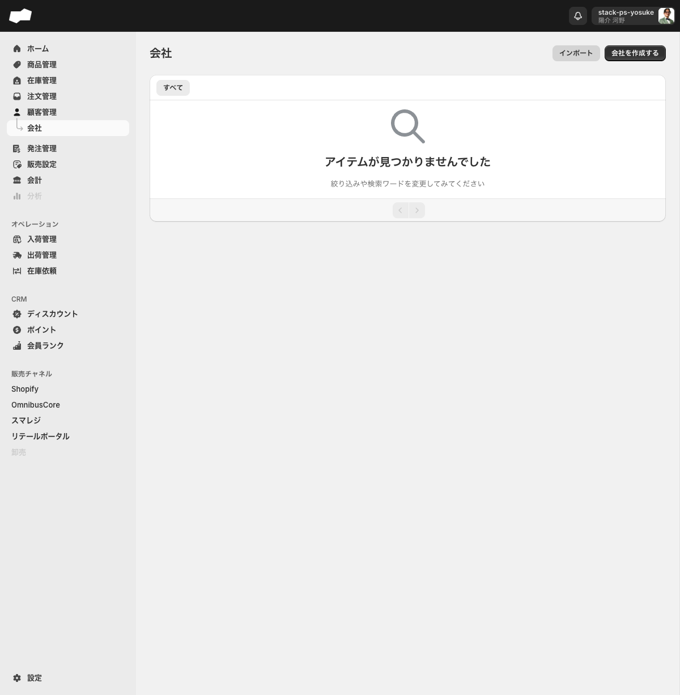
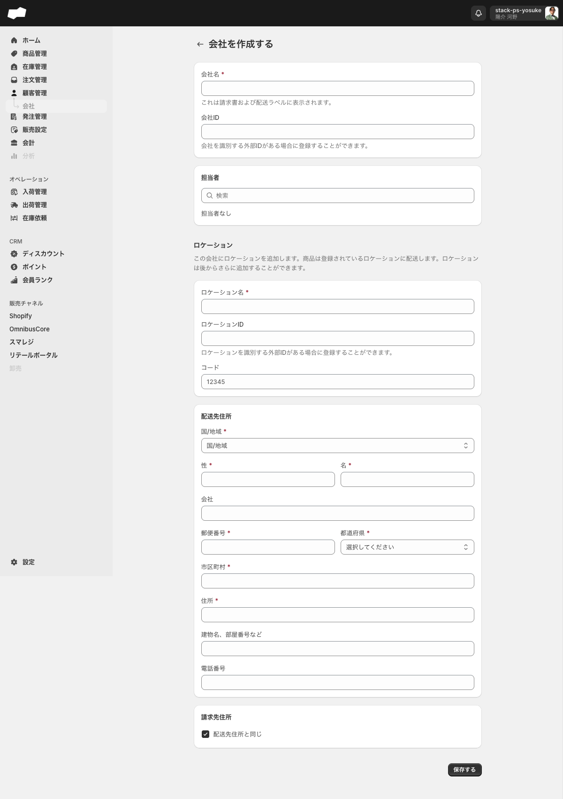
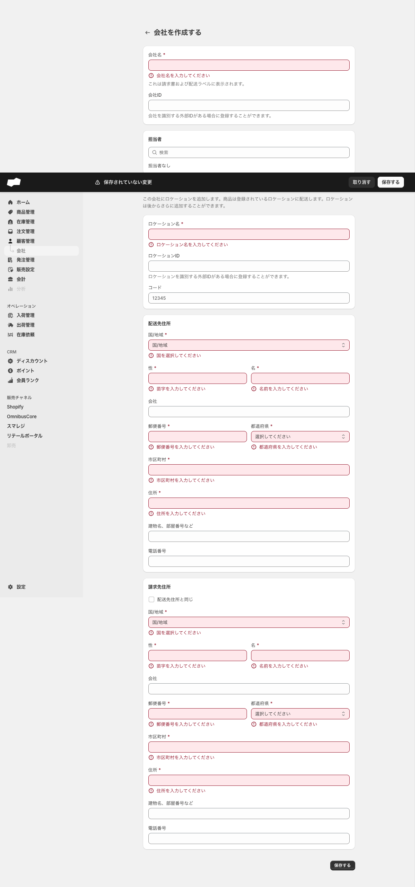
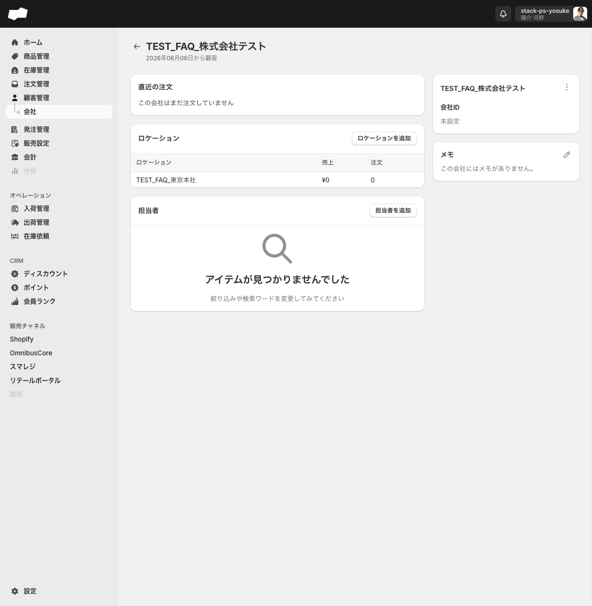
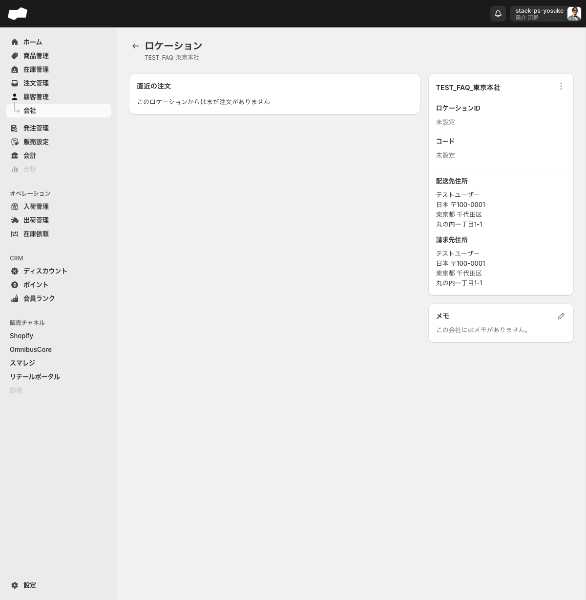
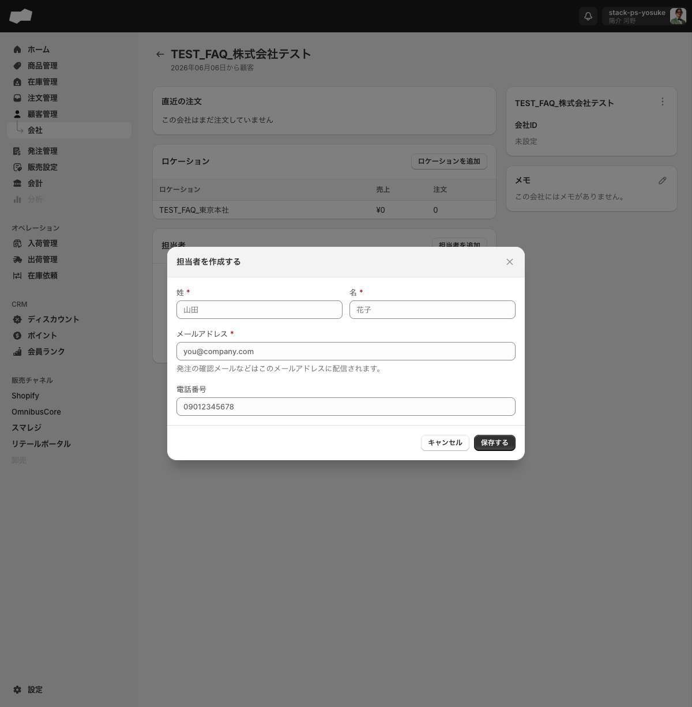
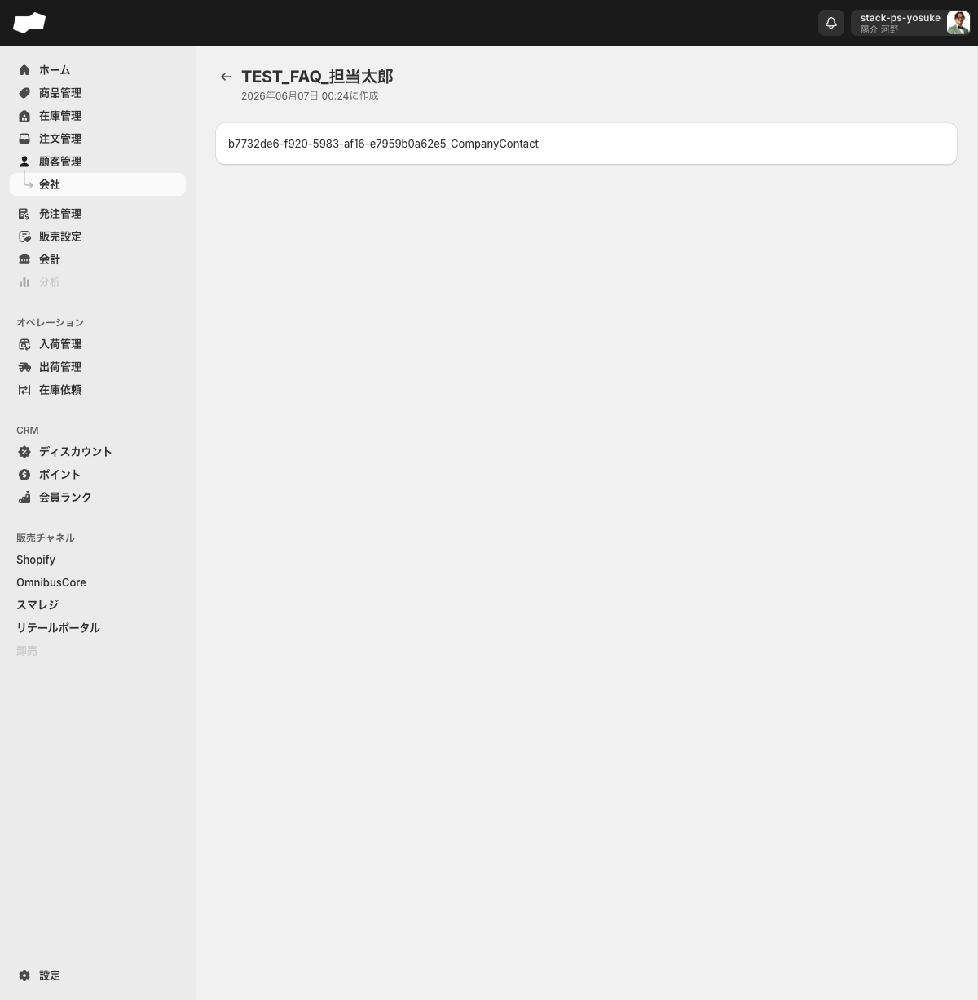
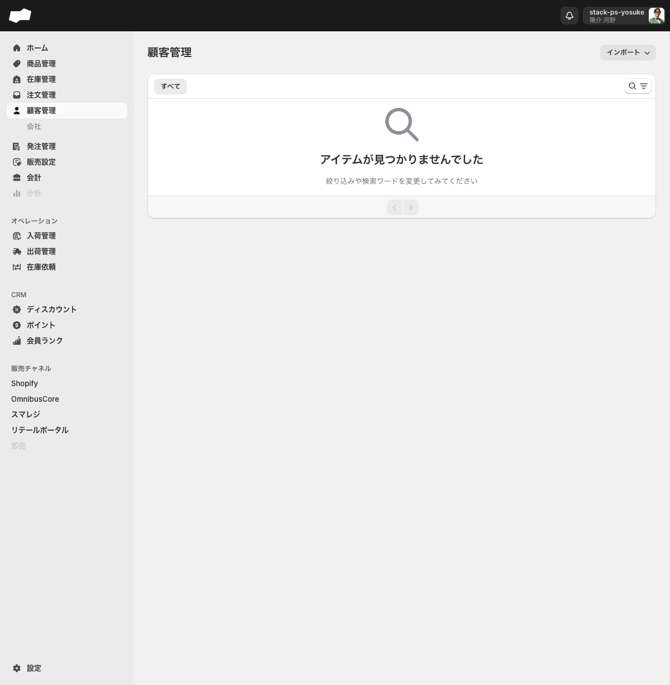

# 16. 顧客・会社

SQでは、購入者（消費者）と取引先企業を別々に管理します。前者を「顧客管理」、後者を「会社」と呼びます。このエリアでは両者の違いと、それぞれに登録できる情報・行える操作を説明します。

> 対象環境: staging（`https://www.sqstackstaging.com/admin`）。実顧客・実注文データがない状態での確認結果に基づきます。

---

## このエリアで学べること

- 「購入顧客（顧客管理）」と「会社担当者」の違いを説明できる
- 顧客管理の一覧でできること（検索・絞り込み・ポイント一括付与）を把握する
- 会社の新規作成からロケーション・担当者の追加までの一連の手順を実行できる
- 会社のロケーションと住所、請求先住所の関係を理解する
- 顧客・会社に関する制約（手動作成の可否、削除UIの有無など）を把握する

---

## 機能概要

| 機能 | 画面URL | できること |
|:--|:--|:--|
| 顧客管理 | `/admin/purchasing_customers` | 購入顧客の一覧表示・メールアドレス検索・絞り込み・ポイント一括付与（CSV） |
| 会社 | `/admin/companies` | 法人顧客（会社）の新規作成・一覧管理・会社ごとのロケーション・担当者管理 |
| 会社作成 | `/admin/companies/create` | 会社情報・最初のロケーション・配送先・請求先住所をまとめて登録 |
| 会社詳細 | `/admin/companies/{id}` | 会社名・メモ編集、ロケーション一覧、担当者一覧、注文履歴の確認 |
| ロケーション追加 | `/admin/companies/{id}/locations/create` | 会社に複数の納品先（ロケーション）を追加 |
| ロケーション詳細 | `/admin/companies/{id}/locations/{location_id}` | ロケーション名・コード・住所・メモの編集、注文履歴の確認 |

### 顧客と会社担当者の違い（重要）

| 項目 | 購入顧客（顧客管理） | 会社担当者（会社） |
|:--|:--|:--|
| 登録元 | 販売チャネル（Shopifyなど）経由で自動登録 | 管理画面の会社詳細から手動作成 |
| 用途 | 一般消費者の購入者データ | 発注確認メールの送付先 |
| 作成ボタン | なし（手動作成不可） | あり（会社詳細の「担当者を追加」） |
| 顧客管理一覧への表示 | される | されない（別データ） |
| ディスカウント対象顧客の候補 | される | されない |

> 会社詳細で担当者を作成しても、顧客管理（`/admin/purchasing_customers`）の顧客一覧には表示されません。両者は別のエンティティです。

---

## 画面・項目の説明

### 顧客管理 一覧（`/admin/purchasing_customers`）

2026-06-19時点のstagingでは顧客一覧は0件です。空状態では「アイテムが見つかりませんでした」「絞り込みや検索ワードを変更してみてください」と表示されます。

#### タブ

| タブ名 | 表示対象 |
|:--|:--|
| すべて | 全顧客 |

#### 主な操作要素

| 要素（UIラベル） | 種別 | 動作 |
|:--|:--|:--|
| インポート | ドロップダウンボタン | 「ポイント一括付与」のリンクを含むドロップダウンを展開 |
| ポイント一括付与 | リンク（インポート内） | `/admin/csv_import/csv_import_operation_point_pluses`（ポイント一括付与CSV）へ遷移 |
| 検索と絞り込みの結果 | ボタン | 「メールアドレスで検索する」欄と「絞り込みを追加」ボタンを展開 |
| メールアドレスで検索する | テキストボックス | メールアドレスで顧客を絞り込み |
| 絞り込みを追加 | ドロップダウンボタン | 絞り込み条件メニューを展開 |
| 前へ／次へ | ページネーション | 前後ページへ移動 |

#### 絞り込み条件（「絞り込みを追加」の選択肢）

| 選択肢 | 内容 |
|:--|:--|
| テナント | テナントで絞り込み |
| メタフィールド | メタフィールドの値で絞り込み |
| 会員証バーコード | 会員証バーコードで絞り込み（2026-06-04 追加） |

> 顧客データが入った状態でのテーブル列構成は未確認です。<!-- TODO: 要確認（顧客データ存在時の一覧テーブル列） -->

---

### 会社 一覧（`/admin/companies`）

#### タブ

| タブ名 | 表示対象 |
|:--|:--|
| すべて | 全会社 |

#### テーブル列

| 列名 | 内容 |
|:--|:--|
| （チェックボックス） | アイテムを選択（一括選択用） |
| 会社 | 会社名 |
| ロケーション | 登録ロケーション数（例：「1箇所のロケーション」） |
| 総注文数 | 注文件数（例：「0個の注文」） |
| 販売合計 | 累計金額（例：「¥0」） |
| 作成日 | 登録日時（例：「2026年06月06日 17:39」） |

行全体をクリックすると会社詳細画面へ遷移します。

#### 主な操作要素

| 要素（UIラベル） | 種別 | 動作 |
|:--|:--|:--|
| インポート | ボタン | クリックしても反応なし（未実装） |
| 会社を作成する | リンクボタン | `/admin/companies/create` へ遷移 |
| 前へ／次へ | ページネーション | 前後ページへ移動 |

---

### 会社作成フォーム（`/admin/companies/create`）

#### 会社情報

| 項目（UIラベル） | 必須 | 補足 |
|:--|:--|:--|
| 会社名 | 必須（*） | 請求書・配送ラベルに表示 |
| 会社ID | 任意 | 外部IDがある場合に登録 |
| 担当者 | 任意 | 検索テキストボックスで顧客を紐付け |

#### ロケーション（配送先）

| 項目（UIラベル） | 必須 | 補足 |
|:--|:--|:--|
| ロケーション名 | 必須（*） | 例：「東京本社」 |
| ロケーションID | 任意 | 外部IDがある場合に登録 |
| コード | 任意 | プレースホルダー: 12345 |

#### 配送先住所

| 項目（UIラベル） | 必須 | バリデーションエラー文言 |
|:--|:--|:--|
| 国/地域 | 必須（*） | 国を選択してください |
| 性 | 必須（*） | 苗字を入力してください |
| 名 | 必須（*） | 名前を入力してください |
| 会社 | 任意 | — |
| 郵便番号 | 必須（*） | 郵便番号を入力してください |
| 都道府県 | 必須（*） | 都道府県を入力してください |
| 市区町村 | 必須（*） | 市区町村を入力してください |
| 住所 | 必須（*） | 住所を入力してください |
| 建物名、部屋番号など | 任意 | — |
| 電話番号 | 任意 | — |

#### 請求先住所

「配送先住所と同じ」チェックボックスがあり、デフォルトでチェック済みです。チェックを外すと配送先住所と同一の項目が展開され、個別入力できます。

---

### 会社詳細画面（`/admin/companies/{id}`）

#### ページヘッダー

- 会社名が大見出しで表示
- 「2026年XX月XX日から顧客」（作成日）がサブテキストとして表示

#### 左カラム（メインコンテンツ）

| セクション | 内容 |
|:--|:--|
| 直近の注文 | 注文一覧。注文がない場合は「この会社はまだ注文していません」と表示 |
| ロケーション | 登録済みロケーションのテーブル（ロケーション名 / 売上 / 注文）。「ロケーションを追加」ボタンあり |
| 担当者 | 登録済み担当者のテーブル（名前 / メールアドレス）。「担当者を追加」ボタンあり |

#### 右サイドバー

| セクション | 内容 |
|:--|:--|
| 会社名 | テキスト表示。編集ボタン（ペンアイコン）で変更可 |
| 会社ID | 外部ID。未設定時は「未設定」 |
| メモ | 会社に関するメモ。編集ボタンで変更可 |

---

### ロケーション追加（`/admin/companies/{id}/locations/create`）

会社詳細の「ロケーションを追加」ボタンから遷移します。入力項目は会社作成フォームのロケーション・配送先住所セクションと同一です。

| 項目（UIラベル） | 必須 | 補足 |
|:--|:--|:--|
| ロケーション名 | 必須（*） | 「注文のロケーションを特定するために使用します。例：ミッドタウン」 |
| ロケーションID | 任意 | 「会社のロケーションを識別する外部IDがある場合に登録することができます。」 |
| コード | 任意 | プレースホルダー: 12345 |

続いて「配送先住所」と「請求先住所」（デフォルトで配送先と同じ）を入力します。

---

### ロケーション詳細画面（`/admin/companies/{id}/locations/{location_id}`)

#### 左カラム

| セクション | 内容 |
|:--|:--|
| 直近の注文 | 注文がない場合は「このロケーションからはまだ注文がありません」と表示 |

#### 右サイドバー

| セクション | 内容 |
|:--|:--|
| ロケーション名 | 編集ボタン（ペンアイコン）で変更可 |
| ロケーションID | 外部ID。未設定時は「未設定」 |
| コード | 未設定時は「未設定」 |
| 配送先住所 | 登録済みの住所を表示 |
| 請求先住所 | 配送先と同一の場合は同じ内容を表示 |
| メモ | 編集ボタンで変更可 |

---

### 担当者を作成するダイアログ

会社詳細の「担当者を追加」ボタンを押すとダイアログが開きます。

| 項目（UIラベル） | 必須 | プレースホルダー |
|:--|:--|:--|
| 姓 | 必須（*） | 山田 |
| 名 | 必須（*） | 花子 |
| メールアドレス | 必須（*） | you@company.com |
| 電話番号 | 任意 | 09012345678 |

> 「発注の確認メールなどはこのメールアドレスに配信されます。」

ダイアログのボタンは「キャンセル」と「保存する」です。

---

## 主な操作手順

### 会社を新規作成する

1. 左メニューから「会社」（`/admin/companies`）を開く
2. 右上の「会社を作成する」ボタンを押す（`/admin/companies/create` へ遷移）
3. 「会社情報」に会社名（必須）・会社ID（任意）を入力する
4. 「ロケーション」にロケーション名（必須）・ロケーションID（任意）・コード（任意）を入力する
5. 「配送先住所」に国/地域・性・名・郵便番号・都道府県・市区町村・住所（いずれも必須）を入力する
6. 請求先住所が配送先と同じ場合は「配送先住所と同じ」チェックを入れたままにする（異なる場合はチェックを外して個別入力）
7. 「保存する」を押す

### 会社にロケーション（納品先）を追加する

1. 会社一覧（`/admin/companies`）で対象の会社行をクリックし、会社詳細を開く
2. 「ロケーション」セクションの「ロケーションを追加」ボタンを押す（`/admin/companies/{id}/locations/create` へ遷移）
3. ロケーション名（必須）・ロケーションID（任意）・コード（任意）を入力する
4. 配送先住所・請求先住所を入力する
5. 「保存する」を押す

### 会社に担当者（発注確認メールの宛先）を追加する

1. 会社詳細（`/admin/companies/{id}`）を開く
2. 「担当者」セクションの「担当者を追加」ボタンを押す（ダイアログが開く）
3. 姓（必須）・名（必須）・メールアドレス（必須）・電話番号（任意）を入力する
4. 「保存する」を押す

### 会社名・メモを編集する

1. 会社詳細（`/admin/companies/{id}`）を開く
2. 右サイドバーの「会社名」または「メモ」の右にある編集ボタン（ペンアイコン）を押す
3. 内容を書き換えて保存する

### 顧客をメールアドレスで検索する

1. 左メニューから「顧客管理」（`/admin/purchasing_customers`）を開く
2. 「検索と絞り込みの結果」ボタンを押して検索欄を展開する
3. 「メールアドレスで検索する」テキストボックスにメールアドレスを入力する
4. 検索結果を確認する

### 顧客にポイントを一括付与する

1. 顧客管理（`/admin/purchasing_customers`）を開く
2. 右上の「インポート」ドロップダウンボタンを押す
3. 「ポイント一括付与」を押す（`/admin/csv_import/csv_import_operation_point_pluses` へ遷移）
4. CSVファイルをアップロードし、画面の案内に従ってインポートを実行する

> ポイント一括付与CSVの「実行」は取り消し不可です。実行前に内容を確認してください。

### 担当者を削除する

1. 会社詳細（`/admin/companies/{id}`）の「担当者」セクションで対象の行を選択する
2. 「担当者を削除」を押す
3. 確認ダイアログ「選択されている1件の担当者を削除しますか？」で「担当者を削除する」を押す
4. 対象の担当者行が一覧から消えることを確認する

---

## 注意点・制約

### 顧客管理

| 制約 | 内容 |
|:--|:--|
| 顧客データは手動新規作成不可 | 顧客管理に新規作成ボタンは存在しません。顧客データは販売チャネル（Shopifyなど）経由で流入します。`/admin/purchasing_customers/create` に直接アクセスすると「予期せぬエラーが発生しました」となります |
| 顧客データ自体のCSVインポート不可 | 「インポート」ドロップダウンの選択肢は「ポイント一括付与」のみです。顧客データそのもののCSVインポートはこの画面から行えません |
| 顧客のCSVエクスポートは別画面 | CSVエクスポート専用画面（`/admin/csv_export`）から行います |

### 会社

| 制約 | 内容 |
|:--|:--|
| 会社担当者は購入顧客とは別データ | 会社詳細で担当者を作成しても、顧客管理一覧やディスカウント対象顧客のメール検索には出ません。会社担当者は発注確認メールの宛先です |
| 会社一覧の「インポート」ボタンは無反応（未実装） | クリックしても画面遷移・ダイアログが出ません |
| 会社本体の削除UIは確認できない | 会社一覧の行選択でも会社詳細でも、削除操作は確認できません |
| 会社ロケーションの削除UIは確認できない | 会社ロケーション詳細の三点メニューは「ロケーションを編集」のみで、削除操作はありません |
| 担当者詳細画面は最小構成 | 担当者名・作成日時のみ表示。この画面からの情報編集や詳細確認はできません |

### 共通

| 制約 | 内容 |
|:--|:--|
| ディスカウント対象顧客は購入顧客データが必要 | 顧客0件の環境では「追加する」を押しても追加ダイアログが出ず、会社担当者メールも候補に出ません |
| 「卸売」（`/admin/b2b`）は別機能で未実装 | 会社とは別機能。現在は「TODO」表示のみです |

---

## このエリアの確認状態

| 項目 | 状態 | 根拠 |
|:--|:--|:--|
| 顧客管理 一覧表示・タブ・検索・絞り込み | 確定 | 2026-06-19実機確認（一覧0件だがUI要素は確認） |
| 顧客管理 絞り込み条件（テナント/メタフィールド/会員証バーコード） | 確定 | 2026-06-16実機確認 |
| 顧客管理 ポイント一括付与CSV導線 | 確定 | 2026-06-16実機確認 |
| 顧客管理 手動作成不可 | 確定 | `/admin/purchasing_customers/create` で予期せぬエラー確認 |
| 会社 一覧・タブ・テーブル列 | 確定 | 2026-06-15実機確認 |
| 会社作成フォーム項目・バリデーション | 確定 | 2026-06-15実機確認 |
| 会社詳細画面の構成 | 確定 | 2026-06-15実機確認 |
| ロケーション追加・詳細画面 | 確定 | 2026-06-15実機確認 |
| 担当者ダイアログ・詳細・削除 | 確定 | 2026-06-15実機確認 |
| 会社「インポート」ボタン無反応 | 確定（未実装） | 2026-06-19実機確認 |
| 会社本体・ロケーション削除UIなし | 確定（UIなし） | 2026-06-15実機確認 |
| 顧客データ存在時の一覧テーブル列 | 未確認 | 顧客データ0件のため |
| 顧客詳細画面（注文履歴・ポイント残高・会員ランク） | 未確認 | 顧客データ0件のため |
| チャネル経由の顧客自動登録 | 未確認（連携待ち） | Shopify等の接続が必要 |
| 会社の注文履歴・売上の実データ | 未確認 | 注文データ0件のため |
| 会員証バーコードの実運用挙動 | 未確認 | 実データが必要 |

---

## TODO（未確認・一部確認）

WBS確認状態は「一部確認 連携待ち」です。以下はチャネル連携や実データ前提で要確認の項目です。

### 連携待ち（外部連携前提）

- [ ] Shopify等のチャネル接続後に、購入顧客が自動登録されることの実機確認
- [ ] チャネル連携後の顧客データ流入経路・タイミングの確認
- [ ] 連携顧客のメタフィールド・会員証バーコードの実データ確認

### TODO表示（未実装・未確認）

- [ ] 顧客データ存在時の顧客管理一覧テーブル列構成
- [ ] 顧客詳細画面（注文履歴・ポイント残高・会員ランク表示）
- [ ] 会社一覧の「インポート」ボタンの有効化（現状無反応）
- [ ] 会社本体・会社ロケーションの削除導線（現状UIなし）
- [ ] 担当者詳細画面の追加機能（現状は名前・作成日時のみ）

### 完成寄り（ほぼ確定・残り少なめ）

- [ ] 会社作成〜ロケーション・担当者追加までの基本フローは確定済み。実データでの注文履歴・売上表示のみ残

---

## 次のエリア

→ [17-次エリア名.md](./17-次エリア名.md)
