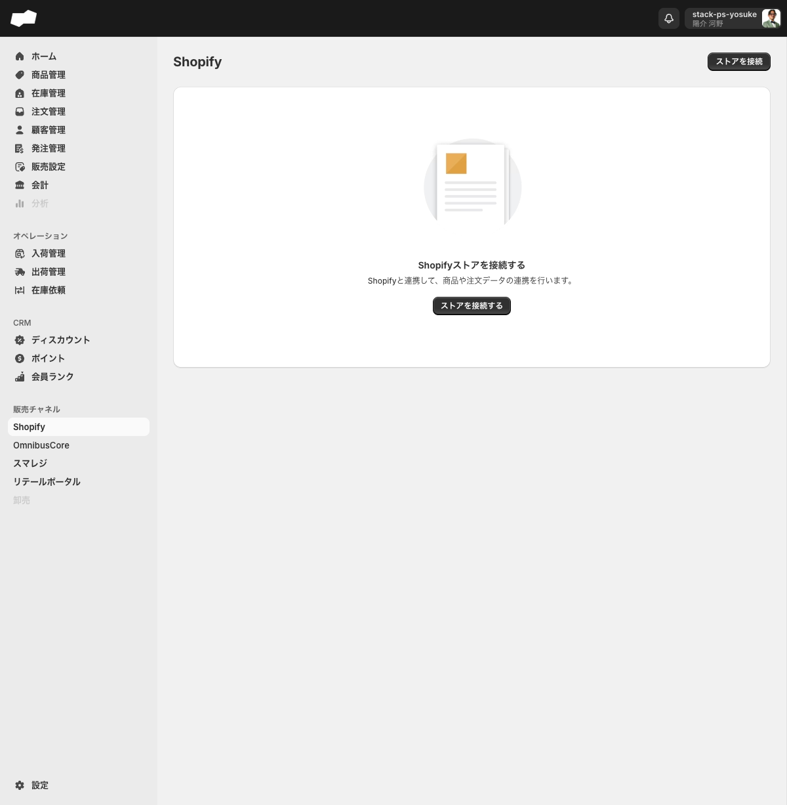
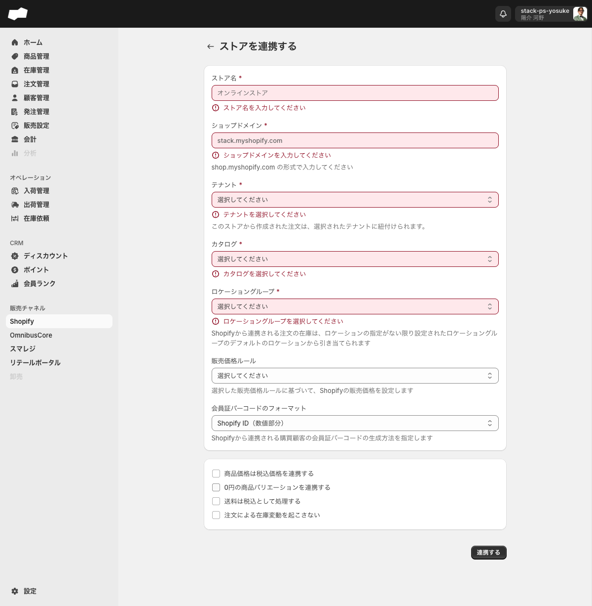
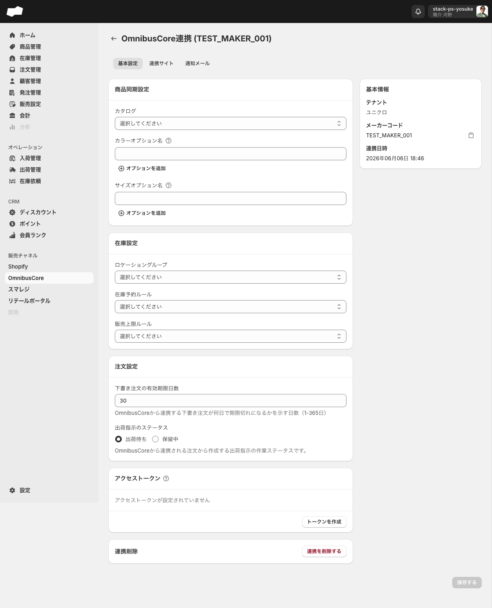
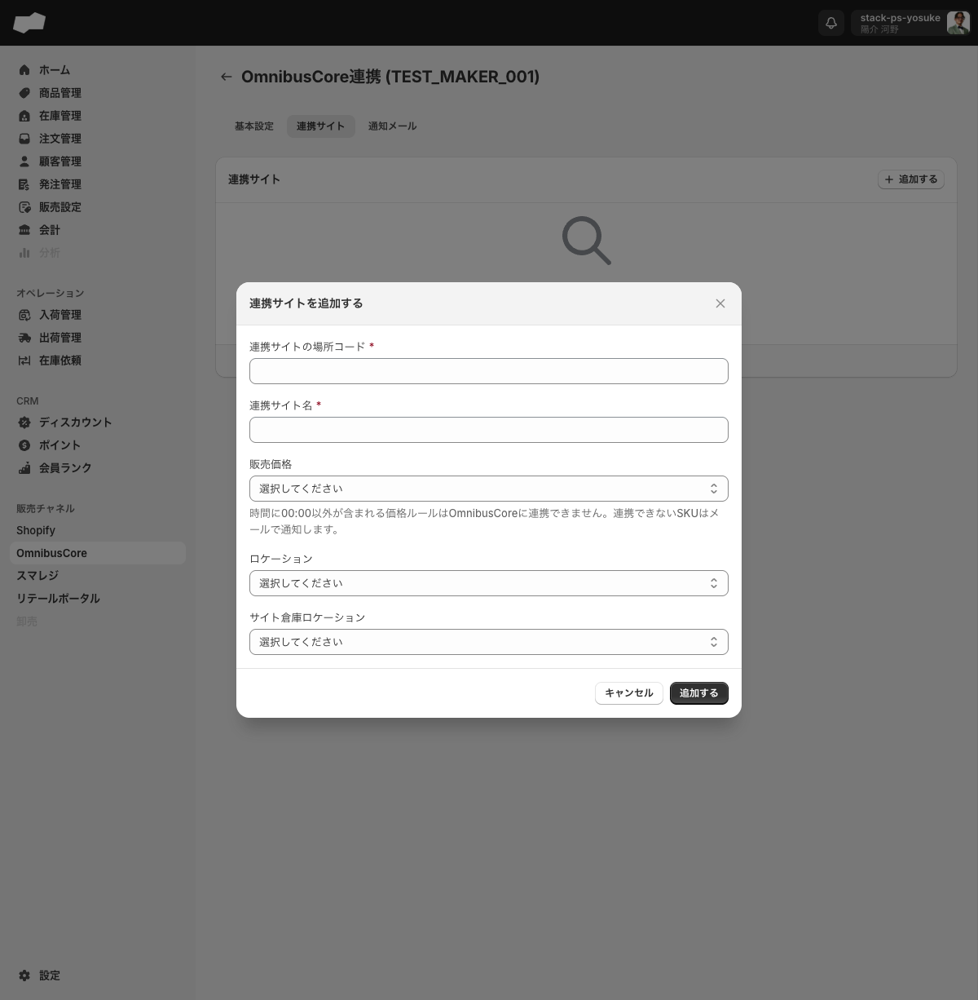
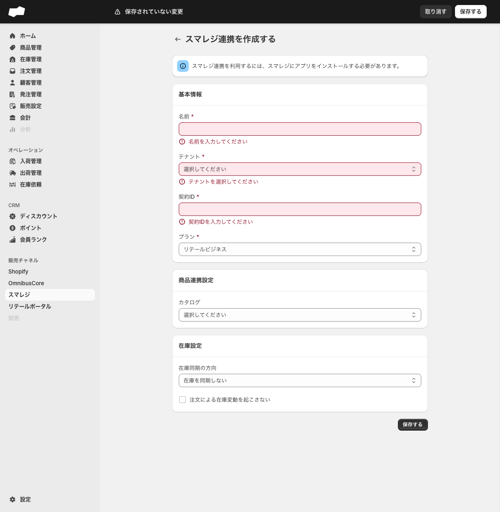

# 19. 標準販売チャネル連携

> このページはWBS-25エリアの第19エリアです。Shopify、OmnibusCore、スマレジという3つの標準販売チャネルをSQに接続し、商品・在庫・注文データを連携する設定を理解するのが目標です。

学習のポイントは **「SQ側で設定すること」** と **「外部サービス側で接続すること」** を明確に分けることです。SQのフォームを埋めるだけでは接続は完了せず、各チャネル（Shopifyストア、スマレジなど）側での事前作業が必須です。

## このエリアで学べること

- 標準販売チャネルとして接続できる3種類（Shopify / OmnibusCore / スマレジ）を説明できる
- どのチャネルでも「SQ内マスタ（テナント・カタログ・ロケーショングループ）の事前準備」が共通の前提であることを理解する
- Shopify接続にはShopifyストア側へのSQコネクターアプリ（SQ Connect）の事前インストールが必要なことを把握する
- スマレジ接続にはスマレジ側でのSQアプリのインストールが必要なことを把握する
- 各接続フォームの必須項目と、空入力時のバリデーションエラー文言を確認できる
- 「SQ側のフォーム入力まで」は実機確認済み、「送信後の接続確立・同期挙動」は連携前提で未確認であることを区別できる

---

## 機能概要

標準販売チャネル連携は、SQと外部の販売チャネルを接続して商品・在庫・注文データを連携する機能群です。左メニューから各チャネルの連携画面にアクセスします。

| チャネル | 連携一覧画面のURL | 主な連携内容 |
|:--|:--|:--|
| Shopify | `/admin/shopify_integrations` | 商品・注文の連携、在庫引当、販売価格設定 |
| OmnibusCore | `/admin/omnibus_core_integrations` | 商品同期、在庫設定、下書き注文連携 |
| スマレジ | `/admin/smaregi_integrations` | 実機見出し「スマレジ連携」。フォームに商品(カタログ)/在庫(同期方向)/注文(在庫変動)の項目あり。「POS」は一般知識 **※公式ガイドは近日連携予定扱い。連携UIは実機に存在** |

> **共通の前提**: 3チャネルいずれも、SQ側の「テナント」が事前に作成済みである必要があります。Shopifyはこれに加えて「カタログ」「ロケーショングループ」も必須です。

> **確認範囲の注記**: 本エリアの実機確認は、staging環境（`sqstackstaging.com`）で **未接続状態** で実施しています。各フォームの入力項目・バリデーションは確認済みですが、送信後のOAuth認証フローや実際の同期挙動（方向・頻度・エラー時の挙動）は未確認です。

---

## 画面・項目の説明

### Shopify連携

#### 接続前の画面（空状態）

> URL: `/admin/shopify_integrations`

Shopifyストアが未接続の場合、次のメッセージが表示されます。

> 「Shopifyストアを接続する / Shopifyと連携して、商品や注文データの連携を行います。」

#### 「ストアを連携する」フォーム

> URL: `/admin/shopify_integrations/create`

| 項目（UIラベル） | 説明 | 必須 | 制約・選択肢 |
|:--|:--|:--|:--|
| ストア名 | SQ内でのストア識別名 | 必須 | テキスト入力 |
| ショップドメイン | ShopifyストアのURL | 必須 | `shop.myshopify.com` の形式 |
| テナント | 連携するSQ内テナント | 必須 | コンボボックス（SQ内マスタから選択） |
| カタログ | 連携する商品カタログ | 必須 | コンボボックス（SQ内マスタから選択） |
| ロケーショングループ | 注文在庫の引当元グループ | 必須 | コンボボックス（SQ内マスタから選択） |
| 販売価格ルール | Shopify側の販売価格算出ルール | 任意 | コンボボックス |
| 会員証バーコードのフォーマット | 購買顧客の会員証バーコード生成方法 | 任意 | 「Shopify ID（数値部分）」（デフォルト）/「JAN-13コード（モジュラス10/ウェイト3方式）」 |
| 商品価格は税込価格を連携する | 商品価格を税込で送るか | 任意 | チェックボックス（デフォルト: オフ） |
| 0円の商品バリエーションを連携する | 0円バリエーションも連携するか | 任意 | チェックボックス（デフォルト: オフ） |
| 送料は税込として処理する | 送料を税込で処理するか | 任意 | チェックボックス（デフォルト: オフ） |
| 注文による在庫変動を起こさない | Shopify経由注文で在庫を変動させないか | 任意 | チェックボックス（デフォルト: オフ） |

**送信ボタン**: 「連携する」

#### バリデーション

| 条件 | エラー文言 |
|:--|:--|
| ストア名が空 | 「ストア名を入力してください」 |
| ショップドメインが空 | 「ショップドメインを入力してください」 |
| テナント未選択 | 「テナントを選択してください」 |
| カタログ未選択 | 「カタログを選択してください」 |
| ロケーショングループ未選択 | 「ロケーショングループを選択してください」 |

---

### OmnibusCore連携

#### 作成フォーム「OmnibusCore連携を作成する」

> URL: `/admin/omnibus_core_integrations/create`

##### 基本情報

| 項目（UIラベル） | 説明 | 必須 | 制約・選択肢 |
|:--|:--|:--|:--|
| テナント | 連携するSQ内テナント | 必須 | コンボボックス（SQ内マスタから選択） |
| メーカーコード | OmnibusCore側のメーカーコード | 必須 | テキスト入力（プレースホルダー「メーカーコードを入力してください」） |

##### 商品同期設定（すべて任意）

| 項目（UIラベル） | 説明 | 制約・選択肢 |
|:--|:--|:--|
| カタログ | 連携する商品カタログ | コンボボックス（SQ内マスタから選択） |
| カラーオプション名 | 商品カラーを示すオプション名 | テキスト入力。「オプションを追加」で複数行追加可能 |
| サイズオプション名 | 商品サイズを示すオプション名 | テキスト入力。「オプションを追加」で複数行追加可能 |

##### 在庫設定（すべて任意）

| 項目（UIラベル） | 説明 | 制約・選択肢 |
|:--|:--|:--|
| ロケーショングループ | 在庫引当に使うロケーショングループ | コンボボックス |
| 在庫予約ルール | 在庫予約時に適用するルール | コンボボックス |
| 販売上限ルール | 販売数の上限制御ルール | コンボボックス |

##### 注文設定

| 項目（UIラベル） | 説明 | 必須 | 制約・選択肢 |
|:--|:--|:--|:--|
| 下書き注文の有効期限日数 | OmnibusCoreから連携された下書き注文が期限切れになるまでの日数 | 必須（作成時） | 数値入力（デフォルト: 30、範囲: 1〜365） |

**送信ボタン**: 「保存する」

#### バリデーション

| 条件 | エラー文言 |
|:--|:--|
| テナント未選択 | 「テナントを選択してください」 |
| メーカーコードが空 | 「メーカーコードを入力してください」 |
| 下書き注文の有効期限日数が範囲外 | 「1から365の間で入力してください」 |

#### 詳細・編集画面（接続済み状態）

> URL: `/admin/omnibus_core_integrations/{id}`

詳細・編集画面は3つのタブで構成されます。

##### タブ1: 基本設定

作成フォームの全セクションに加え、以下の項目があります。

| 項目（UIラベル） | 説明 | 制約・選択肢 |
|:--|:--|:--|
| 出荷指示のステータス | OmnibusCore注文から作成する出荷指示の作業ステータス | ラジオボタン。「出荷待ち」（デフォルト）/「保留中」 |
| アクセストークン | OmnibusCoreとのAPI連携に使用するトークン | 「トークンを作成」ボタンで生成 |

##### タブ2: 連携サイト

「追加する」ボタンから「連携サイトを追加する」ダイアログを開きます。

| 項目（UIラベル） | 説明 | 必須 | 制約・選択肢 |
|:--|:--|:--|:--|
| 連携サイトの場所コード | サイトを識別する場所コード | 必須 | テキスト入力 |
| 連携サイト名 | サイトの表示名 | 必須 | テキスト入力 |
| 販売価格 | サイトに適用する販売価格ルール | 任意 | コンボボックス |
| ロケーション | 会社に紐づくロケーション | 任意 | コンボボックス |
| サイト倉庫ロケーション | サイトに割り当てる倉庫ロケーション | 任意 | コンボボックス |

##### タブ3: 通知メール

| 項目（UIラベル） | 説明 | 必須 | 制約・選択肢 |
|:--|:--|:--|:--|
| 名前 | 通知先の名前 | 必須 | テキスト入力 |
| メールアドレス | 通知先のメールアドレス | 必須 | テキスト入力（プレースホルダー「you@company.com」）。重複登録不可 |

---

### スマレジ連携

> **実機と公式ガイドの差**: **SQアプリの連携UIは実機に存在し、フォーム入力が可能**（契約ID・プラン・在庫同期方向等）です。一方で公式ガイド（[docs.sqstack.com](https://docs.sqstack.com/docs/guide/app-integrations)）では「近日連携予定（Coming Soon）」扱いとなっています。本項は実機で確認できたフォームの事実を記載していますが、接続確立後の実際の同期挙動はstaging未接続のため未確認です。

#### 作成フォーム「スマレジ連携を作成する」

> URL: `/admin/smaregi_integrations/create`

画面上部に次のバナーが表示されます。

> 「スマレジ連携を利用するには、スマレジにアプリをインストールする必要があります。」

##### 基本情報

| 項目（UIラベル） | 説明 | 必須 | 制約・選択肢 |
|:--|:--|:--|:--|
| 名前 | SQ内でのスマレジ連携の識別名 | 必須 | テキスト入力 |
| テナント | 連携するSQ内テナント | 必須 | コンボボックス（SQ内マスタから選択） |
| 契約ID | スマレジの契約ID | 必須 | テキスト入力 |
| プラン | スマレジの契約プラン | 必須 | コンボボックス。「スタンダード」/「プレミアム」/「プレミアムプラス」/「フードビジネス」/「リテールビジネス」（デフォルト: リテールビジネス） |

##### 商品連携設定（任意）

| 項目（UIラベル） | 説明 | 制約・選択肢 |
|:--|:--|:--|
| カタログ | 連携する商品カタログ | コンボボックス |

##### 在庫設定（任意）

| 項目（UIラベル） | 説明 | 制約・選択肢 |
|:--|:--|:--|
| 在庫同期の方向 | 在庫をどちらからどちらへ同期するか | コンボボックス。「スマレジからSQへ在庫を同期する」（デフォルト）/「SQからスマレジへ在庫を同期する」/「在庫を同期しない」 |
| 注文による在庫変動を起こさない | スマレジ経由注文で在庫を変動させないか | チェックボックス（デフォルト: オフ） |

**送信ボタン**: 「保存する」

#### バリデーション

| 条件 | エラー文言 |
|:--|:--|
| 名前が空 | 「名前を入力してください」 |
| テナント未選択 | 「テナントを選択してください」 |
| 契約IDが空 | 「契約IDを入力してください」 |

---

## 主な操作手順

### 共通の事前準備（SQ側マスタ）

1. 左メニュー「設定」>「テナント」で、連携先となるテナントが存在することを確認する。未作成の場合は先に作成する。
2. Shopifyの場合は「設定」>「ロケーショングループ」と「商品」>「カタログ」も事前に作成しておく。

### Shopifyを接続する

> **前提**: 事前にShopifyストア側へSQコネクターアプリ（SQ Connect）をインストールしておく必要があります。アプリ未インストールのまま「連携する」を実行すると「エラーが発生しました。しばらくしてから再度お試しください」というエラーになります。

1. 左メニューの「Shopify」をクリックし、`/admin/shopify_integrations` を開く。
2. 「ストアを接続する」ボタン（またはリンク）をクリックする。「ストアを連携する」フォーム（`/admin/shopify_integrations/create`）が開く。
3. ストア名・ショップドメイン（`〇〇.myshopify.com` 形式）を入力する。
4. テナント・カタログ・ロケーショングループをコンボボックスから選択する。
5. 必要に応じてオプション設定（販売価格ルール・会員証バーコードのフォーマット・各チェックボックス）を指定する。
6. 「連携する」ボタンをクリックする。

<!-- TODO: 要確認（「連携する」押下後のOAuth認証フロー・遷移先画面は未接続環境のため未確認） -->

### OmnibusCoreを接続する

1. 左メニューの「OmnibusCore」をクリックし、`/admin/omnibus_core_integrations` を開く。
2. 「追加する」ボタンをクリックする。「OmnibusCore連携を作成する」フォーム（`/admin/omnibus_core_integrations/create`）が開く。
3. テナント・メーカーコードを入力する。
4. 必要に応じて商品同期設定（カタログ・カラーオプション名・サイズオプション名）を指定する。
5. 必要に応じて在庫設定（ロケーショングループ・在庫予約ルール・販売上限ルール）を指定する。
6. 下書き注文の有効期限日数（1〜365、デフォルト30）を入力する。
7. 「保存する」ボタンをクリックする。

<!-- TODO: 要確認（「保存する」押下後の接続確立・同期開始の挙動は未接続環境のため未確認） -->

#### 接続後の追加設定（OmnibusCore）

接続が完了すると詳細・編集画面（`/admin/omnibus_core_integrations/{id}`）で追加設定ができます。

| タブ | 操作 |
|:--|:--|
| 基本設定 | 出荷指示のステータス変更、アクセストークン作成 |
| 連携サイト | 「追加する」から「連携サイトを追加する」ダイアログで場所コード・サイト名・販売価格・ロケーション・倉庫ロケーションを登録 |
| 通知メール | 「追加する」から「通知メールを追加する」ダイアログで名前・メールアドレスを登録（重複不可） |

### スマレジを接続する

> **前提**: スマレジ側でSQ連携アプリのインストールが必要です（フォーム上部バナー「スマレジ連携を利用するには、スマレジにアプリをインストールする必要があります。」）。手順はスマレジ側のドキュメントを参照してください。

1. 左メニューの「スマレジ」をクリックし、`/admin/smaregi_integrations` を開く。
2. 「追加する」ボタンをクリックする。「スマレジ連携を作成する」フォーム（`/admin/smaregi_integrations/create`）が開く。
3. 名前・テナント・契約ID・プランを入力・選択する。
4. 必要に応じてカタログを選択する。
5. 在庫同期の方向（3択）と「注文による在庫変動を起こさない」を指定する。
6. 「保存する」ボタンをクリックする。

<!-- TODO: 要確認（「保存する」押下後の接続確立・同期開始の挙動は未接続環境のため未確認） -->

---

## 注意点・制約

### Shopify連携

| 項目 | 内容 |
|:--|:--|
| コネクターアプリの事前インストール必須 | Shopifyストア側にSQ Connectが未インストールの場合、SQ側の「連携する」実行時にエラーになる（実機確認済み） |
| 本番用アプリはstagingに接続不可 | 公開アプリ「SQ Connect」は本番SQ（`sq.stackservice.com`）専用。staging（`sqstackstaging.com`）へは別途staging向けアプリとインストールリンクが必要（実機確認済み） |
| SQ内マスタの事前準備 | テナント・カタログ・ロケーショングループは接続前にSQ内で作成済みである必要がある |
| Shopify Flow連携 | SQはShopify Flowのトリガー7種・アクション6種を提供（[公式ガイド](https://docs.sqstack.com/docs/guide/shopify-integration/shopifyflow)）。商品タグ/価格更新・ポイント失効前・会員ランク変動等でワークフローを自動化。詳細は [Shopify連携](../01-by-feature/Shopify連携.md) の「Shopify Flow連携」節 |

### OmnibusCore連携

| 項目 | 内容 |
|:--|:--|
| 連携サイトの販売価格ルールの制限 | 適用時刻が00:00（深夜0時）のみの価格ルールのみ設定可能。00:00以外の時刻を含むルールは連携不可（連携できないSKUはメールで通知される）。フォームのヒント文言に明記 |
| 通知メールの重複不可 | 同一メールアドレスの重複登録はできない。ヒント文言に「メールアドレスは重複して登録できません」と明記 |
| オプション名の空行 | カラーオプション名・サイズオプション名は空行で保存してもエラーにならず、保存後に空行は自動除去される |
| 未保存変更のダイアログ | フォーム編集中に別ページへ移動しようとすると「保存されていない変更」ダイアログが表示される |

### スマレジ連携

| 項目 | 内容 |
|:--|:--|
| スマレジ側アプリの事前インストール必須 | フォーム上部バナーに「スマレジ連携を利用するには、スマレジにアプリをインストールする必要があります」と明記。具体的なインストール手順はフォーム内に記載がないためスマレジ側ドキュメントを参照 |
| プランのデフォルト | 「リテールビジネス」がデフォルト選択済み。プランを変更してもフォーム項目構成は変わらない |
| 在庫同期の方向 | 方向を変更してもフォーム項目構成は変わらない（条件付き表示なし） |

---

## このエリアの確認状態

| 項目 | 確認状態 | 根拠 |
|:--|:--|:--|
| Shopify接続前の空状態画面 | 確定 | 実機確認（2026-06-16） |
| Shopify接続フォームの入力項目 | 確定 | 実機確認 |
| Shopify必須項目のバリデーション | 確定 | 実機確認 |
| Shopify未インストール時のエラー | 確定 | 実機確認（SHOPIFY-CONNECT-ATTEMPT） |
| Shopify本番用アプリのstaging接続不可 | 確定 | 実機確認 |
| Shopify「連携する」押下後のOAuth認証フロー | 未確認 | 未接続環境のため |
| Shopify接続後の同期挙動・接続済み画面 | 未確認 | 未接続環境のため |
| OmnibusCore作成フォームの入力項目 | 確定 | 実機確認（2026-06-10） |
| OmnibusCore必須項目・範囲のバリデーション | 確定 | 実機確認 |
| OmnibusCore詳細・編集画面の3タブ構成 | 確定 | 実機確認 |
| OmnibusCore連携サイト・通知メールダイアログ | 確定 | 実機確認 |
| OmnibusCore接続後の同期挙動 | 未確認 | 未接続環境のため |
| OmnibusCore「トークンを作成」押下後の動作 | 未確認 | 未確認 |
| スマレジ作成フォームの入力項目 | 確定 | 実機確認（2026-06-10） |
| スマレジ必須項目のバリデーション | 確定 | 実機確認 |
| スマレジ側アプリインストールの具体的導線 | 未確認 | フォーム内に手順記載なし |
| スマレジ接続後の詳細・編集画面 | 未確認 | 未接続環境のため |
| スマレジ接続後の同期挙動 | 未確認 | 未接続環境のため |

---

## TODO（未確認・一部確認）

WBS確認状態は「連携待ち」です。外部チャネルとの実際の接続が前提となる項目は未確認です。

- [ ] Shopify「連携する」押下後のOAuth認証フロー・遷移先画面
- [ ] Shopify接続後の実際の同期挙動（方向・頻度・エラー時の挙動）
- [ ] Shopify接続済み状態のダッシュボード・同期ログ・切断操作画面
- [ ] OmnibusCore接続後の実際の同期挙動（方向・頻度・エラー時の挙動）
- [ ] OmnibusCore「トークンを作成」ボタン押下後の動作
- [ ] OmnibusCore下書き注文の有効期限切れ時の挙動（自動キャンセル・在庫解放・通知）
- [ ] OmnibusCore詳細・編集画面で「下書き注文の有効期限日数」を空欄で保存した場合のサーバー側バリデーション
- [ ] スマレジ側のアプリインストール手順・導線
- [ ] スマレジ接続済み状態の詳細・編集画面の構成
- [ ] スマレジ接続後の実際の同期挙動（方向・頻度・エラー時の挙動）
- [ ] 各チャネル共通: 接続実行後の挙動（OAuth・同期開始・接続完了後の画面）

---

## 次のエリア

→ [20-次エリア名.md](20-次エリア名.md)
