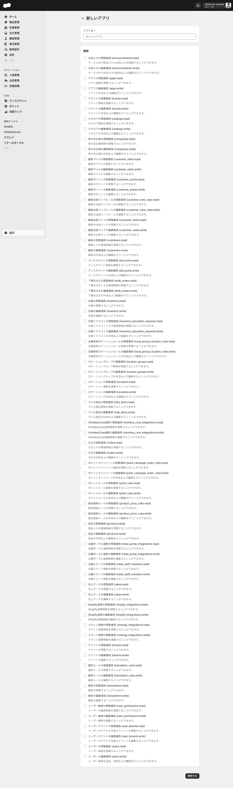

# 22. API/Webhook・開発者連携

> このページはWBS-25エリアの第22エリアです。外部のシステム（自社アプリ・BIツール・連携サービスなど）がSQのデータを読み書きするための「入口」を理解するのが目標です。設定画面の「アプリ」を起点に、Admin API・Storefront API・Webhook・リクエストログを取り扱います。

## このエリアで学べること

- SQが外部システムに提供するAPI（Admin API / Storefront API）の違いと用途を説明できる
- 設定>アプリで「アプリ」を作ると何が発行され、何に使えるのか把握できる
- アクセストークン・シークレット・Storefrontトークン・Webhookという各要素の役割が分かる
- Webhookで受け取れるイベントの種類と、設定すべき項目が分かる
- 「Playgroundを開く」「リクエストログを見る」といった検証・監査手段があることを知っている

---

## 機能概要

### API/Webhook・開発者連携とは

SQの管理画面で入力したデータ（商品・注文・在庫・顧客など）は、外部のプログラムからも読み書きできます。このための入口として、SQは以下を提供しています。

- **Admin API**: 管理機能（商品・注文・在庫などの読み書き）を操作するためのAPI（GraphQL）
- **Storefront API**: ストアフロント（顧客向け画面）側で商品やカートを扱うためのAPI
- **Webhook**: SQ側でイベント（注文の作成・在庫の更新など）が起きたときに、外部のURLへ通知を送る仕組み

これらを使うには、まず設定画面で **アプリ** という単位を作成します。アプリはAPIを呼ぶための「権限（スコープ）」「アクセストークン」「シークレット」をまとめて管理する入れ物です。

### 対象画面

| 画面 | URL | 役割 |
|:--|:--|:--|
| アプリ 一覧 | `/admin/settings/apps` | APIアクセスを管理するアプリの一覧表示・管理 |
| アプリ 作成 | `/admin/settings/apps/create` | 新しいアプリ（APIキー群）の作成 |
| アプリ 詳細 | `/admin/settings/apps/{id}` | アクセストークン・Webhook・リクエストログ等の確認・設定 |

> 設定画面（`/admin/settings`）の「外部連携グループ」配下に「アプリ」があります。画面の説明文（UIの原文）は「APIアクセスを管理する / アプリを作成して、SQのアドミンAPIにアクセスしましょう。」です。

### 何ができるか

- アプリを作成すると、**Admin API用のアクセストークンとシークレットが自動発行**される
- アプリごとに付与する権限（スコープ）を **76種の権限**から個別に選択できる
- 同じアプリ画面から **Storefront APIのトークン発行**と **Webhookの作成**ができる
- 「Playgroundを開く」で GraphQL Playground 上でAPIを試せる
- 「リクエストログを見る」で、そのアプリによるAPIリクエストの履歴を確認できる

---

## 画面・項目の説明

### アプリ作成フォーム

フォームのパス: `/admin/settings/apps/create`

| 項目（UIの原文） | 必須 | 補足 |
|:--|:--|:--|
| アプリ名 * | 必須 | テキストボックス（プレースホルダー: 「モバイルアプリ」） |
| 権限（チェックボックス群） | — | 76権限から付与するスコープを個別に選択。各権限には説明文が付いている（例: 「商品情報を閲覧することができます。」） |

### アプリ詳細画面（保存後）

アプリを作成すると詳細画面に遷移し、以下のセクションが表示されます。

#### Admin API

作成と同時にアクセストークンとシークレットが自動発行されます。

| 項目 | 内容 |
|:--|:--|
| アクセストークン | Admin APIへの接続に使用するトークン（自動発行） |
| シークレット | Webhookのリクエスト検証等に使用するシークレット（自動発行） |

#### 検証方法（Playground）

「**Playgroundを開く**」ボタンから GraphQL Playground を開いてAdmin APIを試すことができます。

#### リクエストログ

「**リクエストログを見る**」からこのアプリによるAPIリクエストの履歴を確認できます。

#### Storefront API

「**トークンを発行する**」ボタンからStorefront API用のトークンを発行できます。

#### Webhook

「**Webhookを作成する**」ボタンからWebhookを追加できます。

**Webhook作成ダイアログの入力項目:**

| 項目（UIの原文） | 説明 | 選択肢・補足 |
|:--|:--|:--|
| イベント | Webhookを送信するトリガーとなるイベント | 「注文の作成」 / 「注文の更新」 / 「在庫の更新」の3種 |
| エンドポイント | Webhookの送信先URL | URLを入力する |

---

## 主な操作手順

### アプリを作成してAdmin APIのアクセストークンを取得する

1. 管理画面で `/admin/settings/apps` を開く（設定 > 外部連携グループ > アプリ）
2. 「**アプリを作成する**」リンクをクリックし、作成フォーム（`/admin/settings/apps/create`）を開く
3. 「アプリ名」に任意の名前を入力する（例: 社内BI連携用）
4. 「権限」のチェックボックス群から、このアプリに必要な権限（スコープ）をオンにする
5. 保存する
6. アプリ詳細画面に遷移する。「Admin API」セクションの **アクセストークン** と **シークレット** を控える

### Admin APIを Playground で試す

1. アプリ詳細画面を開く
2. 「**Playgroundを開く**」ボタンをクリックする
3. 開いた GraphQL Playground 上でクエリを入力し、Admin APIを試す

### Storefront APIのトークンを発行する

1. アプリ詳細画面を開く
2. 「Storefront API」セクションの「**トークンを発行する**」ボタンをクリックする
3. 発行されたStorefront APIトークンを控える

### Webhookを設定する

1. アプリ詳細画面を開く
2. 「**Webhookを作成する**」ボタンをクリックし、Webhook作成ダイアログを開く
3. 「イベント」でトリガーを選ぶ（「注文の作成」 / 「注文の更新」 / 「在庫の更新」）
4. 「エンドポイント」に通知先のURLを入力する
5. 作成を完了する

### APIのリクエスト履歴を確認する

1. アプリ詳細画面を開く
2. 「**リクエストログを見る**」をクリックする
3. このアプリによるAPIリクエストの履歴を確認する

---

## 注意点・制約

- アプリの **アクセストークンとシークレットは作成時に自動発行** されます。再発行の操作については実機未確認です。<!-- TODO: 要確認（アクセストークン・シークレットの再発行操作） -->
- アプリに付与できる権限は、権限グループと同じ **38リソース × 閲覧（:read）/ 編集（:write）の76種** です。必要最小限のスコープを付与してください。
- Webhookのイベントは「注文の作成」「注文の更新」「在庫の更新」の3種のみ実機確認済みです。<!-- TODO: 要確認（その他イベントの有無） -->
- Webhookの送信時にシークレットを使ったリクエスト検証ができることが UI 上示唆されていますが、具体的な検証アルゴリズム・署名ヘッダ名は実機未確認です。<!-- TODO: 要確認（Webhook署名の検証方式） -->
- Shopify等の外部連携（コネクターアプリ経由）は別経路であり、本エリアで扱う「アプリ（Admin API / Storefront API / Webhook）」とは別物です。連携の前提は [外部連携のよくある質問](../03-faq/外部連携のよくある質問.md) を参照してください。
- API直接操作（GraphQLの実行結果・レスポンススキーマなど）は読み取り・書き込みを含むため、本プロジェクトでは管理画面の表示・操作のみを「実機確認」としています。

---

## このエリアの確認状態

| 項目 | 状態 | 備考 |
|:--|:--|:--|
| アプリ一覧画面（`/admin/settings/apps`） | 確定 | UIラベル・説明文・配置を確認 |
| アプリ作成フォーム | 確定 | 「アプリ名」「権限」の2項目を確認 |
| アクセストークン自動発行 | 確定 | 作成時に自動発行されることを確認 |
| シークレット自動発行 | 確定 | Webhook検証等に使用（用途はUI記載） |
| Playgroundを開く | 確定 | ボタンから GraphQL Playground が開くことを確認 |
| リクエストログを見る | 確定 | ボタンの存在・遷移先を確認 |
| Storefront API トークン発行 | 確定 | 「トークンを発行する」ボタンを確認 |
| Webhook 作成 | 確定 | ダイアログ・入力項目（イベント3種・エンドポイント）を確認 |
| アクセストークン/シークレットの再発行 | 未確認 | 操作の有無を未確認 |
| Webhookのその他イベント | 未確認 | 3種以外の有無を未確認 |
| Webhook署名の検証方式 | 未確認 | 具体的な検証アルゴリズムを未確認 |
| APIの実行結果・レスポンススキーマ | 未確認 | API直接操作は確認対象外 |

---

## TODO（未確認・一部確認）

「完成寄り」のエリアです。画面構成・主な項目・操作ボタンは実機で確定していますが、API実行に絡む詳細仕様が残っています。

- [ ] アクセストークン・シークレットの **再発行操作** の有無・手順
- [ ] Webhookで受け取れるイベントが「注文の作成 / 注文の更新 / 在庫の更新」**以外にあるか**
- [ ] Webhook送信時の **リクエスト検証（署名）の具体的な方式**・ヘッダ名
- [ ] 「リクエストログ」に表示される **項目・保持期間** の詳細
- [ ] Storefront API で **できることの範囲**（商品取得・カート操作など）
- [ ] Playground で **認証トークンがどう渡されるか**（連携待ち: GraphQL Playground 上での実行検証）
- [ ] GraphQL APIの **スキーマ・クエリ例**（連携待ち: API直接操作の検証が必要）

---

## 次のエリア

→ [23. 会計・売上実績・分析](23-会計・売上実績・分析.md)
