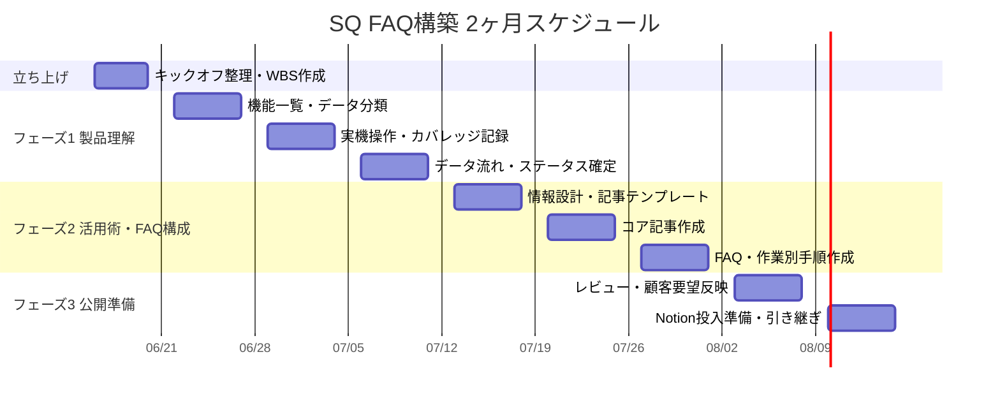

# SQ FAQ構築 2ヶ月ガイドライン

- 作成日: 2026-06-16
- 対象期間: 2026-06-16（火）〜 2026-08-14（金）
- 目的: SQの標準機能を理解し、顧客と社内メンバーが自力で課題解決できるFAQ/ヘルプセンターの土台を作る
- 前提: AI利用を前提にしない。担当者が管理画面を実際に操作し、事実確認・整理・執筆・レビューを行う

## 基本方針

2026-06-12のキックオフで決まった通り、最初からFAQ記事を量産しない。まずSQを構造として理解し、機能・データ・依存関係・実測ステータスを整理してからFAQ化する。

| 方針 | 実行内容 |
|:--|:--|
| 製品理解を先に固める | 機能、データ、ステータス、外部連携、未実装範囲を整理する |
| 操作方法だけで終わらせない | 「いつ使うか」「何を先に設定するか」「何に影響するか」を書く |
| 標準機能と個別開発を分ける | SQ標準機能として説明できるものと、顧客別連携ロジックを混ぜない |
| 実測状態を明記する | 確認済み、外部連携待ち、実データ待ち、未実装、不具合を分ける |
| 顧客と社内オンボーディングの両方に使える形にする | 通読用の完全ガイド、検索用FAQ、作業別手順を分けて作る |

## 2ヶ月のゴール

| 成果物 | 2ヶ月後の到達状態 |
|:--|:--|
| SQ完全ガイド | 初学者が通読して全体像、データ構造、主要業務フローを理解できる |
| 実測学習ガイド | 操作済み/未確認/外部連携待ちが明確に分かる |
| データ事典 | 設定マスタ、商品、在庫、注文、CRM、ステータスの関係が整理されている |
| 機能別ページ | 主要機能の画面、項目、制約、使いどころが整理されている |
| 作業別ページ | 顧客がやりたい作業から手順にたどり着ける |
| FAQページ | よくある質問、つまずき、エラー、制約に対する回答がまとまっている |
| サポートデスク資料 | 問い合わせ時に見る症状、制約、ステータス、エラーが一覧化されている |
| 公開準備 | Notion等へ投入できる構成、リンク、画像、残課題が整理されている |

## ガントチャート

| 週 | 期間 | フェーズ | 主作業 | 成果物 | レビュー観点 |
|:--|:--|:--|:--|:--|:--|
| W0 | 6/16〜6/19 | 立ち上げ | キックオフ内容整理、WBS作成、既存資料棚卸し | 2ヶ月ガイドライン、対象範囲、進捗管理表 | 方針がStack側の期待と合っているか |
| W1 | 6/22〜6/26 | フェーズ1: 製品理解 | SQ全体構造、機能一覧、データ分類、標準/個別の切り分け | 機能マップ、データマップ、用語リスト | 抜けている大分類がないか |
| W2 | 6/29〜7/3 | フェーズ1: 実機確認 | 管理画面を一通り操作し、確認済み/未確認/不可を記録 | 操作カバレッジ表、未確認リスト、画面別メモ | 「どこまで触ったか」が見えるか |
| W3 | 7/6〜7/10 | フェーズ1: データ/ステータス確定 | 在庫、注文、顧客、CRM、CSV、外部連携のデータ流れを整理 | データ事典、ステータス一覧、制約一覧 | データの流れと前提条件が説明できるか |
| W4 | 7/13〜7/17 | フェーズ2: 情報設計 | 読者、記事分類、記事テンプレート、優先順位を決める | 情報設計案、記事テンプレート、FAQ優先リスト | 顧客が探しやすい構成か |
| W5 | 7/20〜7/24 | フェーズ2: コア記事作成 | はじめに、完全ガイド、セットアップ、データ事典を整える | 通読用資料一式 | 初学者が1から理解できるか |
| W6 | 7/27〜7/31 | フェーズ2: FAQ/作業別作成 | 機能別、作業別、よくある質問、サポート系資料を増補 | FAQ群、作業別手順、症状/エラー一覧 | 操作手順だけでなく使いどころが書けているか |
| W7 | 8/3〜8/7 | フェーズ3: レビュー/補正 | Stackレビュー、顧客要望リスト反映、矛盾修正 | レビュー反映版、残課題リスト | 実務者目線で不足がないか |
| W8 | 8/10〜8/14 | フェーズ3: 公開準備 | Notion投入準備、リンク/画像/表記チェック、引き継ぎ | 公開候補版、運用ルール、次月バックログ | 公開できる品質か、未確認が明示されているか |

## Mermaid版ガント

## 週ごとの詳細WBS

### W0: 2026-06-16〜2026-06-19

| タスク | 完了条件 |
|:--|:--|
| キックオフ議事録を読み、決定事項を整理する | 方針、フェーズ、残インプットが1ページにまとまっている |
| 2ヶ月ガイドラインを作成する | 週単位の計画、成果物、レビュー観点がある |
| 既存FAQ/調査資料を棚卸しする | どの資料が入口、根拠、公開候補か分かる |
| 初回レビュー用の論点を整理する | Stack側に確認したい質問が10個以内に整理されている |

### W1: 2026-06-22〜2026-06-26

| タスク | 完了条件 |
|:--|:--|
| SQの機能一覧を大分類/中分類で整理する | 商品、在庫、注文、顧客、CRM、販売設定、連携、設定に分かれている |
| データ一覧を整理する | 主要データ、作成元、参照先、削除/変更可否が分かる |
| 標準機能と個別連携を切り分ける | FAQに入れる範囲と個別運用資料に逃がす範囲が分かる |
| 用語リストを作る | 初学者が混同しやすい言葉が整理されている |

### W2: 2026-06-29〜2026-07-03

| タスク | 完了条件 |
|:--|:--|
| 主要画面を一通り開いて操作する | 画面ごとに確認済み/未確認/外部連携待ちが付いている |
| ボタン、メニュー、保存、削除、CSV、モーダルを確認する | 重要操作の挙動が記録されている |
| 未実装/不具合/外部連携不足を分類する | 顧客に説明できる制約表になっている |
| スクリーンショットと根拠メモを整理する | 後から記事に戻れる根拠がある |

### W3: 2026-07-06〜2026-07-10

| タスク | 完了条件 |
|:--|:--|
| 在庫のデータ流れを整理する | 調整、取置、移動、出荷、入荷で在庫区分がどう動くか説明できる |
| 注文/顧客/会計の流れを整理する | チャネル流入前提と実データ不足の範囲が明確 |
| CRMのルール関係を整理する | ディスカウント、ポイント、会員ランクの前提と影響が分かる |
| CSV/PDFの入口と出口を整理する | インポート/エクスポート対象、履歴、不可逆操作が分かる |

### W4: 2026-07-13〜2026-07-17

| タスク | 完了条件 |
|:--|:--|
| 読者別の入口を決める | 初学者、運営者、管理者、CS担当の導線がある |
| 記事分類を確定する | はじめに、機能別、作業別、FAQ別、サポート資料の役割が明確 |
| 記事テンプレートを整える | 目的、前提、手順、注意、関連リンクが統一されている |
| FAQ優先順位を決める | 顧客要望、実務頻度、事故リスクで並べられている |

### W5: 2026-07-20〜2026-07-24

| タスク | 完了条件 |
|:--|:--|
| SQ完全ガイドを通読資料として整える | 1から順番に読める構成になっている |
| セットアップガイドを整える | 何をどの順番で設定するか分かる |
| データ事典を整える | データ、ステータス、前提、影響が説明できる |
| 図解・相関図を補強する | テキストだけでは分かりにくい関係が図で追える |

### W6: 2026-07-27〜2026-07-31

| タスク | 完了条件 |
|:--|:--|
| 機能別ページを整える | 主要画面の項目、制約、使いどころがそろっている |
| 作業別ページを整える | ユーザーの目的から操作手順にたどり着ける |
| FAQを増補する | つまずき、エラー、状態、未確認範囲がQ&Aで探せる |
| サポートデスク資料を整える | 症状、制約、エラー、ステータスが一覧で見られる |

### W7: 2026-08-03〜2026-08-07

| タスク | 完了条件 |
|:--|:--|
| Stackレビューを受ける | 指摘、未確認、追加要望が一覧化されている |
| 顧客別要望リストを反映する | 標準FAQに入れるものと個別資料に分けるものが決まる |
| 矛盾・重複を修正する | 完全ガイド、FAQ、データ事典で表現が揃っている |
| 事故リスクの高い操作を再確認する | 不可逆操作、削除、CSV実行、出荷/入荷実績の注意が明確 |

### W8: 2026-08-10〜2026-08-14

| タスク | 完了条件 |
|:--|:--|
| Notion投入前チェックを行う | 見出し、表、画像、リンク、関連ページが確認済み |
| 公開候補版をまとめる | 顧客に見せる範囲と社内用の範囲が分かれている |
| 未確認/外部連携待ちリストを残す | 次フェーズで検証すべきことが明確 |
| 運用ルールを作る | 更新日、確認者、実機確認ルール、問い合わせ反映手順が決まっている |

## レビューのリズム

| 頻度 | 内容 | 参加者 |
|:--|:--|:--|
| 毎週1回 | 進捗、理解のズレ、未確認、次週タスクを確認 | 河野、Stack担当者、必要に応じてCS/現場担当 |
| フェーズ終わり | 成果物レビューと次フェーズ移行判断 | 河野、Stack担当者 |
| 公開前 | 顧客に出してよい表現か、個別開発情報が混ざっていないか確認 | Stack担当者、CS/現場担当 |

## フェーズ移行の判定基準

| 移行 | 判定基準 |
|:--|:--|
| フェーズ1完了 | SQの主要機能、主要データ、依存関係、確認済み/未確認が説明できる |
| フェーズ2開始 | 記事分類、読者、テンプレート、優先順位が決まっている |
| フェーズ2完了 | 通読用資料、機能別、作業別、FAQ、サポート資料の初版がある |
| フェーズ3完了 | 公開候補版、未確認リスト、運用ルール、次フェーズバックログがある |

## 進捗管理で使うステータス

| ステータス | 意味 |
|:--|:--|
| 未着手 | まだ調査・執筆していない |
| 調査中 | 管理画面や既存資料を確認中 |
| 実測済み | 管理画面で操作または表示確認済み |
| 外部連携待ち | Shopify、スマレジ、WMSなど接続環境がないと確認できない |
| 実データ待ち | 注文、顧客、返品、売上などの実データがないと確認できない |
| 未実装/不具合 | 画面はあるが動かない、またはエラーになる |
| 初稿済み | 記事として読める状態 |
| レビュー中 | Stack側確認中 |
| 反映済み | レビュー指摘を反映済み |
| 公開候補 | Notion投入または顧客共有できる候補 |

## リスクと対応

| リスク | 影響 | 対応 |
|:--|:--|:--|
| Shopify認証情報・正式連携SKUの準備が遅れる | SQ→Shopifyの商品/在庫/価格送信、正式連携SKUでの出荷/返品、CRM/ポイント適用が確認できない | Shopify→SQの注文・顧客・返金・キャンセル受信は確認済みとして切り出し、残りを認証情報待ち/正式SKU再検証として明記する |
| 顧客別要望リストが遅れる | FAQの優先順位が実問い合わせとズレる | 先に製品構造ベースで作り、要望リスト到着後にW7で反映する |
| stagingに開発中画面が混ざる | 未実装を仕様と誤認する | 未実装/不具合/外部連携不足を必ず分類する |
| 操作手順だけの記事になる | 顧客が「いつ使うか」を判断できない | 各記事に目的、前提、使いどころ、影響範囲を入れる |
| 標準機能と個別開発が混ざる | 顧客ごとに違う挙動を標準FAQとして出してしまう | 標準FAQと顧客別運用資料を分ける |

## 最終チェックリスト

| 項目 | チェック |
|:--|:--|
| SQの全体像を初学者に説明できる | |
| 商品、SKU、ロケーション、テナント、カタログの関係を説明できる | |
| 在庫区分と在庫が動く操作を説明できる | |
| 取り寄せ販売の流れを最初から最後まで説明できる | |
| 顧客、会社、会社担当者の違いを説明できる | |
| CRMのルール関係を説明できる | |
| CSVインポート/エクスポートの対象と不可逆操作を説明できる | |
| 外部連携が必要な未確認範囲を説明できる | |
| 標準機能と顧客別個別連携を分けて説明できる | |
| 顧客が検索するFAQと、社内オンボーディング用の通読資料が分かれている | |
| Notion投入前にリンク、画像、表、見出しを確認した | |
