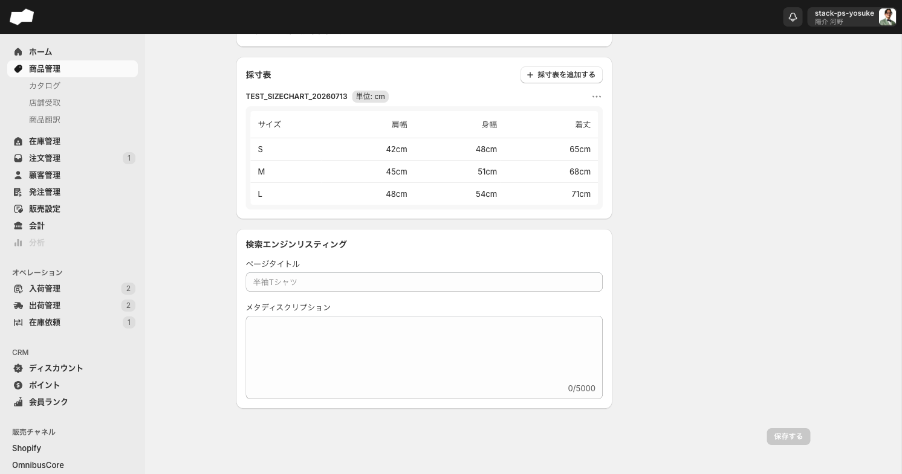
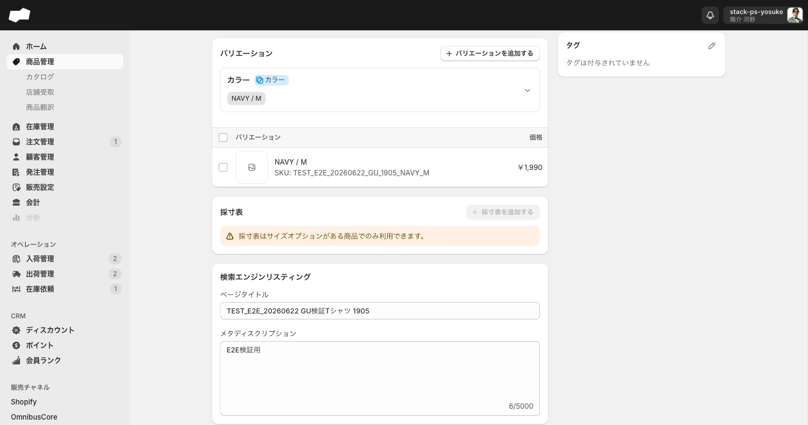

# 採寸（サイズ表）実機検証 2026-07-13

7/3以降のStack社レビュー会で「採寸ルールが商品詳細のサイズ表カードから商品に紐づけられるようになった」と説明された件を実機で深掘りした一次記録。**旧10-採寸.mdの「商品紐づけUIなし」記述が覆る重要な更新**。

- 検証者ロール: 管理者（stack-ps-yosuke）
- 作成テストデータ: 採寸ルール `TEST_SIZECHART_20260713`（cm・3項目）、`TEST_SIZECHART_UNITNONE_20260713`（単位なし・2項目）、商品 `TEST_SIZECHART_サイズ表検証_20260713`（サイズS/M/L）
- スクショ: `screenshots/sizechart-03〜05*.png`

---

## 1. 採寸ルールマスタのURL・仕様変更

| 項目 | 旧（〜2026-07-02） | 現在（2026-07-13実測） |
|:--|:--|:--|
| URL | `/admin/settings/product_measurement_rules` | **`/admin/product_measurement_rules`**（settings配下から移動。旧URLは「このページは存在しないようです」） |
| メニュー階層 | 設定 > 採寸定義 | **販売設定 > 採寸定義**（`/admin/product_price_rules` のサブメニュー群。翻訳言語も同様に移動） |
| 一覧の列見出し | 「ルール名」 | **「定義名」** |
| 採寸項目の上限 | 5件（5件目でボタン非表示） | **10件**（`最大10件まで追加できます` と明示。10件目でボタンが `aria-disabled=true`） |
| 採寸単位 | なし / センチメートル | 変わらず2択（`なし`（デフォルト）/ `センチメートル`） |
| 詳細画面の編集/削除 | readonly・導線なし | **変わらず**。定義名・単位・項目はreadonly、詳細画面に編集/削除ボタンなし |

→ 会議での「最終的に10件」は**既に実装済み**。旧資料の「現行5件/予定10件」は「現行10件」に更新する。

## 2. 【最重要】商品詳細に「採寸表」カードが新設された

商品詳細（`/admin/products/{id}`）のバリエーションセクションの下に **「採寸表」カード** が常設された。旧資料「採寸ルールの商品紐づけは管理画面上にない」は**誤り（機能追加により解消）**。

### サイズオプションがある商品

- カード右上に **「採寸表を追加する」** ボタン
- 押すと「採寸表を追加する」ダイアログ → **採寸ルールをセレクトボックスから選択** → 「追加する」
- 追加すると、**採寸ルールの採寸項目が列、商品のサイズオプション値が行**の表が生成される
  - 例: cmルール（肩幅/身幅/着丈）× 商品サイズ（S/M/L）→ 3列×3行の空表（各セル `-`）
- カード見出しに **`<定義名> 単位: cm`**（単位なしルールなら `単位: なし`）
- 初期は全セル `-`

### サイズオプションがない商品（カラーのみ等）

- **カードは表示されるが機能ロック**。「採寸表を追加する」ボタンの下に
  **「採寸表はサイズオプションがある商品でのみ利用できます。」** と表示され、ボタンを押してもダイアログが開かない
- → 会議の「サイズオプションが必要」の正確な裏取り。カード自体は全商品に出るが、**種別=サイズのオプションが登録されていないと使えない**

## 3. 採寸値の入力（採寸値を編集する）

- カード見出しの右の **「…」メニュー** に **「採寸値を編集する」「採寸表を削除する」** の2項目
- 「採寸値を編集する」→ ダイアログ「`<定義名>の採寸値を編集する`」。行=サイズ、列=採寸項目のグリッド入力欄（3サイズ×3項目=9セル）
- **入力欄は自由テキスト**（type=text）。数値バリデーションなし。実測で `free` / `ABC` などの文字列もそのまま保存できた
- 保存すると:
  - **cm単位のルールは各値に `cm` が自動付与**されて表示（例: 入力`42` → 表示`42cm`）
  - **単位なしルールは単位なしでそのまま表示**（例: 入力`70` → 表示`70`）
  - 未入力セルは `-`

## 4. 複数採寸表・重複防止・削除

- **1商品に複数の採寸表を追加できる**（cmルールと別ルールを両方追加でき、カードが縦に並ぶ）
- **同じ採寸ルールは重複追加できない**: 追加済みのルールは「採寸表を追加する」ダイアログのセレクト選択肢から消える
- 削除: 「…」>「採寸表を削除する」→ 確認ダイアログ
  **「採寸表を削除しますか？ `<定義名>`の採寸表を削除します。入力済みの採寸値も削除します。この処理は巻き戻すことができません。」**（キャンセル / 削除する）
- 削除するとカードから消え、他の採寸表は残る

## 5. 商品作成フォームでのサイズオプション登録

商品作成（`/admin/products/create`）のバリエーションで:
- **オプション名**（テキスト）＋ **種別**（セレクト: `サイズ` / `カラー` / `その他`）＋ **オプション値**（値＋コード）
- 種別に **「サイズ」** を選んだオプションを登録することが、採寸表機能の前提
- 「別のオプションを追加する」で複数オプション（サイズ＋カラー等）も可能

## 6. 10-採寸.md へ反映すべき差分サマリ

| # | 反映内容 |
|:--|:--|
| a | URL変更（`/admin/product_measurement_rules`）とメニュー階層（販売設定配下） |
| b | 採寸項目上限は**10件**（実装済み。旧「5件/予定10件」を訂正） |
| c | 一覧列見出しは「定義名」 |
| d | **商品詳細の採寸表カードで商品に紐づけできる**（旧「紐づけUIなし」を全面訂正） |
| e | サイズオプション必須（無い商品は「サイズオプションがある商品でのみ利用できます」でロック） |
| f | 採寸値は自由テキスト、cm単位ルールは値に`cm`自動付与、単位なしは無単位表示 |
| g | 複数採寸表可・同一ルール重複不可・採寸表削除（巻き戻し不可） |
| h | 採寸ルールマスタ自体の詳細画面は依然readonly・編集/削除導線なし（値の入力は商品側で行う） |

## 7. 残課題

- [ ] 採寸表がストアフロント（Shopify等チャネル）へどう出力/連携されるか（未接続・要確認）
- [ ] 採寸ルールマスタ側の編集/削除は依然不可。商品に紐づけ済みのルールをマスタから消せるか（導線なし。API/開発元確認）
- [ ] 採寸値の数値以外入力（`ABC`等）が許容される仕様が意図的か（バリデーション予定の有無は開発元確認）
- [ ] サイズオプション値の並び順と採寸表の行順の対応（S/M/L以外の並びでの挙動）

## 残置テストデータ

- 採寸ルール: `TEST_SIZECHART_20260713`（cm）、`TEST_SIZECHART_UNITNONE_20260713`（単位なし）
- 商品: `TEST_SIZECHART_サイズ表検証_20260713`（下書き・採寸表1枚 cm 42/48/65…入力済み）
