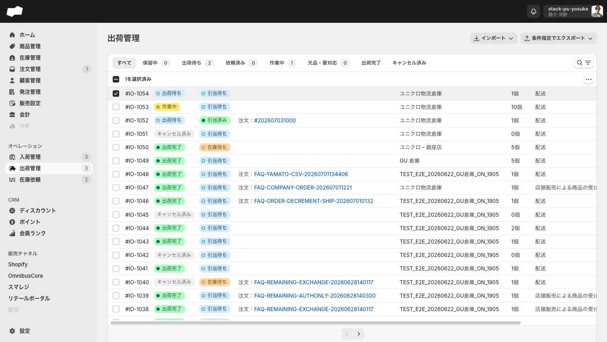
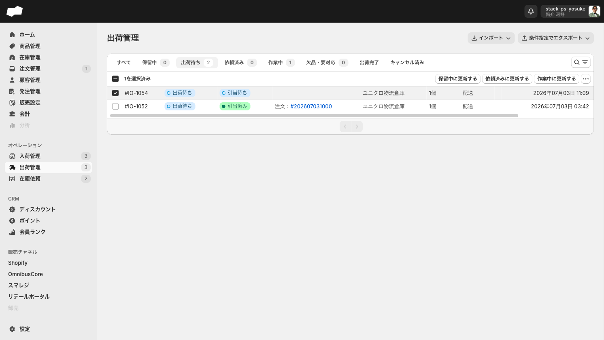

# 出荷管理・入荷管理 ステータス遷移マトリクス実機検証 2026-07-03

移動伝票から自動生成される出荷指示・入荷指示について、一覧のタブ別チェックボックス→一括ステータス変更の全パターンと、各遷移が (1)次に選べるステータス (2)親の移動伝票の操作可否 (3)在庫9区分 (4)詳細画面のボタン活性 に与える影響を実測する一次記録。

- 検証日: 2026-07-03（JST）
- 検証SKU: バギーカーブジーンズ BLUE/36 `487973-64-36`（InventoryItem `c7892d64-...`）
- 経路: ユニクロ物流倉庫（配送元）→ GU 倉庫（配送先）、数量1
- この記録は検証を進めながら逐次追記する

## 検証伝票

| 伝票 | 出荷指示 | 入荷指示 | 用途 |
|:--|:--|:--|:--|
| #IM-1042 | #IO-1054 | #II-1045 | A: 出荷側フォワードパス（順方向の全遷移） |

## 在庫ベースライン（伝票A作成直前）

| ロケーション | 販売可能 | 引当済み | 取置中 | 手持ち | 積送中 | 入荷予定 |
|:--|--:|--:|--:|--:|--:|--:|
| ユニクロ物流倉庫（元） | 86 | 1 | 10 | 97 | 0 | 0 |
| GU 倉庫（先） | 25 | 0 | 0 | 25 | 0 | 0 |

## 発見1: 移動伝票の作成（出荷待ち）だけで在庫が動く

伝票A（#IM-1042、数量1）を保存した直後:

| ロケーション | 変化 |
|:--|:--|
| ユニクロ物流倉庫（元） | 販売可能 86→**85**（−1）、取置中 10→**11**（+1）。手持ち97不変 |
| GU 倉庫（先） | 入荷予定 0→**+1** |

→ 移動伝票は「出荷待ち」の時点で配送元の販売可能を**取置中**に振り替えて確保し、配送先に**入荷予定**を立てる。

## 発見2: 親移動伝票（出荷待ち時点）の操作

- ステータス表示: `情報 未完了 / 出荷待ち`
- `その他の操作` メニュー: **キャンセル**（出荷待ちではキャンセル可）
- 明細テーブルに **商品を削除** ボタンあり、`参照` で明細追加も可能（=出荷待ち中は明細編集可）
- 関連リンク: 出荷指示 #IO-1054 / 入荷指示 #II-1045

## 発見3: 出荷管理のタブ構成が変わっている（キャンセル済みタブ新設）

2026-07-03時点の出荷管理タブ: **すべて / 保留中 / 出荷待ち / 依頼済み / 作業中 / 欠品・要対応 / 出荷完了 / キャンセル済み** の8タブ。
2026-06-27記録「キャンセル専用タブは一覧に存在しない」は旧UI。現在は `?tab=cancelled` の**キャンセル済みタブが存在**する。

## 発見4: 一括ステータス変更ボタンはタブ（=現ステータス）ごとに決まる

行チェック時の一括バー構成。「…」（aria-label: その他の操作）は全タブ共通で `エクスポート > ヤマトB2クラウド（CSV） / 納品書（PDF）`。





| タブ | チェックボックス | 一括ステータス変更ボタン |
|:--|:--|:--|
| すべて | あり | **なし**（「…」のみ。「1を選択済み」表示は出る） |
| 出荷待ち | あり | **保留中に更新する / 依頼済みに更新する / 作業中に更新する** |
| 作業中 | あり | **欠品・要対応に更新する** のみ |
| 出荷完了 | あり | なし |
| キャンセル済み | あり | なし |
| 保留中 / 依頼済み / 欠品・要対応 | （検証時0件） | 伝票Aのウォークで後述 |

- どのタブにも「出荷完了に更新する」「キャンセル」の一括ボタンは**ない**（出荷完了は出荷実績登録、キャンセルは伝票詳細から）。
- 「すべて」タブではステータス変更が一切出ないため、更新するには対象ステータスのタブに切り替える必要がある（ユーザー指摘どおり）。

## 状態ウォーク（伝票A: #IO-1054 / 親 #IM-1042）

一括更新の確認ダイアログは全遷移共通で「出荷指示を◯◯ステータスに更新する / 選択されている◯件の出荷指示のステータスを◯◯に更新します。」（キャンセル/更新する）。**巻き戻し不可の警告文はない**。

### 出荷待ち → 保留中 → 出荷待ち（可逆）

- 出荷待ちタブで「保留中に更新する」→ 行は保留中タブへ移動。バッジは `警告 未完了 保留中`
- **親 #IM-1042 は「警告 未完了 / 出荷保留中」に変化**（子の保留が親のステータス表示に波及）
- 保留中でも: 親のキャンセルメニュー活性・明細編集（参照/商品を削除）可能・在庫変化なし（取置中確保は維持）
- 保留中タブの一括ボタンは「出荷待ちに更新する」のみ → 実行で出荷待ちへ復帰（**保留中↔出荷待ちは可逆**）

### 出荷待ち → 依頼済み

- 一覧バッジ: `情報 未完了 出荷依頼済み`（タブ名は「依頼済み」、バッジ表記は「出荷依頼済み」）
- 親 #IM-1042: `情報 未完了 / 出荷依頼済み`
- **親伝票の明細編集がロックされる**: 「参照」「商品を削除」ボタンが消え、数量が入力欄から固定表示に変わる
- **親伝票の「その他の操作 > キャンセル」が disabled になる**（出荷待ち/保留中では活性だった）
- 在庫変化なし（元: 85/1/11/97、先: 入荷予定+1 のまま）
- 依頼済みタブの一括ボタン: 「出荷待ちに更新する」「作業中に更新する」→ **出荷待ちへの逆行は一括ボタンとしては存在**（逆行後にキャンセル可否が復活するかは伝票Bで検証）

### 依頼済み → 作業中

- 一覧バッジ: `注意 一部完了済み 作業中`（依頼済みタブから「作業中に更新する」で遷移）
- 親 #IM-1042: **`注意 一部完了済み / 出荷作業中`**
- 親のキャンセル: **disabled 継続**、明細編集ロック継続
- 出荷指示詳細: 「出荷実績を登録する」ボタンが**活性**（出荷予定1/出荷済み0）
- 在庫変化なし
- 作業中タブの一括ボタン: 「欠品・要対応に更新する」のみ（**逆行ボタンなし**。依頼済み/出荷待ちには一括では戻せない）

### 作業中 → 欠品・要対応

- 確認ダイアログが他と異なり除外条件つき: 「選択されている出荷指示を欠品・要対応にします。以下の条件に当てはまるものは処理されません。**既に欠品・要対応の出荷指示 / 既に出荷作業が開始されている出荷指示 / 既に出荷が完了している出荷指示**」→ 出荷実績が1件でも登録済みだと欠品にできない
- 一覧バッジ: `重大 欠品・要対応`
- 親 #IM-1042: **`重大 / 欠品・要対応`**（親にも欠品が波及）
- 出荷指示詳細: **「出荷実績を登録する」が disabled**（欠品中は出荷不可）
- **親のキャンセルが復活（活性に戻る）**: 依頼済み・作業中では disabled だったが、欠品・要対応では再びキャンセル可能
- 在庫変化なし（取置中の確保は維持）
- 欠品・要対応タブの一括ボタン: **「出荷指示を再依頼する」**（「◯◯に更新する」ではない専用文言）

### 欠品・要対応 → 出荷待ち（「出荷指示を再依頼する」）

- ダイアログ: 「選択されている出荷指示の出荷を再依頼します。以下の条件に当てはまるものは処理されません。**既に出荷待ちの出荷指示 / 既に出荷作業が開始されている出荷指示 / 既に出荷が完了している出荷指示**」
- 実行後、#IO-1054 は**出荷待ちタブに復帰**（欠品からの復帰先は出荷待ち。依頼済み・作業中には戻らない）

### 出荷待ち → 出荷完了（出荷実績登録）

- 出荷待ちのまま詳細の「出荷実績を登録する」を実行可能（**作業中を経由する必要はない**）
- 登録ダイアログの項目: **配送キャリア / 追跡コード**のみ（数量指定なし=明細全量。どちらも空のまま登録可）
- 登録後: `成功 完了 出荷完了`、「出荷実績を登録する」はdisabled化
- **在庫変化**: 配送元=取置中 11→10（確保解放）・手持ち 97→96（実減）／配送先=**入荷予定 +1→0、積送中 0→+1**（入荷予定から積送中へ振替）
- 親 #IM-1042: 「情報 / **入荷待ち**」へ。キャンセルは disabled（出荷済みのため）

### 出荷側まとめ（作業ステータス遷移図）

```
                 ┌──────────┐
       ┌────────→│  保留中   │（親: 出荷保留中。キャンセル可・明細編集可）
       │「保留中に │└────┬─────┘
       │  更新する」│  「出荷待ちに更新する」
       ↓          ↓
   ┌──────────────────┐ 「依頼済みに更新する」 ┌──────────┐
   │     出荷待ち      │←──────────────────→│  依頼済み  │（親: 出荷依頼済み。キャンセル不可・明細ロック）
   │（キャンセル可・   │ 「出荷待ちに更新する」  └────┬─────┘
   │  明細編集可）     │                        「作業中に更新する」
   └───┬──────────────┘                            ↓
       │「作業中に更新する」→→→→→→→→→→→→→→→ ┌──────────┐
       │                                     │  作業中   │（親: 出荷作業中。キャンセル不可）
       │                                     └────┬─────┘
       │           「出荷指示を再依頼する」        │「欠品・要対応に更新する」
       │        ┌←←←←←←←←←←←←←←←←←←←←←←←┐    ↓
       │        │                       ┌──┴────────┐
       │        │                       │ 欠品・要対応 │（親: 欠品・要対応。**キャンセル復活**・出荷実績disabled）
       │        │                       └────────────┘
       ↓ 「出荷実績を登録する」（出荷待ち/依頼済み/作業中から可）
   ┌──────────┐
   │  出荷完了  │（親: 入荷待ちへ。以降一括ボタンなし・実績disabled）
   └──────────┘
```

- 一括「◯◯に更新する」で**出荷完了にはできない**（出荷完了は実績登録のみ）
- キャンセルは一括アクションに存在せず、親の移動伝票詳細から（可否は上記のとおり状態依存）

## 入荷側の検証結果（#II-1045）

### タブ構成と一括操作

2026-07-03時点の入荷管理タブ: **すべて / 入荷保留 / 入荷待ち / 入荷依頼済み / 入荷作業中 / 要対応 / 入荷完了 / キャンセル済み** の8タブ（入荷側にも保留・キャンセル済みタブあり。リテールポータル側は7タブで入荷保留がない）。

**入荷管理は全8タブでチェックボックス・一括アクションが存在しない**（各タブで thead/tbody のチェックボックス有無を確認、入荷完了タブ30行でも無し）。2026-07-01記録「入荷管理一覧に行チェックボックスなし」は「すべて」タブだけでなく全タブで正しい。**一覧からの一括ステータス変更は出荷管理だけの機能**。

### 入荷指示のステータス遷移手段

- 入荷指示詳細のボタンは「**入荷指示を一括受領で完了する**」（`/complete`）と「**入荷実績を登録する**」（`/receive`）の2つのみ
- **入荷保留・入荷依頼済み・入荷作業中・要対応へ手動で遷移させるUIは管理画面に存在しない**（これらのステータスはWMS等の外部連携で更新される用途と推定。`<!-- TODO: 開発元確認 -->`）
- `/receive` フォームの説明文: 「受領数を入力してください。**全明細の受領が揃うと自動で完了になります。**」

### 入荷完了（受領数1を登録）

- #II-1045: `成功 完了 / 入荷完了`
- **親 #IM-1042: `成功 完了 / 入荷完了`**（移動伝票のライフサイクル完了）
- **在庫変化**: 配送先 GU 倉庫 = **積送中 +1→0、販売可能 25→26、手持ち 25→26**（積送中から手持ちへ振替）。配送元は変化なし

## 伝票Aフルサイクルの在庫仕訳まとめ

| イベント | 配送元（ユニクロ物流倉庫） | 配送先（GU 倉庫） |
|:--|:--|:--|
| 移動伝票作成（出荷待ち） | 販売可能 −1 → 取置中 +1（手持ち不変） | 入荷予定 +1 |
| 保留中/依頼済み/作業中/欠品・要対応 | 変化なし | 変化なし |
| 出荷実績登録（出荷完了） | 取置中 −1、手持ち −1 | 入荷予定 −1、積送中 +1 |
| 入荷実績登録（入荷完了） | 変化なし | 積送中 −1、販売可能 +1、手持ち +1 |

→ 中間ステータスをどれだけ行き来しても在庫は動かない。在庫が動くのは**作成・出荷実績・入荷実績（とキャンセル）**の3点のみ。

## 伝票B（#IM-1043 / #IO-1055 / #II-1046）: 逆行とキャンセル

### 逆行でロックが解除される

- 出荷待ち→依頼済み→（一括「出荷待ちに更新する」で）出荷待ちへ逆行
- 逆行後の親 #IM-1043: 「情報 未完了 / 出荷待ち」に戻り、**キャンセルも明細編集（参照）も復活**
- → 親のロック（キャンセル不可・明細編集不可）は「現在の作業ステータス」に完全連動する。依頼済み/作業中の間だけロックされ、戻せば解除される

### 欠品・要対応からの親キャンセル実行

- 出荷待ち→作業中→欠品・要対応 と進め、欠品状態で親の「その他の操作 > キャンセル」を実行
- 確認ダイアログ: 「**移動伝票をキャンセルしますか？ 移動伝票をキャンセルすると、この伝票に紐づく入荷予定および出荷指示もすべてキャンセルされます。**」（閉じる / キャンセルする）
- 実行後: 親 #IM-1043 = `キャンセル`、出荷指示 #IO-1055 = キャンセル済みタブに `キャンセル済み / 0個` 表示、入荷指示 #II-1046 もキャンセル
- **在庫は完全に巻き戻る**: 配送元の取置中 −1 → 販売可能 +1、配送先の入荷予定 −1（作成時の仕訳が逆仕訳される）

## 伝票C（#IM-1044 / #IO-1056 / #II-1047）: 出荷前入荷

出荷実績を登録する前に、入荷指示の `/receive` から受領数1を登録した。

| ステップ | 結果 |
|:--|:--|
| 出荷前に入荷実績登録 | #II-1047 = `成功 完了 / 入荷完了`。**親は「情報 未完了 / 出荷待ち」のまま** |
| このときの在庫 | 配送先: **手持ち+1・販売可能+1（積送中を経由しない）、ただし入荷予定+1は残存**。配送元: 取置中1の確保も残存 |
| 後から出荷実績登録 | #IO-1056 = `出荷完了`。**親 #IM-1044 が「成功 完了 / 入荷完了」に**（出荷・入荷が揃った時点で完了） |
| 最終在庫 | 配送元: 取置中−1・手持ち−1（実減）。配送先: **入荷予定+1→0**（積送中には入らずに消える）。手持ちは入荷時の+1のまま |

→ 出荷と入荷の順序は固定ではない（既知）に加え、**逆順の場合は積送中を経由せず、入荷予定は出荷完了時に解消される**ことを確認。

## 検証に使った伝票の最終状態（残置データ）

| 伝票 | 最終状態 |
|:--|:--|
| #IM-1042 / #IO-1054 / #II-1045 | 入荷完了（正常フルサイクル） |
| #IM-1043 / #IO-1055 / #II-1046 | キャンセル（欠品・要対応からの親キャンセル） |
| #IM-1044 / #IO-1056 / #II-1047 | 入荷完了（出荷前入荷→後出荷） |

在庫の正味変化: ユニクロ物流倉庫 手持ち 97→95（A・Cで各1出荷）、GU 倉庫 手持ち 25→27（A・Cで各1入荷）。

## FAQへ反映すべき要点

1. 一覧の一括ステータス変更は**出荷管理のみ**。「すべて」タブでは出ず、ステータス別タブで行チェック時に「現ステータスから遷移可能な候補」だけがボタンとして出る
2. 一括で出荷完了・キャンセルにはできない（出荷完了=実績登録、キャンセル=親の移動伝票から）
3. 親の移動伝票は**依頼済み・作業中の間だけ編集/キャンセル不可**。出荷待ち・保留中・欠品・要対応では可能。ロックは逆行で解除される
4. 欠品・要対応は「出荷させないための状態」（実績登録ボタンがdisabled）で、復帰は「出荷指示を再依頼する」（出荷待ちに戻る）
5. 入荷側のステータスタブ（入荷保留/依頼済み/作業中/要対応）は管理画面から手動で入れる手段がない（外部連携用と推定）
6. 在庫が動くのは 作成/出荷実績/入荷実績/キャンセル の4イベントのみ。中間ステータスの行き来では動かない
7. 出荷管理・入荷管理とも「キャンセル済み」タブが存在する（2026-06-27の「キャンセル専用タブなし」記録は陳腐化）

