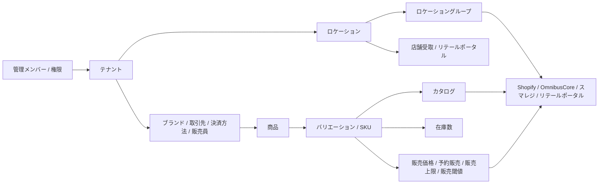

# W1提出物 詳細版 — 基礎データ・設定順序・影響範囲

対象週: W1 `2026/06/22〜2026/06/26`  
WBS上の位置づけ: `理解1 基礎データ・設定順序`  
対象分類: 1〜11

- 01. SQ全体・共通導線
- 02. アカウント・権限
- 03. 組織・通知
- 04. 基本マスタ
- 05. 商品・SKU
- 06. カタログ
- 07. 店舗受取商品
- 08. カスタムデータ
- 09. 翻訳
- 10. 採寸
- 11. 価格・販売制御

## 1. W1のゴール

W1では、SQを使い始める前提になる基礎データを理解し、7月以降のナレッジ構成・導線設計に使える形へ整理する。

ここでいう基礎データは、単なる用語一覧ではない。各データについて、次を説明できる状態にする。

| 観点 | W1で整理すること |
|:--|:--|
| 何のデータか | そのデータが何を表すか |
| どこで作るか | 管理画面のどのメニューで作成・編集するか |
| 何の前提になるか | どの画面の選択肢・必須項目・検索キーになるか |
| 先に作るべきか | 初期設定の順番上、先に必要か、後でもよいか |
| どこに影響するか | 商品、在庫、発注、注文、連携、CSV、店舗業務への影響 |
| 未確認は何か | 実機確認済み、連携待ち、実データ待ち、別権限ユーザー待ちを分ける |

W1で作る提出物は4つ。

| 提出物 | 目的 |
|:--|:--|
| 基礎データ辞書 | 設定・商品まわりのデータを、作成場所・役割・参照先で整理する |
| 商品/カタログ/ブランド比較表 | 混同しやすい商品系概念を説明できるようにする |
| 初期設定順序案 | ゼロからSQを使うときの設定順序を決める |
| 基本マスタ影響範囲メモ | どのマスタが後続画面にどう効くかを一覧化する |

## 2. W1でやること / やらないこと

### やること

- 設定配下のマスタが、どの画面の選択肢になるかを整理する。
- 商品、SKU、商品タイプ、製造元、ブランド、カタログの違いを説明できる状態にする。
- メタフィールド、翻訳、採寸を「商品・顧客・注文などのデータを拡張する仕組み」として整理する。
- 基本マスタ、商品、カタログ、価格、店舗受取の前後関係を初期設定順序としてまとめる。
- W2で扱う在庫・発注・注文・連携へ渡す前提データを明確にする。

### やらないこと

- 在庫伝票、入出荷、発注、注文、CRMの業務フローを深掘りしない。これはW2対象。
- Shopify、スマレジ、リテールポータルなど外部連携の同期結果を断定しない。
- 実注文、実顧客、売上実績、ポイント反映など実データが必要な挙動を確定扱いしない。
- Notion下書きの公開品質化まではしない。W1では、基礎理解と設定順序の整理が目的。

## 3. W1の根拠資料

| 種別 | ファイル |
|:--|:--|
| WBS本体 | `faq/_analysis/FAQ-PROJECT-WBS-24AREAS-2026-06-18.html` |
| 7月末スコープ見直し | `faq/_analysis/WBS-JULY-END-SCOPE-REVIEW-2026-06-21.md` |
| 設定データ事典 | `faq/00-getting-started/データ事典①-設定で作るデータ.md` |
| 商品・在庫データ事典 | `faq/00-getting-started/データ事典②-商品・在庫・運用のデータとステータス.md` |
| セットアップ順序 | `faq/00-getting-started/セットアップガイド.md` |
| Notion下書き | `faq/04-notion/01〜11` |

---

## 4. 基礎データの全体像

SQの基礎データは、次の順に積み上がる。

重要なのは、後の画面で選ぶデータを先に作ること。

例:

- ロケーションがないと、在庫をどこに持つか決められない。
- ブランドがないと、商品登録時にブランドを選べない。
- 商品/SKUがないと、在庫、価格、店舗受取、カタログに登録できない。
- カタログがないと、Shopifyなどの連携設定や店舗受取/外部在庫同期で「どの商品を対象にするか」を指定できない。
- ロケーショングループがないと、Shopify連携などで在庫引当元を指定できない。

---

## 5. 提出物1: 基礎データ辞書

### 5.1 組織・権限・ユーザー

| データ | 作成・管理場所 | 主な役割 | 参照先・効く場所 | W1での扱い |
|:--|:--|:--|:--|:--|
| 組織ID | 設定トップ | SQ組織を識別するシステム生成ID | 問い合わせ、外部連携、サポート時の識別子 | ユーザーが作るものではない。用語として説明できればよい |
| 管理メンバー | 設定 > 管理メンバー | SQ管理画面に入るユーザー | ログイン、権限割り当て、リテールポータル連携のユーザー候補 | 複数人運用なら最初に整理 |
| 権限グループ | 設定 > 管理メンバー > 権限グループ一覧 | 見える画面・操作できる範囲を制御 | 管理メンバーに割り当てる。APIアプリの権限スコープとも同体系 | 38リソース × 閲覧/編集 = 76権限。別権限ユーザーでの実効果は未確認 |
| ユーザーテナント | 管理メンバー詳細 | メンバーが扱えるテナント範囲 | テナント別アクセス制御 | 欄の存在は確定。実際の制御効果は別権限ログインで要確認 |
| アプリ/APIキー | 設定 > アプリ | Admin API / Storefront API / Webhookの接続キー | GraphQL API、Webhook、APIリクエストログ | W1では「APIも権限スコープを持つ」と理解する |

### 5.2 組織・通知

| データ | 作成・管理場所 | 主な役割 | 参照先・効く場所 | W1での扱い |
|:--|:--|:--|:--|:--|
| テナント | 設定 > テナント | ブランド・事業部・運用単位 | 発注、ディスカウント、チャネル連携、CSVエクスポート、ポイント一括加算、注文/顧客絞り込み | 多くのフォームで必須になるため最初に確認 |
| テナントID | テナント詳細 | テナントの識別子 | サポート、外部連携、API利用時の識別子 | ユーザー入力項目ではない |
| 注文IDプレフィックス | テナント詳細 | 注文番号の先頭表記を分ける | 注文番号の表示 | 未設定時の採番影響は要確認 |
| 通知用メールアドレス | 設定 > 通知用メールアドレス | 通知メールの送信先 | 注文・在庫・ポイント失効等の通知候補 | 作成フォームは確認済み。どの通知が届くかは実通知待ち |
| 納品書テンプレート | 設定 > 納品書 | 同梱納品書PDFのレイアウト | 出荷管理のヤマトB2クラウド条件指定エクスポート | PDF反映の実機確認は要確認 |

### 5.3 基本マスタ

| データ | 作成・管理場所 | 主な役割 | 参照先・効く場所 | W1での扱い |
|:--|:--|:--|:--|:--|
| ロケーション | 設定 > ロケーション | 在庫を持つ場所 | 在庫管理、SKU詳細、移動/調整/取置伝票、在庫依頼、入出荷、リテールポータル、店舗受取 | 最重要。ほぼ全業務の前提 |
| 場所種別 = 倉庫 | ロケーション作成/編集 | 倉庫ロケーションとして扱う | 在庫保管、発注入荷先、出荷元、リテールポータル連携の在庫ロケーション | 店舗受取ルールの受取ロケーション候補には出ない。手動の在庫依頼・移動伝票では倉庫/店舗の両方が関与する |
| 場所種別 = 店舗 | ロケーション作成/編集 | 店舗ロケーションとして扱う | リテールポータル連携の店舗ロケーション、店舗受取、在庫依頼・移動伝票の移動元/先 | 論理ロケーションも店舗種別で作る運用。店舗受取ルールの候補は店舗種別のみ確認済み |
| 在庫依頼を受け付ける | ロケーション項目 | 自動在庫リクエスト送付先の候補 | EC注文起点の取り寄せ販売、ロケーショングループ内の送付先制御 | 手動在庫依頼ではOFFでもリクエスト先に選択・保存可能。自動連携時は要確認 |
| 店舗受け取りを有効にする | ロケーション項目 | BOPISの受取店舗化 | 店舗受取、リテールポータル側の受取店舗設定 | 店舗受取を使うなら重要 |
| ロケーショングループ | 設定 > ロケーショングループ | 複数ロケーションの束 | Shopify連携、OmnibusCore連携、在庫引当元、自動在庫リクエスト範囲 | チャネル連携前に必要 |
| デフォルトロケーション | ロケーショングループ詳細 | 注文時の在庫引当元 | Shopify注文の引当元候補 | グループから外せない。変更時は要注意 |
| ブランド | 設定 > ブランド | 商品に紐づくブランド属性 | 商品作成/編集、カタログ自動追加、販売閾値自動追加 | カタログとは別物 |
| ブランドコード | ブランド項目 | 完全一致の判定キー | カタログ自動追加、販売閾値自動追加 | 表記ゆれに弱い。命名ルールが必要 |
| 取引先 | 設定 > 取引先 | 仕入先 | 発注伝票の取引先選択肢 | 発注を使うなら先に必要 |
| 決済方法 | 設定 > 決済方法 | 注文の支払い手段 | 注文、出荷エクスポート、会計連携の決済種別 | 支払い待ち出荷/代引きの実動作は要確認 |
| 販売員 | 設定 > 販売員 | 店舗スタッフ識別 | リテールポータルでの販売員コード、顧客情報閲覧/客注作成の監査 | リテールポータル利用時に必要 |

### 5.4 商品・SKU

| データ | 作成・管理場所 | 主な役割 | 参照先・効く場所 | W1での扱い |
|:--|:--|:--|:--|:--|
| 商品 | 商品管理 > 商品 | 販売対象の親データ | 商品一覧、カタログ、バリエーションの親 | 商品名・説明・画像・分類を持つ |
| 商品コード | 商品作成時 | 商品の識別コード | 商品一覧・カタログの検索キー | 作成後変更不可。商品名/タグでは一覧検索できない |
| 商品タイプ | 商品作成/編集 | 分類メモ | 商品詳細・分類表示 | 検索やカタログ自動追加条件には使われない |
| 製造元 | 商品作成/編集 | メーカー/製造元属性 | カタログ自動追加ルールの完全一致条件 | 表記ゆれに注意 |
| 商品ステータス | 商品作成/編集 | 公開/下書き/アーカイブ管理 | チャネル表示、管理画面表示 | 作成フォームと編集フォームで表記が違う |
| オプション軸 | 商品作成時 | バリエーションを作る軸 | サイズ/カラー/その他 | 商品作成時にしか設定できない。後から追加・種別変更は不可または制約大 |
| オプション値 | 商品作成/編集 | 軸の値 | バリエーション作成フォームの選択肢 | 新しいSKUを作る前に値の追加が必要 |
| バリエーション/SKU | 商品詳細 > バリエーション | 在庫・価格・バーコード等を持つ最小単位 | 在庫管理、伝票、販売価格、店舗受取、CSV | 在庫・価格・店舗受取はSKU単位 |
| 上代 | バリエーション作成 | 販売価格の基準値 | 商品バリエーション | 作成時に設定。販売価格ルールとは別 |
| 原価 | バリエーション編集/CSV | 仕入れ原価 | 原価管理、CSVインポート | 作成画面には仕入価格/原価欄なし。編集画面で設定 |
| 在庫を追跡する | バリエーション項目 | SKUの在庫追跡フラグ | CSV項目 `is_tracked` | 管理画面内ではOFFでも在庫一覧・伝票・販売設定候補に出る。外部連携での差は未確認 |
| 在庫切れの場合でも販売を続ける | バリエーション項目 | 在庫0時の販売継続設定 | チャネル販売、注文受付 | 外部チャネル連携時の実挙動は要確認 |

### 5.5 カタログ・店舗受取

| データ | 作成・管理場所 | 主な役割 | 参照先・効く場所 | W1での扱い |
|:--|:--|:--|:--|:--|
| カタログ | 商品管理 > カタログ | 商品を束ねる汎用グループ | Shopify連携、OmnibusCore、スマレジ、リテールポータル、店舗受取、外部在庫同期 | 商品分類でも出品範囲そのものでもない。各設定側で参照される対象商品グループ |
| カタログ商品 | カタログ詳細 | カタログに含める商品 | 各連携・業務設定で参照する商品集合 | カタログに入れるだけでは出品/同期/店舗受取は実行されない。参照する設定側で指定が必要 |
| カタログ自動追加ルール | カタログ詳細 | 条件一致の商品を自動追加 | 製造元/ブランドコードによる完全一致 | ルール削除後に自動追加済み商品が残るかは未確認 |
| カタログCSVインポート | カタログ詳細 > インポート | カタログ商品を一括追加 | CSVインポート | 実行は巻き戻し不可 |
| 店舗受取対象SKU | 商品管理 > 店舗受取 | 店舗受取対象のSKUを指定 | 店舗受取可能商品 | 商品側のSKU許可リスト。受取店舗やチャネル表示とは別設定 |
| 受取店舗 | リテールポータル > 店舗受取 | どの店舗で受け取れるか | 店舗受取の受取ロケーション | W1では前提として把握。詳細はW2以降 |

### 5.6 カスタムデータ、翻訳、採寸

| データ | 作成・管理場所 | 主な役割 | 参照先・効く場所 | W1での扱い |
|:--|:--|:--|:--|:--|
| メタフィールド定義 | 設定 > メタフィールド定義 | 標準項目にない独自項目を追加 | 対象一覧は16オブジェクト。2026-06-28実機で作成可は9種、詳細画面反映は7種。下書き注文は2026-07-01に定義作成・一覧表示・削除まで確認済みだが、下書き注文本体の作成/詳細画面が開けず値入力は未確認 | 対象一覧に出ること、保存できること、詳細画面に出ることを分ける |
| ネームスペース/キー | メタフィールド定義 | 識別子 | API、CSV、詳細画面 | 命名ルールが必要 |
| メタフィールドタイプ | メタフィールド定義 | 入力形式 | テキスト、日付、真偽値、JSON、ID等 | 後から変更できるかは要注意 |
| 翻訳ルール | 設定 > 翻訳 | 商品系データの翻訳 | 商品、商品オプション、オプション値、メタフィールド | 言語は保存後変更不可 |
| 翻訳データ自動作成 | 翻訳ルール項目 | 翻訳データ生成 | 商品系データ | 実際の翻訳出力・チャネル反映は未確認 |
| 採寸ルール | 設定 > 採寸ルール | 採寸項目テンプレート | 商品に使う想定 | 商品への紐づけUIは未確認 |

### 5.7 販売制御

| データ | 作成・管理場所 | 主な役割 | 参照先・効く場所 | W1での扱い |
|:--|:--|:--|:--|:--|
| 販売価格ルール | 販売設定 > 販売価格 | SKUごとの通常価格/セール価格を束ねる | Shopify、OmnibusCore連携 | 通貨は作成後変更不可 |
| 通常価格 | 販売価格ルール詳細 | SKUごとの税抜/税込価格 | チャネル連携時の価格 | 通常価格CSVは非対応。手動登録 |
| セール価格 | 販売価格ルール詳細 | 期間付きのセール価格 | チャネル連携時の価格 | セール価格はCSV登録可能 |
| 予約販売ルール | 販売設定 > 予約販売 | 在庫0でも注文を受ける枠 | OmnibusCore連携の在庫予約ルール | 実際の在庫0受注は連携待ち |
| 販売上限ルール | 販売設定 > 販売上限 | チャネルごとの販売数上限 | 接続済み販売チャネル | チャネル接続前は作成完了できない。2026-07-01にShopify接続済み状態でチャネル候補、ルール作成、SKU別上限追加・削除まで確認済み |
| 販売閾値ルール | 販売設定 > 販売閾値 | 在庫しきい値で販売可否を制御 | リテールポータル連携 | 閾値SKU削除はリロード後反映。実効は連携待ち |

---

## 6. 提出物2: 商品/カタログ/ブランド比較表

### 6.1 混同しやすい概念の比較

| 概念 | 何を表すか | 作る場所 | 主に効くところ | 混同しやすい点 |
|:--|:--|:--|:--|:--|
| 商品 | 商品名・説明文・画像などを持つ親データ | 商品管理 > 商品 | 商品一覧、カタログ、バリエーションの親 | 一覧の「在庫」列は実在庫数ではなくバリエーション数 |
| バリエーション/SKU | 色・サイズ等の1組み合わせ | 商品詳細 > バリエーション | 在庫、伝票、価格、店舗受取、CSV | 在庫数は商品単位ではなくSKU単位 |
| 商品コード | 商品を識別するコード | 商品作成時 | 商品検索、カタログ内検索 | 作成後変更不可 |
| SKU | バリエーションを識別するコード | バリエーション作成/編集 | 在庫検索、伝票、販売設定、CSV | 在庫・価格・店舗受取はSKU単位 |
| 商品タイプ | 商品側の分類メモ | 商品作成/編集 | 商品情報の整理 | 検索や自動追加条件には使われない |
| 製造元 | 商品側のメーカー属性 | 商品作成/編集 | カタログ自動追加条件 | 完全一致。表記ゆれに弱い |
| ブランド | 商品に付けるブランド属性 | 設定 > ブランド | 商品登録、カタログ自動追加、販売閾値自動追加 | カタログではない。テナントとも別 |
| ブランドコード | ブランドの識別コード | 設定 > ブランド | 自動追加ルールの完全一致条件 | ブランド名ではなくコードで判定 |
| カタログ | 商品を束ねる汎用グループ | 商品管理 > カタログ | Shopify等の販売チャネル連携、店舗受取、外部在庫同期 | 商品分類でも出品範囲そのものでもない。各設定側で対象商品グループとして参照される |
| カタログ自動追加ルール | 条件に合う商品をカタログへ自動追加する設定 | カタログ詳細 | 製造元/ブランドコードで商品を集める | ルール削除後の既存商品扱いは未確認 |
| 店舗受取対象SKU | 店舗受取できるSKU | 商品管理 > 店舗受取 | BOPIS対象商品 | 受取店舗の設定も別途必要 |

### 6.2 1文で説明するなら

| 概念 | 1文説明 |
|:--|:--|
| 商品 | 販売対象の親データ。商品名、説明、画像、分類を持つ |
| SKU | 在庫・価格・伝票で使う最小単位 |
| ブランド | 商品につける属性。自動追加ルールの条件にもなる |
| カタログ | 商品を束ねる汎用グループ。出品・店舗受取・外部在庫同期などは参照する設定側で決まる |
| ロケーション | 在庫をどこに持つかを表す場所 |
| ロケーショングループ | 複数ロケーションを束ね、チャネル連携や在庫引当元に使う |
| テナント | 事業部・ブランド・運用単位を分ける管理単位 |

### 6.3 FAQで誤解されやすい説明

| 誤解 | 正しい説明 |
|:--|:--|
| 商品を作れば在庫ができる | 在庫はSKU × ロケーションで別に持つ |
| カタログは商品カテゴリである | カタログは商品を束ねる汎用グループ。商品カテゴリでも出品範囲そのものでもない |
| ブランドとカタログは同じ | ブランドは商品属性、カタログは連携・店舗受取・外部在庫同期などで参照される商品グループ |
| 店舗受取対象SKUを追加すれば店舗受取が動く | 対象SKUと受取店舗設定の両方が必要 |
| 在庫追跡OFFなら在庫管理に出ない | 実機ではOFFでも管理画面内の在庫・伝票・販売設定候補に表示される |
| 販売価格ルールを作ればすぐ価格が変わる | チャネル連携側で指定されて初めて効く |
| ロケーションの在庫依頼OFFなら手動在庫依頼で選べない | 手動作成ではOFFでも選択・保存できた。自動連携時は要確認 |

---

## 7. 提出物3: 初期設定順序案

### 7.1 標準の設定順序

| 順番 | 作る/確認するもの | 必須度 | なぜ先に必要か | ないと困る画面・業務 |
|:--|:--|:--|:--|:--|
| 0 | 管理メンバー・権限グループ | 複数人運用なら必須 | 操作できる人と権限を決めるため | 管理画面利用、操作制限、API権限設計 |
| 1 | テナント | 基本必須 | 多くのデータの紐づけ先になるため | 発注、ディスカウント、チャネル連携、CSVエクスポート |
| 2 | ロケーション | 必須 | 在庫はロケーション単位で持つため | 在庫管理、伝票、入出荷、店舗受取、リテールポータル |
| 3 | ロケーショングループ | チャネル連携するなら必須 | 複数ロケーションを束ねるため | Shopify連携、OmnibusCore連携、自動在庫リクエスト |
| 4 | 取引先 | 発注するなら必須 | 発注伝票の仕入先として必要 | 発注伝票 |
| 5 | 決済方法 | 注文/店舗販売で必要 | 注文の支払い手段になるため | 注文、出荷エクスポート、会計連携 |
| 6 | ブランド | 商品分類や自動追加を使うなら必要 | 商品作成時に選択するため | 商品登録、カタログ自動追加、販売閾値自動追加 |
| 7 | 販売員 | 店舗業務で必要 | 店舗スタッフを識別するため | リテールポータル、顧客閲覧、客注作成 |
| 8 | 通知用メールアドレス | 通知運用で必要 | 通知メールの宛先になるため | 通知・アラート |
| 9 | メタフィールド定義 | 独自項目を使うなら必要 | 対応対象の詳細画面に入力欄を出すため | 商品、バリエーション、顧客、注文、ロケーション、会社、ディスカウント等。下書き注文は定義作成可だが値入力画面未確認。伝票系は2026-06-28実機で保存エラー |
| 10 | 翻訳ルール・採寸ルール | 多言語/採寸で必要 | 商品情報を拡張するため | 商品翻訳、採寸情報 |
| 11 | 商品 | 必須 | 販売対象の親データ | SKU、カタログ、在庫、価格 |
| 12 | バリエーション/SKU | 必須 | 在庫・価格の最小単位 | 在庫管理、販売設定、伝票、店舗受取 |
| 13 | カタログ | チャネル連携/店舗受取/外部在庫同期で必要 | 対象商品グループを指定するため | Shopify、OmnibusCore、スマレジ、リテールポータル、店舗受取、外部在庫同期 |
| 14 | 在庫数 | 販売/移動するなら必須 | 売れる数・動かせる数を持つため | 在庫管理、注文引当、取り寄せ |
| 15 | 販売価格ルール | チャネル価格連携で必要 | SKU価格をチャネルに渡すため | Shopify、OmnibusCore |
| 16 | 予約販売ルール | 在庫0受注で必要 | バックオーダー枠を作るため | OmnibusCore連携 |
| 17 | 販売上限ルール | 数量制限で必要 | チャネルごとに販売上限を持つため | 接続済み販売チャネル |
| 18 | 販売閾値ルール | 店舗販売制御で必要 | 在庫しきい値で販売可否を制御するため | リテールポータル連携 |
| 19 | 店舗受取対象SKU | BOPISで必要 | 受取対象商品を指定するため | 店舗受取 |
| 20 | チャネル連携 | 外部販売で必要 | SQのデータを外部チャネルへ渡すため | Shopify、OmnibusCore、スマレジ、リテールポータル |

### 7.2 目的別の最短順序

| やりたいこと | 最短順序 |
|:--|:--|
| まず商品と在庫を管理したい | テナント確認 → ロケーション → 商品 → SKU → 在庫数 |
| Shopifyとつなぎたい | テナント → ロケーション → ロケーショングループ → 商品/SKU → カタログ → 販売価格ルール → Shopify連携 |
| 店舗在庫をECで売りたい | Shopify接続前提 + 論理ロケーション → EC販売用在庫数 → 実店舗ロケーション → 在庫依頼受付ON → ロケーショングループ |
| 発注を使いたい | テナント → 取引先 → ロケーション → 商品/SKU → 発注伝票 |
| 店舗受取を使いたい | 店舗ロケーション → 店舗受取ON → 商品/SKU → 店舗受取対象SKU → リテールポータル側の受取店舗設定 |
| リテールポータルを使いたい | 店舗ロケーション → 在庫ロケーション → テナント → カタログ → 管理メンバー → リテールポータル連携 |
| 販売価格を管理したい | 商品/SKU → 販売価格ルール → 通常価格/セール価格 → チャネル連携 |
| 予約販売を使いたい | 商品/SKU → 予約販売ルール → 対象SKU/販売数 → OmnibusCore連携 |
| 販売上限を使いたい | 商品/SKU → 対象チャネル連携 → 販売上限ルール |
| 販売閾値を使いたい | ブランド → 商品/SKU → 販売閾値ルール → SKU別閾値/ブランドコード自動追加 → リテールポータル連携 |
| CSVで登録したい | 必要なマスタを先に作る → 商品/SKU → CSVテンプレート → 検証 → 実行 |

### 7.3 後戻りしづらい設定

| 設定 | 後戻りしづらい理由 | W1での注意 |
|:--|:--|:--|
| 商品コード | 作成後変更不可 | 命名ルールを先に決める |
| 商品のオプション軸 | 商品作成時にしか設定できない | サイズ/カラー/その他の設計を先に決める |
| ブランド外部ID | 作成時のみ設定可 | 外部連携で使うか確認してから作る |
| 販売価格ルールの通貨 | 作成後変更不可 | 多通貨運用があるか先に確認 |
| ロケーショングループの自動追加設定 | 作成フォームには表示されず、既存詳細では disabled 表示 | 今後増える店舗を自動で含められるかは標準UIでは変更不可として扱う |
| CSVインポート実行 | 巻き戻し不可 | 検証→実行の2段階を明記 |
| 削除操作 | 復元不可のものが多い | FAQでは削除前の確認を強調 |

---

## 8. 提出物4: 基本マスタ影響範囲メモ

### 8.1 マスタ別の影響範囲

| マスタ | 商品 | 在庫 | 発注 | 入出荷 | 注文 | CRM | 連携 | 店舗業務 | CSV/API |
|:--|:--:|:--:|:--:|:--:|:--:|:--:|:--:|:--:|:--:|
| テナント |  |  | ○ |  | ○ | ○ | ○ | ○ | ○ |
| ロケーション |  | ○ | ○ | ○ | ○ |  | ○ | ○ | ○ |
| ロケーショングループ |  | ○ |  |  | ○ |  | ○ | ○ |  |
| ブランド | ○ |  |  |  |  |  | ○ |  | ○ |
| 取引先 |  |  | ○ |  |  |  |  |  | ○ |
| 決済方法 |  |  |  | ○ | ○ |  |  | ○ | ○ |
| 販売員 |  |  |  |  |  |  |  | ○ |  |
| メタフィールド定義 | ○ |  | ○ | ○ | ○ | ○ | ○ |  | ○ |
| 翻訳ルール | ○ |  |  |  |  |  | ○ |  | ○ |
| 採寸ルール | ○ |  |  |  |  |  | ○ |  |  |
| 商品/SKU | ○ | ○ | ○ | ○ | ○ |  | ○ | ○ | ○ |
| カタログ | ○ |  |  |  |  |  | ○ | ○ | ○ |
| 販売価格ルール | ○ |  |  |  |  |  | ○ |  | ○ |
| 予約販売ルール | ○ | ○ |  |  | ○ |  | ○ |  | ○ |
| 販売上限ルール | ○ |  |  |  | ○ |  | ○ |  |  |
| 販売閾値ルール | ○ | ○ |  |  |  |  | ○ | ○ | ○ |
| 店舗受取対象SKU | ○ | ○ |  |  | ○ |  | ○ | ○ |  |

### 8.2 影響範囲の読み方

- ○は「そのマスタがないと、後続画面の選択肢や前提が欠ける」ことを表す。
- ここでは業務フローの詳細までは扱わない。W2で在庫・伝票・注文・CRMの流れとして深掘りする。
- W1では、後続画面で詰まらないための前提データを整理する。

### 8.3 重要な前提関係

| 前提データ | 後続データ/画面 | 関係 |
|:--|:--|:--|
| テナント | 発注、ディスカウント、チャネル連携、CSVエクスポート | 多くのフォームで必須選択肢になる |
| ロケーション | 在庫、伝票、入出荷、店舗受取 | 在庫を持つ場所。SKU × ロケーションで在庫が管理される |
| ロケーショングループ | Shopify、OmnibusCore、取り寄せ販売 | どのロケーション群から在庫を引き当てるかを決める |
| ブランド | 商品、カタログ自動追加、販売閾値自動追加 | 商品属性。ブランドコードが完全一致条件になる |
| 取引先 | 発注伝票 | 発注先として選ばれる |
| 決済方法 | 注文、出荷エクスポート、会計連携 | 支払い手段・代引き判定などに関係する |
| 商品 | SKU、カタログ、販売ルール | 親データ。商品だけでは在庫や価格の最小単位にならない |
| SKU | 在庫、伝票、販売ルール、店舗受取 | 最小管理単位。ほぼすべての運用データのキー |
| カタログ | Shopify等の連携、店舗受取、外部在庫同期 | 各設定で参照する対象商品グループを決める |
| 販売価格ルール | Shopify/OmnibusCore | チャネル側価格の前提 |
| 販売上限ルール | 販売チャネル | チャネル接続済みでないと作成完了できない |
| 店舗受取対象SKU | 店舗受取 | 受取店舗設定と組み合わせて成立する |

---

## 9. W1からW2へ渡すもの

W1で整理した基礎データは、W2の業務フロー理解に渡す。

| W1で整理する前提 | W2で見る業務 |
|:--|:--|
| ロケーション | 在庫区分、移動伝票、調整伝票、取置伝票、入出荷 |
| ロケーショングループ | Shopify連携、取り寄せ販売、自動在庫リクエスト |
| 商品/SKU | 在庫、伝票、価格、店舗受取、CSV |
| カタログ | 販売チャネル連携、店舗受取、外部在庫同期の対象商品グループ |
| 取引先 | 発注伝票 |
| 決済方法 | 注文、出荷、会計連携 |
| 販売価格/予約販売/販売上限/販売閾値 | チャネル連携時の価格・販売可否・数量制御 |
| メタフィールド/翻訳/採寸 | 商品・顧客・注文などの拡張データ |
| 権限/ユーザーテナント | 別権限ユーザーでの画面制御確認 |

---

## 10. W1定例で確認したい論点

| 優先度 | 論点 | Stack側に確認したいこと |
|:--|:--|:--|
| 高 | 初期設定順序 | 標準の導入順として、テナント → ロケーション → 商品/SKU → カタログ → 価格 → 連携でよいか |
| 高 | ロケーション種別 | 倉庫/店舗/論理ロケーションの説明はこの粒度でよいか |
| 高 | 在庫依頼を受け付ける | FAQでは「手動作成ではOFFでも選べる。自動連携時は未確認」と書く方針でよいか |
| 高 | 商品/SKU | 「在庫・価格・店舗受取はSKU単位」と強調してよいか |
| 高 | カタログ | 「商品カテゴリでも出品範囲そのものでもなく、商品を束ねる汎用グループ」と説明してよいか |
| 中 | ブランドコード | カタログ自動追加/販売閾値自動追加でブランドコード完全一致を標準説明に入れてよいか |
| 中 | 店舗受取 | 商品側SKU設定と店舗側受取設定の2つが必要、という説明でよいか |
| 中 | 在庫追跡OFF | 管理画面内ではOFFでも候補に出る事実をFAQ注記に入れてよいか |
| 中 | 販売価格/予約販売/上限/閾値 | ルール単体では効かず、チャネル連携側で指定されて初めて効く説明でよいか |
| 中 | 権限グループ | 76権限の画面構成は確定、別権限ユーザーでの実効果は未確認扱いでよいか |
| 低 | 通知用メール | 通知先作成は確定、送信タイミングは実通知待ちとしてよいか |
| 低 | 採寸ルール | 現時点ではテンプレート定義のみ、商品紐づけUI未確認としてよいか |

---

## 11. W1完成条件

W1完了時点で、次の状態になっていればよい。

| チェック | 完了条件 |
|:--|:--|
| 基礎データ辞書 | 01〜11の主要データについて、作成場所、役割、参照先、未確認が整理されている |
| 比較表 | 商品/SKU/ブランド/カタログ/店舗受取の違いを説明できる |
| 初期設定順序 | ゼロから使う場合の標準順序と、目的別の最短順序がある |
| 影響範囲 | 基本マスタが後続画面のどこに効くかが表で分かる |
| 未確認管理 | 実機確認済み、連携待ち、実データ待ち、別権限ユーザー待ちが混ざっていない |
| W2への引き継ぎ | 在庫・発注・入出荷・注文・連携で深掘りすべき前提が分かっている |

## 12. W1の提出時に添える短い説明

> W1では、SQを使い始めるための基礎データを「何のデータか」「どこで作るか」「何の選択肢になるか」「どの順で作るべきか」で整理しました。  
> データ依存関係という独立フェーズは置かず、W1/W2の理解フェーズ内で「設定順序・影響範囲」として扱います。  
> これにより、7月のナレッジ構成・導線設計では、読者別・目的別・業務フロー別の入口設計に入れる状態にします。
